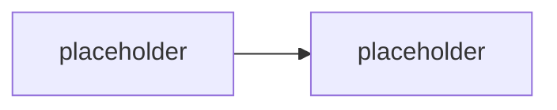

# Konvence

Závazná pravidla pro psaní materiálů SPO_COPILOT. Cíl: konzistence napříč moduly a snadná
údržba (malé soubory = malé diffy).

## Jazyk

- **Obsah**: čeština.
- **Cesty a názvy souborů/složek**: angličtina, `kebab-case`.
- **Identifikátory v kódu** (typy, metody, proměnné): angličtina, dle konvence jazyka.

## Struktura modulu

Jeden modul = jedna složka. Slug složky, ne pořadové číslo. Volitelné moduly mají prefix `opt-`.

Typické soubory ve složce modulu:

| Soubor | Účel | Publikum |
|---|---|---|
| `README.md` | teorie / výklad modulu | student |
| `lab-*.md` | zadání labu | student |
| `instructor-notes.md` | timing, tripwires, otázky, fallbacky | jen lektor |

Podle potřeby modul přidává i další soubory (bez šablony, ale konzistentní pojmenování):

| Prefix | Účel |
|---|---|
| `explainer-<téma>.md` | samostatný deep-dive na jeden mechanismus/koncept, odkazovaný z README |
| `comparison-<téma>.md` | srovnávací tabulka + rozhodovací osa |
| `guide-<téma>.md` | krok-za-krokem návod (instruktorský demo skript nebo referenční postup) |
| `scenario-<téma>.md` | běžící příklad/dataset sdílený napříč sourozeneckými moduly |
| `solution/<soubor>.cs` | referenční řešení labu — plně okomentované, odpovídá `Ověření` v labu |

Pořadí modulů v běhu drží **`agenda.md`** — je to jediný zdroj pravdy o pořadí. Změna pořadí =
úprava `agenda.md`, ne přejmenování složek.

## Odkazování mezi moduly

- H1 nadpis modulu je jen `# <Název>` — **žádná pořadová čísla** v nadpisech ani v textu.
  Vkládání/přesun modulu tak nikdy nevyvolá přečíslování napříč repem.
- Křížové odkazy mezi moduly vždy **slugem jako relativní odkaz na složku**. Tvar odkazu
  (z pohledu souboru uvnitř složky modulu):

  ```md
  jiný den:        [`../../day-3/agent-framework/`](../../day-3/agent-framework/)
  sourozenec dne:  [`../actions-graph/`](../actions-graph/)
  ```

- V instruktorských poznámkách (sekce Vazby) stačí backtick slug bez odkazu.
- Pořadí v rámci dne drží výhradně `agenda.md` (a `day-N/README.md` tabulka).

## Markdown styl

- Nadpisy `##` / `###`, žádné přeskoky úrovní.
- Krátké odstavce, odrážky pro výčty.
- Odkazy na názvosloví vždy proti [`GLOSSARY.md`](GLOSSARY.md) — nepsat názvy produktů, SDK
  ani certifikací „od oka". Tento obor má za sebou vlnu přejmenování a špatné jméno v materiálu
  je viditelná chyba lektora.

## Mermaid

- Diagramy jako fenced bloky ` ```mermaid ` přímo v `.md`. GitHub je renderuje nativně,
  žádný build step.
- **Výchozí motiv** (bez `%%{init}%%`) — nulová údržba, konzistentní vzhled.
- Placeholder v kostře:



## Currency-markery

Fast-moving fakta (verze SDK, preview stavy, ceny, retirement data certifikací, přejmenování
produktů) se v tomto oboru mění po týdnech. Balit je do GitHub alertů, ať jsou vizuálně
oddělené a grep-nutelné před každým během:

```md
> [!WARNING] Ověřit k datu běhu — stav k <RRRR-MM>.
> Verze SDK / cena / preview stav / retirement datum.
```

Lineage a breaking changes:

```md
> [!IMPORTANT] Názvosloví
> <starý název/API> → <aktuální název/API>. V dokumentaci/UI se může objevit staré jméno.
```

## Delta sekce

Každý modul má na konci:

```md
## Stav produktu / delta
- <co se od napsání změnilo, co ověřit>
```

## Kód v materiálech

- **Primární jazyk je C#** (.NET, Microsoft 365 Agents SDK). TypeScript se objevuje jako
  **parity úryvek** tam, kde je to levné (manifest, MCP konfigurace, deklarativní agent).
  Python jen zmínkou v modulu o Toolkitu — nedržíme tři jazyky do hloubky.
- C# ukázky: XML doc komentáře (`/// <summary>`) u veřejných typů delších ukázek, `Options`
  pattern pro konfiguraci (`AgentApplicationOptions`), `async`/`await` bez `.Result`/`.Wait()`,
  `CancellationToken` propagovaný skrz.
- **Žádné tenant ID, ClientId, cert thumbprinty, subscription ID, API klíče ani connection
  stringy natvrdo v kódu** — vždy konfigurace / proměnné prostředí / user secrets
  (viz [`environment.md`](environment.md)). Repo je public.
- Ukázky volání modelu, Graphu a nástrojů ukazují **i chybové a retry větve, ne jen happy
  path** — to je nosný pedagogický bod kurzu (inženýrská robustnost, ne demo-ware).
  Konkrétně: klasifikace transientní vs permanentní chyby, timeout, a co agent odpoví
  uživateli, když nástroj selže.
- Referenční řešení labu žije v `solution/*.cs`, plně okomentované, a odpovídá přesně
  krokům v sekci `Ověření` daného labu.
- V kódových blocích a skriptech **jen ASCII** — žádné typografické pomlčky, šipky ani
  uvozovky. (V prozaickém textu materiálů je česká typografie v pořádku.)

## Skripty a příkazy

- Provozní skripty repa i příkazy v labech jsou **PowerShell**, ne bash. Line continuation
  je backtick (`` ` ``), ne backslash.
- CLI příkazy pro .NET / Agents Toolkit / Agent 365 CLI uvádět v podobě, v jaké je student
  reálně spustí ve Windows terminálu.
