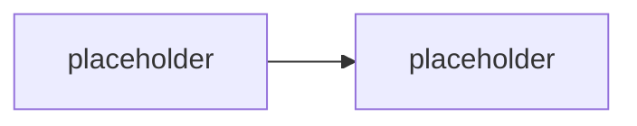

# <Název modulu>

> Typ: povinný | volitelný · Den: <N> · Odhad: <min> · Publikum: **vývojáři / architekti**
> Prostředí: viz [`../../environment.md`](../../environment.md) · Názvosloví: [`../../GLOSSARY.md`](../../GLOSSARY.md)

## Cíle
- <co student po modulu umí>

## Výklad

<text; produktové názvy proti GLOSSARY.md>

## Klíčové rozlišení
- <pojmy, které se pletou>

## Naše prostředí
<volitelná sekce — co pro tenhle modul platí na spdemo.online + PAYG; režim hands-on / demo>

## Lab
Viz [`lab-<slug>.md`](lab-<slug>.md).

## Nosná linka
<co agent ze scénáře v tomto modulu získal — viz `scenario-support-agent.md`>

## Zdroje (Microsoft)
- [<název stránky>](https://learn.microsoft.com/...)

## Stav produktu / delta

> [!WARNING] Ověřit k datu běhu — stav k <RRRR-MM>.
> <co ověřit: verze SDK, preview stav, cena, názvy šablon>
