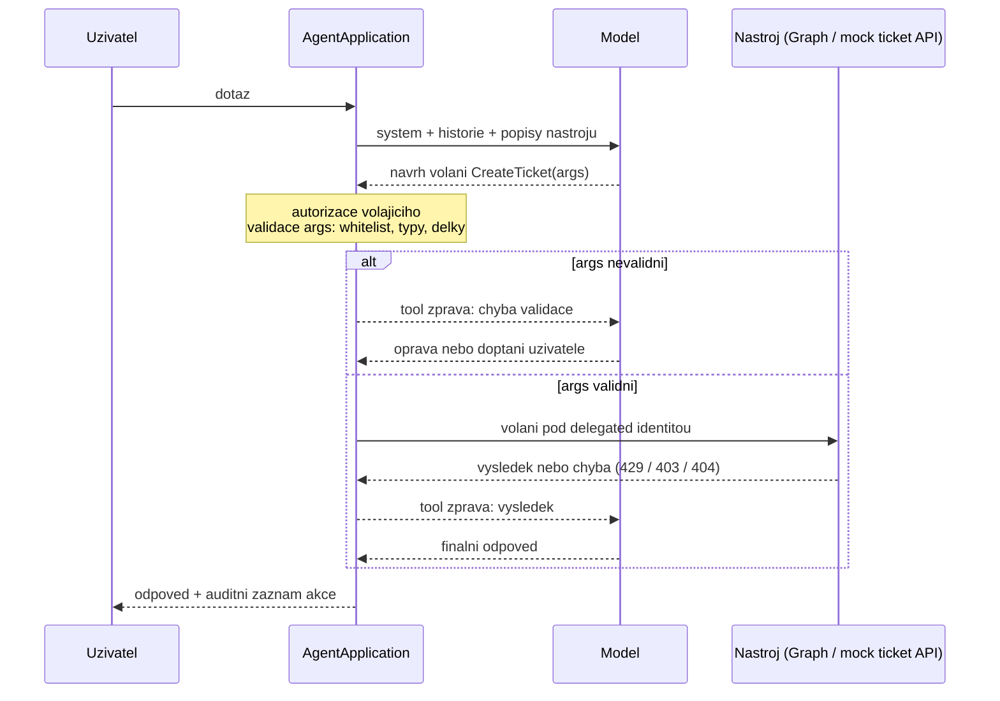

# Action handlers & integrace s Microsoft Graph

> Typ: povinný · Den: 4 · Odhad: **80 min** (30 výklad + 50 lab) · Publikum: **vývojáři / architekti**
> Identity výklad (app registrace, permissions, tokeny) **odučen na D3** — část A jede rychleji, `.lab-token` studenti mají.
> Prostředí: viz [`../../environment.md`](../environment.md) · Názvosloví: [`../../GLOSSARY.md`](../GLOSSARY.md)

Agent přestává jen mluvit a začíná něco dělat. Tím se otevírá celá governance otázka.

## Cíle
- Směrovat akce v `AgentApplication` a validovat jejich parametry **před** provedením.
- Volat Microsoft Graph z agenta se správným typem oprávnění.
- Rozumět hranicím oprávnění: **delegated vs. app-only**, a kde do toho vstupuje
  **Microsoft Entra Agent ID**.
- Napojit nástroj přes **MCP** a vědět, jak se to liší od vlastního action handleru.

## Výklad

### Směrování akcí

- V `AgentApplication` registruješ **handlery na aktivity**. Akce agenta není zvláštní
  konstrukce — je to další handler s routingem podle typu aktivity a jejího obsahu.
- **Tři cesty, kterými se akce spustí**:
  1. **model ji navrhne** v tool-call loopu (mechanika v [`../../prompt-orchestration/`](../prompt-orchestration/)),
  2. **uživatel klikne v Adaptive Card** — přijde to jako **aktivita**, ne jako text od
     uživatele (podle typu akce karty jako zpráva s `value`, nebo jako `invoke`; ověřit proti
     aktuální verzi SDK),
  3. **tvoje deterministická větev** v kódu — nejjistější cesta, když se nesmí spolehnout
     na model.
- **Kde končí SDK**: doručí aktivitu, dá ti stav (`TurnState`) a odešle odpověď.
  **Autorizaci, validaci, volání API, retry ani audit nedělá.** To všechno je tvůj kód —
  a přesně za tohle si zákazník platí custom engine agenta.
- Handler drž tenký a v tomhle pořadí: **parse → autorizace → validace → volání služby →
  mapování výsledku do odpovědi**. HTTP klient a business logika patří mimo handler
  (testovatelnost, později evaluace v D5).
- **Každý handler končí odpovědí do turnu — i chybovou.** Neuzavřený turn znamená uživatele,
  který kouká na „agent přemýšlí" a pak nic.

### Validace parametrů — proč je to bezpečnostní téma

- **Model parametry navrhuje — tím se nevalidují.** Návrh vzniká z textu, a ten text může být
  cizí: obsah runbooku, jméno souboru, e-mail. Prompt injection míří přesně sem
  ([`../../security-risk/`](../security-risk/)). Nejde o to, že „model lže" —
  model je jen kanál.
- **Whitelist, ne blacklist**: `priority` je enum `P1 | P2 | P3`, ne „cokoliv, co vypadá jako
  priorita".
- **Typy, rozsahy, povinnost**: minimální a maximální délka popisu, prázdný řetězec není
  hodnota, chybějící povinné pole je zamítnutí — ne dosazení defaultu.
- **Autorizace patří na úroveň akce, ne agenta.** To, že agent smí volat ticket API,
  neznamená, že **tenhle uživatel** smí založit tiket za někoho jiného. Dvě různé otázky,
  dvě různá místa v kódu.
- Příklad `CreateTicket(priority, description, requester)` z našeho scénáře:

| Parametr | Odkud | Validace |
|---|---|---|
| `priority` | návrh modelu | whitelist `P1` / `P2` / `P3`, jinak chyba zpět modelu |
| `description` | návrh modelu | neprázdný, omezená délka, bez markupu dál do API |
| `requester` | **identita volajícího** (`TurnContext`) | model ho **nenavrhuje vůbec** |

- **Pravidlo: co si model nesmí vybrat, nedávej mu do schématu nástroje.** `requester` v popisu
  nástroje být nemá — pak není co ošetřovat.
- Chyba validace **není výjimka do logu**. Vrací se **jako tool zpráva zpět modelu**, aby se
  agent uměl doptat uživatele („jakou prioritu má tiket mít?").

### Hranice oprávnění

| | **Delegated** | **App-only** |
|---|---|---|
| Jménem koho | přihlášeného uživatele | aplikace |
| Co vidí | přesně to, co uživatel | co má aplikace nagrantováno — typicky celý tenant |
| ACL trimming | zdarma, ze zdroje | **žádný** — musíš ho napsat sám |
| Audit ukazuje | uživatele i agenta | jen aplikaci |
| Kdy je nutné | běžný chat s uživatelem | žádný uživatel v kontextu (job, webhook, proaktivní zpráva) |

- **Nosná pointa: app-only je pohodlné — a je to nejčastější zdroj exfiltrace u agentů.**
  Žádný consent flow, „prostě to funguje". A agent pak ochotně přečte a **shrne** to, co
  uživatel nikdy vidět neměl. Shrnutí je horší než únik souboru: nese se dál jako text bez
  klasifikace.
- **Least privilege po akcích, ne jeden všemocný set.** Čtení runbooků není důvod mít přístup
  k mailboxům. Scope se přidává k akci, ne k agentovi.
- Když app-only opravdu potřebuješ, **musí autorizaci nahradit tvůj kód**: explicitně,
  na úrovni akce, s auditní stopou kdo a proč. To je architektonické rozhodnutí s podpisem,
  ne položka v konfiguraci.
- Věta pro zákazníka: **„Agent nesmí vidět víc než člověk, který se ptá."** Když to v návrhu
  neplatí, musí být zapsané proč.

### Entra Agent ID

- Agent přestává být „app registrace, kterou kdysi udělal někdo z týmu" a stává se
  **identitou v Entra**: má vlastníka, lifecycle, přiřazená oprávnění a je vidět v seznamu
  jako objekt sám o sobě.
- **Co to mění pro audit**: v logu je vidět, **který agent** akci provedl — ne jen „nějaká
  aplikace". V delegated toku jsou v každém volání **dvě identity** (uživatel a agent) a audit
  má ukázat obě.
- **Co to mění pro lifecycle**: access reviews, attestace vlastníka a lifecycle politiky jdou
  aplikovat i na agenty. Odchod vlastníka je detekovatelný, osiřelý agent dohledatelný.
- Praktický důsledek pro tenhle modul: identita agenta je oddělená od identity uživatele —
  autorizaci akce nesmíš stavět na tom, že „agent má oprávnění".
- Detail governance a instrumentace: [`../../agent-365-governance/`](../agent-365-governance/).
  Tady stačí vědět, že to existuje — a že dodatečné dohánění identity u nasazeného agenta je
  drahé.

### MCP jako nástroj

| | **MCP tool** | **Vlastní action handler** |
|---|---|---|
| Kontrakt (schéma nástroje) | drží **server**, může se změnit bez tebe | držíš ty, verzuješ v gitu |
| Autentizace | konfigurace MCP serveru | tvoje, per akce a per uživatel |
| Validace parametrů | to, co dělá server | tvoje, před voláním |
| Audit | co server nabídne | tvoje telemetrie, plná stopa |
| Náklad na zavedení | nízký — nástroj „je" | vyšší — píšeš to |

- **Kdy MCP**: cizí systém s hotovým MCP serverem, čtecí nebo málo rizikové operace, žádný
  tvrdý požadavek na auditní stopu per uživatel.
- **Kdy vlastní handler**: akce s validací, autorizací per uživatel a auditem — přesně náš
  `CreateTicket`. Proto se v labu píše ručně, i když by mock API šlo obalit MCP serverem.
- **Popisy MCP nástrojů vstupují do kontextu modelu.** Nedůvěryhodný server tak dodává
  instrukce do promptu — a to je útočný vektor, ne jen integrační detail.
- Pravidlo: **MCP nezbavuje odpovědnosti.** Za to, co agent udělal, ručíš ty, i když nástroj
  napsal někdo jiný.
- Mechanika protokolu (role, primitiva, transport — a jak MCP zapadá do tool-call
  smyčky z labu): [`../knowledge-grounding/explainer-mcp.md`](../knowledge-grounding/explainer-mcp.md).

### Co nemusí dělat model

Validace v kódu místo v promptu je speciální případ obecnějšího pravidla: **u každého
kroku zadání se ptej, jestli ho musí dělat model.** Většinou nemusí.

- **Deterministické** (API, parser, regex, výpočet) — hodnota je na známém místě.
- **Extrakce** (levný model, strukturovaný výstup) — hodnota v textu je, kolísá rozložení.
- **Inference** (reasoning model) — hodnota se **odvozuje** z víc faktů.

Dělicí čára mezi druhým a třetím: *hledáš hodnotu, nebo ji odvozuješ?* Variabilita
rozložení není důvod pro uvažování.

> [!IMPORTANT] Nejdražší chyba není špatný model, ale neudělaný rozpad
> Když se zadání nerozloží na kroky, jediná zbylá páka je koupit větší model — nejdražší
> a nejméně účinná varianta. Dobrý rozpad potřebu silného modelu většinou **odstraní**.
>
> Rozbor včetně case study (vlastníci firmy: celé PDF → předfiltr → **strukturované API
> bez modelu**) a toho, proč se spolehlivost vynucuje kontrolou a ne modelem, je
> v [`explainer-deterministic-first.md`](explainer-deterministic-first.md).

## Klíčové rozlišení
- **Delegated** (dědí permissions uživatele) vs. **app-only** (vidí všechno) — a proč je
  app-only nejčastější zdroj exfiltrace u agentů.
- **Autorizace agenta** vs. **autorizace akce** — agent smí volat Graph neznamená, že smí
  udělat tuhle konkrétní věc pro tohoto uživatele.
- **MCP tool** (externí kontrakt) vs. **action handler** (tvůj kód) — jiné vlastnictví, jiný audit.
- **Model navrhuje parametry** ≠ parametry jsou validní.
- **Hledat hodnotu** (extrakce, levný model) vs. **odvozovat ji** (inference, reasoning
  model) vs. **přečíst ji ze zdroje** (API, parser — žádný model).

## Naše prostředí

Hands-on. Graph volání pod **delegated** identitou studenta (`user.NN@spdemo.online`).
Ticketing je **mock API** lokálně — cílem je validace parametrů a hranice oprávnění,
ne produkční integrace.

## Lab
Viz [`lab-actions-and-graph.md`](lab-actions-and-graph.md). Referenční řešení v `solution/`.

## Nosná linka
Support Asistent získává dvě akce: čtení z Graphu a `CreateTicket` s validací.
Dotaz 3 ze [`../../scenario-support-agent.md`](../scenario-support-agent.md)
poprvé vede k **eskalaci místo výmluvy**. Dotaz 4 se stává zajímavějším: agent teď má
přístup k datům, která nesmí prozradit.

## Zdroje (Microsoft)
- [AgentApplication in Microsoft 365 Agents SDK](https://learn.microsoft.com/en-us/microsoft-365/agents-sdk/agent-application)
- [What is Microsoft Entra Agent ID](https://learn.microsoft.com/en-us/entra/agent-id/what-is-microsoft-entra-agent-id)
- [Microsoft Graph permissions reference](https://learn.microsoft.com/en-us/graph/permissions-reference)
- [Microsoft Graph error responses](https://learn.microsoft.com/en-us/graph/errors)

## Stav produktu / delta

> [!WARNING] Ověřit k datu běhu — stav k 2026-08.
> Rozsah **Entra Agent ID** a jeho vztah k app registracím se aktivně vyvíjí. Ověřit,
> jestli agent v tomto scénáři už dostává Agent ID automaticky, nebo se registruje ručně.
> Rovněž ověřit aktuální podporu MCP nástrojů v Agents SDK.
