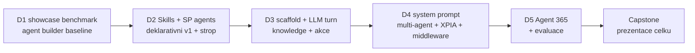

# Agenda — pořadí bloků

Jediný zdroj pravdy o pořadí modulů. Moduly leží v jedné rovině bez prefixu dne
(`onboarding/`, `agents-sdk-core/`, …) — **den je metadata a žije výhradně tady**.
Denní briefingy (prerekvizity rána, kompresní ventily dne) jsou v [`dny/`](dny/).

> [!IMPORTANT] Přestavba složek 2026-08-25 večer — studenti musí udělat `git pull`
> Původní struktura `day-N/<modul>` po dvou rekalibracích u 8 z 24 modulů lhala o dni
> výuky, proto se prefix zahodil uprostřed týdne (rozhodnutí lektora). Kdo má repo
> naklonované z pondělí, má po pullu jiné cesty — **ohlásit ráno D3 před blokem 1**.
> Staré odkazy `day-N/…` v poznámkách studentů už nevedou nikam; modul se najde podle
> názvu v kořeni repa.

**5 dní · 16 povinných bloků · 3–4 bloky/den.** P = povinný, V = volitelný / samostudium.
Fokus kurzu: **blízké okolí Microsoft 365** — vlastní vektorizace, hluboký Azure a obecná
AI témata jsou vedlejší koleje, ne jádro.

Po dvou rekalibracích (2026-08-24 a 25) je pět modulů vyřazeno do samostudia a dva bloky
sloučeny — přehled a důvody v [`self-study.md`](self-study.md).

> [!IMPORTANT] Osnova je restrukturalizovaná proti webu
> Publikovaná katalogová osnova má 15 bloků a je obsahově zastaralá (retirované certifikace,
> „Graph konektory", chybí Agent Framework / Agent 365 / Foundry / MCP / A2A). Tato agenda drží
> stack 2026. Návrh nové webové osnovy je v [`marketing/`](marketing/) a **musí být na webu
> před prvním během**. Mapování „publikovaný blok → modul" je tam v delta tabulce.

> [!WARNING] Timing — publikovaná čísla jsou nominální
> Web slibuje 2 h + 13×2,5 h + 2,5 h = **37 h / 5 dní = 7,4 h/den**. První běh naměřil
> **~5,2 h skutečně odučeného obsahu za den** (D1 245 min, D2 ~310 min) — publikovaná
> čísla ber jako marketingová. Pracovní kapacita plánu je **~310 min/den**, u D5 tvrdý
> strop ~220 (konec ve 13:00 bez oběda). Skutečné timingy žijí v `instructor-notes.md`
> jednotlivých modulů.

## Den 1 — Mapa stacku a no-code/low-code (~4,1 h odučeno)

| # | Blok | Slug | Typ |
|---|---|---|---|
| 1 | Onboarding, prostředí & toolchain | `onboarding` | P |
| 2 | Mapa cest tvorby agentů & rozhodovací osa | `agent-landscape` | P |
| 3 | No-code a low-code cesty — showcase | `no-code-showcase` | P |
| — | Základy promptování a agentní anatomie | `opt-prompting-fundamentals` | V |
| — | Srovnání schopností podle cesty tvorby *(dokument, ne blok)* | `agent-landscape/comparison-agent-paths.md` | V |

> [!NOTE] Den 1 staví rozhodovací vrstvu **před** kódem. Blok 2 je ten, za který zákazník
> platí nejvíc: kdy deklarativní agent, kdy custom engine, kdy Copilot Studio, kdy Foundry —
> a proč. Blok 3 osu materializuje naživo (agent builder + Copilot Studio). Celý den jede
> **bez model endpointu** (jen tenant + PAYG).

> [!IMPORTANT] Realita prvního běhu (2026-08-24)
> Plánované byly čtyři bloky (360 min), odučily se **tři** (245 min) a naplnily celý den.
> `declarative-agents` se přesunul na **start dne 2**. Z toho vznikl časový etalon, podle
> kterého jsou přeplánované dny 2–5 (viz varování níže).
>
> Volitelné položky nejsou bloky dne, ale materiál k samostudiu:
> `opt-prompting-fundamentals` (převzato z GOC224 — anatomie promptu a **vrstvy instrukcí**;
> tabulka vrstev je vytažená do `declarative-agents`, kde má okamžitou hodnotu) a
> `comparison-agent-paths.md` (rozdílová matice čtyř cest **včetně SharePoint agentů** —
> hodnotnější než tabulka pěti cest ve výkladu, dát studentům jako referenci).

## Den 2 — Copilot v SharePointu, deklarativní strop a hygiena (~310 min, ODUČENO)

**Bez Azure** — celý den jel na tenantu a PAYG. Rozhodnutí lektora 2026-08-25 podle
zájmu skupiny: M365 strana nejdřív, kód až od D3.

| # | Blok | Slug | Typ | min |
|---|---|---|---|---|
| 1 | Skills — rozšíření Copilot in SharePoint | `skills` | P | 70 |
| 2 | SharePoint agents *(instruktorské demo)* | `sharepoint-agents` | P | 30 |
| 3 | Deklarativní agenti & Agents Toolkit | `declarative-agents` | P | 100 |
| 4 | Datová hygiena + SharePoint Advanced Management | `data-hygiene` | P | 60 |
| 5 | Agenti v Marketplace — podmínky publikace (case study Normiqa Navigator) | `marketplace-agents` | P | 50 |

> [!NOTE] Bloky 1 a 2 jsou převzaté z GOC224 a zařazené na místě podle zájmu skupiny.
> Blok 3 se sem přesunul z dne 1 a končí přesně pojmenovaným stropem. Blok 4 je rozšířený
> o hloubku **SAM** (tři pilíře, RAC vs. RCD, licenční past) — nahrazuje samostatný SAM
> blok. Blok 5 se vešel navíc proti plánu: Navigator je deklarativní agent z Toolkitu
> s knowledge výhradně z webu, takže sedí hned za blok 3. Odučen **celý modul** včetně
> Partner Center a validačního procesu, ne jen case study.

> [!IMPORTANT] Strop bez odpovědi přes noc
> Deklarativní agent narazil na strop, ale custom engine přijde až D3. Uzavřít den větou,
> která z přesunu udělá argument: *„Strop jste viděli. Odpověď na něj začneme psát zítra
> ráno — dneškem jsme se ujistili, že tenant, do kterého ho pustíme, je uklizený."*

## Den 3 — První agent v kódu a znalosti (~270 min, ODUČENO)

| # | Blok | Slug | Typ | min |
|---|---|---|---|---|
| 1 | Agents SDK — jádro: AgentApplication, aktivity, turny *(vč. Foundry v kostce a env setupu)* | `agents-sdk-core` | P | 150 |
| 2 | Identita aplikací: app registrace, permissions, single/multi-tenant, Enterprise apps, tokeny *(neplánovaný blok)* | — | P | ~35 |
| 3 | Grounding: Copilot connectors, semantic index, MCP *(vč. ŽIVÉHO Retrieval API)* | `knowledge-grounding` | P | 85 |

> [!IMPORTANT] Realita třetí rekalibrace (2026-08-26)
> Env setup (fnm sága: profil → policy → PATH pro F5) a ŽIVÉ napojení si vyžádaly
> čas; před živým Retrieval API lektor zařadil **neplánovaný výklad identity
> aplikací** — a to je investice, ne skluz: je to první polovina výkladu
> `actions-graph`, který se proto na D4 zkracuje (90 → 80). **Změřeno na živo:**
> Retrieval API vyžaduje licenci/PAYG meter per uživatel (admin 403, student 200);
> studenti odcházeli s agentem groundovaným nad skutečným indexem s vlastním ACL.
> `actions-graph` se přesouvá na start D4.

## Den 4 — Akce, prompt, bezpečnost a Copilot Apps (310 min)

| # | Blok | Slug | Typ | min |
|---|---|---|---|---|
| 1 | Action handlers & integrace s Microsoft Graph | `actions-graph` | P | 80 |
| 2 | Prompt & systémová orchestrace | `prompt-orchestration` | P | 55 |
| 3 | Bezpečnost & middleware — útok a obrana jako kód *(sloučený blok)* | `middleware-policy` | P | 130 |
| 4 | SharePoint Copilot Apps *(Public Preview)* | `spfx-copilot-apps` | P | 45 |

> [!NOTE] Blok 1 navazuje přímo na včerejšek: identity výklad je odučen, `.lab-token`
> studenti mají — výklad části A se zkracuje na mechaniku akcí. Blok 2 dá agentovi
> systémový prompt s měřenou baseline — pokus o obejití na jeho konci **uspěje**,
> což je záměr. Blok 3 to napraví (sloučený `middleware-policy` + `security-risk`,
> dramaturgie útok → proč prompt nedrží → middleware → scope) — **chráněný blok,
> nezkracovat**, jet po poledni s čerstvou pozorností. Blok 4 je oddechový vizuální
> závěr a **most k SPFx kurzům** — multi-agent zmínku v middleware nahrazuje
> odkaz na D5.

## Den 5 — Multi-agent, governance, kvalita a capstone (215 min, konec 13:00)

| # | Blok | Slug | Typ | min |
|---|---|---|---|---|
| 1 | Microsoft Agent Framework & multi-agent (A2A) — *kompakt: výklad + instruktorské demo* | `agent-framework` | P | 45 |
| 2 | Agent 365, Entra Agent ID & instrumentace *(vč. hostingu v kostce)* | `agent-365-governance` | P | 55 |
| 3 | Evaluace & kvalita | `evaluation-quality` | P | 55 |
| 4 | Capstone architektura & roadmapa | `capstone` | P | 60 |

> [!WARNING] Nejkratší den — 9:00 až 13:00 **bez pauzy na oběd**
> Reálně ~220 min čistého času, plán 215 — rezerva 5 min. Blok 4 je hodnotový
> závěr a **musí proběhnout** — když se skluz nedá dohnat, krátí se bloky 1–3,
> ne capstone. Capstone drž na 60 a v pair-share formátu.

> [!NOTE] Třetí rekalibrace: `agent-framework` z D4 v kompaktní formě (45 min) —
> lab `lab-multi-agent-triage` jde do samostudia, rozhodnutí triage/resolver
> a A2A přehled zůstávají (capstone rozhodnutí č. 3 je potřebuje). Blok 2 pohltil
> i hosting v kostce. **Demo vlastního retrievalu padá** zpět do samostudia —
> zájem skupiny z velké části pokryl ŽIVÝ semantic index s ACL na D3
> (plný text v [`opt-custom-retrieval/`](opt-custom-retrieval/)).

> [!IMPORTANT] Etalon po dvou měřeních — kapacita je ~310 min/den
> | Den | Plán | Odučeno | Poznámka |
> |---|---|---|---|
> | D1 | 360 | **245** | jednorázová režie onboardingu u 20 strojů + seznamování |
> | D2 | 260 | **~310** | vešel se navíc celý blok Normiqa Navigator |
>
> **D1 byl výjimka, ne etalon.** Onboarding se neopakuje a diskusní bloky prvního dne
> byly nejhustší v týdnu. Pracovní kapacita je **~310 min/den** — kromě D5, který končí
> ve 13:00 bez oběda a má tvrdý strop ~220.
>
> **D3 etalon potvrdil potřetí** (~270 min odučeného obsahu + režie prvního dne
> s Azure: fnm sága, klíče, živé napojení). Po třetí rekalibraci: D4 = 310 přesně
> na etalonu, D5 = 215 pod tvrdým stropem 220.

## Kompresní ventily — v tomto pořadí

1. `actions-graph` — část D jako demo (10 min), ne hands-on; MOCK cesta místo ŽIVĚ šetří dalších ~5.
2. `prompt-orchestration` — část C labu zkrátit (−10).
3. `spfx-copilot-apps` — lab jako instruktorské demo (−15); most na SPFx kurzy zůstává.
4. `agent-framework` — demo zkrátit na čistý výklad (−15).
5. `evaluation-quality` — část C labu jeden běh místo tří (−10).

**Middleware a capstone nejsou ventily.** Bezpečnostní blok je jádro D4;
při skluzu D5 se zkracují bloky 1–3, ne závěr týdne.

Do samostudia bylo vyřazeno šest modulů — viz [`self-study.md`](self-study.md). Žádný
povinný modul ani capstone na nich nesmí záviset; to je podmínka, která je udržela
vyřaditelné.

## Nosná linka — jeden agent celý týden

Kurz nebuduje sérii nesouvisejících ukázek, ale **jednoho agenta**, který každý blok
něco získá. Scénář: [`scenario-support-agent.md`](scenario-support-agent.md).

## Nitě napříč kurzem

- **Rozhodovací nit**: `agent-landscape` + `no-code-showcase` (D1) → `skills` +
  `sharepoint-agents` + `declarative-agents` (D2) → `agents-sdk-core` +
  `knowledge-grounding` (D3) → `agent-framework` (D4). Pokaždé „která vrstva,
  a proč ne ta druhá".
- **Governance nit**: `data-hygiene` + SAM (D2) → `actions-graph` (hranice oprávnění, D3)
  → `middleware-policy` (útok a obrana, D4) → `agent-365-governance` (D5).
- **Kvalitativní nit**: `prompt-orchestration` (baseline, D4) → `evaluation-quality`
  (golden set, D5) → `capstone` (KPI matice, D5).
