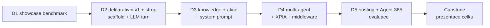

# Agenda — pořadí bloků

Jediný zdroj pravdy o pořadí modulů. Složky jsou slugy; pořadí drží tato tabulka.
Prefix `day-N/` ve slugu je **stabilní identifikátor**, ne garance dne — po prohození
bloků (viz den 1/2) se složky nepřesouvají.

**5 dní · 16 povinných bloků · 3–4 bloky/den.** P = povinný, V = volitelný / samostudium.
Fokus kurzu: **blízké okolí Microsoft 365** — vlastní vektorizace, hluboký Azure a obecná
AI témata jsou vedlejší koleje, ne jádro.

Po rekalibraci prvního běhu (2026-08-24) je pět modulů vyřazeno do samostudia a dva bloky
sloučeny — přehled a důvody v [`self-study.md`](self-study.md).

> [!IMPORTANT] Osnova je restrukturalizovaná proti webu
> Publikovaná katalogová osnova má 15 bloků a je obsahově zastaralá (retirované certifikace,
> „Graph konektory", chybí Agent Framework / Agent 365 / Foundry / MCP / A2A). Tato agenda drží
> stack 2026. Návrh nové webové osnovy je v [`marketing/`](marketing/) a **musí být na webu
> před prvním během**. Mapování „publikovaný blok → modul" je tam v delta tabulce.

> [!WARNING] Timing — publikovaná čísla jsou nominální
> Web slibuje 2 h + 13×2,5 h + 2,5 h = **37 h / 5 dní = 7,4 h/den**. První běh naměřil
> **~4,1 h skutečně odučeného obsahu za den** (den 1: 245 z plánovaných 360 min) — původní
> odhady byly ~1,5× optimistické. Dny 2–5 jsou podle toho přeplánované na 245–310 min/den.
> Publikovaná čísla ber jako marketingová. Skutečné timingy žijí v `instructor-notes.md`
> jednotlivých modulů.

## Den 1 — Mapa stacku a no-code/low-code (~4,1 h odučeno)

| # | Blok | Slug | Typ |
|---|---|---|---|
| 1 | Onboarding, prostředí & toolchain | `day-1/onboarding` | P |
| 2 | Mapa cest tvorby agentů & rozhodovací osa | `day-1/agent-landscape` | P |
| 3 | No-code a low-code cesty — showcase | `day-1/no-code-showcase` | P |
| — | Základy promptování a agentní anatomie | `day-1/opt-prompting-fundamentals` | V |
| — | Srovnání schopností podle cesty tvorby *(dokument, ne blok)* | `day-1/agent-landscape/comparison-agent-paths.md` | V |

> [!NOTE] Den 1 staví rozhodovací vrstvu **před** kódem. Blok 2 je ten, za který zákazník
> platí nejvíc: kdy deklarativní agent, kdy custom engine, kdy Copilot Studio, kdy Foundry —
> a proč. Blok 3 osu materializuje naživo (agent builder + Copilot Studio). Celý den jede
> **bez model endpointu** (jen tenant + PAYG).

> [!IMPORTANT] Realita prvního běhu (2026-08-24)
> Plánované byly čtyři bloky (360 min), odučily se **tři** (245 min) a naplnily celý den.
> `declarative-agents` se přesunul na **start dne 2**. Z toho vznikl časový etalon, podle
> kterého jsou přeplánované dny 2–5 (viz varování níže).
>
> Volitelné položky nejsou bloky dne, ale materiál k samostudiu:
> `opt-prompting-fundamentals` (převzato z GOC224 — anatomie promptu a **vrstvy instrukcí**;
> tabulka vrstev je vytažená do `declarative-agents`, kde má okamžitou hodnotu) a
> `comparison-agent-paths.md` (rozdílová matice čtyř cest **včetně SharePoint agentů** —
> hodnotnější než tabulka pěti cest ve výkladu, dát studentům jako referenci).

## Den 2 — Deklarativní strop, první agent v kódu a hygiena (~4,1 h)

| # | Blok | Slug | Typ |
|---|---|---|---|
| 1 | Deklarativní agenti & Agents Toolkit — maximum bez serverového kódu | `day-2/declarative-agents` | P |
| 2 | Agents SDK — jádro: AgentApplication, aktivity, turny | `day-1/agents-sdk-core` | P |
| 3 | Datová hygiena v SharePoint Online a Exchange Online | `day-2/data-hygiene` | P |

> [!NOTE] Blok 1 se sem přesunul z dne 1 (přetečení prvního běhu) — vyčerpá deklarativní
> cestu a končí přesně pojmenovaným stropem. Blok 2 je odpověď na ten strop: první běžící
> custom engine agent v Agents Playgroundu (bez tenantu, bez tunelu). Vyžaduje instruktorský
> Foundry deployment, klíče se rozdají ráno. Blok 3 uzavírá den otázkou, kterou praxe klade
> před grounding: **je tenant na agenta uklizený?** Den je záměrně lehčí — nese rezervu
> na doběh rozjezdu a je to první měřený den po rekalibraci.

## Den 3 — Znalosti, akce a prompt (~4,8 h)

| # | Blok | Slug | Typ |
|---|---|---|---|
| 1 | Grounding: Copilot connectors, semantic index, MCP | `day-2/knowledge-grounding` | P |
| 2 | Action handlers & integrace s Microsoft Graph | `day-2/actions-graph` | P |
| 3 | Prompt & systémová orchestrace | `day-3/prompt-orchestration` | P |

> [!NOTE] Blok 1 učí nosné rozlišení **synced vs. federated (MCP)** konektorů a hlavně
> *kdy retrieval nedělat sám*; navazuje na hygienu ze závěru D2. Blok 2 je pointa custom
> engine cesty — akce s validací, na kterou deklarativní agent nedosáhl (část D jako demo).
> Blok 3 je protějšek deklarativních instructions z D1: model, system prompt i tool-call
> loop poprvé plně v rukou studenta, s měřenou baseline pro zbytek týdne.

## Den 4 — Copilot Apps, multi-agent a bezpečnost (~5,2 h)

| # | Blok | Slug | Typ |
|---|---|---|---|
| 1 | SharePoint Copilot Apps — interaktivní UX v Copilot canvasu *(Public Preview)* | `day-4/spfx-copilot-apps` | P |
| 2 | Microsoft Agent Framework, workflows & multi-agent (A2A) | `day-3/agent-framework` | P |
| 3 | Bezpečnost & middleware — útok a obrana jako kód *(sloučený blok)* | `day-3/middleware-policy` | P |

> [!NOTE] Blok 1 je vizuální hands-on rozjezd a **most k SPFx kurzům**. Blok 2 je největší
> doplněk proti publikované osnově (Agent Framework tam chybí úplně). Blok 3 vznikl
> **sloučením `middleware-policy` a `security-risk`** (rozhodnutí prvního běhu 2026-08-24):
> oba učily totéž z opačných stran — útok ukáže, že obrana v promptu nedrží, a middleware
> je odpověď. Dramaturgie: útok první, obrana jednou a pořádně. Middleware musí pokrýt
> **oba** agenty z bloku 2 — studenti to skoro vždy zapomenou.

## Den 5 — Hosting, governance, kvalita a capstone (~4,8 h)

| # | Blok | Slug | Typ |
|---|---|---|---|
| 1 | Hosting & publikace *(zkráceno na demo)* | `day-4/event-driven-hosting` | P |
| 2 | Agent 365, Entra Agent ID & instrumentace pro-code agenta | `day-4/agent-365-governance` | P |
| 3 | Evaluace & kvalita | `day-5/evaluation-quality` | P |
| 4 | Capstone architektura & roadmapa *(elastický 60–120 min)* | `day-5/capstone` | P |

> [!NOTE] Narativ **agent opouští notebook**: hosting → publikace → governance. Blok 1 je
> instruktorské demo (studenti nemají Azure subscription) — osa hostingu jde do samostudia,
> živě zůstávají timeouty a idempotence, které na Azure nezávisí. Blok 2 je pro-code
> diferenciátor kurzu: Copilot Studio agenti se do Agent 365 registrují automaticky,
> **pro-code agenti se musí explicitně instrumentovat**. Den je nejlehčí záměrně —
> studenti občas odcházejí o 1–2 h dřív a capstone je hodnotový závěr, který musí proběhnout.

> [!WARNING] Rekalibrace po dni 1 (2026-08-24)
> Den 1 odučil 245 plánovaných minut a naplnil tím celý den — původní odhady byly zhruba
> **1,5× optimistické**. Dny 2–5 jsou přeplánované na ~245–310 min/den a jádro zkráceno
> průměrně o pětinu. Po dni 2 znovu přeměřit a doladit.

## Kompresní ventily — v tomto pořadí

1. `day-3/prompt-orchestration` — část C labu, pak výklad na 60 min.
2. `day-5/evaluation-quality` — část C labu jeden běh místo tří.
3. `day-5/capstone` — elastický 60–120 min, prezentace → pair-share.

Do samostudia bylo vyřazeno pět modulů — viz [`self-study.md`](self-study.md). Žádný
povinný modul ani capstone na nich nesmí záviset; to je podmínka, která je udržela
vyřaditelné.

## Nosná linka — jeden agent celý týden

Kurz nebuduje sérii nesouvisejících ukázek, ale **jednoho agenta**, který každý blok
něco získá. Scénář: [`scenario-support-agent.md`](scenario-support-agent.md).

## Nitě napříč kurzem

- **Rozhodovací nit**: `agent-landscape` + `no-code-showcase` (D1) → `declarative-agents`
  (D2) → `knowledge-grounding` (D3) → `agent-framework` (D4) → `event-driven-hosting` (D5).
  Pokaždé „která vrstva, a proč ne ta druhá".
- **Governance nit**: `actions-graph` (hranice oprávnění, D3) → `middleware-policy`
  (útok a obrana, D4) → `agent-365-governance` (D5).
- **Kvalitativní nit**: `prompt-orchestration` (baseline, D3) → `evaluation-quality`
  (golden set, D5) → `capstone` (KPI matice, D5).
