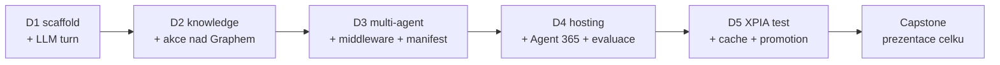

# Agenda — pořadí bloků

Jediný zdroj pravdy o pořadí modulů. Složky jsou slugy; pořadí drží tato tabulka.

**5 dní · 16 modulů (15 povinných + 1 volitelný) · 3–4 bloky/den.** P = povinný, V = volitelný.

> [!IMPORTANT] Osnova je restrukturalizovaná proti webu
> Publikovaná katalogová osnova má 15 bloků a je obsahově zastaralá (retirované certifikace,
> „Graph konektory", chybí Agent Framework / Agent 365 / Foundry / MCP / A2A). Tato agenda drží
> stack 2026. Návrh nové webové osnovy je v [`marketing/`](marketing/) a **musí být na webu
> před prvním během**. Mapování „publikovaný blok → modul" je tam v delta tabulce.

> [!WARNING] Timing — publikovaná čísla jsou nominální
> Web slibuje 2 h + 13×2,5 h + 2,5 h = **37 h / 5 dní = 7,4 h/den**. To je nad reálně
> udržitelnou hustotou (kalibrace autora z jiných běhů: nejhustší den ~6,25 h). Reálná zátěž
> níže je **~6–6,5 h/den**; publikovaná čísla ber jako marketingová. Skutečné timingy žijí
> v `instructor-notes.md` jednotlivých modulů.

## Den 1 — Mapa stacku, prostředí a první agent (~6 h)

| # | Blok | Slug | Typ |
|---|---|---|---|
| 1 | Onboarding, prostředí & toolchain | `day-1/onboarding` | P |
| 2 | Mapa cest tvorby agentů & rozhodovací osa | `day-1/agent-landscape` | P |
| 3 | Agents SDK — jádro: AgentApplication, aktivity, turny | `day-1/agents-sdk-core` | P |

> [!NOTE] Den 1 staví rozhodovací vrstvu **před** kódem. Blok 2 je ten, za který zákazník platí
> nejvíc: kdy deklarativní agent, kdy custom engine, kdy Copilot Studio, kdy Foundry — a proč.
> Blok 3 končí prvním běžícím agentem v Agents Playgroundu (bez tenantu, bez tunelu).

## Den 2 — Znalosti, akce a prompt (~6,3 h)

| # | Blok | Slug | Typ |
|---|---|---|---|
| 1 | Grounding: Copilot connectors, semantic index, MCP | `day-2/knowledge-grounding` | P |
| 2 | Action handlers & integrace s Microsoft Graph | `day-2/actions-graph` | P |
| 3 | Prompt & systémová orchestrace | `day-2/prompt-orchestration` | P |
| 4 | Vlastní retrieval: chunking, embeddings, hybrid ranking | `day-2/opt-custom-retrieval` | V |

> [!NOTE] Blok 1 učí nosné rozlišení **synced vs. federated (MCP)** konektorů a hlavně *kdy
> retrieval nedělat sám*. Vlastní vektorizace je proto **volitelný** blok 4 — v M365 kontextu
> je to rozhodnutí, ne výchozí stav. Blok 4 je zároveň **hlavní kompresní ventil dne**
> (leaf node, nic na něm nezávisí).

## Den 3 — Multi-agent, politiky a manifest (~6,75 h)

| # | Blok | Slug | Typ |
|---|---|---|---|
| 1 | Microsoft Agent Framework, workflows & multi-agent (A2A) | `day-3/agent-framework` | P |
| 2 | Middleware & enforcement politik | `day-3/middleware-policy` | P |
| 3 | Manifest, deklarace schopností & kanály | `day-3/manifest-channels` | P |

> [!NOTE] Nejhustší den kurzu — uprostřed týdne, bez onboarding/odchodových rizik.
> Blok 1 je největší doplněk proti publikované osnově (Agent Framework tam chybí úplně).
> Blok 2 slučuje Responsible AI guardrails s middleware pipeline — v pro-code kurzu je to
> jedna věc, ne dvě: guardrail je kód v pipeline, ne slide.

## Den 4 — Hosting, governance a kvalita (~6,5 h)

| # | Blok | Slug | Typ |
|---|---|---|---|
| 1 | Událostmi řízená orchestrace & hosting | `day-4/event-driven-hosting` | P |
| 2 | Agent 365, Entra Agent ID & instrumentace pro-code agenta | `day-4/agent-365-governance` | P |
| 3 | Evaluace & kvalita | `day-4/evaluation-quality` | P |

> [!NOTE] Blok 2 je pro-code diferenciátor celého kurzu: Copilot Studio agenti se do Agent 365
> registrují automaticky, **pro-code agenti se musí explicitně instrumentovat**. Blok 3 navazuje
> hned — bez telemetrie z bloku 2 se evaluace dělá naslepo.

## Den 5 — Bezpečnost, náklady a capstone (~5–6 h)

| # | Blok | Slug | Typ |
|---|---|---|---|
| 1 | Bezpečnost & řízení rizik (exfiltrace, prompt injection) | `day-5/security-risk` | P |
| 2 | Výkon, náklady & lifecycle *(elastický blok)* | `day-5/perf-cost-lifecycle` | P |
| 3 | Capstone architektura & roadmapa *(elastický 60–120 min)* | `day-5/capstone` | P |

> [!NOTE] Záměrně volnější závěr — studenti občas odcházejí o 1–2 h dřív. Blok 2 i 3 jsou
> elastické: při zkrácení se capstone prezentace mění na pair-share a jádro (end-to-end
> architektura + evaluační matice + rollback plán) zůstává vždy.

## Kompresní ventily — v tomto pořadí

1. `day-2/opt-custom-retrieval` — volitelný leaf, padá první.
2. `day-5/perf-cost-lifecycle` — elastický, jde zkrátit na výklad bez labu.
3. `day-5/capstone` — elastický 60–120 min, prezentace → pair-share.

Volitelný modul (`opt-custom-retrieval`) musí zůstat **leaf** — žádný povinný modul ani
capstone na něm nesmí záviset.

## Nosná linka — jeden agent celý týden

Kurz nebuduje 16 nesouvisejících ukázek, ale **jednoho agenta**, který každý blok něco získá.
Scénář: [`day-1/agents-sdk-core/scenario-support-agent.md`](day-1/agents-sdk-core/scenario-support-agent.md).

## Nitě napříč kurzem

- **Rozhodovací nit**: `agent-landscape` (D1) → `knowledge-grounding` (D2) →
  `agent-framework` (D3) → `event-driven-hosting` (D4). Pokaždé „která vrstva, a proč ne ta druhá".
- **Governance nit**: `actions-graph` (hranice oprávnění, D2) → `middleware-policy` (D3) →
  `agent-365-governance` (D4) → `security-risk` (D5).
- **Kvalitativní nit**: `prompt-orchestration` (evaluační heuristiky, D2) →
  `evaluation-quality` (golden set, D4) → `capstone` (KPI matice, D5).
