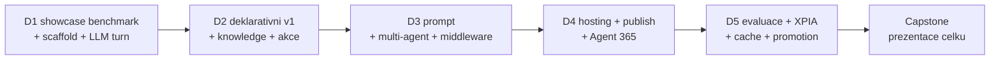

# Agenda — pořadí bloků

Jediný zdroj pravdy o pořadí modulů. Složky jsou slugy; pořadí drží tato tabulka.

**5 dní · 21 modulů (20 povinných + 1 volitelný) · 4–5 bloků/den.** P = povinný, V = volitelný.
Fokus kurzu: **blízké okolí Microsoft 365** — vlastní vektorizace, hluboký Azure a obecná
AI témata jsou vedlejší koleje, ne jádro.

> [!IMPORTANT] Osnova je restrukturalizovaná proti webu
> Publikovaná katalogová osnova má 15 bloků a je obsahově zastaralá (retirované certifikace,
> „Graph konektory", chybí Agent Framework / Agent 365 / Foundry / MCP / A2A). Tato agenda drží
> stack 2026. Návrh nové webové osnovy je v [`marketing/`](marketing/) a **musí být na webu
> před prvním během**. Mapování „publikovaný blok → modul" je tam v delta tabulce.

> [!WARNING] Timing — publikovaná čísla jsou nominální
> Web slibuje 2 h + 13×2,5 h + 2,5 h = **37 h / 5 dní = 7,4 h/den**. To je nad reálně
> udržitelnou hustotou (kalibrace autora z jiných běhů: nejhustší den ~6,25 h). Reálná zátěž
> níže je **~6–6,5 h/den**; publikovaná čísla ber jako marketingová. Skutečné timingy žijí
> v `instructor-notes.md` jednotlivých modulů.

## Den 1 — Mapa stacku, no-code/low-code a první agent (~6,3 h)

| # | Blok | Slug | Typ |
|---|---|---|---|
| 1 | Onboarding, prostředí & toolchain | `day-1/onboarding` | P |
| 2 | Mapa cest tvorby agentů & rozhodovací osa | `day-1/agent-landscape` | P |
| 3 | No-code a low-code cesty — showcase | `day-1/no-code-showcase` | P |
| 4 | Agents SDK — jádro: AgentApplication, aktivity, turny | `day-1/agents-sdk-core` | P |

> [!NOTE] Den 1 staví rozhodovací vrstvu **před** kódem. Blok 2 je ten, za který zákazník platí
> nejvíc: kdy deklarativní agent, kdy custom engine, kdy Copilot Studio, kdy Foundry — a proč.
> Blok 3 osu materializuje naživo (agent builder + Copilot Studio) — než developer sáhne
> k SDK, musí umět posoudit no-code a low-code cesty. Blok 4 končí prvním běžícím agentem
> v Agents Playgroundu (bez tenantu, bez tunelu).

## Den 2 — Deklarativní maximum, znalosti, akce a hygiena (~6,9 h)

| # | Blok | Slug | Typ |
|---|---|---|---|
| 1 | Deklarativní agenti & Agents Toolkit — maximum bez serverového kódu | `day-2/declarative-agents` | P |
| 2 | Grounding: Copilot connectors, semantic index, MCP | `day-2/knowledge-grounding` | P |
| 3 | Action handlers & integrace s Microsoft Graph | `day-2/actions-graph` | P |
| 4 | Datová hygiena v SharePoint Online a Exchange Online | `day-2/data-hygiene` | P |
| 5 | Vlastní retrieval: chunking, embeddings, hybrid ranking | `day-2/opt-custom-retrieval` | V |

> [!NOTE] Blok 1 vyčerpá možnosti **před prvním řádkem serverového kódu** (Toolkit,
> instructions, capabilities aktuální verze manifestu) a končí přesně pojmenovaným stropem —
> motivací pro custom engine zbytek týdne. Blok 2 učí nosné rozlišení **synced vs. federated
> (MCP)** konektorů a hlavně *kdy retrieval nedělat sám*. Blok 4 uzavírá den otázkou, kterou
> praxe klade před grounding: **je tenant na agenta uklizený?** Vlastní vektorizace je
> **volitelný** blok 5 — rozhodnutí, ne výchozí stav; zároveň **hlavní kompresní ventil dne**
> (leaf node, nic na něm nezávisí).

## Den 3 — Prompt, multi-agent a politiky (~6,6 h)

| # | Blok | Slug | Typ |
|---|---|---|---|
| 1 | Prompt & systémová orchestrace | `day-3/prompt-orchestration` | P |
| 2 | Microsoft Agent Framework, workflows & multi-agent (A2A) | `day-3/agent-framework` | P |
| 3 | Middleware & enforcement politik | `day-3/middleware-policy` | P |

> [!NOTE] Blok 2 je největší doplněk proti publikované osnově (Agent Framework tam chybí
> úplně). Blok 3 slučuje Responsible AI guardrails s middleware pipeline — v pro-code kurzu
> je to jedna věc, ne dvě: guardrail je kód v pipeline, ne slide (lab 90 min, část C
> volitelná při plném tempu).

## Den 4 — Copilot Apps, hosting, Marketplace a governance (~6,8 h)

| # | Blok | Slug | Typ |
|---|---|---|---|
| 1 | SharePoint Copilot Apps — interaktivní UX v Copilot canvasu *(Public Preview)* | `day-4/spfx-copilot-apps` | P |
| 2 | Událostmi řízená orchestrace, hosting & publikace | `day-4/event-driven-hosting` | P |
| 3 | Agenti v Marketplace — podmínky publikace | `day-4/marketplace-agents` | P |
| 4 | Agent 365, Entra Agent ID & instrumentace pro-code agenta | `day-4/agent-365-governance` | P |

> [!NOTE] Blok 1 je vizuální hands-on rozjezd dne a **most k SPFx kurzům** (MCP Apps
> model, každý student si scaffoldne vlastní Copilot App). Pak narativ **agent opouští
> notebook**: hosting → org katalog → Marketplace (case study Normiqa Navigator) →
> governance. Blok 4 je pro-code diferenciátor celého kurzu: Copilot Studio agenti se
> do Agent 365 registrují automaticky, **pro-code agenti se musí explicitně
> instrumentovat**.

## Den 5 — Governance alternativa, kvalita, bezpečnost a capstone (~6,5 h s ventily)

| # | Blok | Slug | Typ |
|---|---|---|---|
| 1 | Orchestry — third-party alternativa governance | `day-5/orchestry-governance` | P |
| 2 | Evaluace & kvalita | `day-5/evaluation-quality` | P |
| 3 | Bezpečnost & řízení rizik (exfiltrace, prompt injection) | `day-5/security-risk` | P |
| 4 | Výkon, náklady & lifecycle *(elastický blok)* | `day-5/perf-cost-lifecycle` | P |
| 5 | Capstone architektura & roadmapa *(elastický 60–120 min)* | `day-5/capstone` | P |

> [!NOTE] Blok 1 navazuje na Agent 365 ze závěru dne 4 (third-party srovnání, dokud je
> čerstvé). Blok 2 staví na governance telemetrii — bez ní se evaluace dělá naslepo.
> Studenti občas odcházejí o 1–2 h dřív; bloky 4 i 5 jsou elastické: při zkrácení se
> capstone prezentace mění na pair-share a jádro (end-to-end architektura + evaluační
> matice + rollback plán) zůstává vždy.

> [!WARNING] Hustota dnů 2 (~6,9 h) a 4 (~6,8 h) je nad kalibračním stropem (~6,25 h)
> Kompaktní bloky na okrajích dnů (data-hygiene, marketplace) se při skluzu zkracují
> první, před kompresními ventily níže. Reálné timingy doladit po prvním běhu.

## Kompresní ventily — v tomto pořadí

1. `day-2/opt-custom-retrieval` — volitelný leaf, padá první.
2. `day-5/perf-cost-lifecycle` — elastický, jde zkrátit na výklad bez labu.
3. `day-5/capstone` — elastický 60–120 min, prezentace → pair-share.

Volitelný modul (`opt-custom-retrieval`) musí zůstat **leaf** — žádný povinný modul ani
capstone na něm nesmí záviset.

## Nosná linka — jeden agent celý týden

Kurz nebuduje 17 nesouvisejících ukázek, ale **jednoho agenta**, který každý blok něco získá.
Scénář: [`scenario-support-agent.md`](scenario-support-agent.md).

## Nitě napříč kurzem

- **Rozhodovací nit**: `agent-landscape` + `no-code-showcase` (D1) → `declarative-agents` +
  `knowledge-grounding` (D2) → `agent-framework` (D3) → `event-driven-hosting` (D4).
  Pokaždé „která vrstva, a proč ne ta druhá".
- **Governance nit**: `actions-graph` (hranice oprávnění, D2) → `middleware-policy` (D3) →
  `agent-365-governance` (D4) → `security-risk` (D5).
- **Kvalitativní nit**: `prompt-orchestration` (evaluační heuristiky, D3) →
  `evaluation-quality` (golden set, D5) → `capstone` (KPI matice, D5).
