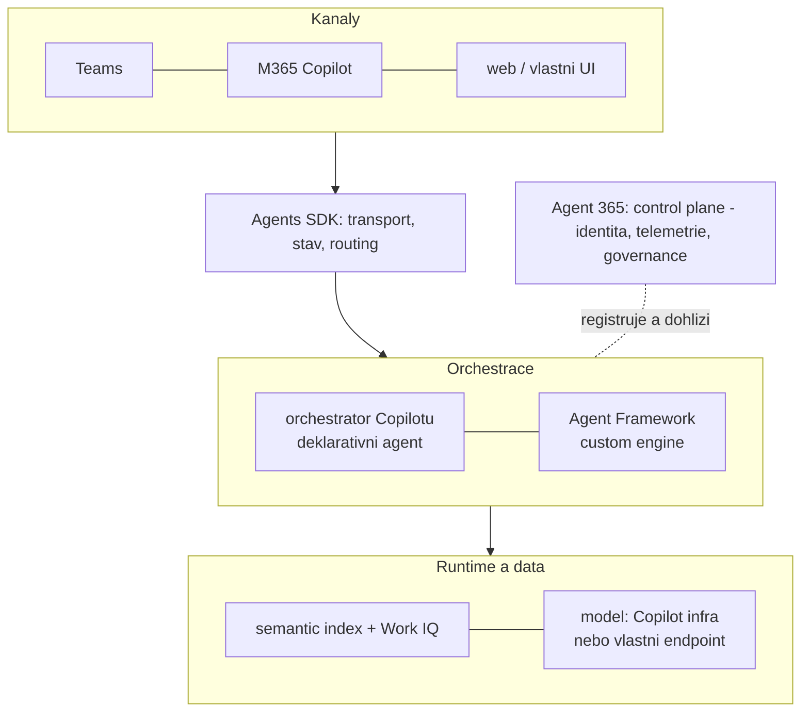
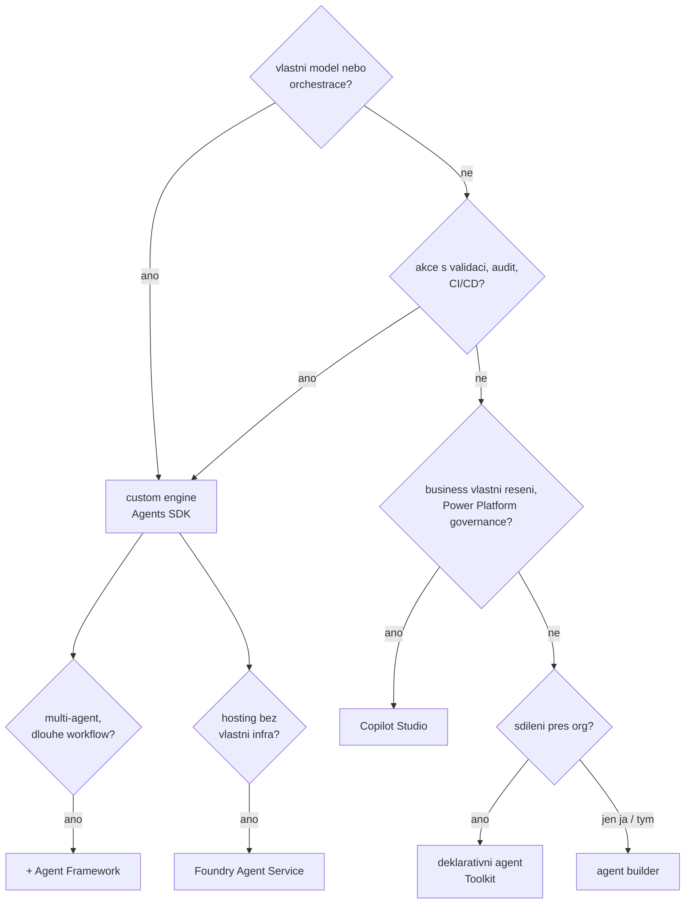

# Mapa cest tvorby agentů & rozhodovací osa

> Typ: povinný · Den: 1 · Odhad: **105 min** (60 výklad + 45 lab) · Publikum: **vývojáři / architekti**
> Prostředí: viz [`../../environment.md`](../environment.md) · Názvosloví: [`../../GLOSSARY.md`](../GLOSSARY.md)

Blok, za který zákazník platí nejvíc. Odpovídá na otázku, se kterou studenti reálně přicházejí:
*„zákazník chce Copilot Studio, my umíme pro-code — kdo má pravdu?"*

## Cíle
- Umět **obhájit volbu cesty** tvorby agenta před zákazníkem, ne jen jmenovat nástroje.
- Rozlišit **deklarativní** a **custom engine** agenta a vědět, co každý vyžaduje za infrastrukturu.
- Vědět, kde v Microsoft stacku leží Agents SDK, Agent Framework, Agents Toolkit,
  Copilot Studio, Microsoft Foundry a Agent 365 — a co která vrstva **není**.

## Výklad

### Architektura Copilotu — co je runtime a co je kanál

- **M365 Copilot je pracovní plocha, ne agent.** Uživatel v ní potkává agenty — vlastní
  i cizí. Kdo staví agenta, staví obsah do této plochy (nebo mimo ni, a to je rozhodnutí).
- **Orchestrátor Copilotu**: plánuje, volí knowledge a akce, drží konverzaci. U deklarativního
  agenta pracuje **za tebe** — dodáváš mu jen instructions, knowledge a akce.
- **Semantic index**: vyhledání nad tenantem s vynucením permissions. Zadarmo v ceně
  platformy — vlastní retrieval je proti němu rozhodnutí s cenovkou (D2).
- **Work IQ signály**: kontext uživatele (kalendář, vztahy, dokumenty) — dostupný platformě,
  ne tvému custom kódu.
- **Kanál ≠ runtime.** Teams a M365 Copilot jsou kanály; kde agent *běží*, je jiná otázka —
  a přesně tu řeší zbytek mapy.

### Microsoft nesjednocuje — vrstvy koexistují

- Strategie zní **„build agents, your way"**: no-code (agent builder), low-code (Copilot
  Studio), pro-code (Agents SDK + Agent Framework), PaaS (Foundry Agent Service) a nad tím
  control plane (Agent 365).
- **Nosná pointa: není to jeden nástroj nahrazující druhý — je to vrstvená mapa.** Každá
  vrstva cílí jiné publikum a jiné vlastnictví řešení. Koexistence je záměr, ne dluh.
- Konzultant, který zná jen jeden konec osy, neprodává řešení, ale svůj zvyk.

### Pět cest tvorby

> [!NOTE] Tabulka má šest řádků, ale cest je pět
> **Agent Framework není samostatná cesta** — běží uvnitř SDK aplikace. Je v tabulce proto,
> že se studenti ptají, kam patří. Na D5 se k mapě vracíme jako k rozhodovacímu nástroji:
> [`recap-d5-rozhodovaci-mapa.md`](recap-d5-rozhodovaci-mapa.md).

| Cesta | Kdo ji vlastní | Co potřebuje | Kde běží | Governance |
|---|---|---|---|---|
| **Copilot agent builder** | koncový uživatel / business | M365 Copilot nebo PAYG | uvnitř M365 Copilotu | omezené sdílení, bez ALM |
| **SharePoint agent** | **vlastník obsahu** — bez opuštění webu | Copilot licence (tvorba), PAYG (použití) | u webu; žije s ním i jeho oprávněními | RCD / Restricted SharePoint Search, SAM reporty |
| **Copilot Studio** | business / citizen dev + IT | Studio licenci, Copilot Credits | Power Platform | PPAC, DLP, Managed Environments; **auto-registrace do Agent 365** |
| **Agents SDK (custom engine)** | vývojový tým | model endpoint, hosting, CI/CD | tvoje infrastruktura (App Service, Container Apps…) | tvoje práce: instrumentace do Agent 365 |
| **Agent Framework** | vývojový tým | běží **uvnitř** SDK aplikace | tam, kde SDK aplikace | dtto custom engine; jen C#/Python |
| **Foundry Agent Service** | vývojový tým / platform tým | Azure subscription | PaaS v Azure | Foundry Control Plane + Entra Agent ID |

- **SharePoint agent** je pro tohle publikum nejbližší cesta: vzniká jedním klikem nad
  knihovnou, kterou už spravujete. Strop je ale tvrdý — Q&A nad obsahem, žádné akce,
  jeden list a nic jiného.
- Deklarativní agent (Toolkit) je příčka mezi Studiem a custom enginem — stavíte ho
  ráno druhého dne.

> [!TIP] Podrobná rozdílová matice
> [`comparison-agent-paths.md`](comparison-agent-paths.md) srovnává agent builder,
> Copilot Studio, Agents Toolkit a SharePoint agenty po jednotlivých schopnostech
> (listy, konektory, akce, ALM, publikace, licence) a říká, co má která cesta
> **exkluzivně**. Tam patří i odpověď na „kam až dosáhne SharePoint agent".

### Rozhodovací osa

Pořadí otázek je důležité — governance a údržba rozhodují častěji než technologie:

1. **Potřebuje vlastní orchestraci nebo vlastní model?** Ne → zůstaň deklarativně/low-code.
2. **Potřebuje akce s validací, audit, source control a CI/CD?** Ano → custom engine.
3. **Má zákazník Power Platform governance (PPAC, DLP) a vlastní to business?** → Studio.
4. **Stačí instructions + knowledge nad tenantem?** Sdílí se přes org → deklarativní agent;
   jen pro sebe/tým → agent builder.
5. **Kdo to bude udržovat za dva roky?** Odpověď „nikdo z IT" diskvalifikuje pro-code.

### Copilot Studio — poctivě, ne jako soupeř

- Copilot Studio **je Power Platform** — PPAC, DLP, Managed Environments, Dataverse,
  Copilot Credits, ALM přes solutions. Marketing ho prezentuje šířeji, admin a licenční
  model je Power Platform. Tohle studenti jinde nedostanou.
- Když zákazník řekne „chceme Copilot Studio", často nevědomky říká „chceme Power Platform
  governance" — a to je legitimní požadavek, ne omyl.
- **Kde Studio vyhrává**: business vlastní řešení, konektory a Power Automate v zadání,
  governance zdarma (auto-registrace do Agent 365), rychlost od nápadu k nasazení.
- **Kde ne**: akce s validací parametrů, deterministické větve, vlastní middleware,
  vlastní telemetrie, source control nad celým řešením — přesně body 3–5 našeho scénáře.

> [!IMPORTANT] Poznámka pro lektora i studenty
> Cílem bloku **není** prodat pro-code. Cílem je rozhodovací kompetence. Student, který umí
> říct „tady je Copilot Studio správná volba a tady ne, a tady jsou důvody", má u zákazníka
> silnější pozici než ten, kdo umí jen jednu cestu.

## Klíčové rozlišení
- **Deklarativní agent** (instructions + knowledge + actions nad orchestrátorem M365 Copilotu,
  bez vlastního hostingu a modelu) vs. **custom engine agent** (vlastní orchestrace, model, hosting).
- **Agents SDK** (transport, stav, routing aktivit) vs. **Agent Framework** (orchestrace,
  multi-agent) — Agents SDK **není** orchestrátor ani model.
- **Agent 365** (control plane, agenty nehostuje) vs. **Microsoft Foundry** (runtime a modely)
  vs. **Foundry Control Plane** (infrastruktura v Azure).
- **Licence** (přístup k funkci) vs. **permissions** (kdo funkci použije) vs. **inference**
  (kdo platí tokeny).

## Naše prostředí

Hands-on, bez kódu a bez tenantu — rozhodovací lab. Hned po něm osu materializuje živý
showcase ([`../no-code-showcase/`](../no-code-showcase/)). Deklarativního agenta si
student postaví ještě dnes ([`../../declarative-agents/`](../declarative-agents/))
a doporučená volba se v dalších dnech staví reálně (custom engine přes Agents SDK, od D2).

## Lab
Viz [`lab-decision-matrix.md`](lab-decision-matrix.md).

## Nosná linka
Student odůvodní, proč Support Asistent ze
[`../../scenario-support-agent.md`](../scenario-support-agent.md)
musí být **custom engine agent** — body 3–5 zadání (akce, hranice oprávnění, auditovatelnost)
deklarativní agent sám neuzavře.

## Zdroje (Microsoft)
- [What is the Microsoft 365 Agents SDK](https://learn.microsoft.com/en-us/microsoft-365/agents-sdk/agents-sdk-overview)
- [Declarative agents for Microsoft 365 Copilot](https://learn.microsoft.com/en-us/microsoft-365/copilot/extensibility/overview-declarative-agent)
- [Choose the right tool to build a declarative agent](https://learn.microsoft.com/en-us/microsoft-365/copilot/extensibility/declarative-agent-tool-comparison)
- [Microsoft Agent 365 SDK and CLI](https://learn.microsoft.com/en-us/microsoft-agent-365/developer/)
- [Foundry Agent Service](https://azure.microsoft.com/en-us/products/ai-foundry/agent-service)

## Stav produktu / delta

> [!WARNING] Ověřit k datu běhu — stav k 2026-08.
> Nejrychleji se měnící blok kurzu. Před **každým** během projít: rozsah publikace Foundry
> agentů do M365 Copilotu a Teams (GA 06/2026), aktuální feature split Copilot Studia,
> a jestli se rozhodovací osa nezměnila novým oznámením z Build/Ignite.

> [!IMPORTANT] Názvosloví
> Katalogová osnova rámuje tento blok přes „kanály a adaptéry **Azure Bot Service**".
> Bot Service je dnes redukovaný na registraci kanálu — ne nosná architektonická vrstva.
