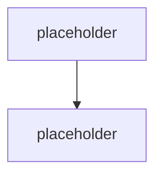

# Mapa cest tvorby agentů & rozhodovací osa

> Typ: povinný · Den: 1 · Odhad: **140 min** (90 výklad + 50 lab) · Publikum: **vývojáři / architekti**
> Prostředí: viz [`../../environment.md`](../../environment.md) · Názvosloví: [`../../GLOSSARY.md`](../../GLOSSARY.md)

Blok, za který zákazník platí nejvíc. Odpovídá na otázku, se kterou studenti reálně přicházejí:
*„zákazník chce Copilot Studio, my umíme pro-code — kdo má pravdu?"*

## Cíle
- Umět **obhájit volbu cesty** tvorby agenta před zákazníkem, ne jen jmenovat nástroje.
- Rozlišit **deklarativní** a **custom engine** agenta a vědět, co každý vyžaduje za infrastrukturu.
- Vědět, kde v Microsoft stacku leží Agents SDK, Agent Framework, Agents Toolkit,
  Copilot Studio, Microsoft Foundry a Agent 365 — a co která vrstva **není**.

## Výklad

### Architektura Copilotu — co je runtime a co je kanál

<!-- TODO: M365 Copilot jako pracovni plocha; orchestrator; semantic index; Work IQ -->

### Microsoft nesjednocuje — vrstvy koexistují

<!-- TODO: strategie "build agents, your way": no-code / low-code / pro-code / PaaS / control plane.
     Nosna pointa: neni to jeden nastroj nahrazujici druhy, je to vrstvena mapa. -->

### Pět cest tvorby

<!-- TODO: Agent Builder / Copilot Studio / Agents SDK / Agent Framework / Foundry Agent Service.
     U kazde: kdo to vlastni, co to potrebuje, kde to bezi, jak se to governuje. -->

### Rozhodovací osa

<!-- TODO: rozhodovaci strom. Vstupy: potrebuje vlastni orchestraci? vlastni model?
     source control a CI/CD? externi kanaly? kdo to bude udrzovat? jaky je governance model? -->

### Copilot Studio — poctivě, ne jako soupeř

<!-- TODO: Copilot Studio je soucast Power Platform (PPAC, DLP, Managed Environments,
     Dataverse, ALM, Copilot Credits). Kdyz zakaznik rekne "Copilot Studio", casto
     nevedomky rika "Power Platform governance". Kde Studio vyhrava a kde ne. -->

> [!IMPORTANT] Poznámka pro lektora i studenty
> Cílem bloku **není** prodat pro-code. Cílem je rozhodovací kompetence. Student, který umí
> říct „tady je Copilot Studio správná volba a tady ne, a tady jsou důvody", má u zákazníka
> silnější pozici než ten, kdo umí jen jednu cestu.

## Klíčové rozlišení
- **Deklarativní agent** (instructions + knowledge + actions nad orchestrátorem M365 Copilotu,
  bez vlastního hostingu a modelu) vs. **custom engine agent** (vlastní orchestrace, model, hosting).
- **Agents SDK** (transport, stav, routing aktivit) vs. **Agent Framework** (orchestrace,
  multi-agent) — Agents SDK **není** orchestrátor ani model.
- **Agent 365** (control plane, agenty nehostuje) vs. **Microsoft Foundry** (runtime a modely)
  vs. **Foundry Control Plane** (infrastruktura v Azure).
- **Licence** (přístup k funkci) vs. **permissions** (kdo funkci použije) vs. **inference**
  (kdo platí tokeny).

## Naše prostředí

Hands-on, bez kódu a bez tenantu — rozhodovací lab. Doporučená volba se v dalších dnech
staví reálně (custom engine přes Agents SDK), ale deklarativního agenta si student postaví
také, v [`../../day-3/manifest-channels/`](../../day-3/manifest-channels/).

## Lab
Viz [`lab-decision-matrix.md`](lab-decision-matrix.md).

## Nosná linka
Student odůvodní, proč Support Asistent ze
[`../agents-sdk-core/scenario-support-agent.md`](../agents-sdk-core/scenario-support-agent.md)
musí být **custom engine agent** — body 3–5 zadání (akce, hranice oprávnění, auditovatelnost)
deklarativní agent sám neuzavře.

## Zdroje (Microsoft)
- [What is the Microsoft 365 Agents SDK](https://learn.microsoft.com/en-us/microsoft-365/agents-sdk/agents-sdk-overview)
- [Declarative agents for Microsoft 365 Copilot](https://learn.microsoft.com/en-us/microsoft-365/copilot/extensibility/overview-declarative-agent)
- [Choose the right tool to build a declarative agent](https://learn.microsoft.com/en-us/microsoft-365/copilot/extensibility/declarative-agent-tool-comparison)
- [Microsoft Agent 365 SDK and CLI](https://learn.microsoft.com/en-us/microsoft-agent-365/developer/)
- [Foundry Agent Service](https://azure.microsoft.com/en-us/products/ai-foundry/agent-service)

## Stav produktu / delta

> [!WARNING] Ověřit k datu běhu — stav k 2026-08.
> Nejrychleji se měnící blok kurzu. Před **každým** během projít: rozsah publikace Foundry
> agentů do M365 Copilotu a Teams (GA 06/2026), aktuální feature split Copilot Studia,
> a jestli se rozhodovací osa nezměnila novým oznámením z Build/Ignite.

> [!IMPORTANT] Názvosloví
> Katalogová osnova rámuje tento blok přes „kanály a adaptéry **Azure Bot Service**".
> Bot Service je dnes redukovaný na registraci kanálu — ne nosná architektonická vrstva.
