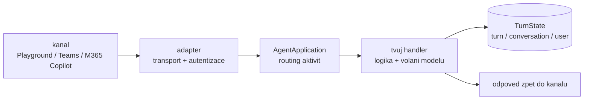
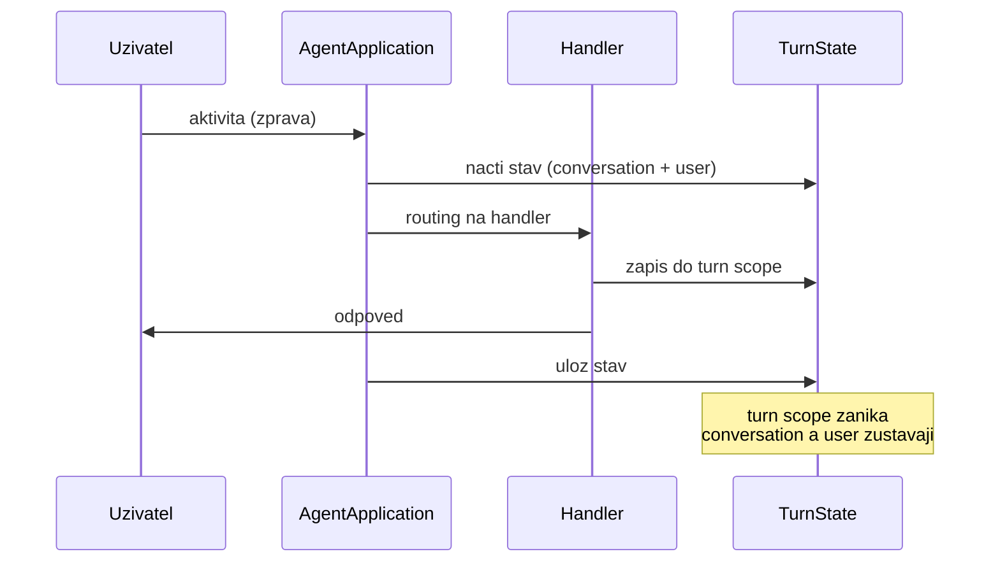

# Agents SDK — jádro: AgentApplication, aktivity, turny

> Typ: povinný · Den: 3 · Odhad: **130 min** (65 výklad + 65 lab) · Publikum: **vývojáři / architekti**
> Prostředí: viz [`../../environment.md`](../../environment.md) · Názvosloví: [`../../GLOSSARY.md`](../../GLOSSARY.md)
> Nosná linka: [`scenario-support-agent.md`](../../scenario-support-agent.md)

## Cíle
- Rozumět **`AgentApplication`** jako vstupnímu bodu všech příchozích aktivit.
- Vědět, co je **aktivita**, co je **turn** a kde žije **`TurnState`**.
- Nakonfigurovat agenta přes **`AgentApplicationOptions`** a spustit ho lokálně
  v Microsoft 365 Agents Playground.
- Zapojit první volání modelu — a hlavně **ošetřit, když selže**.

## Výklad

### Otvírák dne — co za tebe platforma přestává dělat

Dnešek **není povýšení na „opravdové agenty"**. Deklarativní agent z úterý není juniorní
verze toho dnešního — je to [vrstvená mapa, ne žebřík](../agent-landscape/README.md).
Kdo dneska přejde na custom engine, něco získá **a něco ztratí**.

Co se láme, je vlastnictví. Do včerejška ti tři věci držela platforma. Od dneška jsou tvoje:

| | **Deklarativní agent** (D2) | **Custom engine agent** (od dneška) |
|---|---|---|
| **Model** | orchestrátor M365 Copilot, nevybíráš ho | **tvůj endpoint**, tvoje volba, tvoje subscription |
| **Hosting** | žádný — agent je manifest | **povinný**; server běží a fakturuje i v noci |
| **Autorizace a ACL trimming** | zdarma ze zdroje, agent nikdy nepřekročí práva uživatele | **tvůj kód**, per akce — [`../../day-2/actions-graph/`](../../day-2/actions-graph/) |
| **Grounding** | capability v manifestu | tvoje volání — Retrieval API, konektor nebo vlastní index |
| **Audit a governance** | platforma | tvoje instrumentace — [`../../day-4/agent-365-governance/`](../../day-4/agent-365-governance/) |
| **Lifecycle** | verze manifestu | build, deploy, rollback — [`../../day-4/event-driven-hosting/`](../../day-4/event-driven-hosting/) |

- **Proč tedy vůbec?** Protože včerejší strop je konkrétní: deklarativní agent neumí
  spustit **tvůj kód** — validaci parametrů, autorizaci per uživatel, retry, auditní stopu.
  Kde tohle zákazník potřebuje, žádné ladění manifestu nepomůže. Kde to nepotřebuje, je
  custom engine agent **over-engineering** a rozhodovací matice z D1 to má říct nahlas.
- **Peněženky se nemění na jednu, ale na čtyři.** Copilot Credits nezmizí — grounding přes
  Retrieval API se z nich platí dál, i z custom engine agenta. Odstěhuje se **jen
  inference**: každý turn, včetně reasoning tokenů, jde přes Azure subscription. Přibude
  hosting, který běží bez ohledu na provoz. Detail v [`../../GLOSSARY.md`](../../GLOSSARY.md),
  s čísly v [`../../day-5/perf-cost-lifecycle/`](../../day-5/perf-cost-lifecycle/).
- Věta pro zákazníka: **„Máme Copilot licence, tak agenta máme zaplaceného"** přestává
  platit v okamžiku, kdy sáhneš po Agents SDK. Ne proto, že licence zmizí — proto, že
  přibude faktura, kterou dosud nikdo neviděl.
- Zapamatovatelně: **custom engine agent není vyšší level, je to obchod.** Kupuješ si
  kontrolu nad akcemi, orchestrací a auditem. Platíš infrastrukturou, fakturou
  a odpovědností.

### Microsoft Foundry v kostce — kam se to připojujeme

První závazek z tabulky výše (model) má konkrétní podobu: **Foundry deployment**.
Než se na něj v labu připojíme, patří k němu vysvětlení a pět minut sdílené obrazovky —
jinak je to připojení na slepo. Celý blok (~15 min):
[`explainer-foundry-basics.md`](explainer-foundry-basics.md) — co Foundry je a není,
hierarchie subscription → resource → deployment (kde bydlí klíč, endpoint a deployment
name), typy nasazení a proč máme DataZone, capacity jako brzda rychlosti (429 naživo
v části D labu) a přechod hranice M365 jednou větou pro zákazníka.

### Co Agents SDK dělá a co nedělá

- **Dělá plumbing mezi kanálem a tvojí logikou**: příjem zpráv, správu stavu, routing
  událostí, autentizaci a transport. Je to vrstva, kterou bys jinak psal sám a nudil se u ní.
- **Je AI-agnostické by design.** SDK neví, jestli za ním je model, `if`, nebo databáze.
- **Není model**, **není orchestrátor**, **není no-code builder.** Microsoft to říká
  explicitně a studenti to skoro vždy čekají jinak. Otázka „kde nastavím, aby agent použil
  nástroj" nemá v SDK odpověď — to je orchestrace (D4).
- Praktický důsledek: dnešní agent bude fungovat, i když z něj model odpojíš. Odpoví hloupě,
  ale odpoví — a to je správně navržená hranice.

### AgentApplication a handlery

- `AgentApplication` je **jediný vstupní bod** všech příchozích aktivit. Neregistruješ
  endpointy, registruješ **handlery na typy aktivit**.
- Typy příchozích aktivit, se kterými se reálně potkáš:
  - **zpráva uživatele** — to, co si studenti představí jako jediný případ,
  - **conversation lifecycle** — uživatel přidán do konverzace, agent přidán do týmu
    (tady se dělá uvítací zpráva),
  - **interakce s Adaptive Card** — uživatel klikl na tlačítko v kartě, ne napsal text,
  - **OAuth callback** — návrat z přihlašovacího toku.
- Routing je deklarativní: řekneš „na tenhle typ aktivity zavolej tenhle handler".
  Co handler dělá uvnitř, SDK nezajímá.
- Zapamatovatelně: **SDK doručí aktivitu do handleru. Tím jeho práce končí.**

### Turn a TurnState

- **Turn = zpracování jedné aktivity** od příjmu po odpověď. Není to konverzace ani
  session — je to jeden průchod.
- `TurnState` má tři rozsahy a jejich volba je **návrhové rozhodnutí, ne detail**:
  - **turn** — žije jeden průchod (mezivýsledky, příznaky pro tenhle běh),
  - **conversation** — žije napříč turny téže konverzace (historie, kontext, počitadla),
  - **user** — žije napříč konverzacemi téhož uživatele (preference).
- Kam se stav ukládá (paměť, blob, databáze) je **konfigurace**, ne kód aplikace.
  V Playgroundu jede paměťové úložiště; v produkci ne — restart by smazal konverzace.
- Nejčastější chyba: dát do `user` scope věc, která patří do `conversation` (a naopak).
  V labu na to narazíte sami, pak to pojmenujeme.

### Kanály a adaptéry — stav 2026

- Agents SDK je **multi-channel**: M365 Copilot, Teams, web chat, e-mail, SMS a další.
  Tentýž handler obslouží víc kanálů — liší se adaptér, ne logika.
- **Role Azure Bot Service se zúžila** na registraci kanálu a channel adaptaci. Není to
  nosná architektonická vrstva, jak ji staví starší dokumentace i katalogová osnova.
- Praktický důsledek pro dnešek: **Agents Playground žádnou registraci nepotřebuje.**
  Bot registrace a tunel jsou téma až u publikace (D5).
- Kanál určuje, co jde poslat: Adaptive Cards, přílohy, streamování odpovědi — to se
  liší a je to rozhodnutí pro návrh UX, ne detail transportu.

> [!IMPORTANT] Názvosloví
> Starší dokumentace i katalogová osnova staví **Azure Bot Service** jako nosnou vrstvu.
> Dnes je to registrace kanálu a channel adaptace — architektura sedí na Agents SDK.

### První volání modelu — a jeho chybové větve

Model endpoint se zapojuje **z konfigurace, nikdy natvrdo** (klíč v `.env` / user secrets,
viz [`../../environment.md`](../../environment.md)). Volání modelu je ale síťové volání
cizí služby — a tady začíná rozdíl mezi kurzem a tutoriálem z internetu:

- **Timeout je povinný.** Bez něj agent čeká, dokud nevyprší trpělivost uživatele.
  Nastav ho explicitně, ne implicitně.
- **Rozliš transientní a permanentní chybu.** Throttling a timeout jsou transientní —
  retry s exponenciálním backoffem dává smysl. Špatný klíč, neexistující deployment nebo
  odmítnutý obsah jsou permanentní — retry jen pálí čas a tokeny.
- **Retry má strop.** Nekonečné opakování je nejdražší způsob, jak selhat.
- **Co uživatel uvidí, když model neodpoví?** Ne stack trace, ne prázdná bublina. Věta,
  která říká, že se nepovedlo a co dělat dál. Tohle je součást produktu, ne ošetření chyby.

> [!IMPORTANT] Proč je chybová větev v prvním bloku o kódu
> Je to nosný pedagogický bod celého kurzu: agent je **distribuovaný systém**, ne skript.
> Kdo se to nenaučí tady, staví demo-ware. Chybové větve z dnešního labu se vracejí
> v hostingu (D5, timeout patterny) a v evaluaci (D5, měření selhání).

## Klíčové rozlišení
- **Aktivita** (jedna událost) vs. **turn** (její zpracování) vs. **konverzace** (série turnů).
- **`TurnState`** rozsahy: turn / conversation / user — a co kam **nepatří**.
- **Agents SDK** (transport, stav, routing) vs. **orchestrace** (kdo rozhoduje, co agent řekne)
  — orchestrace přijde v [`../../day-3/agent-framework/`](../../day-3/agent-framework/).
- **Agents Playground** (lokálně, bez tenantu/tunelu/bot registrace) vs. **nasazení do kanálu**.

## Naše prostředí

Hands-on, **bez tenantu** — Agents Playground běží lokálně. Potřebuje ale **model endpoint**
(instruktorský Foundry deployment, viz [`../../environment.md`](../../environment.md)).
Při výpadku endpointu se lab dokončí v echo režimu a LLM turn se odloží.

## Lab
Viz [`lab-first-agent.md`](lab-first-agent.md). Referenční řešení v `solution/`.

## Nosná linka
Support Asistent vzniká: scaffold → echo turn → **LLM turn s ošetřenou chybovou větví**.
Čtyři testovací dotazy ze [`scenario-support-agent.md`](../../scenario-support-agent.md) se pouští
poprvé — zatím na ně agent odpovídá špatně, protože nemá knowledge. To je záměr.

## Zdroje (Microsoft)
- [What is the Microsoft 365 Agents SDK](https://learn.microsoft.com/en-us/microsoft-365/agents-sdk/agents-sdk-overview)
- [AgentApplication in Microsoft 365 Agents SDK](https://learn.microsoft.com/en-us/microsoft-365/agents-sdk/agent-application)
- [AgentApplication class (@microsoft/agents-hosting)](https://learn.microsoft.com/en-us/javascript/api/@microsoft/agents-hosting/agentapplication)
- [Quickstart: Create and test a basic agent](https://learn.microsoft.com/en-us/microsoft-365/agents-sdk/quickstart)
- [Test your agent locally in Microsoft 365 Agents Playground](https://learn.microsoft.com/en-us/microsoft-365/agents-sdk/test-with-toolkit-project)

## Stav produktu / delta

> [!WARNING] Ověřit k datu běhu — stav k 2026-08.
> Verze Agents SDK a názvy typů/exportů se mezi verzemi měnily. Ověřit signatury proti
> [API referenci](https://learn.microsoft.com/en-us/javascript/api/@microsoft/agents-hosting/agentapplication)
> a přebuildovat `solution/` před během. Rovněž ověřit aktuální požadavek na Bot registraci
> per kanál.
