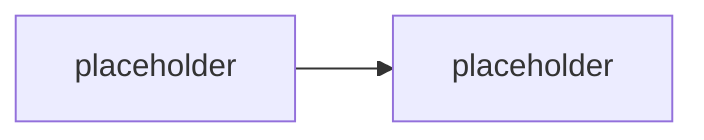
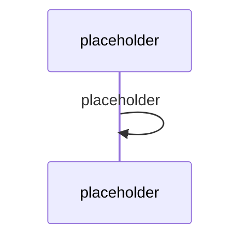

# Agents SDK — jádro: AgentApplication, aktivity, turny

> Typ: povinný · Den: 1 · Odhad: **135 min** (60 výklad + 75 lab) · Publikum: **vývojáři / architekti**
> Prostředí: viz [`../../environment.md`](../../environment.md) · Názvosloví: [`../../GLOSSARY.md`](../../GLOSSARY.md)
> Nosná linka: [`scenario-support-agent.md`](../../scenario-support-agent.md)

## Cíle
- Rozumět **`AgentApplication`** jako vstupnímu bodu všech příchozích aktivit.
- Vědět, co je **aktivita**, co je **turn** a kde žije **`TurnState`**.
- Nakonfigurovat agenta přes **`AgentApplicationOptions`** a spustit ho lokálně
  v Microsoft 365 Agents Playground.
- Zapojit první volání modelu — a hlavně **ošetřit, když selže**.

## Výklad

### Co Agents SDK dělá a co nedělá

<!-- TODO: SDK = plumbing mezi kanalem a tvou logikou: prijem zprav, stav, routing eventu,
     autentizace, transport. Je AI-agnosticke by design. Neni model, neni orchestrator,
     neni no-code builder. -->

### AgentApplication a handlery

<!-- TODO: AgentApplication jako entry point. Typy prichozich aktivit: zprava uzivatele,
     conversation lifecycle event, interakce s Adaptive Card, OAuth callback.
     Registrace handleru, routing. -->

### Turn a TurnState

<!-- TODO: turn = zpracovani jedne aktivity od prijmu po odpoved.
     TurnState: rozsah turn / conversation / user. Kde se stav ulozi (storage) a proc
     to je konfiguracni rozhodnuti, ne detail. -->

### Kanály a adaptéry — stav 2026

<!-- TODO: multi-channel: M365 Copilot, Teams, web chat, e-mail, SMS. Kde je dnes role
     Azure Bot Service (registrace kanalu, channel adaptace) a kde uz neni. -->

> [!IMPORTANT] Názvosloví
> Starší dokumentace i katalogová osnova staví **Azure Bot Service** jako nosnou vrstvu.
> Dnes je to registrace kanálu a channel adaptace — architektura sedí na Agents SDK.

### První volání modelu — a jeho chybové větve

<!-- TODO: zapojeni model endpointu. POVINNE ukazat i: timeout, transientni vs permanentni
     chyba, retry s backoff, a co agent odpovi uzivateli kdyz model neodpovi.
     Toto je nosny pedagogicky bod kurzu — ne demo-ware. -->

## Klíčové rozlišení
- **Aktivita** (jedna událost) vs. **turn** (její zpracování) vs. **konverzace** (série turnů).
- **`TurnState`** rozsahy: turn / conversation / user — a co kam **nepatří**.
- **Agents SDK** (transport, stav, routing) vs. **orchestrace** (kdo rozhoduje, co agent řekne)
  — orchestrace přijde v [`../../day-3/agent-framework/`](../../day-3/agent-framework/).
- **Agents Playground** (lokálně, bez tenantu/tunelu/bot registrace) vs. **nasazení do kanálu**.

## Naše prostředí

Hands-on, **bez tenantu** — Agents Playground běží lokálně. Potřebuje ale **model endpoint**
(instruktorský Foundry deployment, viz [`../../environment.md`](../../environment.md)).
Při výpadku endpointu se lab dokončí v echo režimu a LLM turn se odloží.

## Lab
Viz [`lab-first-agent.md`](lab-first-agent.md). Referenční řešení v `solution/`.

## Nosná linka
Support Asistent vzniká: scaffold → echo turn → **LLM turn s ošetřenou chybovou větví**.
Čtyři testovací dotazy ze [`scenario-support-agent.md`](../../scenario-support-agent.md) se pouští
poprvé — zatím na ně agent odpovídá špatně, protože nemá knowledge. To je záměr.

## Zdroje (Microsoft)
- [What is the Microsoft 365 Agents SDK](https://learn.microsoft.com/en-us/microsoft-365/agents-sdk/agents-sdk-overview)
- [AgentApplication in Microsoft 365 Agents SDK](https://learn.microsoft.com/en-us/microsoft-365/agents-sdk/agent-application)
- [AgentApplication class (@microsoft/agents-hosting)](https://learn.microsoft.com/en-us/javascript/api/@microsoft/agents-hosting/agentapplication)
- [Quickstart: Create and test a basic agent](https://learn.microsoft.com/en-us/microsoft-365/agents-sdk/quickstart)
- [Test your agent locally in Microsoft 365 Agents Playground](https://learn.microsoft.com/en-us/microsoft-365/agents-sdk/test-with-toolkit-project)

## Stav produktu / delta

> [!WARNING] Ověřit k datu běhu — stav k 2026-08.
> Verze Agents SDK a názvy typů/exportů se mezi verzemi měnily. Ověřit signatury proti
> [API referenci](https://learn.microsoft.com/en-us/javascript/api/@microsoft/agents-hosting/agentapplication)
> a přebuildovat `solution/` před během. Rovněž ověřit aktuální požadavek na Bot registraci
> per kanál.
