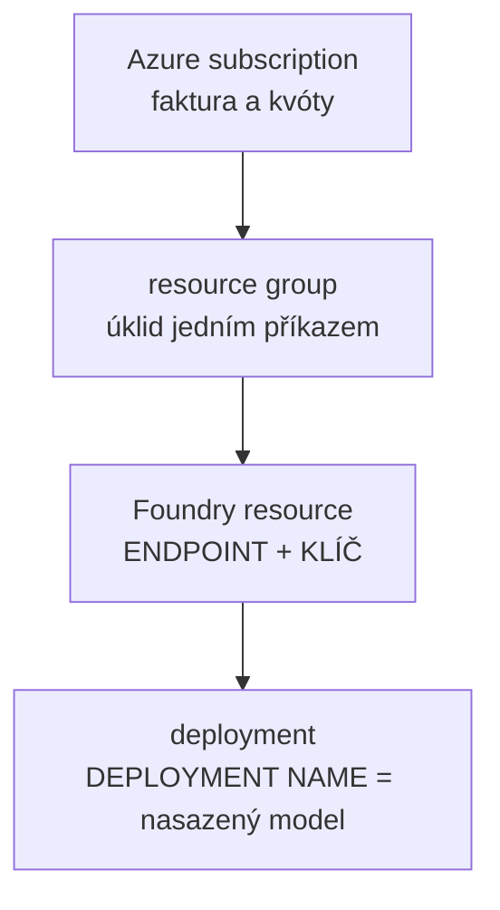

# Explainer · Microsoft Foundry v kostce — kam se to připojujeme

> Modul: `agents-sdk-core` · Typ: výklad ~15 min (10 výklad + 5 sdílená obrazovka)
> Prostředí: viz [`../../environment.md`](../../environment.md) · Názvosloví: [`../../GLOSSARY.md`](../../GLOSSARY.md)

Za chvíli dostaneš tři hodnoty a tvůj agent začne volat model. Bez tohohle bloku by to
bylo připojení na slepo: klíč funguje, ale nevíš **do čeho** se připojuješ, kdo to platí
a proč odpověď někdy nepřijde. Studenti nemají Azure subscription, takže portál uvidí
jen přes instruktorovu obrazovku — o důvod víc to ukázat pořádně teď.

## Co Foundry je — a co není

- **Je to platforma v Azure, kde běží modely.** Katalog modelů (OpenAI, Meta, Mistral,
  Microsoft…), jejich nasazování, klíče, kvóty a účtování.
- **Není to M365.** Copilot licence ani Copilot Credits sem nedosáhnou — tady teče
  peněženka **Azure inference** ([`../../GLOSSARY.md`](../../GLOSSARY.md), tři peněženky).
- **Není to orchestrátor ani hosting agenta.** Foundry dává **model endpoint**; agent
  (kód, který dnes píšeš) běží jinde. *Foundry Agent Service* — PaaS hosting agentů —
  je jiná vrstva, v tomhle kurzu se nestavíme na ni.
- **Není to Agent 365.** Governance agentů je control plane nad M365; Foundry je runtime
  modelů v Azure. Plete se to, protože obojí má v názvu agenty.

## Hierarchie — kde bydlí ty tři hodnoty

- **Endpoint a klíč patří k resource.** Jeden resource může mít víc deploymentů —
  proto klíč sám o sobě neříká, se kterým modelem mluvíš.
- **Deployment name vybírá model.** Je to *tvůj* název nasazení (u nás `support-agent`),
  ne název modelu — proto scaffoldu nevadí `model: ""`, model určuje deployment.
- Tři hodnoty v `env/.env.*.user` teď mají adresu: klíč a endpoint z resource,
  deployment name z deploymentu.

## Deployment: model × typ nasazení × kapacita

Nasazení není jen „vyber model". Tři rozhodnutí:

| Rozhodnutí | Možnosti | Naše volba a proč |
|---|---|---|
| **Model + verze** | katalog, filtrování podle capability a regionu | `gpt-5-mini` `2025-08-07` — mini-tier stačí na support scénář |
| **Typ nasazení** | `GlobalStandard` (nejlevnější, routing kamkoli) · `DataZoneStandard` (data zóna EU/US) · `ProvisionedManaged` (rezervovaný výkon) | **DataZone** — inference neopustí EU datovou zónu |
| **Capacity** | TPM (tokeny/min), čerpá kvótu subscription v regionu | 100k TPM z kvóty 300k — brzda rychlosti pro 20 lidí ve smyčce |

- **Capacity omezuje rychlost, ne útratu.** Když do ní narazíme (20 lidí najednou),
  přijde **429 + Retry-After** — to je ta transientní chyba z části D labu, naživo.
  Celkovou útratu hlídá budget alert na resource group.
- **Dostupnost modelů se liší per region a per typ nasazení.** Proto je katalog
  s filtry první místo, kam se dívat — ne ceník.

## Kdo co vidí

| | Student | Instruktor |
|---|---|---|
| tři hodnoty (klíč, endpoint, deployment name) | ✅ dostává | ✅ vydává |
| portál: resource, deployment, kvóty, ceny | jen přes sdílenou obrazovku | ✅ spravuje |
| faktura | ne — ale **`usage` v každé odpovědi ano** | ✅ budget alert |

Proto krok labu s `usage`: je to jediné okno do ekonomiky, které máš z kódu — a je
v každé odpovědi zadarmo.

## Data flow — jedna věta pro zákazníka

Dotaz uživatele opouští hranici M365 a jde do Azure resource. U nás je resource ve
stejném Entra adresáři jako studentské účty (`spdemo.online`), přesto platí:
**model endpoint je mimo M365 compliance boundary** — a v návrhu pro zákazníka se to
kreslí jako přechod hranice ([capstone, část A](../../day-5/capstone/lab-capstone-blueprint.md)).

## Zdroje (Microsoft)

- [What is Microsoft Foundry](https://learn.microsoft.com/en-us/azure/ai-foundry/what-is-azure-ai-foundry)
- [Deployment types](https://learn.microsoft.com/en-us/azure/ai-foundry/openai/how-to/deployment-types)
- [Quotas and limits](https://learn.microsoft.com/en-us/azure/ai-foundry/openai/quotas-limits)
- [Model catalog](https://learn.microsoft.com/en-us/azure/ai-foundry/how-to/model-catalog-overview)

## Stav produktu / delta

> [!WARNING] Ověřit k datu běhu — stav k 2026-08
> Názvy typů nasazení, rozsah datových zón a dostupnost modelů per region se mění
> po měsících. Před během projít deployment types a ceník; ceny needitovat do textu —
> žijí v [`../../day-5/perf-cost-lifecycle/prices-snapshot.json`](../../day-5/perf-cost-lifecycle/prices-snapshot.json)
> (`--refresh-prices`).
