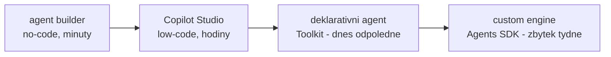

# No-code a low-code cesty — showcase

> Typ: povinný · Den: 1 · Odhad: **50 min** (30 demo + 20 srovnání) · Publikum: **vývojáři / architekti**
> Prostředí: viz [`../../environment.md`](../../environment.md) · Názvosloví: [`../../GLOSSARY.md`](../../GLOSSARY.md)

Než developer sáhne po SDK, musí umět použít — a hlavně **posoudit** — no-code a low-code
varianty. Tenhle blok je živý showcase: Copilot agent builder a Copilot Studio naklikané
před studenty, na stejném zadání, na které pak celý týden stavíme pro-code agenta.

## Cíle

- Vidět naživo, jak rychle vznikne agent v **Copilot agent builderu** (no-code) a
  v **Copilot Studiu** (low-code).
- Umět u každé cesty říct: **kdo hostuje, kdo platí model, kdo governuje, co nejde**.
- Přestat vnímat no-code/low-code jako „konkurenci" — je to první příčka téže rozhodovací
  osy z [`../agent-landscape/`](../agent-landscape/).

## Výklad

### Proč to musí vidět i pro-code tým

- Většina zákaznických požadavků SDK nepotřebuje. Kdo neumí říct *„tohle naklikáte
  ve Studiu za hodinu"*, prodává zbytečně drahé řešení — a jednou mu na to zákazník přijde.
- Důvěryhodnost konzultanta = znát **celou osu**, ne jen svůj oblíbený konec. Doporučení
  pro-code má váhu, jen když umíš obhájit, proč ne no-code.
- Dnes odpoledne k těmto dvěma příčkám přibude třetí (deklarativní agent) — a strop té
  třetí je důvod, proč existuje zbytek kurzu.

### Copilot agent builder — no-code (společně se studenty)

Staví se **společně** a výsledek se **sdílí skupině Students** — je to baseline nosné
linky, proti které se celý týden srovnává. Krok za krokem včetně referenčního textu
instructions: [`guide-agent-builder.md`](guide-agent-builder.md).

1. M365 Copilot → vytvořit agenta v **agent builderu**: instructions podle zadání ze
   scénáře + knowledge = knihovna `Runbooky`.
2. Nasdílet skupině **Students**, změřit **čas stavby** a pustit čtyři testovací dotazy
   do srovnávací tabulky.
3. Pojmenovat hranice: **žádné akce s validací, žádná orchestrace, žádné verzování** —
   agent žije u uživatele, ne v ALM.

> [!IMPORTANT] Tenhle agent zůstává živý celý týden
> Nemaže se po bloku. Každý další přírůstek se proti němu měří stejnými čtyřmi dotazy —
> tabulka v návodu je artefakt, který se doplňuje až do `evaluation-quality` (D5).

### Copilot Studio — low-code (instruktorské demo)

Skript dema — stejné zadání, záložní agent připravený v tenantu:

1. Studio agent: topics + generative answers nad stejným zdrojem, **akce přes konektor**
   (tady builder končí), publikace do Teams.
2. Studenti si značí: čas stavby, kde instruktor narazil, které ze čtyř dotazů agent zvládl.
3. Zaseknout kotvu: **Studio agenti se do Agent 365 registrují automaticky** — pro-code
   agent se bude instrumentovat ručně (D4). Governance zdarma vs. governance prací.

### Kde jsou stropy — a co z toho plyne pro zbytek týdne

| | Agent builder | Copilot Studio |
|---|---|---|
| Hosting a model | platforma (neviditelné) | platforma (Power Platform) |
| Peněženka | M365 Copilot / PAYG kredity | **Copilot Credits / message billing** |
| Akce | ne | konektory, Power Automate — bez vlastní validace |
| ALM a verzování | ne | solutions, environments |
| Governance | omezená | PPAC + DLP + **auto-registrace Agent 365** |
| Extensibility strop | instructions + knowledge | kde končí konektor, končí Studio |

- **Pointa na plátno**: dotazy 1–2 ze scénáře zvládne i Studio. Dotaz 3 (akce s validací)
  a 4 (vynucené odmítnutí) už spolehlivě ne — **přesně tam začíná zbytek kurzu.**

## Klíčové rozlišení

- **Copilot agent builder** (no-code, uvnitř M365 Copilotu) vs. **Copilot Studio**
  (low-code platforma s ALM) vs. **deklarativní agent z Toolkitu** (hned další blok) vs.
  **custom engine agent** (zbytek týdne) — čtyři příčky jedné osy, ne čtyři produkty.
- **Peněženky**: Copilot Studio jede na **Copilot Credits / message billing** — jiná
  peněženka než M365 Copilot licence i než Azure inference vlastního kódu.
- **Governance zdarma vs. governance prací**: Studio agenti se do **Agent 365** registrují
  automaticky; pro-code agent se musí instrumentovat (D4).
- Showcase ≠ kurz Copilot Studia — jde o **posouzení cesty**, ne o ovládnutí nástroje.

## Naše prostředí

Studenti mají **PAYG (Copilot Credits)** — ty kryjí i **Copilot agent builder**, takže
část A je studentský **hands-on** (každý si builder agenta zkusí sám). **Copilot Studio**
zůstává instruktorské demo (vlastní licence/trial — viz go/no-go
v [`instructor-notes.md`](instructor-notes.md)).

> [!WARNING] Ověřit k datu běhu
> Pokrytí agent builderu Copilot Credits (PAYG) bez M365 Copilot licence ověřit před
> během — licenční hranice PAYG se mění (viz [`../../GLOSSARY.md`](../../GLOSSARY.md),
> tři peněženky).

## Lab

Viz [`lab-showcase-differences.md`](lab-showcase-differences.md).

## Nosná linka

Poprvé zazní **čtyři testovací dotazy** ze scénáře
([`../../scenario-support-agent.md`](../../scenario-support-agent.md)) — proti naklikanému
Studio agentovi. Dotazy 1–2 zvládne, 3–4 ne. Zbytek týdne je odpověď na ten rozdíl.

## Zdroje (Microsoft)

- [Microsoft Copilot Studio — overview](https://learn.microsoft.com/en-us/microsoft-copilot-studio/fundamentals-what-is-copilot-studio)
- [Build agents with the Copilot Studio agent builder](https://learn.microsoft.com/en-us/microsoft-365/copilot/extensibility/agent-builder)
- [Copilot Studio — licensing and message management](https://learn.microsoft.com/en-us/microsoft-copilot-studio/requirements-messages-management)

## Stav produktu / delta

> [!WARNING] Ověřit k datu běhu — stav k 2026-08.
> **Billing model Copilot Studia** (messages / Copilot Credits) i dostupnost **agent
> builderu** bez M365 Copilot licence se mění. Ověřit aktuální licenční stav a UI obou
> nástrojů — dema naskriptovat znovu před každým během, UI se mění po měsících.
