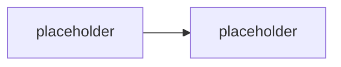

# No-code a low-code cesty — showcase

> Typ: povinný · Den: 1 · Odhad: **50 min** (30 demo + 20 srovnání) · Publikum: **vývojáři / architekti**
> Prostředí: viz [`../../environment.md`](../../environment.md) · Názvosloví: [`../../GLOSSARY.md`](../../GLOSSARY.md)

Než developer sáhne po SDK, musí umět použít — a hlavně **posoudit** — no-code a low-code
varianty. Tenhle blok je živý showcase: Copilot agent builder a Copilot Studio naklikané
před studenty, na stejném zadání, na které pak celý týden stavíme pro-code agenta.

## Cíle

- Vidět naživo, jak rychle vznikne agent v **Copilot agent builderu** (no-code) a
  v **Copilot Studiu** (low-code).
- Umět u každé cesty říct: **kdo hostuje, kdo platí model, kdo governuje, co nejde**.
- Přestat vnímat no-code/low-code jako „konkurenci" — je to první příčka téže rozhodovací
  osy z [`../agent-landscape/`](../agent-landscape/).

## Výklad

### Proč to musí vidět i pro-code tým

<!-- TODO: argument: 80 % pozadavku zakaznika nepotrebuje SDK; kdo neumi rict "tohle
     nakliknete ve Studiu za hodinu", prodava zbytecne drahe reseni. Duveryhodnost
     konzultanta = znat celou osu, ne jen svuj oblibeny konec. -->

### Copilot agent builder — no-code

<!-- TODO: demo naskriptovat: agent builder v M365 Copilotu, instructions + knowledge
     (SharePoint), bez akci. Kolik minut to trvalo. Kde jsou hranice (zadne akce
     s validaci, zadna orchestrace, sdileni omezene). -->

### Copilot Studio — low-code

<!-- TODO: demo naskriptovat: Studio agent na stejne zadani, topics/generative answers,
     akce (konektor), publikace do Teams. Zminit: Studio agenti se do Agent 365 registry
     registruji AUTOMATICKY (kotva pro day-4/agent-365-governance). -->

### Kde jsou stropy — a co z toho plyne pro zbytek týdne

<!-- TODO: tabulka rozdilu (hosting, model, penezenka, ALM, governance, extensibility).
     Pointa: dotazy 1-2 ze scenare zvladne Studio, dotaz 3 (akce s validaci) a 4 (vynucene
     odmitnuti) uz ne spolehlive -- presne tam zacina zbytek kurzu. -->

## Klíčové rozlišení

- **Copilot agent builder** (no-code, uvnitř M365 Copilotu) vs. **Copilot Studio**
  (low-code platforma s ALM) vs. **deklarativní agent z Toolkitu** (D2) vs.
  **custom engine agent** (zbytek týdne) — čtyři příčky jedné osy, ne čtyři produkty.
- **Peněženky**: Copilot Studio jede na **Copilot Credits / message billing** — jiná
  peněženka než M365 Copilot licence i než Azure inference vlastního kódu.
- **Governance zdarma vs. governance prací**: Studio agenti se do **Agent 365** registrují
  automaticky; pro-code agent se musí instrumentovat (D4).
- Showcase ≠ kurz Copilot Studia — jde o **posouzení cesty**, ne o ovládnutí nástroje.

## Naše prostředí

Režim: **instruktorské demo** (agent builder vyžaduje M365 Copilot licenci, Studio vyžaduje
vlastní licenci/trial — viz go/no-go v [`instructor-notes.md`](instructor-notes.md)).
Studenti si tabulku rozdílů vyplňují sami; hands-on jen pokud tenant licence má.

## Lab

Viz [`lab-showcase-differences.md`](lab-showcase-differences.md).

## Nosná linka

Poprvé zazní **čtyři testovací dotazy** ze scénáře
([`../../scenario-support-agent.md`](../../scenario-support-agent.md)) — proti naklikanému
Studio agentovi. Dotazy 1–2 zvládne, 3–4 ne. Zbytek týdne je odpověď na ten rozdíl.

## Zdroje (Microsoft)

- [Microsoft Copilot Studio — overview](https://learn.microsoft.com/en-us/microsoft-copilot-studio/fundamentals-what-is-copilot-studio)
- [Build agents with the Copilot Studio agent builder](https://learn.microsoft.com/en-us/microsoft-365-copilot/extensibility/copilot-studio-agent-builder)
- [Copilot Studio — licensing and message management](https://learn.microsoft.com/en-us/microsoft-copilot-studio/requirements-messages-management)

## Stav produktu / delta

> [!WARNING] Ověřit k datu běhu — stav k 2026-08.
> **Billing model Copilot Studia** (messages / Copilot Credits) i dostupnost **agent
> builderu** bez M365 Copilot licence se mění. Ověřit aktuální licenční stav a UI obou
> nástrojů — dema naskriptovat znovu před každým během, UI se mění po měsících.
