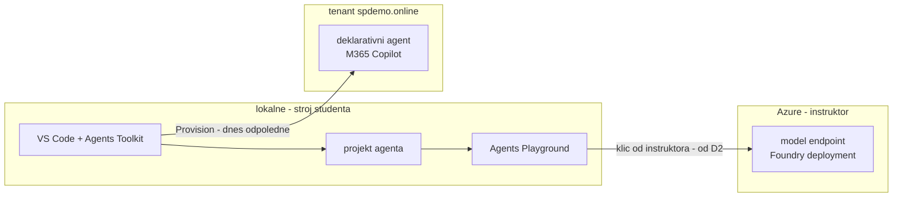

# Onboarding, prostředí & toolchain

> Typ: povinný · Den: 1 · Odhad: **90 min** (30 výklad + 45 lab + 15 rezerva) · Publikum: **vývojáři / architekti**
> Prostředí: viz [`../../environment.md`](../../environment.md) · Názvosloví: [`../../GLOSSARY.md`](../../GLOSSARY.md)

## Cíle
- Přihlásit se do kurzovního tenantu a do model endpointu.
- Mít funkční pro-code toolchain: VS Code, Microsoft 365 Agents Toolkit, Node.js,
  Microsoft 365 Agents Playground, Git.
- Vědět, co se za týden postaví (nosná linka) a jak se pracuje s repem kurzu.

## Výklad

- **Pravidla práce**: kurz jede z tohoto repa — [`agenda.md`](../../agenda.md) drží pořadí
  bloků, každý modul má README (výklad) a `lab-*.md` (práce). Referenční řešení labů
  v `solution/` složkách.
- **Nosná linka**: celý týden stavíme jednoho agenta
  ([`scenario-support-agent.md`](../../scenario-support-agent.md)) — přečíst dnes, čtyři
  testovací dotazy z něj se vrací po každém přírůstku.
- **Bezpečnostní pravidlo dne 1**: klíče a tajemství nikdy do repa — user secrets / `.env`,
  kontrola přes `git status`. Repo kurzu je public.

### Toolchain — a proč právě tenhle

- **VS Code** — primární IDE; **Agents Toolkit** — scaffolding, provision/publikace, MCP;
  **Agents Playground** — lokální běh a debug agenta **bez tenantu, tunelu a registrace
  bota**; **Node.js (LTS)** — runtime kurzu; **Git** — repo-as-code návyk.
- Pointa dvojice Toolkit/Playground: Toolkit mluví do tenantu, Playground zůstává lokální.
  Dnes se tenantu dotkne jen přihlášení — první kód (D2) pojede čistě lokálně.

### Podporované jazyky Agents SDK

- Agents SDK: **C#**, **JavaScript/TypeScript**, **Python**.
- Tento kurz jede **TypeScript** (`@microsoft/agents-hosting`) — publikum jsou SPFx
  vývojáři, TS je most k SPFx kurzům i ke Copilot Apps (D4).
- C# zůstává ve dvou instruktorských výjimkách: Agent Framework (D3 — JS SDK neexistuje)
  a zmínka .NET evaluační knihovny (D5). Detaily v [`CONVENTIONS.md`](../../CONVENTIONS.md).

### Tři peněženky — nastavit očekávání hned na začátku

- **M365 Copilot licence** — platí Copilot zážitky uživatele; v kurzu ji nemáme (PAYG).
- **Copilot Credits (PAYG)** — platí deklarativní agenty a Copilot interakce; čerpá je
  dnešní odpoledne.
- **Azure inference** — platí volání modelu z vlastního kódu; **Copilot Credits tohle
  nekryjí**, proto od zítřka dostanete klíč k instruktorskému Foundry deploymentu.
- Nejčastější omyl týdne zní „Copilot Credits mi zaplatí model" — ne. Kdo tohle umí
  vysvětlit zákazníkovi, ušetří mu první fakturu za překvapení.

Podrobně [`../../GLOSSARY.md`](../../GLOSSARY.md).

## Klíčové rozlišení
- **Agents Toolkit** (scaffolding, publikace) vs. **Agents Playground** (lokální běh a debug
  bez tenantu, tunelu a registrace bota).
- **Copilot Credits** vs. **klíč k model endpointu** — dvě různé věci, dvě různé peněženky.

## Naše prostředí

Hands-on. Tenant `spdemo.online`, účty `user.11`–`user.30`, Business Basic + Copilot Credits PAYG.
Klíč k model endpointu rozdává instruktor — viz [`../../environment.md`](../../environment.md).

## Lab
Viz [`lab-toolchain-scaffold.md`](lab-toolchain-scaffold.md).

## Nosná linka
Student má prázdný, ale funkční projekt a rozumí zadání
[`../../scenario-support-agent.md`](../../scenario-support-agent.md).

## Zdroje (Microsoft)
- [Microsoft 365 Agents Toolkit — overview](https://learn.microsoft.com/en-us/microsoftteams/platform/toolkit/overview-agents-toolkit)
- [Test your agent locally in Microsoft 365 Agents Playground](https://learn.microsoft.com/en-us/microsoft-365/agents-sdk/test-with-toolkit-project)
- [Quickstart: Create and test a basic agent](https://learn.microsoft.com/en-us/microsoft-365/agents-sdk/quickstart)

## Stav produktu / delta

> [!WARNING] Ověřit k datu běhu — stav k 2026-08.
> Verze Agents Toolkitu, Node.js LTS a **názvy šablon v Toolkitu** se mění po měsících.
> Scaffoldnout referenční projekt den předem a projít go/no-go v
> [`instructor-notes.md`](instructor-notes.md).
