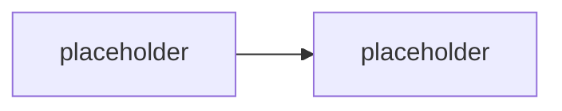

# Onboarding, prostředí & toolchain

> Typ: povinný · Den: 1 · Odhad: **90 min** (30 výklad + 45 lab + 15 rezerva) · Publikum: **vývojáři / architekti**
> Prostředí: viz [`../../environment.md`](../../environment.md) · Názvosloví: [`../../GLOSSARY.md`](../../GLOSSARY.md)

## Cíle
- Přihlásit se do kurzovního tenantu a do model endpointu.
- Mít funkční pro-code toolchain: VS Code, Microsoft 365 Agents Toolkit, .NET SDK,
  Microsoft 365 Agents Playground, Node.js, Git.
- Vědět, co se za týden postaví (nosná linka) a jak se pracuje s repem kurzu.

## Výklad

<!-- TODO: pravidla prace, struktura repa, jak cist agendu, kde jsou laby a solution/ -->

### Toolchain — a proč právě tenhle

<!-- TODO: role kazdeho nastroje; Toolkit = scaffolding + publikace, Playground = lokalni test bez tenantu -->

### Podporované jazyky Agents SDK

<!-- TODO: C# (.NET), JavaScript/TypeScript (Node), Python — a prerekvizity kazdeho.
     Proc tento kurz jede C# primarne a TS jako parity (viz CONVENTIONS.md). -->

### Tři peněženky — nastavit očekávání hned na začátku

<!-- TODO: M365 Copilot licence vs Copilot Credits vs Azure inference; proc student dostava klic k modelu -->
Podrobně [`../../GLOSSARY.md`](../../GLOSSARY.md).

## Klíčové rozlišení
- **Agents Toolkit** (scaffolding, publikace) vs. **Agents Playground** (lokální běh a debug
  bez tenantu, tunelu a registrace bota).
- **Copilot Credits** vs. **klíč k model endpointu** — dvě různé věci, dvě různé peněženky.

## Naše prostředí

Hands-on. Tenant `spdemo.online`, účty `user.11`–`user.30`, Business Basic + Copilot Credits PAYG.
Klíč k model endpointu rozdává instruktor — viz [`../../environment.md`](../../environment.md).

## Lab
Viz [`lab-toolchain-scaffold.md`](lab-toolchain-scaffold.md).

## Nosná linka
Student má prázdný, ale funkční projekt a rozumí zadání
[`../agents-sdk-core/scenario-support-agent.md`](../agents-sdk-core/scenario-support-agent.md).

## Zdroje (Microsoft)
- [Microsoft 365 Agents Toolkit — overview](https://learn.microsoft.com/en-us/microsoftteams/platform/toolkit/overview-agents-toolkit)
- [Test your agent locally in Microsoft 365 Agents Playground](https://learn.microsoft.com/en-us/microsoft-365/agents-sdk/test-with-toolkit-project)
- [Quickstart: Create and test a basic agent](https://learn.microsoft.com/en-us/microsoft-365/agents-sdk/quickstart)

## Stav produktu / delta

> [!WARNING] Ověřit k datu běhu — stav k 2026-08.
> Verze Agents Toolkitu, .NET SDK a **názvy šablon v Toolkitu** se mění po měsících.
> Scaffoldnout referenční projekt den předem a projít go/no-go v
> [`instructor-notes.md`](instructor-notes.md).
