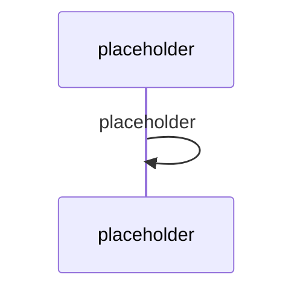

# Action handlers & integrace s Microsoft Graph

> Typ: povinný · Den: 2 · Odhad: **135 min** (60 výklad + 75 lab) · Publikum: **vývojáři / architekti**
> Prostředí: viz [`../../environment.md`](../../environment.md) · Názvosloví: [`../../GLOSSARY.md`](../../GLOSSARY.md)

Agent přestává jen mluvit a začíná něco dělat. Tím se otevírá celá governance otázka.

## Cíle
- Směrovat akce v `AgentApplication` a validovat jejich parametry **před** provedením.
- Volat Microsoft Graph z agenta se správným typem oprávnění.
- Rozumět hranicím oprávnění: **delegated vs. app-only**, a kde do toho vstupuje
  **Microsoft Entra Agent ID**.
- Napojit nástroj přes **MCP** a vědět, jak se to liší od vlastního action handleru.

## Výklad

### Směrování akcí

<!-- TODO: registrace action handleru, routing, Adaptive Card akce jako aktivita.
     Kde konci SDK a zacina tvoje logika. -->

### Validace parametrů — proč je to bezpečnostní téma

<!-- TODO: model navrhuje parametry; nikdy jim neverit. Whitelist, typy, rozsahy,
     autorizace na urovni akce (ne jen na urovni agenta). Priklad: CreateTicket
     s prioritou a zadatelem — kdo smi zaloziti tiket za koho. -->

### Hranice oprávnění

<!-- TODO: delegated (jmenem uzivatele, dedi jeho permissions) vs app-only (jmenem aplikace,
     vidi vse). Nosna pointa: app-only je pohodlne a je to nejcastejsi zdroj exfiltrace
     u agentu. Least privilege, per-akce scope. -->

### Entra Agent ID

<!-- TODO: agent jako identita, ne jen jako app registrace. Co to meni pro audit a lifecycle.
     Detail governance -> day-4/agent-365-governance. -->

### MCP jako nástroj

<!-- TODO: MCP tool vs vlastni action handler: kdo drzi kontrakt, kdo drzi auth,
     co se da a neda auditovat. Kdy pouzit co. -->

## Klíčové rozlišení
- **Delegated** (dědí permissions uživatele) vs. **app-only** (vidí všechno) — a proč je
  app-only nejčastější zdroj exfiltrace u agentů.
- **Autorizace agenta** vs. **autorizace akce** — agent smí volat Graph neznamená, že smí
  udělat tuhle konkrétní věc pro tohoto uživatele.
- **MCP tool** (externí kontrakt) vs. **action handler** (tvůj kód) — jiné vlastnictví, jiný audit.
- **Model navrhuje parametry** ≠ parametry jsou validní.

## Naše prostředí

Hands-on. Graph volání pod **delegated** identitou studenta (`user.NN@spdemo.online`).
Ticketing je **mock API** lokálně — cílem je validace parametrů a hranice oprávnění,
ne produkční integrace.

## Lab
Viz [`lab-actions-and-graph.md`](lab-actions-and-graph.md). Referenční řešení v `solution/`.

## Nosná linka
Support Asistent získává dvě akce: čtení z Graphu a `CreateTicket` s validací.
Dotaz 3 ze [`../../day-1/agents-sdk-core/scenario-support-agent.md`](../../day-1/agents-sdk-core/scenario-support-agent.md)
poprvé vede k **eskalaci místo výmluvy**. Dotaz 4 se stává zajímavějším: agent teď má
přístup k datům, která nesmí prozradit.

## Zdroje (Microsoft)
- [AgentApplication in Microsoft 365 Agents SDK](https://learn.microsoft.com/en-us/microsoft-365/agents-sdk/agent-application)
- [What is Microsoft Entra Agent ID](https://learn.microsoft.com/en-us/entra/agent-id/what-is-microsoft-entra-agent-id)
- [Microsoft Graph permissions reference](https://learn.microsoft.com/en-us/graph/permissions-reference)
- [Microsoft Graph error responses](https://learn.microsoft.com/en-us/graph/errors)

## Stav produktu / delta

> [!WARNING] Ověřit k datu běhu — stav k 2026-08.
> Rozsah **Entra Agent ID** a jeho vztah k app registracím se aktivně vyvíjí. Ověřit,
> jestli agent v tomto scénáři už dostává Agent ID automaticky, nebo se registruje ručně.
> Rovněž ověřit aktuální podporu MCP nástrojů v Agents SDK.
