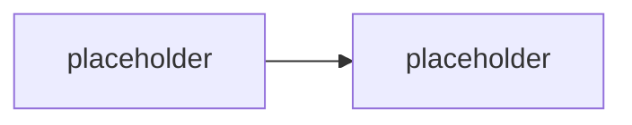

# Datová hygiena v SharePoint Online a Exchange Online

> Typ: povinný · Den: 2 · Odhad: **45 min** (30 výklad + 15 mini-audit) · Publikum: **vývojáři / architekti**
> Prostředí: viz [`../../environment.md`](../../environment.md) · Názvosloví: [`../../GLOSSARY.md`](../../GLOSSARY.md)

Agent neprolamuje oprávnění — on je **zviditelňuje**. Grounding nad semantic indexem je
přesně tak bezpečný, jak uklizený je tenant pod ním. Závěrečný blok dne: co musí být
v SharePointu a Exchange v pořádku, **než** se do nich pustí agent.

## Cíle

- Rozumět, proč nasazení agenta/Copilotu zviditelní **oversharing** a permission sprawl,
  které v tenantu ležely roky bez povšimnutí.
- Znát nástroje hygieny v blízkém okolí M365: **SharePoint Advanced Management**,
  Restricted SharePoint Search / Restricted Content Discovery, sensitivity labels,
  lifecycle neaktivních webů.
- Umět sestavit **hygienický checklist před nasazením agenta** — deliverable pro zákazníka.

## Výklad

### Proč to zviditelní právě agent

<!-- TODO: semantic index respektuje ACL -- problem NEJSOU prolomena opravneni, ale
     spatne nastavena: "Everyone except external users", dedictvi z migraci, mrtve weby.
     Dotaz 4 ze scenare jako ilustrace: agent odpovi jen z toho, co uzivatel SMI videt --
     a prave proto spatne ACL znamena spatnou odpoved "po pravu". -->

### Nástroje hygieny — SharePoint Online

<!-- TODO: SharePoint Advanced Management (reporty oversharingu, site access review,
     inactive site policy), Restricted SharePoint Search / Restricted Content Discovery
     (vyjmuti webu z indexu pro Copilot/agenty), sensitivity labels na webech a souborech.
     Enumerovat proti aktualni dokumentaci, licencni podminky SAM overit. -->

### Nástroje hygieny — Exchange Online

<!-- TODO: sdilene schranky a jejich clenstvi, retention politiky, co z mailboxu vidi
     semantic index a agent s Graph opravnenimi (navaznost na actions-graph delegated
     vs app-only). -->

### Checklist před nasazením agenta

<!-- TODO: prakticky checklist: audit oversharingu -> RCD na citlive knihovny ->
     sensitivity labels -> lifecycle mrtvych webu -> teprve pak grounding.
     Deliverable, ktery si student odnasi k zakaznikovi. -->

## Klíčové rozlišení

- **Agent neprolamuje oprávnění** — ACL platí; hygiena řeší, že ACL jsou **špatně nastavená**.
- **Restricted Content Discovery** (web zůstane, agent ho nevidí) vs. **oprava ACL**
  (řešení příčiny, ne příznaku) — RCD je hasicí přístroj, ne architektura.
- **Purview / sensitivity labels** (klasifikace a politika nad obsahem) vs.
  **SharePoint Advanced Management** (provozní hygiena webů) — doplňují se, nezastupují.
- Hygiena je **předpoklad** groundingu z bloku [`../knowledge-grounding/`](../knowledge-grounding/),
  ne jeho náhrada.

## Naše prostředí

Instruktorské demo + mini-audit na `spdemo.online` — **SharePoint Advanced Management
v tenantu funguje** (potvrzeno 2026-08-06), reporty se ukazují živě, ne ze screenshotů.
Studenti si odnášejí checklist.

## Lab

Viz [`lab-hygiene-audit.md`](lab-hygiene-audit.md).

## Nosná linka

Support Asistent groundí nad knihovnou `Runbooky` — tenhle blok odpovídá na otázku,
**proč mu smí věřit**: dotaz 4 ze scénáře ([`../../scenario-support-agent.md`](../../scenario-support-agent.md))
je bezpečný jen v uklizeném tenantu.

## Zdroje (Microsoft)

- [SharePoint Advanced Management — overview](https://learn.microsoft.com/en-us/sharepoint/advanced-management)
- [Restricted SharePoint Search](https://learn.microsoft.com/en-us/sharepoint/restricted-sharepoint-search)
- [Sensitivity labels — overview](https://learn.microsoft.com/en-us/purview/sensitivity-labels)

## Stav produktu / delta

> [!WARNING] Ověřit k datu běhu — stav k 2026-08.
> Licencování **SharePoint Advanced Management** (samostatně vs. v Copilot licenci) a rozsah
> **Restricted Content Discovery** se mění — ověřit aktuální stav a dostupnost reportů
> v demo tenantu. Publikovaná katalogová osnova tohle téma neobsahuje vůbec; je to doplněk
> z praxe nasazování.
