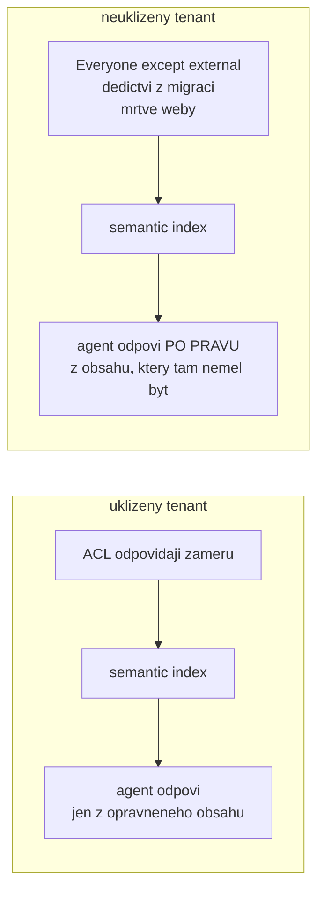
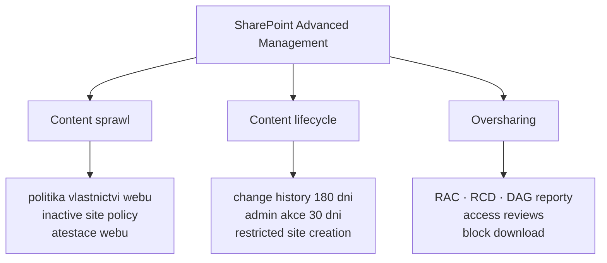

# Datová hygiena v SharePoint Online a Exchange Online

> Typ: povinný · Den: 2 · Odhad: **60 min** (40 výklad + 20 checklist) · Publikum: **vývojáři / architekti**
> Prostředí: viz [`../../environment.md`](../../environment.md) · Názvosloví: [`../../GLOSSARY.md`](../../GLOSSARY.md)

Agent neprolamuje oprávnění — on je **zviditelňuje**. Grounding nad semantic indexem je
přesně tak bezpečný, jak uklizený je tenant pod ním. Závěrečný blok dne: co musí být
v SharePointu a Exchange v pořádku, **než** se do nich pustí agent.

## Cíle

- Rozumět, proč nasazení agenta/Copilotu zviditelní **oversharing** a permission sprawl,
  které v tenantu ležely roky bez povšimnutí.
- Znát nástroje hygieny v blízkém okolí M365: **SharePoint Advanced Management**,
  Restricted SharePoint Search / Restricted Content Discovery, sensitivity labels,
  lifecycle neaktivních webů.
- Umět sestavit **hygienický checklist před nasazením agenta** — deliverable pro zákazníka.

## Výklad

### Proč to zviditelní právě agent

- **Semantic index respektuje ACL.** Problém nejsou prolomená oprávnění — problém jsou
  **špatně nastavená** oprávnění, která tam roky ležela bez povšimnutí.
- Typické zdroje: sdílení na **„Everyone except external users"**, dědičnost přenesená
  z migrací, mrtvé weby po projektech, knihovny nasdílené „dočasně" před třemi lety.
- Dřív to nikdo nenašel, protože nikdo nehledal. Agent hledá pokaždé — a odpoví
  **z všeho, co uživatel smí vidět**.
- Ilustrace na dotazu 4 ze scénáře: agent odmítne odpovědět na plat kolegy, jen když
  ta data uživatel opravdu nesmí vidět. **Špatné ACL znamená správnou odpověď agenta
  a špatný výsledek pro firmu** — a nikdo nemůže tvrdit, že agent selhal.

### SharePoint Advanced Management — tři pilíře

SAM se spravuje ze SharePoint admin centra a stojí na třech pilířích. Pro agenty je
nosný ten třetí:

- **Content sprawl** — politika vlastnictví webů, inactive site policy s notifikací
  vlastníkům, atestace.
- **Content lifecycle** — katalog webů, change history reporty 180 dní zpět, nedávné
  admin akce 30 dní, omezení zakládání webů aplikacemi.
- **Oversharing** — pro Copilota a agenty nejdůležitější: **RAC**, **RCD**, **DAG reporty**
  (permission state, sharing links za 28 dní, EEEU insights, per-user permissions),
  site access reviews. Politiky jde porovnávat přes tisíce webů najednou.

### Nástroje hygieny — SharePoint Online

- **Restricted Access Control (RAC)** — přístup k webu nebo OneDrive jen pro vybrané
  security groups. Bere lidem **přístup**.
- **Restricted Content Discovery (RCD)** — web zůstane přístupný, ale Copilot a search
  ho **negroundují**. Bere agentovi **viditelnost**, ne lidem přístup.
- **Sensitivity labels** (Purview) — klasifikace na webech i souborech; agent labely
  respektuje a je to vrstva nad ACL, ne místo nich.
- Pořadí použití je důležité: DAG report najde problém → RCD ho **zhasne** → oprava ACL
  ho **vyřeší**. Kdo se zastaví u RCD, má hasicí přístroj místo architektury.

> [!IMPORTANT] Licencování SAM — neříkej „zdarma s Copilotem"
> SAM není jedno SKU, ale sada funkcí se **dvěma odemykacími cestami**: samostatný
> **SAM Plan 1** add-on (per-user), nebo **M365 Copilot licence** — kde **jedna přiřazená
> licence odemkne SAM pro celý tenant**. Feature set je shodný až na dokumentovanou výjimku
> (*restricted site creation by apps* chce Plan 1 tak jako tak); DAG report nad sensitivity
> labels navíc vyžaduje E5.
>
> Formulaci hlídej: Copilot licence je dražší než Plan 1, odemčení SAM je **vedlejší efekt**,
> ne úspora. Ověř k datu běhu — licenční podmínky se mění.

### Nástroje hygieny — Exchange Online

- **Sdílené schránky a jejich členství** — nejčastější zdroj překvapení. Kdo je členem,
  vidí obsah; agent s delegovanou identitou uživatele ho vidí taky.
- **Retention politiky** — co v tenantu ještě existuje, i když to uživatel „smazal".
- Co z mailboxu vidí agent, závisí na tom, **s čí identitou** běží. Delegovaná identita
  drží hranici uživatele; app-only ji nemá — návaznost na
  [`../actions-graph/`](../actions-graph/), kde je to protipříklad.

### Checklist před nasazením agenta

Deliverable, který si student odnáší k zákazníkovi. Pořadí není libovolné:

1. **Audit oversharingu** (SAM reporty) — zjisti rozsah, než cokoli měníš.
2. **RCD na citlivé knihovny** — okamžité zhasnutí rizika, dokud běží oprava.
3. **Oprava ACL** — řešení příčiny; bez tohoto kroku zůstává RCD trvalou berličkou.
4. **Sensitivity labels** na tom, co má klasifikaci mít.
5. **Lifecycle mrtvých webů** — co nikdo nespravuje, nemá být v indexu.
6. **Teprve pak grounding.**

## Klíčové rozlišení

- **Agent neprolamuje oprávnění** — ACL platí; hygiena řeší, že ACL jsou **špatně nastavená**.
- **RAC vs. RCD**: RAC bere lidem **přístup**, RCD bere Copilotu a search **viditelnost**
  (člověk s odkazem se dostane dál). Pro „citlivé, ale používané" weby je správně RCD,
  pro „tam nemá co dělat nikdo" RAC.
- **SAM vs. Purview**: SAM řídí **weby a sdílení** (SharePoint vrstva), Purview řídí
  **data a compliance** (labely, retence, audit). Doplňují se, nenahrazují.
- **Restricted Content Discovery** (web zůstane, agent ho nevidí) vs. **oprava ACL**
  (řešení příčiny, ne příznaku) — RCD je hasicí přístroj, ne architektura.
- Hygiena je **předpoklad** groundingu z bloku [`../knowledge-grounding/`](../knowledge-grounding/),
  ne jeho náhrada.

## Naše prostředí

Instruktorské demo + mini-audit na `spdemo.online` — **SharePoint Advanced Management
v tenantu funguje** (potvrzeno 2026-08-06), reporty se ukazují živě, ne ze screenshotů.
Studenti si odnášejí checklist.

## Lab

Viz [`lab-hygiene-audit.md`](lab-hygiene-audit.md).

## Nosná linka

Support Asistent groundí nad knihovnou `Runbooky` — tenhle blok odpovídá na otázku,
**proč mu smí věřit**: dotaz 4 ze scénáře ([`../../scenario-support-agent.md`](../../scenario-support-agent.md))
je bezpečný jen v uklizeném tenantu.

## Zdroje (Microsoft)

- [SharePoint Advanced Management — overview](https://learn.microsoft.com/en-us/sharepoint/advanced-management)
- [Restricted SharePoint Search](https://learn.microsoft.com/en-us/sharepoint/restricted-sharepoint-search)
- [Sensitivity labels — overview](https://learn.microsoft.com/en-us/purview/sensitivity-labels)

## Stav produktu / delta

> [!WARNING] Ověřit k datu běhu — stav k 2026-08.
> Licencování **SharePoint Advanced Management** (samostatně vs. v Copilot licenci) a rozsah
> **Restricted Content Discovery** se mění — ověřit aktuální stav a dostupnost reportů
> v demo tenantu. Publikovaná katalogová osnova tohle téma neobsahuje vůbec; je to doplněk
> z praxe nasazování.
