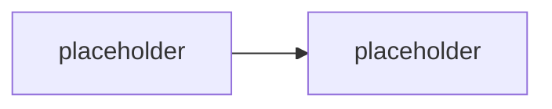

# Deklarativní agenti & Agents Toolkit — maximum bez serverového kódu

> Typ: povinný · Den: 2 · Odhad: **115 min** (50 výklad + 65 lab) · Publikum: **vývojáři / architekti**
> Prostředí: viz [`../../environment.md`](../../environment.md) · Názvosloví: [`../../GLOSSARY.md`](../../GLOSSARY.md)

Než sáhnete k serverovému kódu, máte **opravdu hodně možností** — a tenhle blok je vyčerpá.
Microsoft 365 Agents Toolkit ve VS Code, deklarativní agent, instructions jako orchestrace
bez kódu a všechno, co umí aktuální verze manifestu. Teprve kde tohle končí, začíná zbytek
kurzu.

## Cíle

- Scaffoldnout a provisionovat **deklarativního agenta** v Agents Toolkitu (VS Code).
- Napsat **instructions** tak, aby fungovaly jako orchestrace — bez jediného řádku kódu.
- Znát **schopnosti aktuální verze manifestu** (knowledge, capabilities, akce) a vědět,
  co je manifest-only funkce.
- Znát **TypeSpec** jako typovanou alternativu k ručnímu JSON.
- Umět **přesně pojmenovat strop** deklarativní cesty — na vlastním zadání, ne na slajdu.

## Výklad

### Agents Toolkit ve VS Code

<!-- TODO: scaffold, struktura projektu, Provision, kde ziji soubory manifestu.
     Lineage: Toolkit = nastupce Teams Toolkitu, sirsi zaber. -->

### Anatomie deklarativního agenta

<!-- TODO: declarativeAgent.json: name, description, instructions, knowledge
     (capabilities), actions. Nosna pointa: manifest je to, co schvaluje admin --
     kod nevidi, protoze zadny neni. -->

### Instructions jako orchestrace bez kódu

<!-- TODO: co vsechno se da vyresit dobre napsanymi instructions: ton, scope, odmitani,
     formaty odpovedi, postup reseni. Kde instructions prestavaji stacit (validace,
     deterministicke vetve, audit). POZOR: instructions nejsou system prompt vlastniho
     modelu -- model i runtime patri Copilotu. -->

### Capabilities — co všechno umí aktuální verze manifestu

<!-- TODO: projit aktualni schema: OneDriveAndSharePoint, Copilot connectors, WebSearch,
     CodeInterpreter, GraphicArt, TeamsMessages, EmailMessages, People... vcetne toho,
     co je manifest-only. Enumerovat proti aktualni verzi schematu, ne z pameti. -->

### Akce deklarativně — API plugin

<!-- TODO: OpenAPI popis -> akce v deklarativnim agentovi; auth moznosti; kde konci
     (zadna vlastni validace, zadny retry pod kontrolou). Jen vyklad + instruktorske demo,
     hands-on akce prijdou v actions-graph (custom engine). -->

### TypeSpec

<!-- TODO: TypeSpec for Copilot jako typovany zpusob definice; kdy to pomaha proti
     rucnimu JSON. -->

### Strop deklarativní cesty

<!-- TODO: srovnavaci tabulka na TOM SAMEM zadani ze scenare: co deklarativni agent
     zvladne za 15 minut a co nezvladne vubec (akce s validaci, middleware, vlastni
     orchestrace, vlastni telemetrie, vlastni model). Navrat k rozhodovaci ose z D1 --
     ctvrta pricka za agent builderem a Studiem. -->

## Klíčové rozlišení

- **Deklarativní agent** (bez hostingu, bez vlastního modelu — platí ho Copilot
  infrastruktura) vs. **custom engine agent** (všechno tvoje, včetně odpovědnosti).
- **Instructions ≠ system prompt vlastního modelu** — model, runtime i retrieval patří
  M365 Copilotu; instructions jsou vstup do cizí orchestrace.
- **Capability vs. akce**: capability zapínáš, akci popisuješ (OpenAPI) — ale validaci
  a chybové větve nekontroluješ ani u jedné.
- **Manifest = co admin schvaluje.** U deklarativního agenta je manifest celý agent.
- Deklarativní agent z Toolkitu **není** Copilot Studio agent — jiné ALM, jiná peněženka,
  jiný nástroj (viz [`../../day-1/no-code-showcase/`](../../day-1/no-code-showcase/)).

## Naše prostředí

Hands-on. Deklarativní agent se provisionuje do `spdemo.online` — **funguje i na PAYG bez
Copilot licence** (empiricky potvrzeno 2026-07-17 na jiném běhu; Microsoft to takto
nedokumentuje, viz go/no-go v [`instructor-notes.md`](instructor-notes.md)).
Knihovnu `Runbooky` provisionuje instruktor **před tímto blokem** (viz
[`../../scripts/`](../../scripts/)).

## Lab

Viz [`lab-declarative-maximum.md`](lab-declarative-maximum.md).

## Nosná linka

Student postaví **deklarativní Support Asistent v1** — instructions + knowledge nad
knihovnou `Runbooky` — a změří ho proti čtyřem testovacím dotazům ze scénáře
([`../../scenario-support-agent.md`](../../scenario-support-agent.md)). Dotazy 1–2 projdou,
dotaz 3 (akce s validací) a 4 (vynucené odmítnutí) narazí na strop. Custom engine agent
ze zbytku týdne je odpověď na ten strop.

## Zdroje (Microsoft)

- [Declarative agents for Microsoft 365 Copilot](https://learn.microsoft.com/en-us/microsoft-365/copilot/extensibility/overview-declarative-agent)
- [Create declarative agents using Microsoft 365 Agents Toolkit](https://learn.microsoft.com/en-us/microsoft-365/copilot/extensibility/build-declarative-agents)
- [Add capabilities and custom actions to a declarative agent](https://learn.microsoft.com/en-us/microsoft-365/copilot/extensibility/build-declarative-agents-add-skills)
- [Create declarative agents using TypeSpec for Microsoft 365 Copilot](https://learn.microsoft.com/en-us/microsoft-365/copilot/extensibility/build-declarative-agents-typespec)
- [Microsoft 365 Agents Toolkit — overview](https://learn.microsoft.com/en-us/microsoftteams/platform/toolkit/overview-agents-toolkit)

## Stav produktu / delta

> [!WARNING] Ověřit k datu běhu — stav k 2026-08.
> **Verze manifest schématu** deklarativního agenta se mění po měsících a s ní i dostupné
> capabilities (včetně manifest-only funkcí) — sekci Capabilities enumerovat proti aktuální
> verzi schématu těsně před během. Ověřit názvy šablon v Toolkitu. Rovněž **re-verify**,
> že provisioning deklarativního agenta na PAYG bez Copilot licence stále funguje —
> Microsoft to nedokumentuje, je to empirický poznatek.
