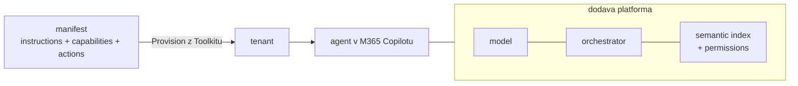

# Deklarativní agenti & Agents Toolkit — maximum bez serverového kódu

> Typ: povinný · Den: 2 · Odhad: **100 min** (40 výklad + 60 lab) · Publikum: **vývojáři / architekti**
> Prostředí: viz [`../../environment.md`](../../environment.md) · Názvosloví: [`../../GLOSSARY.md`](../../GLOSSARY.md)

Než sáhnete k serverovému kódu, máte **opravdu hodně možností** — a tenhle blok je vyčerpá.
Microsoft 365 Agents Toolkit ve VS Code, deklarativní agent, instructions jako orchestrace
bez kódu a všechno, co umí aktuální verze manifestu. Teprve kde tohle končí, začíná zbytek
kurzu.

## Cíle

- Scaffoldnout a provisionovat **deklarativního agenta** v Agents Toolkitu (VS Code).
- Napsat **instructions** tak, aby fungovaly jako orchestrace — bez jediného řádku kódu.
- Znát **schopnosti aktuální verze manifestu** (knowledge, capabilities, akce) a vědět,
  co je manifest-only funkce.
- Znát **TypeSpec** jako typovanou alternativu k ručnímu JSON.
- Umět **přesně pojmenovat strop** deklarativní cesty — na vlastním zadání, ne na slajdu.

## Výklad

### Agents Toolkit ve VS Code

- **Lineage: Teams Toolkit → Microsoft 365 Agents Toolkit** — širší záběr (agenti, ne jen
  Teams aplikace). Ve starších návodech potkáte původní název.
- Scaffold z šablony deklarativního agenta → projekt s manifesty, žádný serverový kód.
- Struktura projektu: manifest aplikace + `declarativeAgent.json` (jméno se může lišit
  podle verze šablony) + ikony + prostředí (`env/`).
- **Provision** = nahrání do tenantu pod přihlášeným účtem; agent se objeví v M365
  Copilotu. Bez buildu, bez hostingu, bez registrace bota.
- Tady vzniká návyk **repo-as-code**: manifest je soubor v gitu, změna agenta je commit.

### Anatomie deklarativního agenta

- `declarativeAgent.json`: `name`, `description`, **`instructions`** (orchestrace slovy),
  **`capabilities`** (knowledge — kde smí hledat), **`actions`** (odkaz na OpenAPI popis).
- **Nosná pointa: manifest je to, co schvaluje admin.** Kód nevidí, protože žádný není —
  celý agent je deklarace. To je governance výhoda, kterou custom engine musí doplácet
  prací (D4).
- Model, orchestrace, retrieval i vynucení permissions dodává platforma M365 Copilotu.

### Instructions jako orchestrace bez kódu

- Dobře napsané instructions zvládnou překvapivě mnoho: **tón, scope, odmítání
  mimo-scope dotazů, formát odpovědí, postup řešení** („nejdřív hledej v runboocích,
  pak nabídni eskalaci").
- Iterace je normální — první verze instructions nesedí nikdy (uvidíte v labu).
- **Kde instructions přestávají stačit**: validace vstupů, deterministické větve
  („vždy, ne většinou"), auditní stopa rozhodnutí. Slova nejsou enforcement — to je
  celá pointa middleware v D3.
- **POZOR: instructions nejsou system prompt vlastního modelu.** Model i runtime patří
  Copilotu; instructions jsou vstup do cizí pipeline, ne kontrola nad ní. Vlastní system
  prompt přijde až s custom enginem (D3).

**Vrstvy instrukcí — kdo všechno mluví do odpovědi.** Studenti tyhle vrstvy slepují
dohromady; nakreslit je na tabuli:

| Vrstva | Kdo nastavuje | Trvání | Kde |
|---|---|---|---|
| **Prompt** | uživatel | jedna otázka | chat |
| **Context** | konverzace + grounding | jedna session | context window |
| **custom instructions** | uživatel sobě | trvale | nastavení Copilotu |
| **Memory** | Copilot (odvozené) + uživatel | trvale | skrytá složka v Exchange mailboxu |
| **Agent Instructions** | **tvůrce agenta** | život agenta | manifest (limit ~8 000 znaků) |

- **custom instructions vs. Agent Instructions**: první říká „jak mluvit se **mnou**",
  druhé „jak se chová **agent**" — vy píšete to druhé, platí všem uživatelům agenta.
- **Context vs. Memory**: context je pracovní paměť jedné konverzace (zmizí), Memory jsou
  trvalé poznámky o uživateli napříč konverzacemi. Memory je preview a Purview retence
  ani audit na ni nesahají — governance dotek, který se vrací v D5.
- **Instrukce nikdy nedávat do knowledge zdrojů** — je to vektor cross-prompt injection
  (XPIA). Útok i obrana přijdou v `middleware-policy` (D4); tady stačí pravidlo.

Podrobněji ve volitelném modulu
[`../../day-1/opt-prompting-fundamentals/`](../../day-1/opt-prompting-fundamentals/).

### Capabilities — co všechno umí aktuální verze manifestu

- Knowledge a schopnosti se **zapínají deklarací**: `OneDriveAndSharePoint` (náš lab —
  knihovna `Runbooky`), Copilot connectors, `WebSearch`, `CodeInterpreter`, `GraphicArt`,
  `TeamsMessages`, `EmailMessages`, `People`…
- Část funkcí je **manifest-only** — jinde než v deklarativním agentovi je nedostanete.
- Každá capability rozšiřuje, kam agent smí — tedy i co může uniknout. Výběr capabilities
  je první bezpečnostní rozhodnutí kurzu (vrací se v D5).
- **Enumerovat proti aktuální verzi schématu, ne z paměti** — seznam se mění po měsících
  (viz Stav produktu níže).

### Akce deklarativně — API plugin

- Akce = **OpenAPI popis** připojený k manifestu; orchestrátor Copilotu sám rozhodne,
  kdy akci zavolat. Auth: none / API key / OAuth podle popisu.
- **Kde to končí**: žádná vlastní validace parametrů, žádný retry pod tvou kontrolou,
  žádná auditní stopa volání. Dotaz 3 ze scénáře („eskaluj s validovanými parametry")
  tady spolehlivě nevyřešíš.
- Jen výklad + instruktorské demo — hands-on akce přijdou v `actions-graph` (D2, custom
  engine), kde budou pod kontrolou.

### TypeSpec

- **TypeSpec for Microsoft 365 Copilot** = typovaná definice agenta místo ručního JSON;
  kompiluje se do manifestu.
- Pomáhá, když manifest roste: typová kontrola, opakované bloky, review v PR čitelnější
  než diff JSON. Pro dnešní lab stačí JSON; TypeSpec ukázka je v repu jako parita.

### Strop deklarativní cesty

Stejné zadání (scénář Support Asistenta), poctivá bilance:

| Schopnost | Deklarativní agent | Custom engine (zbytek týdne) |
|---|---|---|
| Odpovědi z runbooků s citací (dotazy 1–2) | ✅ za 15 minut | ✅ za dva dny práce |
| Tón, scope, formát odpovědí | ✅ instructions | ✅ system prompt |
| Akce s validací parametrů (dotaz 3) | ❌ OpenAPI bez validace | ✅ action handler (D2) |
| Vynucené odmítnutí (dotaz 4) | ⚠️ instructions = prosba, ne enforcement | ✅ middleware (D3) |
| Vlastní model / orchestrace / telemetrie | ❌ patří Copilotu | ✅ tvoje (D2–D4) |
| Hosting, provoz, náklady | ✅ nula — platí platforma | ⚠️ tvoje odpovědnost (D4–D5) |

- Návrat k ose z dopoledne: tohle je **čtvrtá příčka** za agent builderem a Studiem.
  Kde tabulka končí ❌, začíná zítřejší ráno — a to je celý zbytek kurzu.

> [!IMPORTANT] Strop není slepá ulička — pod ním se dá vydat produkt
> Tabulka výš snadno vyzní, že deklarativní agent je jen odrazový můstek. Není.
> **Normiqa Navigator** je publikovaný agent autora kurzu postavený **v Agents Toolkitu**:
> bezplatný agent pro Microsoft 365 Copilot, který provádí české a slovenské organizace
> tématem **NIS2 a ISO 27001**. Knowledge tvoří **výhradně webové zdroje** — žádný
> SharePoint, žádné akce, žádný vlastní hosting. Přesně ta cesta, kterou dnes stavíte,
> a je vydaná v Microsoft Marketplace.
>
> Je to protiváha k dnešnímu labu: u Support Asistenta `WebSearch` nejspíš vypnete, protože
> rozšiřuje scope mimo tenant a citace přestane být důkaz. U agenta nad **veřejnou,
> kurátorovanou** doménou je to naopak jediný správný zdroj. **Capability se nevybírá
> podle toho, co umí, ale podle toho, co má agent dělat.**
>
> Celá case study včetně validačního procesu a Partner Center je v
> [`../../day-4/marketplace-agents/`](../../day-4/marketplace-agents/) (materiál
> k samostudiu — v běhu se neodučí).

> [!WARNING] Web jako knowledge má vlastní past — zdroj nemusí být pro agenta viditelný
> Když je knowledge web, přestává platit „co vidím v prohlížeči, uvidí i agent". Agent čte
> to, co z stránky zbylo po crawleru — a u moderních JS aplikací to bývá **nic**.
>
> Ověřeno na produktové stránce Normiqa Navigatoru: vrací HTTP 200, má 11 server-side meta
> tagů, ale v `<body>` je **devět slov** („You need to enable JavaScript to run this app.")
> a **žádný `<title>`**. Marketplace listing zase odpoví 200 prohlížeči a **403** curlu.
>
> Rozbor příčin a **postup ověření** (co dostane klient bez JS, robots/sitemap/llms.txt,
> chování k botům, `site:` v Bingu, Bing Webmaster Tools) je v
> [`explainer-web-knowledge.md`](explainer-web-knowledge.md). Patří to do **návrhu**
> agenta, ne do ladění.

## Klíčové rozlišení

- **Deklarativní agent** (bez hostingu, bez vlastního modelu — platí ho Copilot
  infrastruktura) vs. **custom engine agent** (všechno tvoje, včetně odpovědnosti).
- **Instructions ≠ system prompt vlastního modelu** — model, runtime i retrieval patří
  M365 Copilotu; instructions jsou vstup do cizí orchestrace.
- **Capability vs. akce**: capability zapínáš, akci popisuješ (OpenAPI) — ale validaci
  a chybové větve nekontroluješ ani u jedné.
- **Manifest = co admin schvaluje.** U deklarativního agenta je manifest celý agent.
- Deklarativní agent z Toolkitu **není** Copilot Studio agent — jiné ALM, jiná peněženka,
  jiný nástroj (viz [`../../day-1/no-code-showcase/`](../../day-1/no-code-showcase/)).

## Naše prostředí

Hands-on. Deklarativní agent se provisionuje do `spdemo.online` — **funguje i na PAYG bez
Copilot licence** (empiricky potvrzeno 2026-07-17 na jiném běhu; Microsoft to takto
nedokumentuje, viz go/no-go v [`instructor-notes.md`](instructor-notes.md)).
Knihovnu `Runbooky` provisionuje instruktor **před tímto blokem** (viz
[`../../scripts/`](../../scripts/)).

## Lab

Viz [`lab-declarative-maximum.md`](lab-declarative-maximum.md).

## Nosná linka

Student postaví **deklarativní Support Asistent v1** — instructions + knowledge nad
knihovnou `Runbooky` — a změří ho proti čtyřem testovacím dotazům ze scénáře
([`../../scenario-support-agent.md`](../../scenario-support-agent.md)). Dotazy 1–2 projdou,
dotaz 3 (akce s validací) a 4 (vynucené odmítnutí) narazí na strop. Custom engine agent
ze zbytku týdne je odpověď na ten strop.

## Zdroje (Microsoft)

- [Declarative agents for Microsoft 365 Copilot](https://learn.microsoft.com/en-us/microsoft-365/copilot/extensibility/overview-declarative-agent)
- [Create declarative agents using Microsoft 365 Agents Toolkit](https://learn.microsoft.com/en-us/microsoft-365/copilot/extensibility/build-declarative-agents)
- [Add capabilities and custom actions to a declarative agent](https://learn.microsoft.com/en-us/microsoft-365/copilot/extensibility/build-declarative-agents-add-skills)
- [Create declarative agents using TypeSpec for Microsoft 365 Copilot](https://learn.microsoft.com/en-us/microsoft-365/copilot/extensibility/build-declarative-agents-typespec)
- [Microsoft 365 Agents Toolkit — overview](https://learn.microsoft.com/en-us/microsoftteams/platform/toolkit/overview-agents-toolkit)

## Stav produktu / delta

> [!WARNING] Ověřit k datu běhu — stav k 2026-08.
> **Verze manifest schématu** deklarativního agenta se mění po měsících a s ní i dostupné
> capabilities (včetně manifest-only funkcí) — sekci Capabilities enumerovat proti aktuální
> verzi schématu těsně před během. Ověřit názvy šablon v Toolkitu. Rovněž **re-verify**,
> že provisioning deklarativního agenta na PAYG bez Copilot licence stále funguje —
> Microsoft to nedokumentuje, je to empirický poznatek.
