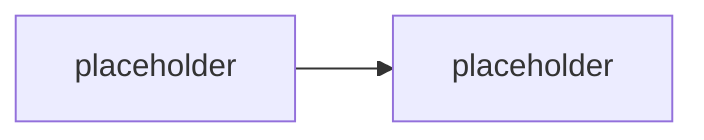

# Grounding: Copilot connectors, semantic index, MCP

> Typ: povinný · Den: 2 · Odhad: **135 min** (65 výklad + 70 lab) · Publikum: **vývojáři / architekti**
> Prostředí: viz [`../../environment.md`](../../environment.md) · Názvosloví: [`../../GLOSSARY.md`](../../GLOSSARY.md)

Kde agent bere data — a hlavně **kdy si retrieval nemá dělat sám**.

## Cíle
- Rozlišit **synced** a **federated** Copilot connectors a vědět, kdy který.
- Vědět, co za tebe dělá **semantic index** (relevance i vynucení permissions ze zdroje).
- Zapojit SharePoint knowledge do agenta z nosné linky.
- Umět odůvodnit, kdy je vlastní vektorizace **správné** rozhodnutí a co stojí.

## Výklad

### Firemní strategie ingestionu

<!-- TODO: principy indexace SharePoint/OneDrive obsahu; co se indexuje, co ne;
     ACL a jejich vynuceni; obohaceni metadaty. -->

### Synced vs. federated connectors

<!-- TODO: tabulka a rozhodovaci osa. Synced: index do Graphu pres Graph connectors API,
     tenant nebo personal konfigurace, custom konektory MOZNE. Federated: MCP, live fetch,
     bez indexace, read-only, custom konektory (k datu psani) NE. -->

> [!IMPORTANT] Názvosloví
> **Microsoft Graph connectors → Microsoft 365 Copilot connectors.** Backend API se ale
> **stále** jmenuje Microsoft Graph connectors API. Katalogová osnova používá starý název.

### Semantic index — co dostaneš zdarma

<!-- TODO: relevance, personalizace, ACL trimming. Nosna pointa: tohle je prace, kterou
     bys u vlastniho vektoroveho ulozište musel udelat sam — vcetne ACL modelu a refreshe. -->

### MCP jako přístup k datům

<!-- TODO: MCP nese federated konektory; MCP je zaroven cesta k nastrojum (viz actions-graph).
     Rozliseni: MCP jako knowledge vs MCP jako akce. -->

### Grounding v agentovi

<!-- TODO: jak se knowledge zapoji do custom engine agenta; rozdil proti deklarativnimu
     agentovi, kde je knowledge deklarace v manifestu (D3). -->

## Klíčové rozlišení
- **Synced** (indexováno do Graphu) vs. **federated** (live přes MCP, bez indexace).
- **Semantic index** (Microsoft dělá relevance a ACL) vs. **vlastní vektorové úložiště**
  (děláš oboje sám).
- **Knowledge** (agent z toho čte) vs. **akce** (agent tím něco dělá) — obojí může jít přes MCP,
  ale governance je jiná.
- **Custom konektor** lze postavit jen jako **synced**.

## Naše prostředí

Hands-on. Knihovna `Runbooky` na `/sites/hr-demo` (vzniká seed skriptem, viz
[`../../scripts/`](../../scripts/)). Custom synced konektor se v labu **nestaví** — je to
samostatná disciplína; pojmenujeme, kde by se napojil.

## Lab
Viz [`lab-grounding-runbooks.md`](lab-grounding-runbooks.md).

## Nosná linka
Support Asistent přestává vymýšlet: dotazy 1 a 2 ze
[`../../day-1/agents-sdk-core/scenario-support-agent.md`](../../day-1/agents-sdk-core/scenario-support-agent.md)
už odpovídá **z runbooku, s citací**. Dotaz 4 zatím odmítá jen slabě (promptem) — to se
zpevní v [`../../day-3/middleware-policy/`](../../day-3/middleware-policy/).

## Zdroje (Microsoft)
- [Copilot connectors overview](https://learn.microsoft.com/en-us/microsoft-365/copilot/connectors/overview)
- [Federated connectors overview](https://learn.microsoft.com/en-us/microsoft-365/copilot/connectors/federated-connectors-overview)
- [Build your first Copilot connector](https://learn.microsoft.com/en-us/microsoft-365/copilot/extensibility/build-your-first-connector)
- [Microsoft Graph connectors API overview](https://learn.microsoft.com/en-us/graph/connecting-external-content-connectors-api-overview)

## Stav produktu / delta

> [!WARNING] Ověřit k datu běhu — stav k 2026-08.
> Federated konektory jsou mladá kategorie — ověřit, jestli už jdou stavět **custom**
> (k datu psaní jen od Microsoftu) a jaký je aktuální seznam default konektorů.
> Rovněž ověřit počet prebuilt konektorů (uváděno „přes 100") před citováním čísla.
