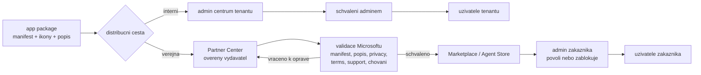

# Agenti v Marketplace — podmínky publikace

> Typ: povinný · Den: 2 · Odhad: **50 min** (35 výklad + 15 case study) · Publikum: **vývojáři / architekti**
> Prostředí: viz [`../../environment.md`](../../environment.md) · Názvosloví: [`../../GLOSSARY.md`](../../GLOSSARY.md)

**Provision** deklarativního agenta z minulého bloku byl distribuce do vlastního tenantu.
Tenhle blok je o druhé cestě: **komerční distribuce přes Microsoft Marketplace / Agent
Store** — co všechno musí být splněno, než tam agent smí, a jak proces reálně vypadá.
Case study: **Normiqa Navigator**, publikovaný agent autora kurzu — ne slide, ale skutečný
listing se skutečnou validační historií.

## Cíle

- Znát **distribuční cesty agenta**: vlastní tenant (Provision z minulého bloku) vs.
  Marketplace / Agent Store — jiný proces, jiné schvalování, jiné publikum.
- Znát **podmínky publikace**: Partner Center účet, validační politiky pro agenty,
  požadavky na manifest, popis, ikony, privacy/terms, podporu.
- Rozumět **procesu review** — co validace kontroluje, jak dlouho trvá, co jsou nejčastější
  důvody zamítnutí.
- Vidět reálný případ end-to-end (Normiqa Navigator): od balíčku po listing.

## Výklad

### Dvě distribuce, dva světy

Východisko je stejné — **app package** (manifest, ikony, popis). Od něj se cesty rozcházejí
ve všem podstatném:

| Hledisko | Org katalog | Marketplace / Agent Store |
|---|---|---|
| **Kdo schvaluje** | tenant admin zákazníka | validace Microsoftu, pak ještě admin zákazníka |
| **Publikum** | uživatelé jednoho tenantu | kdokoli, kdo si agenta najde |
| **Kam se předkládá** | admin centrum tenantu | Partner Center jako nabídka (offer) |
| **Doba do dostupnosti** | dny — jak rychle se domluvíš s IT | kola review; plánovat s rezervou |
| **Co musí existovat navíc** | prakticky nic | ověřený vydavatel, privacy policy, terms of use, support proces |
| **Provoz agenta** | ve tvém tenantu, tvá data | v **cizím** tenantu, cizí data, cizí konfigurace |
| **Monetizace** | není | přes komerční marketplace (transakční nabídky, private offers) |

- **Nejsou to dvě tlačítka nad stejným balíčkem.** Balíček je společný, ale všechno okolo —
  identita vydavatele, právní dokumenty, podpora, reakce na incidenty, kompatibilita
  s libovolným tenantem — je u store cesty samostatná práce s trvalým závazkem.
- **Nejtvrdší rozdíl je „cizí tenant".** Agent, který funguje u tebe, se ve store spoléhá
  na to, že u zákazníka existují stejné zdroje dat, oprávnění a konfigurace. To u interního
  agenta nikdo neřeší, protože se to nikdy nestane.
- **Tenant admin má poslední slovo i u store aplikací** — může je globálně blokovat nebo
  povolovat. Publikace do store negarantuje instalovatelnost u zákazníka.
- **Monetizace** je vlastní téma (transakční nabídky, private offers, billing přes
  Microsoft). Zmiňujeme, že existuje — rozhodnutí „store ANO/NE" se v praxi láme dřív,
  na podpoře a závazku údržby. Podmínky ověřovat v Partner Center dokumentaci.

### Podmínky, které musí být splněny

Struktura požadavků je stabilní, **konkrétní položky nikoli** — enumerovat proti aktuálním
validation guidelines a publish dokumentaci (odkazy níže), ne z paměti.

| Oblast | Co se prokazuje | Kde se to nejčastěji láme |
|---|---|---|
| **Účet vydavatele** | Partner Center účet, ověřená identita organizace, publisher profil konzistentní s doménou v listingu | ověření trvá a nejde urychlit na poslední chvíli |
| **Balíček a manifest** | validní schéma, verze, jednoznačné ID, ikony v požadovaných formátech a rozměrech | ikony a lokalizované varianty |
| **Listing** | co agent dělá, pro koho, srozumitelně; screenshoty; kategorie | popis slibuje víc, než agent v cizím tenantu udělá |
| **Právní dokumenty** | privacy policy a terms of use na veřejné, trvalé URL | odkaz vede na intranet nebo 404 |
| **Zpracování dat** | jaká data agent zpracovává, kam tečou, co ukládá mimo tenant zákazníka | nejtvrdší otázka pro custom engine agenty — data opouštějí tenant, protože je zpracovává tvůj hosting |
| **Podpora** | kontakt a dokumentovaný support proces | závazek reagovat, který nikdo v týmu nevlastní |
| **Technické chování** | funkční auth flow **při první instalaci v cizím tenantu**, korektní chybové stavy, žádné natvrdo zadané tenant-specific hodnoty | consent flow otestovaný jen ve vlastním tenantu |

- **Custom engine agent přidává endpoint**, který validace prověřuje jako součást aplikace:
  dostupnost, chování při chybě, autentizaci. Deklarativní agent tuhle plochu nemá — je to
  jen manifest.
- **Validace kontroluje soulad, ne kvalitu.** Ověřuje, že agent dělá to, co listing tvrdí,
  a že splňuje politiky. Neposoudí, jestli je užitečný — to je tvoje riziko.
- Pravidlo pro plánování: požadavky mimo kód (ověření vydavatele, právní dokumenty, support
  proces) mají **delší dodací lhůtu** než samotný agent. Pokud se řeší až po dokončení
  vývoje, čeká se na ně.

### Case study — Normiqa Navigator

**Normiqa Navigator** je publikovaný agent autora kurzu — reálný listing s reálnou
validační historií. Case study se prochází v tomto pořadí:

1. **Živý listing** — co zákazník vidí: název, popis schopností, screenshoty, kategorie,
   odkazy na privacy policy a podporu. Porovnat s tabulkou podmínek výše: každá položka
   listingu odpovídá nějakému požadavku.
2. **Cesta od balíčku k listingu** — offer v Partner Center, předložení, validace,
   vrácení k opravě, opětovné předložení, publikace.
3. **Co validace vracela** — konkrétní připomínky a jak se opravily. Tohle je nejcennější
   část: ukazuje, co se v dokumentaci nedočtete, protože je to formulované jako požadavek,
   ne jako typická chyba.
4. **Co to stálo mimo kód** — právní dokumenty, support kontakt, údržba listingu při každé
   aktualizaci agenta.

**Co si odnést i bez živého dema:**

- Review je **iterace**, ne jednorázová brána — plánovat s rezervou na kolo oprav
  a nedávat si závazný termín na den publikace.
- Práce po publikaci nekončí: každá změna schopností agenta znamená aktualizaci listingu
  a další kolo validace.
- Většina toho, co proces zdrží, není kód — jsou to dokumenty, ověření a popisy.

> [!NOTE] Vendor-neutralita
> Case study je ilustrace **procesu**, ne produktová prezentace. Co se ukazuje, je Partner
> Center a validační kolotoč — ne funkce produktu.

## Klíčové rozlišení

- **Org katalog** (admin tenant, interní) vs. **Marketplace/Agent Store** (Microsoft
  validace, veřejné) — dva procesy, ne jeden se dvěma tlačítky.
- **Validace ≠ certifikace** — projít store validací neznamená mít Microsoft 365
  certifikaci aplikace; rozlišit úrovně důvěry.
- **Publikace deklarativního agenta vs. custom engine agenta** — jiné požadavky
  (custom engine přidává hosting a endpoint, který validace prověřuje).
- Case study je **ilustrace procesu**, ne produktová prezentace — pravidla kurzu
  o vendor-neutralitě jinak platí dál.

## Naše prostředí

**Instruktorské demo** — Partner Center a listing ukazuje instruktor z vlastního účtu.
Studenti bez Partner Center účtu; deliverable je checklist podmínek, ne vlastní publikace.

## Lab

Viz [`lab-marketplace-checklist.md`](./lab-marketplace-checklist.md).

## Nosná linka

Support Asistent je interní agent — do store nemíří. Blok odpovídá na otázku, **co by se
muselo změnit, kdyby měl**: checklist rozdílů mezi „funguje v mém tenantu" a „smí do
Marketplace" je vstup do capstone roadmapy.

## Zdroje (Microsoft)

- [Publish agents for Microsoft 365 Copilot](https://learn.microsoft.com/en-us/microsoft-365/copilot/extensibility/publish)
- [Teams Store validation guidelines](https://learn.microsoft.com/en-us/microsoftteams/platform/concepts/deploy-and-publish/appsource/prepare/teams-store-validation-guidelines)
- [Partner Center — commercial marketplace](https://learn.microsoft.com/en-us/partner-center/marketplace-offers/)

## Stav produktu / delta

> [!WARNING] Ověřit k datu běhu — stav k 2026-08.
> Validační politiky pro agenty i podoba **Agent Store** se mění po měsících — sekci
> „Podmínky" enumerovat proti aktuální dokumentaci těsně před během. Ověřit i aktuální
> stav listingu Normiqa Navigator (ať demo ukazuje živý stav, ne screenshot).
