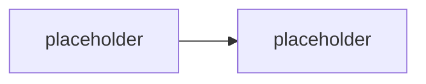

# Vlastní retrieval: chunking, embeddings, hybrid ranking

> Typ: **volitelný** · Den: 2 · Odhad: **105 min** (60 výklad + 45 lab) · Publikum: **vývojáři / architekti**
> Prostředí: viz [`../../environment.md`](../../environment.md) · Názvosloví: [`../../GLOSSARY.md`](../../GLOSSARY.md)

> [!IMPORTANT] Proč je tento modul volitelný
> Katalogová osnova staví vlastní vektorizaci a RAG design jako **povinné jádro**. V kontextu
> Microsoft 365 to je zastaralé rámování: retrieval nad tenant obsahem dělá **semantic index**
> včetně vynucení permissions. Vlastní vektorizace je **rozhodnutí s cenovkou**, ne výchozí stav.
> Proto je to volitelný **leaf** modul — nic povinného na něm nezávisí a je to první kompresní
> ventil dne.

## Cíle
- Vědět, **kdy** vlastní retrieval má smysl — a kdy je to zbytečná odpovědnost.
- Rozumět chunkingu, embeddingům a **hybrid semantic ranking** na úrovni návrhových rozhodnutí.
- Umět pojmenovat kompromis **latence vs. relevance** a co ho v praxi rozhoduje.
- Vědět, co všechno si s vlastním úložištěm bereš na krk (ACL, refresh, ladění, náklady).

## Výklad

### Kdy ano a kdy ne

<!-- TODO: rozhodovaci osa. Vlastni retrieval ma smysl kdyz: data nejsou v M365 a nejde
     synced konektor; potrebuji vlastni ranking; potrebuji data, ktera se nesmi indexovat
     do Graphu; mam mimo-M365 aplikaci. Nema smysl kdyz: obsah je v SPO/OneDrive
     a semantic index staci. -->

### Chunking

<!-- TODO: velikost chunku, overlap, respektovani struktury dokumentu, metadata na chunku.
     Nejcastejsi chyba: chunkovani bez ohledu na strukturu -> rozsekane tabulky a postupy. -->

### Embeddings

<!-- TODO: volba modelu, dimenze, cena, verzovani. KLICOVE: zmena embedding modelu = reindex
     vseho. To je lifecycle zavazek, ne konfiguracni volba. -->

### Hybrid semantic ranking

<!-- TODO: keyword + vektorove skore + re-ranking. Proc cisty vektorovy search u firemnich
     dokumentu casto prohrava s hybridem. -->

### Latence vs. relevance

<!-- TODO: kde se plati: pocet kandidatu, re-ranking, velikost kontextu.
     Merit, ne hadat — navazuje na evaluation-quality. -->

### ACL — nejdrazší část, na kterou se zapomíná

<!-- TODO: semantic index vynucuje permissions ze zdroje. U vlastniho ulozište to musis
     resit ty: security trimming na dotazu, aktualizace pri zmene opravneni, mazani.
     Tohle je nejcastejsi zdroj exfiltrace u vlastnich RAG reseni. -->

## Klíčové rozlišení
- **Semantic index** (Microsoft dělá relevance i ACL trimming) vs. **vlastní úložiště**
  (děláš oboje ty, včetně odpovědnosti za úniky).
- **Chunking** (jak se dokument rozseká) vs. **retrieval** (co se vybere) vs. **ranking**
  (v jakém pořadí) — tři různá místa, kde se dá zkazit relevance.
- **Změna embedding modelu** = reindex všeho, ne konfigurační přepínač.

## Naše prostředí

**Instruktorské demo** — vyžaduje Azure subscription (Azure AI Search / Foundry), kterou
studenti pod baseline `spdemo.online` + PAYG nemají. Viz matice v
[`../../environment.md`](../../environment.md). Studentská část labu je **návrhová**.

## Lab
Viz [`lab-retrieval-design.md`](lab-retrieval-design.md).

## Nosná linka
Support Asistent se **nemění** — a to je pointa. Student na jeho příkladu odůvodní, proč
vlastní retrieval **nepotřebuje**, a pojmenuje jedno rozšíření scénáře, kde by ho potřeboval.

## Zdroje (Microsoft)
- [Copilot connectors overview](https://learn.microsoft.com/en-us/microsoft-365/copilot/connectors/overview)
- [Hybrid search — Azure AI Search](https://learn.microsoft.com/en-us/azure/search/hybrid-search-overview)
- [Semantic ranking — Azure AI Search](https://learn.microsoft.com/en-us/azure/search/semantic-search-overview)
- [Security filters for trimming results — Azure AI Search](https://learn.microsoft.com/en-us/azure/search/search-security-trimming-for-azure-search)

## Stav produktu / delta

> [!WARNING] Ověřit k datu běhu — stav k 2026-08.
> Ceny Azure AI Search tiers a dostupnost integrovaného vektorizování se mění. Neuvádět
> konkrétní ceny bez ověření. Rovněž ověřit, jestli federated konektory (MCP) mezitím
> nepokryly část scénářů, pro které se dnes staví vlastní pipeline — to by tento modul
> ještě zúžilo.
