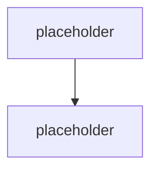
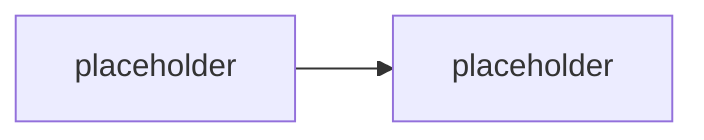

# Prompt & systémová orchestrace

> Typ: povinný · Den: 2 · Odhad: **110 min** (50 výklad + 60 lab) · Publikum: **vývojáři / architekti**
> Prostředí: viz [`../../environment.md`](../../environment.md) · Názvosloví: [`../../GLOSSARY.md`](../../GLOSSARY.md)

## Cíle
- Rozlišit **system / user / tool** zprávy a vědět, co do které patří.
- Napsat systémový prompt, který drží scope a definuje „neznám" chování.
- Řídit **tool-call loop** — kdy model dostane nástroj, kdy se výsledek vrací, kdy se loop zastaví.
- Znát **evaluační heuristiky**, kterými se prompt měří (a proč intuice nestačí).

## Výklad

### Tři druhy zpráv

<!-- TODO: system (kontrakt agenta), user (dotaz), tool (vysledek nastroje).
     Co do systemove zpravy NEpatri: tajemstvi, ACL rozhodnuti, velka data. -->

### Anatomie systémového promptu

<!-- TODO: role, scope, chovani pri neznalosti, format odpovedi, citace, eskalace.
     Nosna pointa: prompt je KONTRAKT, ne zaklinadlo. -->

### Few-shot a řetězení promptů

<!-- TODO: kdy few-shot pomaha a kdy jen zdrazuje kontext; retezeni promptu
     vs jeden slozity prompt; kde retezeni prechazi v orchestraci (-> D3). -->

### Tool-call loop

<!-- TODO: model navrhne nastroj -> validace (D2 actions) -> provedeni -> vysledek jako
     tool zprava -> dalsi tah. Zastavovaci podminky, max iteraci, co kdyz nastroj selze. -->

### Evaluační heuristiky

<!-- TODO: jak poznat, ze zmena promptu pomohla. Zaklad golden setu (plne v D4).
     Proc "zkusil jsem to a je to lepsi" neni metoda. -->

> [!IMPORTANT] Prompt není bezpečnostní hranice
> Instrukce v promptu je **doporučení pro model**, ne vynucení. Skutečná obrana je middleware
> a scope oprávnění — [`../../day-3/middleware-policy/`](../../day-3/middleware-policy/)
> a [`../../day-5/security-risk/`](../../day-5/security-risk/). Tohle je nosné rozlišení kurzu.

## Klíčové rozlišení
- **System** (kontrakt) vs. **user** (dotaz) vs. **tool** (fakt z nástroje) — a proč se tool
  výsledek nesmí vlévat do system zprávy.
- **Instrukce** (co má agent dělat) vs. **knowledge** (z čeho čerpá) — nemíchat.
- **Prompt** (doporučení) vs. **middleware a scope** (vynucení).
- **Řetězení promptů** (stále jeden agent) vs. **orchestrace** (víc agentů, viz D3).

## Naše prostředí

Hands-on, bez tenantu — potřebuje jen **model endpoint**. Pozor na spotřebu tokenů:
iterativní ladění promptu je nejdražší lab dne (viz náklady v [`../../environment.md`](../../environment.md)).

## Lab
Viz [`lab-prompt-anatomy.md`](lab-prompt-anatomy.md).

## Nosná linka
Support Asistent dostává **skutečný systémový prompt**: drží scope, cituje runbooky,
při neznalosti eskaluje přes `CreateTicket`. Čtyři testovací dotazy se poprvé chovají
tak, jak zadání chce — a student to umí **doložit měřením**, ne dojmem.

## Zdroje (Microsoft)
- [What is the Microsoft 365 Agents SDK](https://learn.microsoft.com/en-us/microsoft-365/agents-sdk/agents-sdk-overview)
- [AgentApplication in Microsoft 365 Agents SDK](https://learn.microsoft.com/en-us/microsoft-365/agents-sdk/agent-application)

## Stav produktu / delta

> [!WARNING] Ověřit k datu běhu — stav k 2026-08.
> Chování promptu je vázané na konkrétní model a jeho verzi. Při výměně modelu na
> instruktorském endpointu **znovu projít lab** — odpovědi se mohou lišit natolik, že
> ověřovací kritéria přestanou platit. Tohle je zároveň teaching point pro
> [`../../day-5/perf-cost-lifecycle/`](../../day-5/perf-cost-lifecycle/) (governance výměn modelů).
