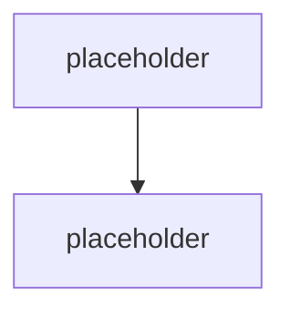
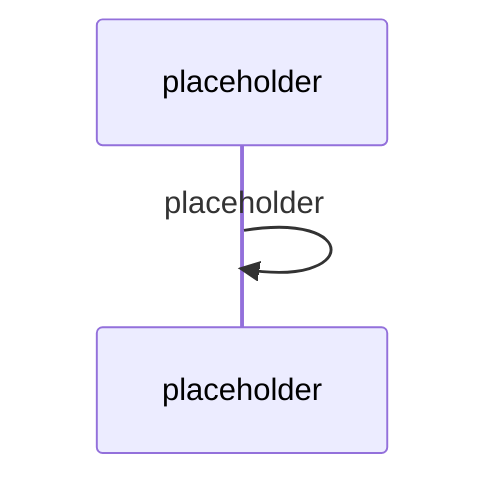

# Microsoft Agent Framework, workflows & multi-agent

> Typ: povinný · Den: 3 · Odhad: **135 min** (60 výklad + 75 lab) · Publikum: **vývojáři / architekti**
> Prostředí: viz [`../../environment.md`](../../environment.md) · Názvosloví: [`../../GLOSSARY.md`](../../GLOSSARY.md)

> [!IMPORTANT] Největší doplněk proti katalogové osnově
> **Microsoft Agent Framework** (sloučení Semantic Kernel a AutoGen) v publikované osnově
> **není vůbec** — ani multi-agent orchestrace, ani A2A. Přitom je to vrstva, kterou pro-code
> tým nad Agents SDK reálně používá, jakmile jeden prompt přestane stačit.

## Cíle
- Vědět, kde končí Agents SDK a začíná orchestrace — a proč to jsou dvě vrstvy.
- Použít **Microsoft Agent Framework** uvnitř agenta postaveného na Agents SDK.
- Rozdělit úlohu na víc agentů (**triage + resolver**) a vědět, kdy to **nedělat**.
- Rozumět **A2A** a orchestračním vzorům (sekvence, fan-out/fan-in, handoff, supervizor).

## Výklad

### Dvě vrstvy, ne konkurence

<!-- TODO: Agents SDK = transport, stav, routing aktivit, autentizace (AI-agnosticke).
     Agent Framework = orchestrace, workflows, multi-agent. Bezi UVNITR SDK aplikace. -->

### Lineage — odkud Agent Framework přišel

<!-- TODO: Semantic Kernel + AutoGen -> Microsoft Agent Framework. Co si student
     z SK/AutoGen prenese a co uz plati jinak. -->

> [!IMPORTANT] Názvosloví
> **Semantic Kernel + AutoGen → Microsoft Agent Framework.** Ve starších tutoriálech,
> blogpostech a Stack Overflow odpovědích potkají studenti oba původní názvy.

### Kdy víc agentů — a kdy je to chyba

<!-- TODO: rozhodovaci osa. Multi-agent ma smysl pri: jasne oddelenych rolich,
     odlisnych opravnenich, odlisnych modelech, dlouhych workflow.
     NEMA smysl kdyz: jeden dobre napsany prompt to zvladne (nejcastejsi pripad).
     Cena: latence, tokeny, obtiznejsi debug, obtiznejsi audit. -->

### Orchestrační vzory

<!-- TODO: sekvence, fan-out/fan-in, handoff, supervizor/worker. U kazdeho: kdy, cena,
     jak se to debuguje. -->

### Workflows

<!-- TODO: workflow jako stavova orchestrace uvnitr procesu; vztah k Durable Functions
     (ktere resi hosting a persistenci) -> day-4/event-driven-hosting. -->

### A2A

<!-- TODO: komunikace mezi agenty jako protokol, ne jako volani funkce. Kdy to potrebujes
     (agenti napric tymy/systemy) a co to znamena pro identitu a audit (-> Entra Agent ID). -->

## Klíčové rozlišení
- **Agents SDK** (transport/stav/routing) vs. **Agent Framework** (orchestrace) — SDK není orchestrátor.
- **Řetězení promptů** (jeden agent, víc tahů) vs. **multi-agent** (víc agentů, víc identit).
- **Workflow** (orchestrace uvnitř procesu) vs. **Durable Functions** (orchestrace s persistencí
  a hostingem, viz D4).
- **A2A** (protokol mezi agenty) vs. **tool call** (agent volá nástroj).

## Naše prostředí

Hands-on, bez tenantu — potřebuje jen **model endpoint**. Pozor: multi-agent násobí volání
modelu, tedy tokeny. Nastavit v labu limit iterací.

## Lab
Viz [`lab-multi-agent-triage.md`](lab-multi-agent-triage.md). Referenční řešení v `solution/`.

## Nosná linka
Support Asistent se rozděluje na **triage** (klasifikuje dotaz, rozhoduje o cestě) a
**resolver** (odpovídá z runbooků nebo eskaluje). Student na svém agentovi uvidí, co tím
získal — a **co tím zaplatil** (latence, tokeny, horší debug).

## Zdroje (Microsoft)
- [Use Semantic Kernel and Agent Framework in Agents SDK](https://learn.microsoft.com/en-us/microsoft-365/agents-sdk/using-semantic-kernel-agent-framework)
- [What is the Microsoft 365 Agents SDK](https://learn.microsoft.com/en-us/microsoft-365/agents-sdk/agents-sdk-overview)
- [Microsoft 365 multi-agent workflow with Microsoft Agent Framework](https://techcommunity.microsoft.com/blog/appsonazureblog/microsoft-365-multi-agent-workflow-with-microsoft-agent-framework/4514164)

## Stav produktu / delta

> [!WARNING] Ověřit k datu běhu — stav k 2026-08.
> Nejrychleji se vyvíjející vrstva celého stacku. Před **každým** během ověřit: aktuální
> názvy typů a balíčků Agent Frameworku, stav podpory **A2A** v Agents SDK, a jestli se
> nezměnil doporučený způsob zapojení Frameworku do SDK aplikace. Přebuildovat `solution/`.
