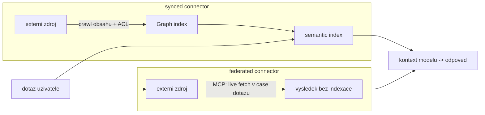

# Grounding: Copilot connectors, semantic index, MCP

> Typ: povinný · Den: 3 · Odhad: **85 min** (35 výklad + 50 lab) · Publikum: **vývojáři / architekti**
> Prostředí: viz [`../../environment.md`](../../environment.md) · Názvosloví: [`../../GLOSSARY.md`](../../GLOSSARY.md)

Kde agent bere data — a hlavně **kdy si retrieval nemá dělat sám**.

## Cíle
- Rozlišit **synced** a **federated** Copilot connectors a vědět, kdy který.
- Vědět, co za tebe dělá **semantic index** (relevance i vynucení permissions ze zdroje).
- Zapojit SharePoint knowledge do agenta z nosné linky přes **Copilot Retrieval API**.
- Umět odůvodnit, kdy je vlastní vektorizace **správné** rozhodnutí a co stojí.

## Výklad

### Firemní strategie ingestionu

- **SharePoint a OneDrive už v indexu jsou.** Konektor se pro ně nestaví — Graph je indexuje
  nativně. Konektory řeší obsah **mimo** Microsoft 365: ticketing, wiki, fileshare, databáze.
- **Co se indexuje**: text dokumentů v podporovaných formátech, obsah stránek a metadata
  sloupců knihovny. **Co ne**: obsah vyloučený nastavením (opt-out knihovny, Restricted
  SharePoint Search), šifrovaný a neparsovatelný obsah — a všechno, co crawl **ještě
  nestihl**. Index není okamžitý; to je nejčastější „agent nefunguje" tohoto bloku.
- **ACL jde do indexu spolu s obsahem** a každý dotaz se trimuje identitou volajícího. Agent
  nevidí nic, co by uživatel neviděl ve vyhledávání. Nosný důsledek: **když agent ukáže něco
  navíc, je to chyba oprávnění ve zdroji, ne v agentovi** — proto [`../data-hygiene/`](../../day-2/data-hygiene/).
- **Obohacení metadaty se vyplácí dřív než ladění relevance.** Sloupce knihovny `Runbooky`
  (kategorie, platnost, vlastník) jdou do indexu jako properties — dají se filtrovat i citovat.
  Levnější investice než vlastní embeddings.
- Ingestion strategie je vědomé rozhodnutí, **co vůbec pustit agentovi do dosahu**. „Všechno,
  co uživatel vidí" je legitimní volba — ale musí to být volba, ne výchozí stav bez majitele.

### Synced vs. federated connectors

| | **Synced** | **Federated** |
|---|---|---|
| Mechanismus | Microsoft Graph connectors API — crawl obsahu **i ACL** | **MCP** — live fetch v čase dotazu |
| Data | kopie v indexu Graphu | žádná kopie, dotaz do zdroje |
| Semantic index | ano (relevance, ranking) | ne |
| Aktuálnost | podle refreshe crawlu | vždy aktuální |
| Zápis | ne | ne (read-only) |
| Konfigurace | tenant (admin) nebo personal (uživatel) | admin povolí, uživatel se autentizuje |
| Vlastní konektor | **ano** | k datu psaní **ne** — jen konektory od Microsoftu |

Rozhodovací osa, v tomhle pořadí:

1. **Je zdroj uvnitř M365?** Ano → nestav nic, index ho už má. (Tohle je náš případ — `Runbooky`.)
2. **Smí data existovat v kopii mimo zdrojový systém?** Nesmí → federated, jinak řešíš retenci
   a klasifikaci dvakrát.
3. **Mění se data po minutách** (stavy tiketů, sklad, kurzy)? → federated; indexovaná kopie
   by lhala.
4. **Chceš relevance a hledání napříč vším** v jednom dotazu? → synced, to je celý smysl
   semantic indexu.
5. **Potřebuješ vlastní konektor?** → zbývá jen synced.

> [!IMPORTANT] Názvosloví
> **Microsoft Graph connectors → Microsoft 365 Copilot connectors.** Backend API se ale
> **stále** jmenuje Microsoft Graph connectors API. Katalogová osnova používá starý název.

### Semantic index — co dostaneš zdarma

- **Relevance**: hybridní vyhledávání (lexikální + sémantické) nad obsahem tenantu,
  chunking a ranking dělá Microsoft. Ty posíláš dotaz, dostáváš pasáže.
- **Personalizace**: signály Work IQ (kdo s kým pracuje, co kdo nedávno otevřel) posouvají
  pořadí výsledků. Tohle si vlastním retrievalem nepostavíš — ta data mimo platformu nejsou.
- **ACL trimming při každém dotazu**, ne při indexaci. Odebrání oprávnění se propíše, aniž
  bys cokoliv reindexoval.
- **Refresh**: změna dokumentu se do indexu dostane bez tvé práce.
- **Nosná pointa: tohle všechno je práce, kterou u vlastního vektorového úložiště děláš sám** —
  chunking, embeddings, ranking, refresh a hlavně **vlastní ACL model**. Nejdražší na vlastním
  retrievalu není indexace, ale to, že se oprávnění ve zdroji mění a tvůj index o tom musí
  vědět dřív, než agent někomu ukáže cizí dokument.
- „Zdarma" znamená **bez tvé práce**, ne bez licence — přístup k semantic indexu se platí
  (Copilot licence nebo PAYG, viz [`../../GLOSSARY.md`](../../GLOSSARY.md)).

### MCP jako přístup k datům

- **MCP nese federated konektory** — to je jeho role v grounding příběhu: standardizovaný
  způsob, jak se model dostane k datům, která nikdo neindexoval.
- Co protokol samotný je a jak funguje (role, primitiva, transport, co teče do
  kontextu): [`explainer-mcp.md`](./explainer-mcp.md) — ~10 min, doporučené čtení
  před rozhodovací tabulkou níže.
- Stejný protokol je zároveň **cesta k nástrojům** — a tam se z něj stává akce
  ([`../actions-graph/`](../../day-4/actions-graph/)).
- Rozlišení, které si studenti pletou:

| | **MCP jako knowledge** | **MCP jako akce** |
|---|---|---|
| Co dělá | agent **čte**, výsledek jde do kontextu | agent **mění stav** ve zdroji |
| Riziko | únik dat, nedůvěryhodný obsah v kontextu | provedení nechtěné operace |
| Co musíš řešit | ACL, klasifikace, citace | autorizace, validace parametrů, audit |
| Kde v kurzu | tento modul | [`../actions-graph/`](../../day-4/actions-graph/) |

- **Jeden MCP server umí obojí.** Kategorie serveru nic neříká — rozhoduje seznam nástrojů,
  které nabízí. Číst popisy nástrojů, ne marketing.
- Popisy nástrojů z MCP serveru **vstupují do kontextu modelu**. Nedůvěryhodný server = cizí
  instrukce v promptu; vrací se v [`../../security-risk/`](../../day-4/security-risk/).

### Grounding v agentovi — Copilot Retrieval API

Tok jednoho turnu v custom engine agentovi:

1. dotaz uživatele → **Copilot Retrieval API** (delegated, jménem volajícího),
2. odpověď = **relevantní text chunky** ze semantic (hybrid) indexu, včetně odkazu na zdroj,
3. chunky vložíš do kontextu modelu **jako tool/kontextovou zprávu** — ne do systémového promptu,
4. model formuluje odpověď a ty pod ni vypíšeš **citace** z metadat chunků.

- **RAG bez vlastního indexu**: žádná replikace dat, žádné embeddings, žádný refresh.
  ACL se vynucují dotazem, **data zůstávají v tenantu zákazníka** — to je architektonický
  argument, který se prodává sám.
- **Oprávnění** (delegated): `Files.Read.All` + `Sites.Read.All`.
- **Limity, se kterými se navrhuje**: 200 requestů / uživatel / hodinu, max 25 výsledků na
  dotaz, `queryString` do 1 500 znaků. Důsledky do návrhu: jeden retrieval na turn (ne jeden
  na každé kolo loopu), cachovat opakované dotazy, posílat **otázku uživatele**, ne
  slepenou historii konverzace.
- **Rozdíl proti deklarativnímu agentovi** ([`../declarative-agents/`](../../day-2/declarative-agents/)):
  tam byla knowledge **deklarace v manifestu** a retrieval udělal orchestrátor Copilotu. Tady
  voláš retrieval sám — a tím přebíráš rozhodnutí, která ti platforma dělala: kolik chunků
  vzít, jak je zkrátit, jak citovat a **co udělat, když se nevrátí nic**. Celý rozdíl mezi
  deklarativní a custom engine cestou v jedné funkci.

**Fallback větev — Graph Search API.** Když Copilot licence ani PAYG nejsou:

- funguje pod běžnou M365 licencí, **ACL trimming platí stejně**,
- ale **bez semantic indexu**: lexikální vyhledávání, žádný sémantický ranking, žádné
  Work IQ signály,
- vrací **položky** (dokumenty), ne text chunky — chunking, výběr a zkracování si děláš sám;
- to je zároveň fallback našeho labu.

Pojmenovat to studentům přesně: **není to rovnocenná cesta, je to fallback.** Rozdíl v kvalitě
odpovědí (a v tom, kolik práce zůstane na tobě) je přesně hodnota, za kterou se u Retrieval API
platí.

> [!WARNING] Ověřit k datu běhu — stav k 2026-08
> **Retrieval API přes pay-as-you-go** (bez M365 Copilot licence) je **preview** a platí
> jen pro tenant-level zdroje (SharePoint, Copilot connectors) — **ne OneDrive**.
> Empiricky ověřeno studentským účtem na PAYG **2026-08-06**; před každým během
> re-verify — preview podmínky se mění.

## Klíčové rozlišení
- **Synced** (indexováno do Graphu) vs. **federated** (live přes MCP, bez indexace).
- **Semantic index** (Microsoft dělá relevance a ACL) vs. **vlastní vektorové úložiště**
  (děláš oboje sám).
- **Knowledge** (agent z toho čte) vs. **akce** (agent tím něco dělá) — obojí může jít přes MCP,
  ale governance je jiná.
- **Copilot Retrieval API** (semantic index, relevance + ACL, RAG bez vlastního indexu) vs.
  **Graph Search API** (lexikální search + ACL, bez semantic indexu) — druhé je fallback,
  ne rovnocenná cesta.
- **Custom konektor** lze postavit jen jako **synced**.

## Naše prostředí

Hands-on. Knihovna `Runbooky` na `/sites/hr-demo` (vzniká seed skriptem **večer dne 1**,
viz [`../../scripts/`](../../scripts/)). Grounding jede přes **Copilot Retrieval API na
PAYG** — empiricky ověřeno studentským účtem 2026-08-06 (preview, viz marker výše).
Custom synced konektor se v labu **nestaví** — je to samostatná disciplína; pojmenujeme,
kde by se napojil.

## Lab
Viz [`lab-grounding-runbooks.md`](./lab-grounding-runbooks.md).

> [!NOTE] Kam tenhle modul pokračuje
> Co v `retrieve()` udělala **platforma** a co **student** se rozebírá na D5 v bloku 0:
> [`../../agent-landscape/explainer-vlastni-retrieval.md`](../../day-1/agent-landscape/explainer-vlastni-retrieval.md).
> Je to podklad k rozhodnutí „stavět vlastní retrieval, nebo pronajmout index".

## Nosná linka
Support Asistent přestává vymýšlet: dotazy 1 a 2 ze
[`../../scenario-support-agent.md`](../../scenario-support-agent.md)
už odpovídá **z runbooku, s citací**. Dotaz 4 zatím odmítá jen slabě (promptem) — to se
zpevní v [`../../middleware-policy/`](../../day-4/middleware-policy/).

## Zdroje (Microsoft)
- [Copilot connectors overview](https://learn.microsoft.com/en-us/microsoft-365/copilot/connectors/overview)
- [Federated connectors overview](https://learn.microsoft.com/en-us/microsoft-365/copilot/connectors/federated-connectors-overview)
- [Microsoft 365 Copilot Retrieval API — overview](https://learn.microsoft.com/en-us/microsoft-365/copilot/extensibility/api/ai-services/retrieval/overview) (licencování vč. PAYG, limity)
- [Build your first Copilot connector](https://learn.microsoft.com/en-us/microsoft-365/copilot/extensibility/build-your-first-connector)
- [Microsoft Graph connectors API overview](https://learn.microsoft.com/en-us/graph/connecting-external-content-connectors-api-overview)

## Stav produktu / delta

> [!WARNING] Ověřit k datu běhu — stav k 2026-08.
> Federated konektory jsou mladá kategorie — ověřit, jestli už jdou stavět **custom**
> (k datu psaní jen od Microsoftu) a jaký je aktuální seznam default konektorů.
> Rovněž ověřit počet prebuilt konektorů (uváděno „přes 100") před citováním čísla.
> **Retrieval API PAYG consumption je preview** — re-verify dostupnost, ceny a podmínky
> před každým během (empirické ověření 2026-08-06 nestárne dobře).
