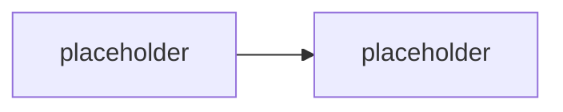

# Manifest, deklarace schopností & kanály

> Typ: povinný · Den: 3 · Odhad: **135 min** (60 výklad + 75 lab) · Publikum: **vývojáři / architekti**
> Prostředí: viz [`../../environment.md`](../../environment.md) · Názvosloví: [`../../GLOSSARY.md`](../../GLOSSARY.md)

Manifest jako **verzovaný kontrakt** agenta — a publikace do víc kanálů z jednoho balíčku.

## Cíle
- Rozumět manifestu jako kontraktu: co agent umí, kam smí, jak se identifikuje.
- Deklarovat schopnosti (knowledge, akce) a vědět, co je **manifest-only** funkce.
- Verzovat agenta a vědět, co verzování v praxi znamená pro nasazené uživatele.
- Publikovat do **Microsoft 365 Copilotu / Teams / webu** a znát rozdíly kanálů.
- Postavit **deklarativního agenta** a srovnat ho s vlastním custom engine agentem.

## Výklad

### Manifest jako kontrakt

<!-- TODO: co v manifestu je: identita, popis, schopnosti, akce, knowledge, ikony, oprávnění.
     Nosna pointa: manifest je to, co schvaluje admin. Kod nevidi — vidi manifest. -->

### Deklarativní agent — druhá cesta, kterou student musí zkusit

<!-- TODO: declarativeAgent.json: instructions, knowledge, actions, capabilities.
     Postavit ho MALY a rychle. Cilem je srovnani s custom engine agentem, ne hloubka. -->

### Deklarativní vs. custom engine — konečně na vlastním kódu

<!-- TODO: srovnavaci tabulka postavena na TOM SAMEM zadani. Co deklarativni agent zvladne
     za 15 minut a co nezvladne vubec (akce s validaci, middleware, vlastni orchestrace,
     vlastni telemetrie). Navrat k rozhodovaci ose z D1. -->

### TypeSpec

<!-- TODO: TypeSpec for Copilot jako typovany zpusob definice; kdy to pomaha proti rucnimu JSON. -->

### Verzování

<!-- TODO: co znamena zvysit verzi: co se stane nasazenym uzivatelum, kdy je nutne
     nove schvaleni, jak se dela rollback. Vazba na lifecycle (D5). -->

### Kanály a jejich rozdíly

<!-- TODO: M365 Copilot, Teams, web, e-mail, SMS — co kanal umi (Adaptive Cards, prilohy,
     autentizace) a co ne. Jeden agent, ale ne stejny zazitek. -->

## Klíčové rozlišení
- **Manifest** (co admin schvaluje a vidí) vs. **kód** (co agent skutečně dělá) — a proč
  se to musí shodovat.
- **Deklarativní agent** (rychle, bez hostingu a modelu, bez vlastního middleware) vs.
  **custom engine agent** (všechno tvoje, včetně odpovědnosti).
- **Manifest-only funkce** — věci, které v žádném UI nejsou a jdou jen z manifestu.
- **Verze manifestu** vs. **verze kódu** — mohou se rozejít, a to je problém.
- Publikace **do org katalogu** vs. **do store** — jiný proces, jiné schvalování.

## Naše prostředí

Hands-on. Deklarativní agent se provisionuje do `spdemo.online` — **funguje i na PAYG bez
Copilot licence** (empiricky potvrzeno 2026-07-17 na jiném běhu; Microsoft to takto
nedokumentuje, viz go/no-go v [`instructor-notes.md`](instructor-notes.md)).
Custom engine agent zůstává lokálně v Agents Playgroundu.

## Lab
Viz [`lab-manifest-and-publish.md`](lab-manifest-and-publish.md).

## Nosná linka
Support Asistent dostává manifest a verzi. Vedle něj student postaví **malého deklarativního
agenta na stejné zadání** — a teprve tady rozhodovací osa z
[`../../day-1/agent-landscape/`](../../day-1/agent-landscape/) přestává být teorie.

## Zdroje (Microsoft)
- [Declarative agents for Microsoft 365 Copilot](https://learn.microsoft.com/en-us/microsoft-365/copilot/extensibility/overview-declarative-agent)
- [Create declarative agents using Microsoft 365 Agents Toolkit](https://learn.microsoft.com/en-us/microsoft-365/copilot/extensibility/build-declarative-agents)
- [Create declarative agents using TypeSpec for Microsoft 365 Copilot](https://learn.microsoft.com/en-us/microsoft-365/copilot/extensibility/build-declarative-agents-typespec)
- [Add capabilities and custom actions to a declarative agent](https://learn.microsoft.com/en-us/microsoft-365/copilot/extensibility/build-declarative-agents-add-skills)
- [Microsoft 365 Agents Toolkit — overview](https://learn.microsoft.com/en-us/microsoftteams/platform/toolkit/overview-agents-toolkit)

## Stav produktu / delta

> [!WARNING] Ověřit k datu běhu — stav k 2026-08.
> **Verze manifest schématu** deklarativního agenta se mění po měsících a s ní i dostupné
> schopnosti (včetně manifest-only funkcí). Ověřit aktuální verzi schématu a názvy šablon
> v Toolkitu. Rovněž **re-verify**, že provisioning deklarativního agenta na PAYG bez
> Copilot licence stále funguje — Microsoft to nedokumentuje, je to empirický poznatek.
