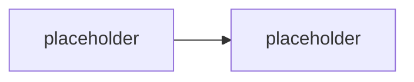

# Middleware & enforcement politik

> Typ: povinný · Den: 3 · Odhad: **150 min** (60 výklad + 90 lab) · Publikum: **vývojáři / architekti**
> Prostředí: viz [`../../environment.md`](../../environment.md) · Názvosloví: [`../../GLOSSARY.md`](../../GLOSSARY.md)

Blok, kde se Responsible AI přestává povídat a začíná se **psát**.

> [!IMPORTANT] Proč je RAI sloučené s middleware
> Katalogová osnova má „Responsible AI & governance" a „Middleware & enforcement politik"
> jako dva bloky. V pro-code kurzu je to **jedna věc**: guardrail, který není v pipeline,
> není guardrail — je to slide. Compliance a dohledatelnost patří ke governance vrstvě
> a řeší je [`../../day-4/agent-365-governance/`](../../day-4/agent-365-governance/).

## Cíle
- Postavit **middleware pipeline** kolem turnu: pre-processing a post-processing.
- Implementovat **redakci** (vstupní i výstupní) a **filtrování výstupů**.
- Znát vzory **mitigace halucinací** a vědět, který z nich je vynucení a který jen naděje.
- Vědět, co dělají **safety filtry a content moderation** na straně modelu — a co ne.

## Výklad

### Middleware pipeline kolem turnu

<!-- TODO: kde se middleware zapoji do AgentApplication; poradi; kratky obvod (zastaveni turnu).
     Pipeline musi pokryt VSECHNY agenty z D3 multi-agent, ne jen jednoho. -->

### Pre-processing

<!-- TODO: normalizace vstupu, detekce a redakce PII pred odeslanim modelu,
     klasifikace zamerů, odmitnuti pred volanim modelu (nejlevnejsi obrana). -->

### Post-processing

<!-- TODO: filtrovani vystupu, vynuceni formatu, vynuceni citaci, redakce pred odeslanim
     uzivateli, zablokovani odpovedi bez podkladu. -->

### Safety filtry a content moderation

<!-- TODO: co resi model/platforma (kategorie skodliveho obsahu) a co NEresi
     (tvoje business politiky, scope, opravneni). Nezamenovat. -->

### Mitigace halucinací — co je vynucení a co naděje

<!-- TODO: naděje: "v promptu mu napisu, ať nevymýšlí".
     Vynuceni: vyzadovani citace + zamitnuti odpovedi bez podkladu v post-processingu;
     omezeni scope znalosti; zamitnuti mimo whitelist temat; strukturovany vystup s overenim.
     Nosna pointa dne. -->

> [!IMPORTANT] Prompt vs. middleware
> Instrukce v promptu je **doporučení pro model**. Middleware je **kód, který se vykoná**.
> Studenti si to ověřili v [`../../day-3/prompt-orchestration/`](../../day-3/prompt-orchestration/)
> (část D labu) — tady se to napravuje.

## Klíčové rozlišení
- **Prompt** (doporučení) vs. **middleware** (vynucení) vs. **oprávnění** (hranice, kterou
  nelze přemluvit).
- **Safety filtry platformy** (obecný škodlivý obsah) vs. **tvoje politiky** (scope, PII,
  business pravidla) — platforma tvoje politiky neřeší.
- **Pre-processing** (levné odmítnutí před voláním modelu) vs. **post-processing**
  (drahé, model už proběhl) — ekonomika obrany.
- **Redakce** (odstraním údaj) vs. **filtrování** (zablokuji odpověď) vs. **odmítnutí**
  (nedostanu se k modelu).

## Naše prostředí

Hands-on, bez tenantu — potřebuje **model endpoint**. Middleware se testuje i offline
(unit testy nad pipeline bez volání modelu) — to je záměr, naváže
[`../../day-5/evaluation-quality/`](../../day-5/evaluation-quality/).

## Lab
Viz [`lab-middleware-pipeline.md`](lab-middleware-pipeline.md). Referenční řešení v `solution/`.

## Nosná linka
Support Asistent dostává middleware, který pokrývá **oba** agenty z
[`../agent-framework/`](../agent-framework/). Dotaz 4 ze
[`../../scenario-support-agent.md`](../../scenario-support-agent.md)
už není odmítnutý promptem, ale **kódem** — a student to umí dokázat i proti pokusu o obejití.

## Zdroje (Microsoft)
- [AgentApplication in Microsoft 365 Agents SDK](https://learn.microsoft.com/en-us/microsoft-365/agents-sdk/agent-application)
- [Responsible AI in Microsoft Foundry](https://learn.microsoft.com/en-us/azure/ai-foundry/responsible-use-of-ai-overview)
- [Content filtering — Microsoft Foundry](https://learn.microsoft.com/en-us/azure/ai-foundry/openai/concepts/content-filter)

## Stav produktu / delta

> [!WARNING] Ověřit k datu běhu — stav k 2026-08.
> Kategorie a konfigurace content filtrů na straně platformy se mění; ověřit, které jsou
> default a které se dají ladit. Rovněž ověřit, jestli Agents SDK nepřidalo vlastní
> middleware abstrakci (mění to podobu labu).
