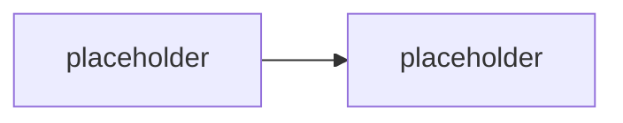

# SharePoint Copilot Apps — interaktivní UX v Copilot canvasu (Public Preview)

> Typ: povinný · Den: 3 · Odhad: **35 min** (25 demo-výklad + 10 diskuse) · Publikum: **vývojáři / architekti**
> Prostředí: viz [`../../environment.md`](../../environment.md) · Názvosloví: [`../../GLOSSARY.md`](../../GLOSSARY.md)

Agent celý den tvaruje **text**. SharePoint Copilot Apps (SPFx 1.24, Public Preview) jsou
odpověď na otázku „a co když má odpověď být graf, formulář nebo schválení?" — SPFx
komponenty renderované **přímo v Copilot canvasu**, postavené na **MCP Apps** modelu,
hostované automaticky v tenantu. Pro SPFx vývojáře je to nejkratší cesta do světa agentů.

## Cíle

- Vědět, co SharePoint Copilot Apps jsou: SPFx komponenta v Copilot canvasu, **MCP Apps**
  model, hosting automaticky v tenantu (žádný vlastní hosting ani routing).
- Znát developer loop: scaffold (šablony Minimal / No framework / React) → lokální běh
  v **Copilot Workbench** → deploy do tenantu.
- Umět zařadit Copilot Apps na osu kurzu: UX vrstva **nad** agenty, ne další druh agenta.
- Vidět most k SPFx dovednostem — stejné packaging, tooling a struktura projektu jako
  u web partů.

## Výklad

### Co to je a proč teď

<!-- TODO: demo naskriptovat: hotova Copilot App (graf/formular) v Copilot canvasu.
     Pointa: agent muze vratit interaktivni UX misto textu; MCP Apps model, ale hosting
     a routing resi platforma (tenant-hosted -- data zustavaji v tenantu). -->

### Developer loop — SPFx, jak ho znáte

<!-- TODO: scaffold pres @microsoft/generator-sharepoint@next, sablony Minimal /
     No framework / React; Copilot Workbench jako lokalni test prostredi;
     stejny packaging a projektova struktura jako web party. -->

### Kde to sedí na ose kurzu

<!-- TODO: Copilot Apps NEJSOU dalsi druh agenta -- jsou UX vrstva nad konverzaci.
     Vazba na MCP nit (D2 konektory, akce) a na middleware (D3 -- co agent smi
     vratit, plati i pro UX vystup). -->

## Klíčové rozlišení

- **Copilot App** (UX komponenta v canvasu) vs. **agent** (logika a orchestrace) —
  App nenahrazuje agenta, dává mu ruce a obrazovku.
- **MCP Apps model s tenant hostingem** — na rozdíl od obecných MCP Apps neřešíš hosting
  ani routing; komponenta žije v M365 tenantu (data sovereignty zdarma).
- **SPFx dovednosti se přenášejí 1:1** — packaging, tooling, projektová struktura;
  jazyk je tu TypeScript (jediný TS-first blok kurzu, záměrně).
- **Public Preview** — bez Copilot licence pro build (v preview), store distribuce zatím
  nepodporovaná, pracovní název se může změnit.

## Naše prostředí

**Instruktorské demo** (25 min) — lokální běh v Copilot Workbench nevyžaduje Copilot
licenci (stav preview), deploy do `spdemo.online` dle stavu rolloutu. Studentský hands-on
až po GA — blok je showcase s odkazem na samostudium (PnP samples).

## Lab

Bez samostatného labu — demo + diskuse. Samostudium:
[GitHub — spfx-copilot-apps samples](https://github.com/pnp/spfx-copilot-apps).

## Nosná linka

Support Asistent dnes dostal middleware — a tady je vidět, **kam jeho výstup může
dorůst**: eskalace z dotazu 3 ([`../../scenario-support-agent.md`](../../scenario-support-agent.md))
jako interaktivní schvalovací karta místo textu. V kurzu jen jako vize, ne implementace.

## Zdroje (Microsoft)

- [SharePoint Framework v1.24 preview release notes](https://learn.microsoft.com/en-us/sharepoint/dev/spfx/release-1.24.0)
- [Going beyond text in Microsoft 365 Copilot: Introducing SharePoint Copilot Apps](https://devblogs.microsoft.com/microsoft365dev/going-beyond-text-in-microsoft-365-copilot-introducing-sharepoint-copilot-apps/)

## Stav produktu / delta

> [!WARNING] Ověřit k datu běhu — stav k 2026-08.
> **Public Preview** (SPFx 1.24 beta.1, 2026-07-08): rollout dokončen ~2026-07-20,
> renderuje se zatím **jen v Copilot canvasu**, store distribuce nepodporovaná, licencování
> po GA se může změnit, i pracovní název „SharePoint Copilot Apps" se může změnit.
> Před během ověřit release notes a stav GA — tenhle blok je nejrychleji se měnící
> v celém kurzu.
