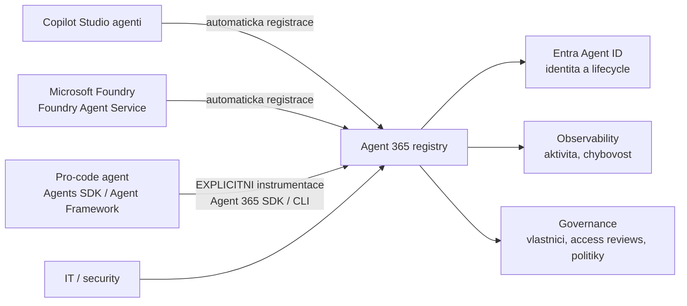
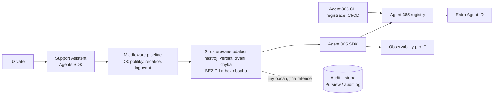

# Agent 365, Entra Agent ID & instrumentace pro-code agenta

> Typ: povinný · Den: 5 · Odhad: **85 min** (40 výklad + 45 lab, vč. 10 min Orchestry) · Publikum: **vývojáři / architekti**
> Prostředí: viz [`../../environment.md`](../../environment.md) · Názvosloví: [`../../GLOSSARY.md`](../../GLOSSARY.md)

> [!IMPORTANT] Pro-code diferenciátor celého kurzu
> **Copilot Studio agenti se do Agent 365 registry registrují automaticky. Microsoft Foundry
> registruje své agenty také automaticky. Pro-code agent postavený na Agents SDK se musí
> instrumentovat explicitně.** To je práce, kterou tato audience dělá — a jediný důvod, proč
> teze „low-code je governed, pro-code je divočina" neplatí. Tenhle blok v publikované
> katalogové osnově **není vůbec**.

## Cíle
- Vědět, co je **Agent 365** a co dělá — a co nedělá (nehostuje ani netvoří agenty).
- Rozumět **Microsoft Entra Agent ID** jako identitě agenta: lifecycle, access reviews,
  owner attestation.
- **Instrumentovat vlastního agenta** do Agent 365 (SDK / CLI) — registry a observability.
- Rozlišit **Foundry Control Plane** a **Agent 365** — dva control plany, jiný rozsah.
- Vědět, kde se řeší compliance a dohledatelnost (Purview, audit).

## Výklad

### Proč vznikl control plane pro agenty

- Agent není skript — je to **identita, která něco dělá** jménem uživatele nebo aplikace:
  čte data, volá API, zakládá tikety. Z pohledu security je to nový typ účtu, jen se
  množí rychleji než lidé.
- Bez registry nikdo neodpoví na tři otázky, které padnou u prvního auditu: **kolik agentů
  v organizaci běží**, **co každý z nich smí** a **kdo je vlastní** (a kdo je vypne, až
  vlastník odejde z firmy).
- **Shadow AI**: agenti vznikají v agent builderu, v Copilot Studiu, ve Foundry a v repech
  vývojových týmů. Každá cesta má vlastní admin povrch — dokud nad nimi není společná
  vrstva, IT vidí střepy a odpovídá „nevíme".
- Control plane tedy neřeší, **jak agenta postavit**. Řeší, jak ho po postavení
  **vidět, spravovat a odebrat**.

### Microsoft Entra Agent ID

- Agent dostává **vlastní identitu v Entra** — objekt první třídy, ne app registraci
  ztracenou mezi stovkami ostatních.
- Co to odemkne:
  - **access reviews** — periodická otázka „má tenhle agent pořád mít tohle oprávnění?",
    se jménem člověka, který na ni odpověděl;
  - **lifecycle politiky** — provisioning při vzniku a hlavně **deprovisioning**: při
    vyřazení agenta nebo odchodu vlastníka;
  - **owner attestation** u high-impact agentů — někdo se podepíše, že agent je nadále
    potřeba a správně nastavený.
- **Rozdíl proti „agent běží pod app registrací"**: app registrace je identita *aplikace*.
  Nikdo v ní nerozliší agenta od integračního jobu, nemá vlastníka v governance smyslu
  a nedá se recenzovat jako agent. Entra Agent ID dělá z agenta samostatnou governance
  jednotku — to není přejmenování.
- Praktický dopad na akce z D2: hranice oprávnění (delegated vs. app-only) se dá recenzovat
  **per agent**, ne per aplikace. Tím se app-only zkratka stává viditelnou.

### Agent 365 — co to je a co to není

- **Co to je**: control plane pro IT a security — **registry** agentů napříč původem,
  **observability** (co agenti dělají a jak často selhávají), **identita** přes Entra
  Agent ID a **governance** (vlastníci, politiky, reviews).
- **Co to není: Agent 365 agenty nehostuje ani netvoří.** Nedá se v něm agent postavit
  ani nasadit — to zůstává Copilot Studiu, Foundry a tvému hostingu z předchozího bloku.
  „Agent 365 je Copilot Studio pro enterprise" je nejčastější omyl v místnosti.
- **Stav k 2026-08**: GA od **2026-05-01**, standalone licence **$15/user/měs** (nebo
  v rámci E7). Ověřit k datu běhu — viz Stav produktu níže.
- **Licencuje se uživatel, ne agent.** Nejčastější nedorozumění při rozpočtování:
  zákazník počítá cenu za agenta a vyjde mu nesmysl oběma směry.

### Instrumentace pro-code agenta — jádro bloku

- **Developerský povrch**: **Agent 365 SDK** (knihovna, kterou zapojíš do agenta) a
  **Agent 365 CLI** (registrace a správa z příkazové řádky, použitelná v CI/CD). Konkrétní
  balíčky a příkazy **ověřovat proti aktuální dokumentaci** — povrch je mladý a mění se.
- **Co se registruje**: identita agenta a jeho metadata — jméno, popis, vlastník,
  prostředí, verze, deklarované schopnosti a akce. To je záznam, který IT uvidí v registry
  vedle agentů z Copilot Studia.
- **Jakou telemetrii posíláš**: události turnu — kdo se ptal (identifikátor, ne obsah),
  který nástroj se volal a s jakým výsledkem, **verdikt middleware** (povoleno / odmítnuto
  / redigováno), doba zpracování, chyby a retry.
- **Zdroj té telemetrie už máš.** Je to logování z middleware pipeline (D3). Instrumentace
  není nová vrstva — je to **export existující vrstvy do control plane**. Kdo v D3 logoval
  pořádně, tady jen připojí kabel.
- **Podporované pro-code cesty**: Agent Framework, Agents SDK a další pro-code volby;
  aktuální seznam ověřit — a zároveň ověřit, jestli Agents SDK nezískalo nativní integraci
  (zjednodušilo by to celý krok).
- **Co IT uvidí**: agenta v registry s vlastníkem, jeho aktivitu v čase, jeho selhání
  a odmítnutí. **Co neuvidí — a nemá**: obsah dotazů a odpovědí.

### Dva control plany

| | **Foundry Control Plane** | **Agent 365** |
|---|---|---|
| Čí je to pohled | platformní tým v Azure | IT / security v Microsoft 365 |
| Rozsah | agenti a infrastruktura ve Foundry — projekty, modely, deploymenty, kvóty | agenti **napříč původem**: Copilot Studio, Foundry, pro-code |
| Odpovídá na | jak to běží a co to stojí na inference | kdo agenta vlastní, co smí a co dělal |
| Identita | Entra Agent ID pro Foundry agenty | Entra Agent ID napříč všemi |

- **Sync mezi nimi existuje**: Foundry registruje své agenty do Agent 365 registry
  automaticky a spravuje jejich identitu po celý lifecycle. Není to volba „buď — anebo";
  platformní tým může žít ve Foundry a IT stejně vidí agenty v Agent 365.
- Testovací otázka pro studenty: „kolik nás ten agent stojí na tokenech" je Foundry;
  „smí tenhle agent pořád číst knihovnu `Runbooky` a kdo to potvrdil" je Agent 365.

### Compliance a dohledatelnost

- **Telemetrie ≠ audit.** Telemetrie je pro tebe (ladění, výkon, chybovost), audit pro
  compliance (kdo, kdy, k čemu přistoupil, s jakým výsledkem). Jiný obsah, jiná retence,
  jiná pravidla přístupu — a jiné úložiště.
- **Kde vzniká auditní stopa**: v platformních službách (Purview a audit log Microsoftu 365
  pro aktivitu nad tenant daty, Entra pro přihlášení a změny identity) **a ve tvém kódu**
  pro to, co platforma nevidí — provedená akce agenta (`CreateTicket`), verdikt middleware,
  důvod odmítnutí.
- **Co do stopy patří**: identifikátor uživatele a agenta, čas, akce, cíl, výsledek,
  korelační ID turnu. **Co do ní nepatří**: obsah dotazu a odpovědi, PII, tajemství,
  tokeny. Log s obsahem konverzace je nová kopie citlivých dat mimo režim zdroje — to je
  GDPR problém, ne nepořádek.
- Praktické pravidlo: **odkazuj, nekopíruj** — ID dokumentu místo výňatku z runbooku,
  ID tiketu místo popisu závady.
- **Retence**: telemetrie krátce (dny až týdny, slouží k ladění), audit dlouho podle
  politiky organizace. Kdo obojí smíchá do jednoho úložiště, dostane nejhorší z obou —
  drahé skladování obsahu, který tam nemá být.

## Klíčové rozlišení
- **Agent 365** (control plane, negeneruje ani nehostuje agenty) vs. **Copilot Studio /
  Foundry / Agents SDK** (staví a hostí).
- **Automatická registrace** (Copilot Studio, Foundry) vs. **explicitní instrumentace**
  (pro-code) — nosná pointa bloku.
- **Entra Agent ID** (identita agenta) vs. **app registrace** (identita aplikace).
- **Foundry Control Plane** (Azure infrastruktura) vs. **Agent 365** (agenti napříč původem).
- **Telemetrie** (co potřebuju k ladění) vs. **audit** (co potřebuje compliance) — jiný obsah,
  jiná retence, jiná pravidla o PII.
- **Licencuje se uživatel, ne agent.**

## Naše prostředí

**Instruktorské demo s živou licencí** — Agent 365 licence je zajištěna **pro lektora**
(rozhodnuto 2026-08-07; $15/user/měs, viz [`../../environment.md`](../../environment.md)) —
registry a observability se ukazují živě, ne ze screenshotů. Studenti licenci nemají:
studentská část je **implementační** — instrumentační kód a telemetrie se napíšou
a otestují lokálně proti mocku; registrace naostro se vidí na lektorském demu.

## Lab
Viz [`lab-instrument-agent.md`](lab-instrument-agent.md).

## Nosná linka
Support Asistent se stává **viditelným pro IT**: má identitu, hlásí telemetrii a je
dohledatelný. Bez tohoto kroku by ho žádné enterprise IT do produkce nepustilo — a to je
argument, který student odnese k zákazníkovi.

## Zdroje (Microsoft)
- [Microsoft Agent 365 SDK and CLI](https://learn.microsoft.com/en-us/microsoft-agent-365/developer/)
- [Microsoft Agent 365 SDK — overview](https://learn.microsoft.com/en-us/microsoft-agent-365/developer/agent-365-sdk)
- [What is Microsoft Entra Agent ID](https://learn.microsoft.com/en-us/entra/agent-id/what-is-microsoft-entra-agent-id)
- [Governing agent identities — Entra ID Governance](https://learn.microsoft.com/en-us/entra/id-governance/agent-id-governance-overview)
- [Microsoft Agent 365 integration with Foundry](https://learn.microsoft.com/en-us/azure/foundry/agents/concepts/agent-365-integration)
- [Agent identity concepts in Microsoft Foundry](https://learn.microsoft.com/en-us/azure/foundry/agents/concepts/agent-identity)
- [Microsoft Agent 365 GA — oznámení](https://www.microsoft.com/en-us/security/blog/2026/05/01/microsoft-agent-365-now-generally-available-expands-capabilities-and-integrations/) (GA datum, licencování)
- [Microsoft licensing FAQ — Agent 365](https://www.microsoft.com/licensing/faqs/122) (cena, prerekvizity licence)

## Stav produktu / delta

> [!WARNING] Ověřit k datu běhu — stav k 2026-08.
> Agent 365 je GA od **2026-05-01** a jeho developerský povrch (SDK, CLI) je mladý —
> **API se mění**. Před každým během ověřit: aktuální balíčky a příkazy CLI, co se registruje
> automaticky vs. explicitně, cenu ($15/user/měs) a jestli Agents SDK nezískalo nativní
> integraci (zjednodušilo by lab).
