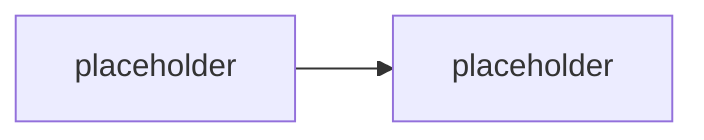

# Agent 365, Entra Agent ID & instrumentace pro-code agenta

> Typ: povinný · Den: 4 · Odhad: **130 min** (60 výklad + 70 lab) · Publikum: **vývojáři / architekti**
> Prostředí: viz [`../../environment.md`](../../environment.md) · Názvosloví: [`../../GLOSSARY.md`](../../GLOSSARY.md)

> [!IMPORTANT] Pro-code diferenciátor celého kurzu
> **Copilot Studio agenti se do Agent 365 registry registrují automaticky. Microsoft Foundry
> registruje své agenty také automaticky. Pro-code agent postavený na Agents SDK se musí
> instrumentovat explicitně.** To je práce, kterou tato audience dělá — a jediný důvod, proč
> teze „low-code je governed, pro-code je divočina" neplatí. Tenhle blok v publikované
> katalogové osnově **není vůbec**.

## Cíle
- Vědět, co je **Agent 365** a co dělá — a co nedělá (nehostuje ani netvoří agenty).
- Rozumět **Microsoft Entra Agent ID** jako identitě agenta: lifecycle, access reviews,
  owner attestation.
- **Instrumentovat vlastního agenta** do Agent 365 (SDK / CLI) — registry a observability.
- Rozlišit **Foundry Control Plane** a **Agent 365** — dva control plany, jiný rozsah.
- Vědět, kde se řeší compliance a dohledatelnost (Purview, audit).

## Výklad

### Proč vznikl control plane pro agenty

<!-- TODO: agenti jako identity, ktere neco delaji jmenem uzivatele nebo aplikace.
     Bez registry: nikdo nevi, kolik agentu v organizaci bezi, co smi a kdo je vlastni.
     Shadow AI. -->

### Microsoft Entra Agent ID

<!-- TODO: identita agenta v Entra. Co to umozni: access reviews, lifecycle politiky
     pro provisioning a deprovisioning, owner attestation u high-impact agentu.
     Rozdil proti "agent bezi pod app registraci". -->

### Agent 365 — co to je a co to není

<!-- TODO: control plane pro IT/security: registry, observability, identita, governance
     napric puvodem. NEHOSTUJE a NETVORI agenty. GA 2026-05-01, $15/user/mes, licencuje
     se uzivatel ne agent. -->

### Instrumentace pro-code agenta — jádro bloku

<!-- TODO: Agent 365 SDK + CLI. Co se registruje, jakou telemetrii posilas, co z toho
     uvidi IT. Navaznost na logovani z middleware pipeline (D3). Podporovane frameworky:
     Agent Framework, Agents SDK a dalsi pro-code volby. -->

### Dva control plany

<!-- TODO: Foundry Control Plane (infrastruktura a agenti v Azure, pohled platformniho tymu)
     vs Agent 365 (agenti napric puvodem, pohled IT/security v M365). Sync mezi nimi.
     Foundry registruje agenty do Agent 365 registry automaticky. -->

### Compliance a dohledatelnost

<!-- TODO: kde vznika auditni stopa, co do ni patri a co ne (PII!), Purview.
     Navaznost na logovani z middleware — telemetrie a audit nejsou totez. -->

## Klíčové rozlišení
- **Agent 365** (control plane, negeneruje ani nehostuje agenty) vs. **Copilot Studio /
  Foundry / Agents SDK** (staví a hostí).
- **Automatická registrace** (Copilot Studio, Foundry) vs. **explicitní instrumentace**
  (pro-code) — nosná pointa bloku.
- **Entra Agent ID** (identita agenta) vs. **app registrace** (identita aplikace).
- **Foundry Control Plane** (Azure infrastruktura) vs. **Agent 365** (agenti napříč původem).
- **Telemetrie** (co potřebuju k ladění) vs. **audit** (co potřebuje compliance) — jiný obsah,
  jiná retence, jiná pravidla o PII.
- **Licencuje se uživatel, ne agent.**

## Naše prostředí

**Instruktorské demo s živou licencí** — Agent 365 licence je zajištěna **pro lektora**
(rozhodnuto 2026-08-07; $15/user/měs, viz [`../../environment.md`](../../environment.md)) —
registry a observability se ukazují živě, ne ze screenshotů. Studenti licenci nemají:
studentská část je **implementační** — instrumentační kód a telemetrie se napíšou
a otestují lokálně proti mocku; registrace naostro se vidí na lektorském demu.

## Lab
Viz [`lab-instrument-agent.md`](lab-instrument-agent.md).

## Nosná linka
Support Asistent se stává **viditelným pro IT**: má identitu, hlásí telemetrii a je
dohledatelný. Bez tohoto kroku by ho žádné enterprise IT do produkce nepustilo — a to je
argument, který student odnese k zákazníkovi.

## Zdroje (Microsoft)
- [Microsoft Agent 365 SDK and CLI](https://learn.microsoft.com/en-us/microsoft-agent-365/developer/)
- [Microsoft Agent 365 SDK — overview](https://learn.microsoft.com/en-us/microsoft-agent-365/developer/agent-365-sdk)
- [What is Microsoft Entra Agent ID](https://learn.microsoft.com/en-us/entra/agent-id/what-is-microsoft-entra-agent-id)
- [Governing agent identities — Entra ID Governance](https://learn.microsoft.com/en-us/entra/id-governance/agent-id-governance-overview)
- [Microsoft Agent 365 integration with Foundry](https://learn.microsoft.com/en-us/azure/foundry/agents/concepts/agent-365-integration)
- [Agent identity concepts in Microsoft Foundry](https://learn.microsoft.com/en-us/azure/foundry/agents/concepts/agent-identity)
- [Microsoft Agent 365 GA — oznámení](https://www.microsoft.com/en-us/security/blog/2026/05/01/microsoft-agent-365-now-generally-available-expands-capabilities-and-integrations/) (GA datum, licencování)
- [Microsoft licensing FAQ — Agent 365](https://www.microsoft.com/licensing/faqs/122) (cena, prerekvizity licence)

## Stav produktu / delta

> [!WARNING] Ověřit k datu běhu — stav k 2026-08.
> Agent 365 je GA od **2026-05-01** a jeho developerský povrch (SDK, CLI) je mladý —
> **API se mění**. Před každým během ověřit: aktuální balíčky a příkazy CLI, co se registruje
> automaticky vs. explicitně, cenu ($15/user/měs) a jestli Agents SDK nezískalo nativní
> integraci (zjednodušilo by lab).
