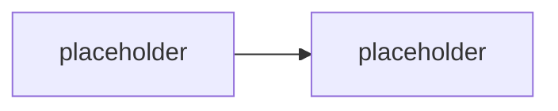

# Evaluace & kvalita

> Typ: povinný · Den: 4 · Odhad: **130 min** (55 výklad + 75 lab) · Publikum: **vývojáři / architekti**
> Prostředí: viz [`../../environment.md`](../../environment.md) · Názvosloví: [`../../GLOSSARY.md`](../../GLOSSARY.md)

Jak dokázat, že je agent dobrý — a že ho poslední změna nezhoršila.

## Cíle
- Rozlišit **kvalitativní a kvantitativní** metriky a vědět, kterou kdy použít.
- Postavit **golden set** a **regresní test** nad vlastním agentem.
- Zapojit **human-in-the-loop** tam, kde automat nestačí.
- Použít **Foundry evaluations** a **OpenTelemetry** jako průmyslové nástroje, ne jen skripty.

## Výklad

### Proč intuice nestačí

<!-- TODO: "zkusil jsem to a je to lepsi" je nemeritelne. LLM je nedeterministicky —
     jeden pruchod nic nedokazuje. Navaznost na baseline z D2 prompt-orchestration. -->

### Co se u agenta vůbec měří

<!-- TODO: spravnost odpovedi, groundedness (odpoved ma podklad), citace, spravnost volby
     nastroje, spravnost parametru, odmitnuti kdyz ma odmitnout, latence, naklady.
     KLICOVE: u multi-agenta je treba vedet, KTERA vrstva chybila (triage vs resolver). -->

### Kvalitativní vs. kvantitativní

<!-- TODO: kvantitativni: pass rate na golden setu, groundedness skore, latence, tokeny.
     Kvalitativni: revize cloveka, uzivatelska zpetna vazba, tonalita, uzitecnost.
     Ani jedno samo nestaci. -->

### Golden set

<!-- TODO: jak se sklada: realne dotazy, edge cases, negativni pripady (musi odmitnout),
     pripady s podkladem i bez. Kolik je dost. Kdo ho udrzuje. Jak stari. -->

### Regresní testy

<!-- TODO: co se testuje BEZ modelu (middleware, validace parametru — determinismus)
     a co s modelem (nedeterminismus -> tolerance, opakovani, prahy).
     Navaznost na unit test z D3 middleware-policy. -->

### Human-in-the-loop

<!-- TODO: kde clovek musi zustat: eskalace s dopadem, prvni nasazeni, sporne pripady.
     Jak se to navrhuje, aby to nebyla brzda. -->

### Nástroje

<!-- TODO: Foundry evaluations (evaluatory, batch behy, srovnani verzi),
     OpenTelemetry (trace pres turn, spans pres nastroje) — navaznost na telemetrii z D4 governance. -->

## Klíčové rozlišení
- **Deterministické testy** (middleware, validace — musí projít vždy) vs. **nedeterministické
  evaluace** (odpovědi modelu — prahy a tolerance).
- **Groundedness** (odpověď má podklad) vs. **správnost** (podklad je ten správný) vs.
  **užitečnost** (uživateli to pomohlo).
- **Golden set** (kurátorovaný, stabilní) vs. **produkční vzorek** (aktuální, zašuměný).
- **Metrika** (číslo) vs. **rozhodnutí o vydání** (prahy + kvalitativní revize).

## Naše prostředí

Hands-on, bez tenantu — potřebuje **model endpoint**. Deterministická část (regresní testy
nad middleware) běží **bez modelu** a je tedy zdarma a rychlá; to je záměr a teaching point.

## Lab
Viz [`lab-golden-set.md`](lab-golden-set.md). Referenční řešení v `solution/`.

## Nosná linka
Support Asistent získává **golden set a regresní běh**. Baseline ze
[`../../day-2/prompt-orchestration/`](../../day-2/prompt-orchestration/) a měření z
[`../../day-3/agent-framework/`](../../day-3/agent-framework/) se konečně spojují do jedné
tabulky — student vidí celý týden jako křivku, ne jako sérii pokusů.

## Zdroje (Microsoft)
- [Evaluation of generative AI applications — Microsoft Foundry](https://learn.microsoft.com/en-us/azure/ai-foundry/concepts/evaluation-approach-gen-ai)
- [Evaluate your AI application — Microsoft Foundry](https://learn.microsoft.com/en-us/azure/ai-foundry/how-to/develop/evaluate-sdk)
- [Observability in generative AI — Microsoft Foundry](https://learn.microsoft.com/en-us/azure/ai-foundry/concepts/observability)
- [Microsoft Agent 365 SDK — overview](https://learn.microsoft.com/en-us/microsoft-agent-365/developer/agent-365-sdk)

## Stav produktu / delta

> [!WARNING] Ověřit k datu běhu — stav k 2026-08.
> Sada built-in evaluatorů ve Foundry a jejich názvy se mění; ověřit, které jsou k dispozici
> a jestli jde evaluovat i agenta hostovaného mimo Foundry. Rovněž ověřit stav OpenTelemetry
> konvencí pro AI agenty (semantic conventions se stále vyvíjejí).
