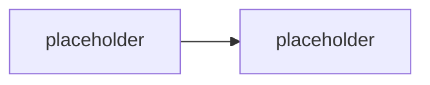
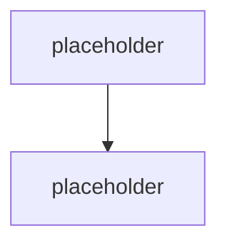

# Událostmi řízená orchestrace & hosting

> Typ: povinný · Den: 4 · Odhad: **130 min** (60 výklad + 70 lab) · Publikum: **vývojáři / architekti**
> Prostředí: viz [`../../environment.md`](../../environment.md) · Názvosloví: [`../../GLOSSARY.md`](../../GLOSSARY.md)

Kde agent běží, když už neběží na notebooku.

## Cíle
- Vybrat hosting: **Azure Functions vs. Logic Apps vs. Durable Functions vs. Foundry
  Agent Service** — a rozhodnutí odůvodnit.
- Rozumět řetězení volání modelu a nástrojů v dlouhých, stavových operacích.
- Navrhnout **timeout a retry patterny** pro agenta, který je závislý na modelu a na API.
- Vědět, co znamená **odolnost** u agenta (a proč „zkusím to znovu" není strategie).

## Výklad

### Co hosting agenta vlastně řeší

<!-- TODO: agent je HTTP endpoint + stav + volani modelu. Hosting resi: dostupnost, skalovani,
     stav mezi turny, dlouhotrvajici operace, naklady v necinnosti. -->

### Čtyři volby

<!-- TODO: rozhodovaci tabulka.
     Functions: kratke, event-driven, consumption, cold start.
     Logic Apps: integrace bez kodu, konektory, malo kodu = malo kontroly.
     Durable: dlouhe stavove orchestrace, fan-out/fan-in, persistence stavu.
     Foundry Agent Service: hostovany agent, publikovatelny do M365 Copilotu a Teams. -->

### Foundry Agent Service — hostovaná varianta

<!-- TODO: kdy ma smysl nehostovat sam. Publikace Foundry agentu do M365 Copilotu a Teams
     je GA od 06/2026 — jedna governed pipeline misto rebuildu per surface. -->

> [!IMPORTANT] Názvosloví
> **Azure AI Foundry → Microsoft Foundry.** Dokumentace ale stále žije pod
> `learn.microsoft.com/azure/foundry/` — brand se přejmenoval, URL a backend zůstaly.

### Řetězení volání modelu a nástrojů

<!-- TODO: kdy operace prestane byt jeden turn (dlouhe zpracovani, cekani na cloveka,
     davkove ulohy). Vzory: potvrzeni uzivateli hned + prace na pozadi + notifikace. -->

### Timeout a retry patterny

<!-- TODO: timeout na model, timeout na nastroj, timeout na cely turn — tri rozne veci.
     Retry jen u transientnich chyb (navaznost na D2 Graph 429/Retry-After).
     Idempotence akci: CreateTicket dvakrat = dva tikety? -->

## Klíčové rozlišení
- **Functions** (krátké, event-driven) vs. **Durable** (dlouhé, stavové) vs. **Logic Apps**
  (integrace, málo kódu) vs. **Foundry Agent Service** (hostovaný agent).
- **Workflow v Agent Frameworku** (orchestrace v procesu, viz D3) vs. **Durable orchestrace**
  (persistence a hosting).
- **Timeout modelu** vs. **timeout nástroje** vs. **timeout turnu** — tři různé limity.
- **Retry** (transientní chyba) vs. **idempotence** (co když retry projde dvakrát).

## Naše prostředí

**Instruktorské demo** — vyžaduje Azure subscription, kterou studenti pod baseline
`spdemo.online` + PAYG nemají (viz matice v [`../../environment.md`](../../environment.md)).
Studentská část je **návrhová + lokální**: timeout a idempotence se implementují a testují
lokálně, bez Azure.

## Lab
Viz [`lab-hosting-and-resilience.md`](lab-hosting-and-resilience.md).

## Nosná linka
Support Asistent získává **explicitní timeouty na všech třech úrovních** a **idempotentní
`CreateTicket`**. Student navíc rozhodne a odůvodní, kam by agenta nasadil — vstup do capstonu.

## Zdroje (Microsoft)
- [Azure Functions — overview](https://learn.microsoft.com/en-us/azure/azure-functions/functions-overview)
- [Durable Functions — overview](https://learn.microsoft.com/en-us/azure/azure-functions/durable/durable-functions-overview)
- [Logic Apps — overview](https://learn.microsoft.com/en-us/azure/logic-apps/logic-apps-overview)
- [Foundry Agent Service](https://azure.microsoft.com/en-us/products/ai-foundry/agent-service)
- [Build and run agents at scale with Microsoft Foundry](https://devblogs.microsoft.com/foundry/agent-service-build2026/)

## Stav produktu / delta

> [!WARNING] Ověřit k datu běhu — stav k 2026-08.
> Rozsah publikace **Foundry agentů do Microsoft 365 Copilotu a Teams** (GA 06/2026)
> a hostingové plány Functions se mění. Ceny neuvádět bez ověření na aktuálním pricing page.
