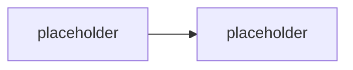

# Agenti v Marketplace — podmínky publikace

> Typ: povinný · Den: 4 · Odhad: **50 min** (35 výklad + 15 case study) · Publikum: **vývojáři / architekti**
> Prostředí: viz [`../../environment.md`](../../environment.md) · Názvosloví: [`../../GLOSSARY.md`](../../GLOSSARY.md)

Org katalog byl minulý blok. Tenhle je o druhé cestě: **komerční distribuce agenta přes
Microsoft Marketplace / Agent Store** — co všechno musí být splněno, než tam agent smí,
a jak proces reálně vypadá. Case study: **Normiqa Navigator**, publikovaný agent autora
kurzu — ne slide, ale skutečný listing se skutečnou validační historií.

## Cíle

- Znát **distribuční cesty agenta**: org katalog (D4 blok 1) vs. Marketplace / Agent Store —
  jiný proces, jiné schvalování, jiné publikum.
- Znát **podmínky publikace**: Partner Center účet, validační politiky pro agenty,
  požadavky na manifest, popis, ikony, privacy/terms, podporu.
- Rozumět **procesu review** — co validace kontroluje, jak dlouho trvá, co jsou nejčastější
  důvody zamítnutí.
- Vidět reálný případ end-to-end (Normiqa Navigator): od balíčku po listing.

## Výklad

### Dvě distribuce, dva světy

<!-- TODO: org katalog (admin schvaluje, interni uzivatele) vs Marketplace/Agent Store
     (Microsoft validuje, kdokoli). Monetizace zminit, nezabihat. -->

### Podmínky, které musí být splněny

<!-- TODO: enumerovat proti aktualni dokumentaci: Partner Center ucet a jeho overeni,
     validacni politiky pro agenty (manifest, popis schopnosti, ikony, privacy policy,
     terms of use, support kontakt), technicke pozadavky (auth, chybove stavy).
     NEVYMYSLET z pameti -- overit na learn pred behem. -->

### Case study — Normiqa Navigator

<!-- TODO: instruktorske demo: listing v AppSource/Agent Store, co validace chtela,
     kolik kol review, jak dlouho trvalo, co bylo zamitnuto a proc. Autenticky material
     autora -- data z Partner Center ukazovat bez citlivych udaju (trzby, zakaznici). -->

## Klíčové rozlišení

- **Org katalog** (admin tenant, interní) vs. **Marketplace/Agent Store** (Microsoft
  validace, veřejné) — dva procesy, ne jeden se dvěma tlačítky.
- **Validace ≠ certifikace** — projít store validací neznamená mít Microsoft 365
  certifikaci aplikace; rozlišit úrovně důvěry.
- **Publikace deklarativního agenta vs. custom engine agenta** — jiné požadavky
  (custom engine přidává hosting a endpoint, který validace prověřuje).
- Case study je **ilustrace procesu**, ne produktová prezentace — pravidla kurzu
  o vendor-neutralitě jinak platí dál.

## Naše prostředí

**Instruktorské demo** — Partner Center a listing ukazuje instruktor z vlastního účtu.
Studenti bez Partner Center účtu; deliverable je checklist podmínek, ne vlastní publikace.

## Lab

Viz [`lab-marketplace-checklist.md`](lab-marketplace-checklist.md).

## Nosná linka

Support Asistent je interní agent — do store nemíří. Blok odpovídá na otázku, **co by se
muselo změnit, kdyby měl**: checklist rozdílů mezi „funguje v mém tenantu" a „smí do
Marketplace" je vstup do capstone roadmapy.

## Zdroje (Microsoft)

- [Publish agents for Microsoft 365 Copilot](https://learn.microsoft.com/en-us/microsoft-365/copilot/extensibility/publish)
- [Teams Store validation guidelines](https://learn.microsoft.com/en-us/microsoftteams/platform/concepts/deploy-and-publish/appsource/prepare/teams-store-validation-guidelines)
- [Partner Center — commercial marketplace](https://learn.microsoft.com/en-us/partner-center/marketplace-offers/)

## Stav produktu / delta

> [!WARNING] Ověřit k datu běhu — stav k 2026-08.
> Validační politiky pro agenty i podoba **Agent Store** se mění po měsících — sekci
> „Podmínky" enumerovat proti aktuální dokumentaci těsně před během. Ověřit i aktuální
> stav listingu Normiqa Navigator (ať demo ukazuje živý stav, ne screenshot).
