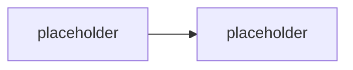

# Orchestry — third-party alternativa governance

> Typ: povinný · Den: 4 · Odhad: **35 min** (25 výklad + 10 srovnání) · Publikum: **vývojáři / architekti**
> Prostředí: viz [`../../environment.md`](../../environment.md) · Názvosloví: [`../../GLOSSARY.md`](../../GLOSSARY.md)

Agent 365 není jediná odpověď na governance otázku. **Orchestry** je third-party
governance vrstva nad M365 — a tenhle blok učí, jak vyhodnotit alternativu k Microsoft
first-party nástroji: co pokrývá, co ne, a kdy dává v blízkém okolí M365 smysl.

> [!IMPORTANT] Third-party obsah
> Jediný blok kurzu postavený na non-Microsoft produktu. Zdrojem je dokumentace vendora
> (orchestry.com), ne learn.microsoft.com — fakta o produktu ověřovat u vendora před
> každým během. Blok je srovnávací, ne implementační.

## Cíle

- Znát **Orchestry** jako third-party governance vrstvu nad M365 a její vztah
  k agentnímu prostoru.
- Umět **strukturovaně srovnat** first-party (Agent 365) a third-party governance:
  rozsah, identita, licencování, lock-in, roadmap riziko.
- Odnést si **rozhodovací rámec** „kdy Microsoft first-party a kdy third-party" —
  použitelný i mimo governance.

## Výklad

### Co Orchestry řeší

<!-- TODO: enumerovat proti aktualni dokumentaci vendora: workspace governance
     (provisioning, lifecycle, reporty) a aktualni pokryti agentniho prostoru.
     NEVYMYSLET -- rozsah agent governance u Orchestry overit pred behem,
     produkt se vyviji rychle. -->

### Srovnání s Agent 365

<!-- TODO: srovnavaci tabulka: co governuje (agenti vs workspaces), identita
     (Entra Agent ID -- ma k nemu third-party pristup?), licencni model
     ($15/user/mes u Agent 365 vs model vendora), hloubka integrace, lock-in,
     roadmap riziko na obe strany. -->

### Rozhodovací rámec first-party vs. third-party

<!-- TODO: kriteria: pokryti potreby, cena, rychlost inovaci vendora vs Microsoftu,
     co se stane kdyz Microsoft funkcionalitu dozene (typicky konec kategorie),
     compliance pozadavky zakaznika. -->

## Klíčové rozlišení

- **Agent 365** (first-party: registry, Entra Agent ID, integrace s M365 admin) vs.
  **Orchestry** (third-party vrstva) — jiná hloubka přístupu k platformě, jiné riziko.
- **Governance agentů** vs. **governance workspaces** — Orchestry historicky druhé;
  aktuální pokrytí prvního ověřit u vendora.
- Third-party governance **nemá Entra Agent ID** pod kontrolou — identita agentů zůstává
  first-party doména; third-party přidává procesní vrstvu nad ní.
- Rozhodnutí není náboženské — je to **rozsah + cena + riziko**, a mění se s roadmapou obou stran.

## Naše prostředí

**Instruktorské demo / výklad** — Orchestry vyžaduje vlastní tenant instalaci a licenci;
pod baseline `spdemo.online` se neukazuje živě, pokud instruktor nemá trial. Srovnávací
tabulka funguje i bez živého produktu.

## Lab

Bez samostatného labu — srovnávací tabulka se staví společně v rámci bloku (10 min)
a je deliverable do capstonu.

## Nosná linka

Support Asistent je od minulého bloku instrumentovaný do Agent 365. Tenhle blok přidává
otázku do capstone architektury: **stačí first-party governance, nebo zákazník potřebuje
třetí stranu — a proč?**

## Zdroje

- [Orchestry — dokumentace vendora](https://www.orchestry.com/) *(third-party; výjimka
  z pravidla Microsoft-only zdrojů — viz marker výše)*
- [Microsoft Agent 365 — overview](https://learn.microsoft.com/en-us/microsoft-agent-365/) *(srovnávací baseline)*

## Stav produktu / delta

> [!WARNING] Ověřit k datu běhu — stav k 2026-08.
> Rozsah agent governance u **Orchestry** ověřit u vendora před každým během — third-party
> roadmapa se mění rychleji než Microsoft dokumentace a tento blok nesmí učit zastaralé
> srovnání. Zároveň ověřit aktuální stav Agent 365 (druhá strana tabulky).
