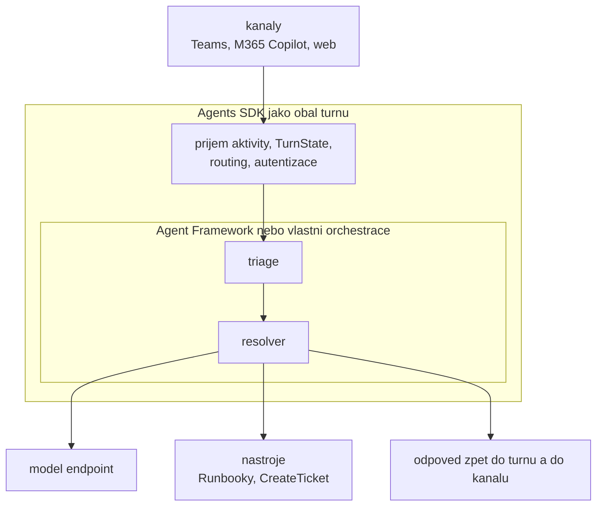
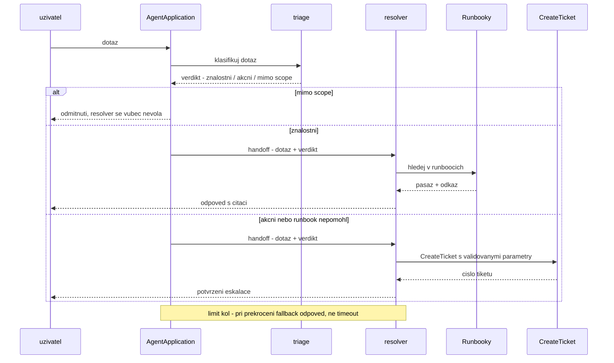

# Microsoft Agent Framework, workflows & multi-agent

> Typ: povinný — **informativní blok** · Den: 5 · Odhad: **35 min** · Publikum: **vývojáři / architekti**
> **Bez labu a bez dema** (rozhodnuto 2026-08-27). Blok dává mapu vrstev a rozhodnutí,
> ne prsty na klávesnici: kde končí SDK a začíná orchestrace, kdy multi-agent ANO/NE,
> co je A2A — a jako druhá polovina **Foundry Agent Service** jako PaaS větev.
> Lab [`lab-multi-agent-triage.md`](./lab-multi-agent-triage.md) zůstává k samostudiu.
> Prostředí: viz [`../../environment.md`](../../environment.md) · Názvosloví: [`../../GLOSSARY.md`](../../GLOSSARY.md)

> [!IMPORTANT] Největší doplněk proti katalogové osnově
> **Microsoft Agent Framework** (sloučení Semantic Kernel a AutoGen) v publikované osnově
> **není vůbec** — ani multi-agent orchestrace, ani A2A. Přitom je to vrstva, kterou pro-code
> tým nad Agents SDK reálně používá, jakmile jeden prompt přestane stačit.

> [!WARNING] Jazyková výjimka kurzu (stav k 2026-08)
> Agent Framework existuje jen v **C# a Pythonu** — JS/TS SDK nemá. Pro kurz, který jede
> v TypeScriptu, to je **rozhodovací fakt, ne technologie k osahání**: volba jazyka
> zužuje dostupný stack. Proto je blok informativní a demo se nedělá — ukazovat C# kód
> publiku, které v něm psát nebude, je ztráta času.
> Kdo chce orchestraci vidět v TS, má ji v labu k samostudiu: staví se tam ručně
> nad Agents SDK.

## Cíle
- Vědět, kde končí Agents SDK a začíná orchestrace — a proč to jsou dvě vrstvy.
- Vidět **Microsoft Agent Framework** v akci (instruktorské demo, C#) a umět říct,
  co dává navíc proti ruční orchestraci.
- Rozdělit úlohu na víc agentů (**triage + resolver**, ručně v TS) a vědět, kdy to **nedělat**.
- Rozumět **A2A** a orchestračním vzorům (sekvence, fan-out/fan-in, handoff, supervizor).

## Výklad

### Dvě vrstvy, ne konkurence

- **Agents SDK** = transport, stav (`TurnState`), routing aktivit, autentizace.
  Je **AI-agnostické**: neví, jaký model voláš, ani jestli vůbec nějaký voláš. Echo agent
  z [`../../agents-sdk-core/`](../../day-3/agents-sdk-core/) je toho důkaz.
- **Agent Framework** = orchestrace: víc agentů, workflows, handoff, sdílený stav mezi
  kroky. Nezná kanály ani aktivity a nezajímá ho, odkud zpráva přišla.
- **Framework běží uvnitř SDK aplikace.** `AgentApplication` přijme aktivitu, handler
  turnu předá řízení orchestraci, výsledek se vrátí zpět do turnu a odejde do kanálu.
  Není to alternativa k SDK — je to jeho vnitřek.
- Otázka „SDK, **nebo** Framework?" je špatně položená. Správně zní: *stačí mi jeden prompt
  v handleru, nebo potřebuju orchestraci?* SDK je v obou případech.
- **Bez Frameworku to jde taky** — orchestrace je pak prostě tvůj kód. Přesně to dělá
  dnešní lab v TypeScriptu.

### Lineage — odkud Agent Framework přišel

- **Semantic Kernel** přinesl nástroj/funkci jako **popsaný kontrakt** pro model, abstrakci
  nad chat completion a filtry kolem volání. **AutoGen** přinesl myšlenku víc agentů, kteří
  spolu konverzují, a vzory jejich řízení. Agent Framework je jejich sloučení.
- **Co si student přenese**: koncepty. Nástroj se pořád popisuje schématem, orchestrace je
  pořád o rolích a předávání řízení, limit kol je pořád povinný.
- **Co už platí jinak**: názvy typů a balíčků a způsob zapojení do hostitelské aplikace.
  Starší tutoriál na SK nebo AutoGen se **nedá přepsat 1:1**.
- Praktické pravidlo pro rešerši: **blogpost starší než sloučení je koncepčně použitelný,
  kódově ne.** Držet se Learn stránky Agent Frameworku, ne prvního výsledku ve vyhledávání.

> [!IMPORTANT] Názvosloví
> **Semantic Kernel + AutoGen → Microsoft Agent Framework.** Ve starších tutoriálech,
> blogpostech a Stack Overflow odpovědích potkají studenti oba původní názvy.

### Kdy víc agentů — a kdy je to chyba

**Výchozí stav je jeden agent.** Multi-agent je odchylka, kterou musíš obhájit — ne meta,
ke které se vývoj přirozeně posouvá.

| Signál v zadání | Rozdělit? |
|---|---|
| jasně oddělené role s různým „co umí" | **ano** |
| různá oprávnění na krok (čtení vs. zápis) | **ano** — a je to bezpečnostní argument |
| různé modely (levný klasifikátor + drahý resolver) | **ano** — a je to nákladový argument |
| dlouhé workflow s kroky, které přežijí turn | ano, ale řeší to hosting (D4) |
| jeden dobře napsaný prompt to zvládne | **ne — nejčastější případ** |
| „bude to modernější / pokročilejší" | ne |

**Cena rozdělení** — každá položka je měřitelná a v labu se měří:

- **Latence**: sériové kroky se sčítají, uživatel čeká na oba.
- **Tokeny**: každý agent má vlastní systémový prompt a vlastní kontext. Není to dvojnásobek,
  je to víc.
- **Debug**: chyba může být v klasifikaci i v odpovědi. Bez jednoho korelačního ID přes celý
  průchod je dohledání drahé.
- **Audit**: víc identit, víc volání, víc míst, kde padne rozhodnutí.

Nejčastější správný kompromis: **jeden agent + deterministický kód** pro rozhodnutí.
Klasifikace není vždy práce pro model — `if` je levnější, rychlejší a auditovatelný.

### Orchestrační vzory

| Vzor | Kdy | Cena | Jak se debuguje |
|---|---|---|---|
| **Sekvence** | pevné pořadí kroků (klasifikuj → odpověz) | latence se sčítá | nejsnáz — lineární stopa |
| **Fan-out / fan-in** | nezávislé dílčí dotazy, agregace výsledku | tokeny za všechny větve, nutná agregace | hůř — nedeterministické pořadí výsledků |
| **Handoff** | agent předá řízení druhému i s kontextem | riziko ztráty kontextu při předání | středně — sleduje se obsah handoffu |
| **Supervizor / worker** | supervizor rozhoduje, kdo pracuje dál a kdy skončit | nejdražší — supervizor běží v každém kole | nejhůř — bez tvrdého limitu kol neřešitelné |

- **Náš scénář je handoff**: triage klasifikuje a předá resolveru **typovaný výsledek**.
  Volba je záměrná — nejlevnější na debug a nejlépe se z ní měří cena rozdělení.
- **Limit kol je povinný u každého vzoru.** Bez něj je smyčka mezi agenty otevřený účet
  za tokeny a jediný důvod, proč lab hlídá strop volání modelu.
- **Handoff nese kontrakt, ne konverzaci.** Předávat volný text znamená vyrobit si druhý
  prompt injection vektor uvnitř vlastní aplikace (D3 [`../middleware-policy/`](../../day-4/middleware-policy/)).
- Debug pravidlo pro všechny vzory: **jedno korelační ID přes celý průchod**, logované
  u každého kroku. Je to zároveň vstup do telemetrie a evaluace v D5.

### Workflows

- **Workflow = stavová orchestrace uvnitř procesu**: definované kroky, přechody mezi nimi
  a stav sdílený napříč kroky. Žije v paměti tvé aplikace.
- Má smysl, jakmile orchestrace přestane být „dvě kola za sebou" a začne mít větve,
  opakování a podmínky — a ty je nechceš mít rozeseté v `if`ech uvnitř handleru turnu.
- **Strop je tvrdý**: proces spadne, restartuje se nebo se škáluje na druhou instanci →
  **stav je pryč**. Workflow sám o sobě restart nepřežije.
- Kde to vadí (dlouhá operace, čekání na člověka, dávka), potřebuješ orchestraci
  **s persistencí a hostingem** — Durable Functions a durable fronta, viz
  [`../../event-driven-hosting/`](../event-driven-hosting/).
- Věta do zkoušky i k zákazníkovi: **workflow řeší tvar orchestrace, Durable řeší její
  přežití.**

### A2A

- **A2A je protokol, ne volání funkce.** Agent nedostane referenci na objekt — mluví
  s druhým agentem přes definovaný povrch: popis schopností, zprávy, kontext úlohy.
  Odpověď může přijít později, může selhat, může přijít od jiné verze protějšku.
- **Kdy to potřebuješ**: agent jiného týmu, jiného systému, jiného vendora nebo jiného
  tenantu — tam, kde druhého agenta nemůžeš prostě naimportovat.
- **Kdy ne**: dva agenti v jednom procesu (přesně náš lab). Tam je protokol jen režie navíc.
- **Důsledky pro identitu a audit** jsou nosný bod: volaný agent musí vědět, **kdo volá
  a jménem koho**. To není parametr zprávy — to je identita, tedy
  **Microsoft Entra Agent ID** a registry v Agent 365
  ([`../../agent-365-governance/`](../agent-365-governance/)).
- Otázka, na kterou zákazník potřebuje odpověď dřív, než A2A schválí: *když agent A požádá
  agenta B o data uživatele, čí oprávnění se uplatní?* Bez odpovědi je A2A přímá cesta
  k confused deputy problému ([`../middleware-policy/`](../../day-4/middleware-policy/)).

### Foundry Agent Service — PaaS větev mapy

> Popisná sekce, **bez dema a bez labu**. Cílem je, aby student uměl říct, kdy tuhle
> cestu zákazníkovi nabídnout a co za ni platí — ne aby v ní uměl stavět.

**Co to je.** Spravovaná služba v Azure, kde agenta **nehostuješ ty, ale platforma**.
Dodáváš instrukce, nástroje a znalosti; Foundry řeší běh, škálování, stav konverzace
a integrace. Proti custom enginu z Agents SDK je to posun o patro výš: neřešíš App Service,
Container Apps ani vlastní endpoint.

**Kdy to dává smysl.** Když platí aspoň jedno:

- Agent má žít **mimo hranici Microsoftu 365** — vlastní web, aplikace, jiný kanál.
- Potřebuješ **modely a nástroje z Azure ekosystému** (vlastní deploymenty, Azure AI Search,
  vlastní data mimo tenant) a nechceš k nim stavět most z M365.
- Máš **platformní tým**, který už Azure spravuje. Foundry Agent Service je jeho jazyk;
  Agents SDK je jazyk vývojového týmu.

**Co za to platíš.**

- **Druhý control plane.** Foundry Control Plane a Agent 365 jsou dvě různá místa, kde se
  na agenty díváš — Foundry z pohledu platformního týmu v Azure, Agent 365 z pohledu IT
  a security v M365. Synchronizace existuje, ale je to rozhodnutí, ne samozřejmost.
- **Azure subscription a její náklady** — inference, hosting, storage. To je jiná peněženka
  než Copilot licence i než Copilot Credits.
- **Identita agenta** se řeší přes Entra Agent ID, stejně jako u instrumentovaného
  custom enginu — ale registruje se jinou cestou.

**Vztah k tomu, co jsme stavěli.** Support Asistent je custom engine nad Agents SDK:
vlastní hosting, vlastní model endpoint, vlastní instrumentace. Kdyby měl běžet
i mimo Teams a M365 Copilot, je Foundry Agent Service první cesta, kterou zvážit —
a rozhodnutí, které patří do capstonu jako varianta, ne jako plán B.

> [!WARNING] Ověřit k datu běhu
> Foundry se přejmenovává a mění rychle (Azure AI Studio → Azure AI Foundry → Microsoft
> Foundry). Před během ověřit aktuální název služby, rozsah publikace agentů do M365
> Copilotu a Teams, a jestli se něco nezměnilo na vztahu Foundry Control Plane ↔ Agent 365.
> Základ Foundry pro tenhle kurz je v [`../../day-3/agents-sdk-core/explainer-foundry-basics.md`](../../day-3/agents-sdk-core/explainer-foundry-basics.md).

**Věta do zákaznického rozhovoru:** *„Agents SDK když agent žije uvnitř Microsoftu 365
a máte vývojový tým. Foundry Agent Service když má žít i mimo něj a máte platformní tým
v Azure. Rozdíl není v tom, co agent umí, ale kdo ho bude provozovat."*

## Klíčové rozlišení
- **Agents SDK** (transport/stav/routing) vs. **Agent Framework** (orchestrace) — SDK není orchestrátor.
- **Řetězení promptů** (jeden agent, víc kol) vs. **multi-agent** (víc agentů, víc identit).
- **Workflow** (orchestrace uvnitř procesu) vs. **Durable Functions** (orchestrace s persistencí
  a hostingem, viz D4).
- **A2A** (protokol mezi agenty) vs. **tool call** (agent volá nástroj).

## Naše prostředí

Hands-on (TS orchestrace), bez tenantu — potřebuje jen **model endpoint**; Framework část
je instruktorské demo v C# (jediné místo kurzu, kde instruktor potřebuje .NET SDK).
Pozor: multi-agent násobí volání modelu, tedy tokeny. Nastavit v labu limit kol.

## Lab — samostudium

[`lab-multi-agent-triage.md`](./lab-multi-agent-triage.md) staví triage + resolver ručně
v TypeScriptu nad Agents SDK a **měří, co rozdělení stálo** (latence, tokeny, obtížnost
debugu). V běhu se nejede — kdo si ho projde doma, přinese si do capstonu vlastní čísla
místo převzatých.
## Nosná linka
Support Asistent se rozděluje na **triage** (klasifikuje dotaz, rozhoduje o cestě) a
**resolver** (odpovídá z runbooků nebo eskaluje). Student na svém agentovi uvidí, co tím
získal — a **co tím zaplatil** (latence, tokeny, horší debug).

## Zdroje (Microsoft)
- [Microsoft Agent Framework — overview](https://learn.microsoft.com/en-us/agent-framework/overview/) (agents vs. workflows, nástupce SK + AutoGen)
- [Use Semantic Kernel and Agent Framework in Agents SDK](https://learn.microsoft.com/en-us/microsoft-365/agents-sdk/using-semantic-kernel-agent-framework)
- [What is the Microsoft 365 Agents SDK](https://learn.microsoft.com/en-us/microsoft-365/agents-sdk/agents-sdk-overview)
- [Microsoft 365 multi-agent workflow with Microsoft Agent Framework](https://techcommunity.microsoft.com/blog/appsonazureblog/microsoft-365-multi-agent-workflow-with-microsoft-agent-framework/4514164)

## Stav produktu / delta

> [!WARNING] Ověřit k datu běhu — stav k 2026-08.
> Nejrychleji se vyvíjející vrstva celého stacku. Před **každým** během ověřit: aktuální
> názvy typů a balíčků Agent Frameworku, stav podpory **A2A** v Agents SDK, a hlavně
> **jestli už Framework nemá JS/TS SDK** — pokud ano, lab přepnout z ruční orchestrace
> na Framework a demo zrušit. Přebuildovat C# demo i TS `solution/`.
