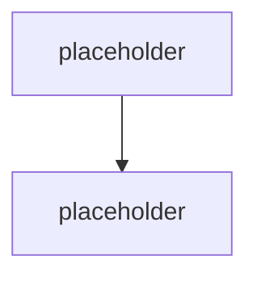

# Capstone architektura & roadmapa

> Typ: povinný · Den: 5 · Odhad: **elastický 60–120 min** (rozpad viz [`instructor-notes.md`](instructor-notes.md)) · Publikum: **vývojáři / architekti**
> Prostředí: viz [`../../environment.md`](../../environment.md) · Názvosloví: [`../../GLOSSARY.md`](../../GLOSSARY.md)

Ne stavba, ale **obhajoba**. Student odchází s architekturou, kterou umí prodat internímu
security týmu i zákazníkovi.

## Cíle
- Sestavit **end-to-end architekturu** agenta z artefaktů celého týdne.
- Předložit **KPI a evaluační matici** — čím se úspěch měří a jaké jsou prahy.
- Umět obhájit **volbu cesty** (deklarativní / custom engine / Copilot Studio / Foundry).
- Znát reálné **další kroky** — certifikace a témata, ne marketingové hesla.

## Výklad

### Z čeho se blueprint skládá

<!-- TODO: architektura (kanaly, orchestrace, knowledge, akce, hosting, identita, telemetrie),
     model hrozby a obranne vrstvy, nakladovy model, lifecycle a rollback, KPI matice,
     rozhodnuti a jejich odůvodneni. Vsechno uz student ma — tohle je konsolidace. -->

### KPI a evaluační matice

<!-- TODO: rozdil mezi technickou metrikou (pass rate, groundedness, latence, tokeny)
     a business KPI (vyresene dotazy bez cloveka, cas do odpovedi, naklad na dotaz,
     spokojenost). Bez business KPI projekt neprojde u sponzora. -->

### Rozhodnutí, která musí být v dokumentu

<!-- TODO: checklist rozhodnuti z celeho tydne, kazde s odůvodnenim:
     cesta tvorby (D1), retrieval vlastni ano/ne (D2), multi-agent ano/ne (D3),
     hosting (D4), instrumentace do Agent 365 (D4), prahy pro promotion (D4/D5),
     obranne vrstvy (D5), nakladovy strop (D5). -->

### Další kroky — certifikace

> [!IMPORTANT] Katalogová osnova jmenuje retirované zkoušky
> Publikovaná osnova uvádí jako další kroky **AI-102** a **AZ-204**. Obě jsou retirované:
> **AI-102 skončila 2026-06-30**, **AZ-204 skončila 2026-07-31**. Aktuální cesty:
>
> | Místo | Nově | Zaměření |
> |---|---|---|
> | AI-102 | **AI-103** | Azure AI Apps and Agents Developer Associate — generativní a agentní architektury |
> | AZ-204 | **AI-200** | Cloud Developer — kód a observability |
>
> Ověřit k datu běhu na [Exam and assessment lab retirement](https://learn.microsoft.com/en-us/credentials/support/retired-certification-exams).

Celou aktuální certifikační mapu ukázat na oficiálním
[Microsoft Certification Posteru (PDF)](https://arch-center.azureedge.net/Credentials/Certification-Poster_en-us.pdf) —
studenti si odnášejí odkaz; projít větev AI/agentních certifikací a nejnovější AI kurzy
v oficiálním kurikulu.

> [!WARNING] Ověřit k datu běhu
> Poster se vydává v nových edicích — před během ověřit, že URL vede na aktuální verzi,
> a projít, které AI zkoušky a kurzy od minulého běhu přibyly nebo se přejmenovaly.

### Další kroky — témata

<!-- TODO: multi-agent vzory do hloubky, MCP a vlastni konektory, Foundry Agent Service,
     Agent 365 governance z pohledu IT, A2A, SharePoint Copilot Apps po GA.
     Odkaz na navazujici kurzy GOPAS: SPFx kurzy (most pres spfx-copilot-apps)
     a dalsi AI kurzy dle aktualniho katalogu. -->

## Klíčové rozlišení
- **Technická metrika** (pass rate, latence) vs. **business KPI** (náklad na dotaz, vyřešeno
  bez člověka) — sponzor rozhoduje podle druhé.
- **Architektura** (jak to je postavené) vs. **rozhodnutí** (proč právě takhle) — bez druhého
  to není blueprint, jen diagram.
- **Blueprint** (design dokument) vs. **implementace** — capstone je první.

## Naše prostředí

Hands-on, bez tenantu a bez modelu — konsolidace a prezentace. Student pracuje se svými
artefakty z celého týdne.

## Lab
Viz [`lab-capstone-blueprint.md`](lab-capstone-blueprint.md).

## Nosná linka
Support Asistent je hotový. Student ho **prezentuje** — architekturu, rozhodnutí, KPI,
model hrozby, náklady a lifecycle. To je deliverable, se kterým odchází ke zákazníkovi.

## Zdroje (Microsoft)
- [Exam and assessment lab retirement](https://learn.microsoft.com/en-us/credentials/support/retired-certification-exams)
- [Evaluation of generative AI applications](https://learn.microsoft.com/en-us/azure/ai-foundry/concepts/evaluation-approach-gen-ai)
- [Microsoft Agent 365 SDK and CLI](https://learn.microsoft.com/en-us/microsoft-agent-365/developer/)
- [Choose the right tool to build a declarative agent](https://learn.microsoft.com/en-us/microsoft-365/copilot/extensibility/declarative-agent-tool-comparison)

## Stav produktu / delta

> [!WARNING] Ověřit k datu běhu — stav k 2026-08.
> **Certifikační cesty se mění po kvartálech** — AI-103 a AI-200 ověřit před **každým**
> během na stránce retirementů. Tohle je nejrychleji se kazící fakt v celém kurzu a zároveň
> nejviditelnější: student si ho odnáší jako doporučení.
