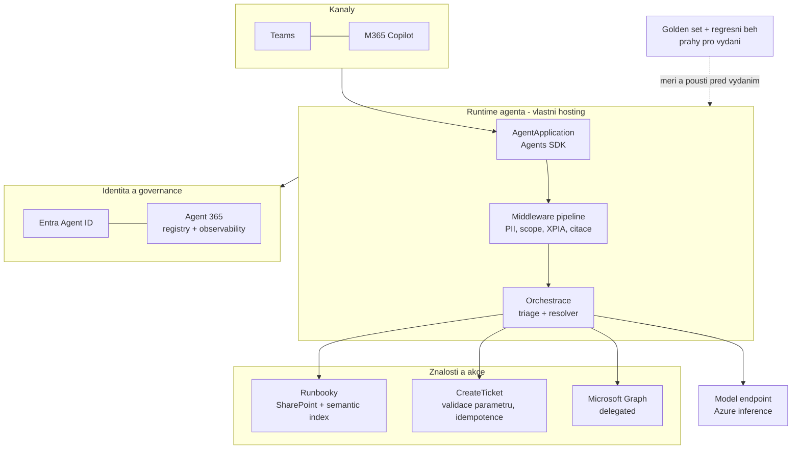

# Capstone architektura & roadmapa

> Typ: povinný · Den: 5 · Odhad: **elastický 60–120 min** (rozpad viz [`instructor-notes.md`](./instructor-notes.md)) · Publikum: **vývojáři / architekti**
> Prostředí: viz [`../../environment.md`](../../environment.md) · Názvosloví: [`../../GLOSSARY.md`](../../GLOSSARY.md)

Ne stavba, ale **obhajoba**. Student odchází s architekturou, kterou umí prodat internímu
security týmu i zákazníkovi.

## Cíle
- Sestavit **end-to-end architekturu** agenta z artefaktů celého týdne.
- Předložit **KPI a evaluační matici** — čím se úspěch měří a jaké jsou prahy.
- Umět obhájit **volbu cesty** (deklarativní / custom engine / Copilot Studio / Foundry).
- Znát reálné **další kroky** — certifikace a témata, ne marketingové hesla.

## Výklad

### Z čeho se blueprint skládá

| Část blueprintu | Co obsahuje | Odkud to student má |
|---|---|---|
| **Architektura** | kanály, `AgentApplication`, middleware, orchestrace (triage + resolver), knowledge, akce, hosting, identita, telemetrie | laby D2–D5 |
| **Model hrozby a obranné vrstvy** | XPIA přes obsah, exfiltrace přes app-only, scope agenta; co je v promptu a co v kódu | D3 `middleware-policy` |
| **Nákladový model** | tokeny na dotaz, tři peněženky (licence / kredity / inference), náklady hostingu v nečinnosti | D4 hosting + naměřené tokeny z evaluace |
| **Lifecycle a rollback** | verze manifestu vs. verze kódu, publikace a schválení, promotion dev → test, rollback | D4 `event-driven-hosting` |
| **KPI a evaluační matice** | technické metriky s prahy + business KPI, a jak se měří | D5 `evaluation-quality` |
| **Rozhodnutí s odůvodněním** | osm rozhodnutí týdne, každé s důvodem a s tím, co by ho změnilo | celý týden |

- **Nic z toho se dnes nevymýšlí.** Všechny podklady student má — capstone je konsolidace
  a obhajoba, ne stavba. Kdo dnes začne kódovat, nestihne to jediné, co má hodnotu.
- Rozsah: **jedna, maximálně dvě strany**. Blueprint, který nikdo nepřečte, není blueprint.
- Formát je záměrně ten, který se dá poslat zákazníkovi nebo internímu security týmu —
  ne prezentace o kurzu.

### KPI a evaluační matice

- **Technická metrika měří agenta**: pass rate na golden setu, groundedness, správnost
  volby nástroje, latence p95, tokeny na dotaz, chybovost akcí. Zdroj: evaluační běh
  a telemetrie.
- **Business KPI měří přínos**: podíl dotazů vyřešených **bez člověka**, čas do odpovědi
  proti dnešnímu supportu, náklad na vyřešený dotaz, objem eskalací, spokojenost uživatelů.
- **Bez business KPI projekt neprojde u sponzora.** Sponzor nekupuje groundedness 0,92 —
  kupuje „třetina opakovaných dotazů se vyřeší bez technika, za tolik a tolik měsíčně".
  Tohle je věta, kterou si mají studenti odnést doslova.
- Převodní pravidlo: ke každé technické metrice napiš, **jaké business číslo ovlivňuje**.
  Metrika, u které to nedokážeš, do matice nepatří.
- Ke každému KPI patří **jak a odkud se měří** (které pole telemetrie, který běh, která
  statistika helpdesku) a **práh**: kdy vydat, kdy opravit, kdy zastavit.

### Náklady a návratnost

- **Blueprint bez ceny za provoz není blueprint.** Číslo musí být odvozené z měření
  (`usage-log.jsonl` z D3/D4), ne z pocitu — a musí nést **datum a verzi ceníku**,
  protože ceny modelů se mění po týdnech.
- Nástroj: [**kalkulačka nákladů a návratnosti**](../perf-cost-lifecycle/roi-calculator.html)
  — otevře se dvojklikem z klonu, jede offline. Výchozí hodnoty jsou
  naměřené na Support Asistentovi během kurzu, ne modelové.
- Tři věci z měření, které se studentům nechtějí věřit — a mění, kde se optimalizuje:

  | Naměřeno | Důsledek |
  |---|---|
  | **78,5 %** faktury jsou reasoning tokeny | zkracování promptu je optimalizace nesprávného sloupce |
  | **12×** rozdíl v ceně téhož dotazu mezi běhy | rozpočet se plánuje z rozdělení, ne z průměru |
  | **0,2 %** ušetřila cache při 21% pokrytí vstupu | u reasoning modelu je vstup levný, cache je skoro k ničemu |

- **Kontrola reality u ROI:** úspora se přepočítává na úvazky. Když vyjde 0,2 FTE,
  neprojeví se v rozpočtu jako propuštěný člověk, ale jako kratší fronta — a tak se
  to má i prodávat. Podklad: [`../../perf-cost-lifecycle/explainer-obhajoba-modelu-a-roi.md`](../perf-cost-lifecycle/explainer-obhajoba-modelu-a-roi.md).

### Rozhodnutí, která musí být v dokumentu

| # | Rozhodnutí | Odkud | Kompromis, který se váží |
|---|---|---|---|
| 1 | **Cesta tvorby** — deklarativní / Copilot Studio / custom engine / Foundry | D1 `agent-landscape`, D2 `declarative-agents` | rychlost a governance zdarma vs. kontrola nad akcemi a auditem |
| 2 | **Vlastní retrieval ano/ne** | D2 grounding | relevance na míru vs. vlastní ACL model, refresh a údržba |
| 3 | **Multi-agent ano/ne** | D3 `agent-framework` | čistší role a lepší diagnostika vs. latence a tokeny navíc |
| 4 | **Hosting** — endpoint i orchestrace okolo něj | D4 `event-driven-hosting` | vlastnictví a kontrola vs. provoz a náklady v nečinnosti |
| 5 | **Instrumentace do Agent 365** | D4 `agent-365-governance` | práce navíc vs. agent, kterého IT pustí do produkce |
| 6 | **Prahy pro promotion** dev → test → prod | D4 / D5 | přísné prahy brzdí vydávání, volné pustí regresi |
| 7 | **Obranné vrstvy** — co v promptu, co v kódu, co ve scope | D3 `middleware-policy` | pohodlí vs. vynutitelnost |
| 8 | **Nákladový strop** — tokeny na dotaz, měsíční strop, co se stane při jeho dosažení | D5 · část D + podklad: [`explainer-obhajoba-modelu-a-roi.md`](../perf-cost-lifecycle/explainer-obhajoba-modelu-a-roi.md) | kvalita odpovědi vs. cena |

- U každého rozhodnutí **jedna věta odůvodnění** a **jedna věta „co by ho změnilo"**.
  Druhá věta je test, jestli šlo o rozhodnutí, nebo jen o zápis toho, co vyšlo v labu.
- **Rozhodnutí bez zamítnuté alternativy není rozhodnutí.** Zapsat i to, co jste nevybrali
  a proč — přesně na to se ptá zákazník, který má nabídku od konkurence.

### Další kroky — certifikace

> [!IMPORTANT] Katalogová osnova jmenuje retirované zkoušky
> Publikovaná osnova uvádí jako další kroky **AI-102** a **AZ-204**. Obě jsou retirované:
> **AI-102 skončila 2026-06-30**, **AZ-204 skončila 2026-07-31**. Aktuální cesty:
>
> | Místo | Nově | Zaměření |
> |---|---|---|
> | AI-102 | **AI-103** | Azure AI Apps and Agents Developer Associate — generativní a agentní architektury |
> | AZ-204 | **AI-200** | Azure AI Cloud Developer Associate — kód a observability |
>
> Ověřit k datu běhu na [Exam and assessment lab retirement](https://learn.microsoft.com/en-us/credentials/support/retired-certification-exams).
> Názvy ověřeny proti Certification Posteru (2026-08).

Celou aktuální certifikační mapu ukázat na oficiálním
[Microsoft Certification Posteru (PDF)](https://arch-center.azureedge.net/Credentials/Certification-Poster_en-us.pdf) —
studenti si odnášejí odkaz. Z agentní větve zmínit i navazující cesty:

- **AI-500 — Multi-Agent AI Solutions Expert** (k datu psaní **Beta**): expertní nadstavba
  přesně nad multi-agent obsahem D3 (`agent-framework`). Nejbližší pokračování pro toto
  publikum.
- **GH-600 — GitHub Agentic AI Developer** (k datu psaní **New**): agentní vývoj na straně
  GitHubu — dává smysl týmům, které už jedou GitHub Copilot a Actions.
- **AB-900 — Microsoft 365 Copilot and Agent Administration Fundamentals**: pro byznys
  a admin kolegy studentů. Společný jazyk pro rozhovor o governance a licencích, který
  studenti v tomto kurzu právě získali.
- Statusy **Beta / New** i názvy **ověřit k datu běhu** — beta zkoušky se přesouvají,
  přejmenovávají a někdy nedojedou do GA.

> [!WARNING] Ověřit k datu běhu
> Poster se vydává v nových edicích — před během ověřit, že URL vede na aktuální verzi,
> a projít, které AI zkoušky a kurzy od minulého běhu přibyly nebo se přejmenovaly.

### Další kroky — témata

- **Multi-agent vzory do hloubky** — handoff, supervizor, paralelní zpracování a **A2A**
  mezi agenty různých vlastníků; tam, kde tento kurz skončil u dvojice triage + resolver.
- **MCP a vlastní konektory** — synced vs. federated, vlastní MCP server nad interním
  systémem.
- **Foundry Agent Service** — hostovaný agent a publikační pipeline do Microsoft 365
  Copilotu a Teams.
- **Agent 365 z pohledu IT** — access reviews, lifecycle politiky, owner attestation;
  druhá strana toho, co jsme dělali z pohledu vývojáře.
- **SharePoint Copilot Apps po GA** — dnes Public Preview; sledovat, co se změní
  v manifestu a v hostingu.
- **Samostudijní moduly přímo v tomto repu**: vlastní retrieval, marketplace, výkon
  a náklady, third-party governance — přehled v [`../../self-study.md`](../../self-study.md).
- **Navazující kurzy GOPAS**: SPFx kurzy (most vede přes
  [`../../spfx-copilot-apps/`](../../day-4/spfx-copilot-apps/)) a další AI kurzy —
  konkrétní kódy ověřit v aktuálním katalogu k datu běhu.

## Klíčové rozlišení
- **Technická metrika** (pass rate, latence) vs. **business KPI** (náklad na dotaz, vyřešeno
  bez člověka) — sponzor rozhoduje podle druhé.
- **Architektura** (jak to je postavené) vs. **rozhodnutí** (proč právě takhle) — bez druhého
  to není blueprint, jen diagram.
- **Blueprint** (design dokument) vs. **implementace** — capstone je první.

## Naše prostředí

Hands-on, bez tenantu a bez modelu — konsolidace a prezentace. Student pracuje se svými
artefakty z celého týdne.

## Lab
Viz [`lab-capstone-blueprint.md`](./lab-capstone-blueprint.md).

## Nosná linka
Support Asistent je hotový. Student ho **sepíše a obhájí** — architekturu, rozhodnutí, KPI,
model hrozby, náklady a lifecycle. Ne před skupinou, ale u svého stolu, na jednu otázku. To je deliverable, se kterým odchází ke zákazníkovi.

## Zdroje (Microsoft)
- [Exam and assessment lab retirement](https://learn.microsoft.com/en-us/credentials/support/retired-certification-exams)
- [Evaluation of generative AI applications](https://learn.microsoft.com/en-us/azure/ai-foundry/concepts/evaluation-approach-gen-ai)
- [Microsoft Agent 365 SDK and CLI](https://learn.microsoft.com/en-us/microsoft-agent-365/developer/)
- [Choose the right tool to build a declarative agent](https://learn.microsoft.com/en-us/microsoft-365/copilot/extensibility/declarative-agent-tool-comparison)

## Stav produktu / delta

> [!WARNING] Ověřit k datu běhu — stav k 2026-08.
> **Certifikační cesty se mění po kvartálech** — AI-103 a AI-200 ověřit před **každým**
> během na stránce retirementů. Tohle je nejrychleji se kazící fakt v celém kurzu a zároveň
> nejviditelnější: student si ho odnáší jako doporučení.
