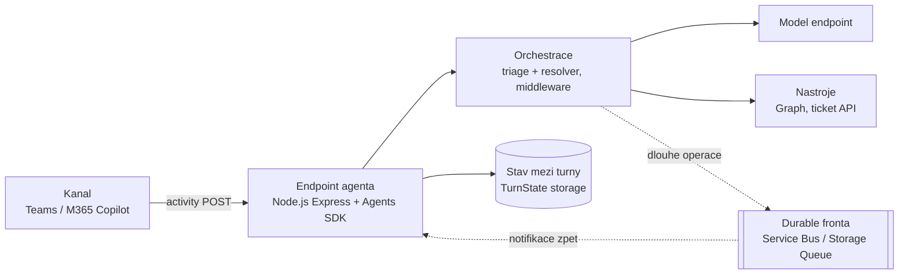
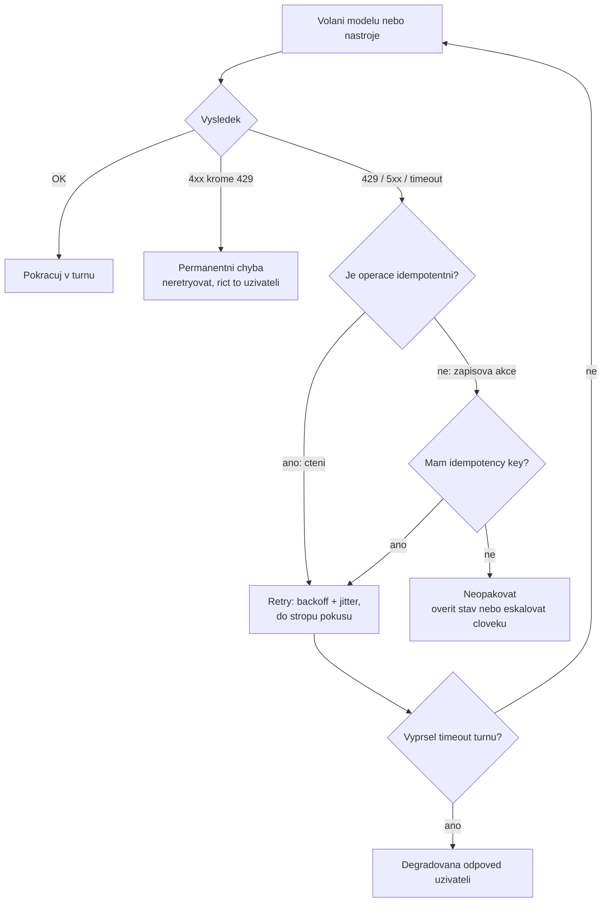
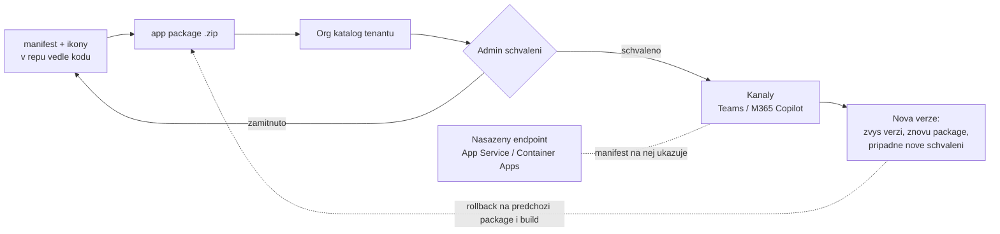

# Událostmi řízená orchestrace, hosting & publikace

> Typ: **samostudium** (vyřazeno z osnovy 2026-08-25) · Odhad: 60 min čtení · Publikum: **vývojáři / architekti**
> Prostředí: viz [`../../environment.md`](../../environment.md) · Názvosloví: [`../../GLOSSARY.md`](../../GLOSSARY.md)

> [!IMPORTANT] Tento modul se v běhu neodučí
> Vyřazen do samostudia při druhé rekalibraci (2026-08-25) — studenti nemají Azure
> subscription, takže blok byl stejně jen instruktorské demo. **Hosting v kostce**
> (kde běží endpoint agenta vs. orchestrace okolo něj) je složený do
> [`../agent-365-governance/`](../agent-365-governance/); timeouty, retry a idempotence
> zůstávají tady jako čtení. Přehled změn: [`../../self-study.md`](../../self-study.md).

Kde agent běží, když už neběží na notebooku — a jak se odtud dostane k uživatelům do kanálů.

## Cíle
- Rozlišit **dvě různé otázky**: kde běží **endpoint agenta** (App Service / Azure
  Container Apps — je to Node.js/Express aplikace) a kde běží **orchestrace okolo něj**
  (Functions / Durable / Logic Apps / Foundry Agent Service) — a rozhodnutí odůvodnit.
- Rozumět řetězení volání modelu a nástrojů v dlouhých, stavových operacích.
- Navrhnout **timeout a retry patterny** pro agenta, který je závislý na modelu a na API.
- Vědět, co znamená **odolnost** u agenta (a proč „zkusím to znovu" není strategie).
- Rozumět **manifestu custom engine agenta jako kontraktu** a publikovat hostovaného
  agenta do **Teams / Microsoft 365 Copilotu** — včetně verzování a rollbacku.

## Výklad

### Co hosting agenta vlastně řeší

- Custom engine agent je z pohledu provozu **HTTP endpoint**: kanál posílá aktivity POSTem
  na jednu URL a čeká na odpověď. Node.js/Express aplikace s Agents SDK, nic exotického.
- Ke zpracování aktivity ale patří i to, co samotný endpoint není: **stav mezi turny**
  (`TurnState`), **volání modelu** (pomalé a účtované) a **volání nástrojů** (Graph,
  mock ticket API).
- Hosting proto odpovídá na pět otázek: **dostupnost** (kdo drží endpoint živý),
  **škálování** (co při desítkách souběžných turnů), **stav mezi turny** (kde žije, když
  instance zmizí), **dlouhotrvající operace** (co když turn trvá déle, než kanál čeká),
  **náklady v nečinnosti** (agent, na kterého se nikdo neptá, přesto něco stojí).
- **Serverless stav nezruší.** In-memory `TurnState` přežije do prvního restartu nebo
  škálování na nulu — pak konverzace ztratí kontext uprostřed. Storage je rozhodnutí,
  ne detail.

### Dvě otázky, pět voleb

**Otázka 1 — kde běží endpoint agenta.** Je to **vždy běžící** Node.js (Express) aplikace,
která musí odpovědět, kdykoli kanál zavolá. Výchozí odpověď: **App Service** nebo **Azure
Container Apps**. Consumption Functions jsou pro samotný endpoint atypická volba — cold
start jde přímo do první odpovědi uživatele a stav mezi turny nemá kde být.

**Otázka 2 — kde běží orchestrace okolo agenta.** Teprve tady dává výběr smysl:

| Volba | Hodí se na | Cena rozhodnutí |
|---|---|---|
| **Azure Functions** | krátké event-driven kroky (webhook, notifikace, post-processing); consumption billing = v nečinnosti platíš skoro nic | cold start, limit doby běhu, stav si řešíš sám |
| **Logic Apps** | integrace bez kódu, konektorová krajina, schvalovací kroky | málo kódu = málo kontroly: horší validace, testy a diff v gitu |
| **Durable Functions** | dlouhé stavové orchestrace, fan-out/fan-in nad více zdroji, čekání na člověka | další runtime a další programovací model, který tým musí umět |
| **Foundry Agent Service** | řeší **obojí** — hostuje agenta i orchestraci, publikovatelný do M365 Copilotu a Teams | PaaS: vlastníš míň a platíš za pohodlí |

- **Katalogová osnova i většina blogů obě otázky slučují** do „kde hostovat agenta".
  Rozdělit je je celá pointa téhle sekce — jinak studenti nasadí agenta do consumption
  Functions a diví se první odpovědi.
- V tomto běhu je osa hostingu **referenční materiál k samostudiu** (studenti nemají Azure
  subscription). Živě se prochází rychle; čas se drží na timeouty a idempotenci, které
  platí bez ohledu na zvolený hosting.

### Foundry Agent Service — hostovaná varianta

- **Kdy nehostovat sám**: tým nemá provozní kapacitu (pohotovost, patchování, škálování);
  agentů bude víc a chcete jednu pipeline místo N nasazení; platformní tým už Azure
  spravuje a chce agenty vidět ve Foundry Control Plane.
- **Publikace Foundry agentů do Microsoft 365 Copilotu a Teams je GA od 06/2026** — jedna
  governed publikační pipeline místo rebuildu per surface. To je hlavní argument pro tuhle
  cestu u zákazníka, který chce agenta na víc povrchů.
- **Co tím ztrácíš**: hosting není tvůj (běh, verze runtime a provozní parametry řídí
  služba), jsi vázaný na Azure a na její model nasazení. Kód orchestrace zůstává tvůj,
  provoz ne.
- Rozhodnutí patří do stejné osy jako v D1: kdo to bude udržovat za dva roky. Odpověď
  „nikdo z týmu" mluví pro hostovanou variantu.

> [!IMPORTANT] Názvosloví
> **Azure AI Foundry → Microsoft Foundry.** Dokumentace ale stále žije pod
> `learn.microsoft.com/azure/foundry/` — brand se přejmenoval, URL a backend zůstaly.

### Řetězení volání modelu a nástrojů

- **Kdy operace přestane být jeden turn**: zpracování trvá déle, než kanál ochotně čeká;
  je potřeba čekat na člověka (schválení eskalace); jde o dávku (projít všechny runbooky
  a přegenerovat souhrn).
- **Vzor**: potvrdit uživateli hned („zakládám tiket, dám vědět") → práce na pozadí →
  **notifikace zpět do konverzace** (proaktivní zpráva na uloženou referenci konverzace).
  Uživatel nikdy nekouká na točící se kolečko déle, než kanál vydrží.
- **Vzor potřebuje durable frontu — pojmenovat ji nahlas**: Azure Service Bus, Azure
  Storage Queues, nebo Durable Functions jako implicitní fronta. Bez fronty to není
  event-driven, ale **fire-and-forget**: restart instance = práce zmizela a uživatel čeká
  na notifikaci, která nikdy nepřijde.
- Fronta přináší i to, co u agentů bolí nejvíc: retry na úrovni zprávy, dead-letter pro
  to, co se opakovaně nepovedlo, a viditelnost, kolik práce čeká.
- Uložená reference konverzace je **stav** — platí pro ni totéž co pro `TurnState`:
  in-memory nestačí.

### Timeout a retry patterny

**Tři timeouty, ne jeden.** Studenti nastaví jednu hodnotu a myslí, že to řeší:

| Úroveň | Co hlídá | Co se stane při vypršení |
|---|---|---|
| **Timeout modelu** | jedno volání modelu | odpověď se nevrátila — můžeš zkusit znovu nebo degradovat |
| **Timeout nástroje** | jedno volání Graphu / ticket API | akce se nepovedla — uživateli to musíš říct, ne mlčet |
| **Timeout turnu** | celé zpracování aktivity včetně tool-call smyčky | **jediný limit, který uživatel přímo vidí** — musí z něj vypadnout smysluplná odpověď |

- Hodnoty musí být **různé a vnořené**: turn kratší než to, co toleruje kanál; nástroj
  kratší než turn; model tak, aby zbyl prostor na aspoň jeden retry a na dopsání odpovědi.
  Konkrétní čísla ověřit proti limitům kanálu k datu běhu.
- **Retry jen u transientních chyb**: 429 s `Retry-After` (přímá návaznost na Graph z D2),
  5xx, timeouty sítě. Nikdy u 400/401/403 — retry čtyřsetky je jen dražší selhání.
  Exponenciální backoff s jitterem, strop počtu pokusů, `AbortSignal` propagovaný skrz,
  aby retry nepřežil timeout turnu.
- **Idempotence: `CreateTicket` dvakrát = dva tikety?** Timeout + retry je nejběžnější
  cesta, jak k tomu dojde — první volání proběhlo, jen se ztratila odpověď. Řešení je
  **idempotency key** generovaný volajícím (deterministicky z konverzace/turnu a obsahu
  žádosti), podle kterého API deduplikuje.
- **Retry bez idempotence není odolnost, ale zdvojení práce.** U čtení je retry zdarma,
  u zápisové akce ne — a agent s akcemi je plný zápisů.
- Co uživatel uvidí, když to selže, je součást návrhu: „tiket se nepodařilo založit, tady
  je odkaz na ruční založení" je odpověď. Prázdná zpráva a stack trace ne.

### Manifest custom engine agenta jako kontrakt

- **Co v manifestu je**: identita agenta (ID, jméno, vydavatel, verze), popis pro uživatele
  i pro orchestrátor, deklarované schopnosti a akce, ikony, požadovaná oprávnění a povrchy
  (kanály), odkaz na endpoint / registraci bota.
- **Nosná pointa: manifest je to, co schvaluje admin.** Do kódu nevidí — vidí manifest.
  Přesně stejné rozlišení jako u deklarativního agenta v D2, jen teď za manifestem stojí
  tvůj běžící kód, který se s ním může rozejít.
- **Manifest se musí shodovat s tím, co agent skutečně dělá.** Akce přidané v modulu
  [`../../actions-graph/`](../../day-4/actions-graph/) (`CreateTicket`, čtení
  z Graphu) a v manifestu nedeklarované znamenají agenta, který dělá víc, než na co dostal
  razítko. To je governance nález, ne kosmetika.
- Praktický důsledek: **manifest patří do repa vedle kódu** a do stejného review. Změna
  akce = změna manifestu ve stejném PR, jinak se rozejdou při prvním spěchu.

### Kanály a jejich rozdíly

| Kanál | Co umí navíc | Kde to bolí |
|---|---|---|
| **Microsoft 365 Copilot** | agent stojí vedle ostatních agentů v pracovní ploše; kontext a grounding dodává platforma | sevřenější rendering — ne všechno, co jde v Teams, jde tady |
| **Teams** | Adaptive Cards, přílohy, SSO a OAuth prompt, skupinové konverzace | karta se chová jinak v 1:1 chatu, v kanálu a na schůzce |
| **Web / vlastní UI** | plná kontrola nad UX | autentizaci a identitu si dodáváš sám — nic ti ji nepřinese |
| **E-mail a podobné** | dosah na uživatele, který v chatu není | žádná interaktivita, formátování a latence mimo tvou kontrolu |

- **Jeden agent, jeden manifest — ale ne stejný zážitek.** Eskalaci z dotazu 3 si jako
  Adaptive Card kartu dovolíš v Teams; jinde potřebuje textový fallback, jinak agent
  v tom kanálu tiše nefunguje.
- Pravidlo: capability kanálu **ověřovat, ne předpokládat**, a ke každé bohaté odpovědi
  mít degradovanou variantu.
- **Azure Bot Service je dnes už jen registrace kanálu**, ne hostingová vrstva. Katalogová
  osnova ho rámuje postaru jako „kanály a adaptéry" (viz [`../../GLOSSARY.md`](../../GLOSSARY.md)) —
  nosná vrstva je Agents SDK a hosting nad ním.

### Publikace a verzování

- **Řetěz**: manifest + ikony → **app package** (zip) → nahrání do org katalogu tenantu →
  **schválení adminem** → zpřístupnění v kanálech (přiřazení uživatelům nebo skupinám).
- **Publikace dává smysl až tady**, ne dřív: agent má konečně veřejný endpoint z hostingu.
  Publikovaný manifest bez běžícího endpointu je ukazatel na nic — a přesně tak vypadá
  většina nepovedených demo nasazení.
- **Verzování**: zvýšení verze v manifestu je to, co nasazeným uživatelům oznámí změnu.
  Změna deklarovaných oprávnění nebo akcí typicky vyžaduje **nové schválení**, kosmetická
  změna popisu obvykle ne — konkrétní pravidlo **ověřit k datu běhu**, mění se.
- **Rollback = publikovat předchozí package a zároveň vrátit deployment endpointu.**
  Obojí, protože manifest a kód mají vlastní verze a umí se rozejít (deklarovaná akce,
  kterou nová verze kódu už neumí — nebo naopak).
- Praktické pravidlo: **verze manifestu a verze nasazeného buildu patří do jedné release
  poznámky.** Vazba na lifecycle a promotion dev → test v samostudijním modulu
  [`../../perf-cost-lifecycle/`](../perf-cost-lifecycle/).

## Klíčové rozlišení
- **Endpoint agenta** (vždy běžící Node.js (Express) app → App Service / Azure Container Apps)
  vs. **orchestrace okolo agenta** — dvě otázky, ne jedna; katalogová osnova je směšuje.
- **Functions** (krátké, event-driven) vs. **Durable** (dlouhé, stavové) vs. **Logic Apps**
  (integrace, málo kódu) vs. **Foundry Agent Service** (hostovaný agent — řeší obojí).
- **Workflow v Agent Frameworku** (orchestrace v procesu, viz D3) vs. **Durable orchestrace**
  (persistence a hosting).
- **Timeout modelu** vs. **timeout nástroje** vs. **timeout turnu** — tři různé limity.
- **Retry** (transientní chyba) vs. **idempotence** (co když retry projde dvakrát).
- **Manifest** (co admin schvaluje a vidí) vs. **kód** (co agent skutečně dělá) — a proč
  se to musí shodovat.
- **Azure Bot Service** = registrace kanálu, **ne** hosting — nosná vrstva je Agents SDK
  a hosting výše.
- **Verze manifestu** vs. **verze kódu** — mohou se rozejít, a to je problém.
- Publikace **do org katalogu** vs. **do store** — jiný proces, jiné schvalování.

## Naše prostředí

**Instruktorské demo** — vyžaduje Azure subscription, kterou studenti pod baseline
`spdemo.online` + PAYG nemají (viz matice v [`../../environment.md`](../../environment.md)).
Studentská část je **návrhová + lokální**: timeout a idempotence se implementují a testují
lokálně, bez Azure. Publikace do kanálu: dle admin schvalování — když to v bloku nestihne,
jede jako demo z předpřipraveného stavu (viz [`instructor-notes.md`](./instructor-notes.md)).

## Lab
Viz [`lab-hosting-and-resilience.md`](./lab-hosting-and-resilience.md).

## Nosná linka
Support Asistent získává **explicitní timeouty na všech třech úrovních**, **idempotentní
`CreateTicket`** — a poprvé opouští notebook: **manifest, verzi a publikaci do kanálu**.
Student navíc rozhodne a odůvodní, kam by agenta nasadil — vstup do capstonu.

## Zdroje (Microsoft)
- [Azure App Service — overview](https://learn.microsoft.com/en-us/azure/app-service/overview)
- [Azure Container Apps — overview](https://learn.microsoft.com/en-us/azure/container-apps/overview)
- [Azure Functions — overview](https://learn.microsoft.com/en-us/azure/azure-functions/functions-overview)
- [Durable Functions — overview](https://learn.microsoft.com/en-us/azure/azure-functions/durable/durable-functions-overview)
- [Logic Apps — overview](https://learn.microsoft.com/en-us/azure/logic-apps/logic-apps-overview)
- [Foundry Agent Service](https://azure.microsoft.com/en-us/products/ai-foundry/agent-service)
- [Build and run agents at scale with Microsoft Foundry](https://devblogs.microsoft.com/foundry/agent-service-build2026/)
- [Azure Bot Service — manage channels](https://learn.microsoft.com/en-us/azure/bot-service/bot-service-manage-channels)

## Stav produktu / delta

> [!WARNING] Ověřit k datu běhu — stav k 2026-08.
> Rozsah publikace **Foundry agentů do Microsoft 365 Copilotu a Teams** (GA 06/2026)
> a hostingové plány Functions se mění. Ceny neuvádět bez ověření na aktuálním pricing page.
> U publikace ověřit aktuální podobu **app package** a proces admin schválení v org katalogu.
