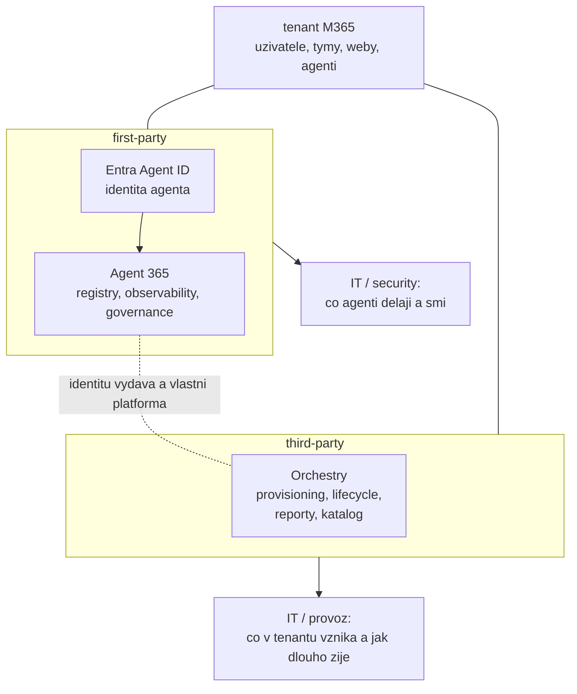

# Orchestry — third-party alternativa governance

> Typ: povinný · Den: 5 · Odhad: **35 min** (25 výklad + 10 srovnání) · Publikum: **vývojáři / architekti**
> Prostředí: viz [`../../environment.md`](../../environment.md) · Názvosloví: [`../../GLOSSARY.md`](../../GLOSSARY.md)

Agent 365 není jediná odpověď na governance otázku. **Orchestry** je third-party
governance vrstva nad M365 — a tenhle blok učí, jak vyhodnotit alternativu k Microsoft
first-party nástroji: co pokrývá, co ne, a kdy dává v blízkém okolí M365 smysl.

> [!IMPORTANT] Third-party obsah
> Jediný blok kurzu postavený na non-Microsoft produktu. Zdrojem je dokumentace vendora
> (orchestry.com), ne learn.microsoft.com — fakta o produktu ověřovat u vendora před
> každým během. Blok je srovnávací, ne implementační.

## Cíle

- Znát **Orchestry** jako third-party governance vrstvu nad M365 a její vztah
  k agentnímu prostoru.
- Umět **strukturovaně srovnat** first-party (Agent 365) a third-party governance:
  rozsah, identita, licencování, lock-in, roadmap riziko.
- Odnést si **rozhodovací rámec** „kdy Microsoft first-party a kdy third-party" —
  použitelný i mimo governance.

## Výklad

### Co Orchestry řeší

Orchestry vyrostlo jako **governance vrstva nad Microsoft 365 workspaces** — tedy nad tím,
co v tenantu vzniká a co s tím dál je:

- **Provisioning** — řízené zakládání týmů a webů ze šablon místo volného „vytvořit tým",
  se schvalovacím krokem a předvyplněnou strukturou.
- **Lifecycle** — co se s workspacem děje v čase: kontrola vlastnictví, archivace
  nepoužívaných, čištění osiřelých.
- **Reporting a inventář** — přehled, co v tenantu existuje, kdo to vlastní a jak se to
  používá.
- **Adresář a katalog** — orientace uživatelů v tom, co už existuje (prevence duplicit).

Tohle je jádro produktu a je stabilní. **Pokrytí agentního prostoru je pohyblivá část** —
kategorie je mladá a vendoři do ní teď rozšiřují záběr. Rozsah agent governance u Orchestry
ověřovat v dokumentaci vendora **před každým během**, ne z tohoto materiálu.

> [!NOTE] Proč to studenta zajímá i bez Orchestry
> Otázka „co s agenty, které si lidé nadělají" je stejná jako otázka „co s týmy, které si
> lidé nadělají" — jen o pět let později. Kategorie workspace governance na ni má hotové
> odpovědi (šablony, schvalování, vlastnictví, expirace) a agentní governance je přebírá.
> Kdo rozumí jedné, rozumí i druhé.

### Srovnání s Agent 365

| Kritérium | Agent 365 (first-party) | Orchestry (third-party) |
|---|---|---|
| **Co primárně governuje** | agenty napříč původem (Copilot Studio, Foundry, pro-code) | workspaces (týmy, weby) — pokrytí agentů ověřit u vendora |
| **Identita agenta** | **vlastní ji**: Entra Agent ID, access reviews, owner attestation | nemá pod kontrolou — pracuje nad tím, co Entra vystaví |
| **Hloubka integrace** | součást platformy; vidí, co platforma vidí | vrstva nad veřejnými API — vidí, co API vydá |
| **Licenční model** | $15/user/měs standalone (nebo v E7) — **ověřit k datu běhu** | licencování vendora; ověřit u vendora |
| **Lock-in** | do Microsoft stacku (kde už zákazník je) | do vendora: procesy, šablony a data governance vrstvy |
| **Roadmap riziko** | funkce přicházejí, ale i mění se; mladý developerský povrch | Microsoft může kategorii dohnat — pak končí důvod platit navíc |
| **Kdy vyhrává** | agentní identita, audit, IT/security pohled na agenty | zralé workspace procesy, které Microsoft nativně nemá |

- **Nejsou to soupeři na stejném hřišti.** Agent 365 řeší agenty a jejich identitu,
  Orchestry řeší, co v tenantu vzniká a jak se to spravuje. Překryv je v reportingu
  a v procesu schvalování — tam se srovnání láme.
- **Entra Agent ID zůstává first-party doménou.** Žádná třetí strana ji nenahradí; může nad
  ní přidat procesní vrstvu (schvalování, katalog, vlastnictví), ale identitu vydává Entra.
  Tohle je nejdůležitější věta celého bloku.
- Cenu i licenční model **obou stran** ověřovat k datu běhu — čísla v této tabulce jsou
  stav k 2026-08 (viz Stav produktu).

### Rozhodovací rámec first-party vs. third-party

Rámec je přenositelný — používá se stejně u zálohování, migračních nástrojů i governance:

1. **Pokrývá to potřebu, kterou zákazník skutečně má?** Ne „co produkt umí", ale „co
   zákazníka dnes bolí". Třetí strana se kupuje na konkrétní bolest, ne na feature list.
2. **Co z toho pokrývá first-party a v jaké kvalitě?** Rozdíl mezi „Microsoft to má" a
   „Microsoft to má použitelně" je celý trh třetích stran.
3. **Cena včetně provozu.** Licence vendora + zaučení + integrace + kdo to bude spravovat.
   Porovnávat proti ceně first-party licencí, které zákazník možná už má.
4. **Rychlost inovace na obou stranách.** Vendor bývá rychlejší v hloubce jedné domény,
   Microsoft v šíři a integraci. U mladých kategorií (agentní governance) se to mění
   po měsících.
5. **Co se stane, až Microsoft funkcionalitu dožene.** U třetích stran nad M365 je to
   opakující se scénář: kategorie zanikne, nebo se posune výš. Ptát se předem: *přežije
   ta investice, když se nativní funkce objeví za rok?*
6. **Compliance a data.** Kam vendor ukládá data a metadata z tenantu, jaká má certifikace,
   jaká oprávnění do tenantu vyžaduje (app-only přístup přes celý tenant je běžný a je to
   samostatné bezpečnostní rozhodnutí).
7. **Exit.** Když vztah skončí, co v tenantu zůstane funkční a co se rozpadne. Šablony
   a procesy uzamčené ve vendorovi jsou skrytá část ceny.

- **Rozhodnutí není náboženské.** Je to rozsah + cena + riziko — a odpověď se legitimně
  liší u zákazníka s 200 uživateli a u zákazníka s 20 000.
- Pro Support Asistenta je praktický závěr obvykle: **agentní identita a audit first-party**
  (Agent 365), třetí strana až tam, kde má zákazník procesní potřebu, kterou platforma
  nepokrývá.

## Klíčové rozlišení

- **Agent 365** (first-party: registry, Entra Agent ID, integrace s M365 admin) vs.
  **Orchestry** (third-party vrstva) — jiná hloubka přístupu k platformě, jiné riziko.
- **Governance agentů** vs. **governance workspaces** — Orchestry historicky druhé;
  aktuální pokrytí prvního ověřit u vendora.
- Third-party governance **nemá Entra Agent ID** pod kontrolou — identita agentů zůstává
  first-party doména; third-party přidává procesní vrstvu nad ní.
- Rozhodnutí není náboženské — je to **rozsah + cena + riziko**, a mění se s roadmapou obou stran.

## Naše prostředí

**Instruktorské demo s živým produktem** — instruktor má **Orchestry trial** (potvrzeno
2026-08-07). Srovnávací tabulka funguje i bez živého produktu, kdyby trial vypršel.

## Lab

Bez samostatného labu — srovnávací tabulka se staví společně v rámci bloku (10 min)
a je deliverable do capstonu.

## Nosná linka

Support Asistent je od závěru dne 4 instrumentovaný do Agent 365. Tenhle blok přidává
otázku do capstone architektury: **stačí first-party governance, nebo zákazník potřebuje
třetí stranu — a proč?**

## Zdroje

- [Orchestry — dokumentace vendora](https://www.orchestry.com/) *(third-party; výjimka
  z pravidla Microsoft-only zdrojů — viz marker výše)*
- [Microsoft Agent 365 — overview](https://learn.microsoft.com/en-us/microsoft-agent-365/) *(srovnávací baseline)*

## Stav produktu / delta

> [!WARNING] Ověřit k datu běhu — stav k 2026-08.
> Rozsah agent governance u **Orchestry** ověřit u vendora před každým během — third-party
> roadmapa se mění rychleji než Microsoft dokumentace a tento blok nesmí učit zastaralé
> srovnání. Zároveň ověřit aktuální stav Agent 365 (druhá strana tabulky).
