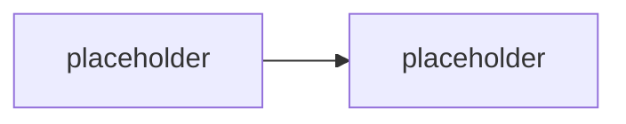

# Výkon, náklady & lifecycle

> Typ: povinný · Den: 5 · Odhad: **elastický 95–120 min** (50 výklad + 45–70 lab) · Publikum: **vývojáři / architekti**
> Prostředí: viz [`../../environment.md`](../../environment.md) · Názvosloví: [`../../GLOSSARY.md`](../../GLOSSARY.md)

Co agent stojí, jak to snížit, a jak ho dostat z dev do prod a zpátky, když se to pokazí.

## Cíle
- Rozumět **token ekonomice** agenta a vědět, kde se peníze reálně ztrácejí.
- Zavést **cache vrstvy** a optimalizaci retrievalu — a změřit efekt.
- Navrhnout **promotion mezi prostředími**, verzování a **rollback**.
- Mít postoj ke **governance výměn modelů a plánování deprecací**.

## Výklad

### Token ekonomika

<!-- TODO: kde tokeny vznikaji: systemovy prompt (kazdy turn!), historie konverzace,
     knowledge chunky, tool definice, tool vysledky, vystup.
     Nejcastejsi zdroj plytvani: rostouci historie a knowledge bez limitu. -->

### Tři peněženky znovu — teď s čísly

<!-- TODO: M365 Copilot licence / Copilot Credits / Azure inference. Kdo co plati
     u Support Asistenta konkretne. Navaznost na GLOSSARY. Nosny teaching point kurzu. -->

### Cache vrstvy

<!-- TODO: cache odpovedi (kdy je bezpecna a kdy ne — permissions!), cache retrievalu,
     prompt caching na strane modelu. Invalidace. Cache s ACL je netrivialni:
     stejny dotaz, jiny uzivatel, jina opravnena odpoved. -->

### Optimalizace retrievalu

<!-- TODO: méně kandidatu, kratsi chunky, limit historie, sumarizace historie misto plne.
     Merit dopad na kvalitu (golden set z D4!) — optimalizace bez merení je hazard. -->

### Odolnost a náklady v nečinnosti

<!-- TODO: navaznost na D4 hosting: cold start vs stale bezici, consumption vs dedicated. -->

### Promotion mezi prostředími

<!-- TODO: dev -> test -> prod: co se meni (endpoint modelu, knowledge zdroje, opravneni,
     telemetrie), co zustava (manifest, kod). Konfigurace, ne branch. -->

### Verzování a rollback

<!-- TODO: verze manifestu vs verze kodu vs verze promptu vs verze modelu — CTYRI veci,
     ktere se mohou rozejit. Rollback: co se da vratit a co ne (data, konverzace, stav). -->

### Governance výměn modelů a deprecace

<!-- TODO: model se meni pod rukama (verze, deprecace, novy default). Co to znamena:
     prompty prestanou fungovat stejne, golden set musi projet ZNOVU.
     Proto je golden set (D4) predpokladem bezpecne vymeny modelu, ne luxus.
     Planovani deprecaci: sledovat oznameni, mit alternativu, mit test. -->

> [!IMPORTANT] Nosná pointa bloku
> **Golden set z [`../../day-4/evaluation-quality/`](../../day-4/evaluation-quality/) je to,
> co dělá výměnu modelu bezpečnou.** Bez něj je každá výměna modelu (a každá optimalizace
> nákladů) hazard. To je důvod, proč evaluace v tomto kurzu předchází optimalizaci.

## Klíčové rozlišení
- **Cache odpovědí** (nebezpečná bez ACL) vs. **cache retrievalu** vs. **prompt caching**.
- **Optimalizace** (snížím náklady, kvalita drží) vs. **degradace** (snížím náklady, kvalita
  klesne) — rozdíl poznáš jen měřením.
- **Verze manifestu / kódu / promptu / modelu** — čtyři nezávislé verze.
- **Rollback kódu** (jde) vs. **rollback dat a konverzací** (nejde) — plánovat dopředu.

## Naše prostředí

Hands-on, bez tenantu — potřebuje **model endpoint**. Elastický blok: při zkrácení se jede
výklad + část A labu (měření a cache), lifecycle části se probírají u tabule.

## Lab
Viz [`lab-cost-and-promotion.md`](lab-cost-and-promotion.md).

## Nosná linka
Support Asistent dostává **cache a limit historie** (s naměřenou úsporou a ověřenou kvalitou
proti golden setu) a **promotion konfiguraci dev → test** včetně rollback plánu.

## Zdroje (Microsoft)
- [Prompt caching — Microsoft Foundry](https://learn.microsoft.com/en-us/azure/ai-foundry/openai/how-to/prompt-caching)
- [Plan and manage costs for Microsoft Foundry](https://learn.microsoft.com/en-us/azure/ai-foundry/how-to/costs-plan-manage)
- [Model deprecations and retirements — Microsoft Foundry](https://learn.microsoft.com/en-us/azure/ai-foundry/openai/concepts/model-retirements)
- [Evaluation of generative AI applications](https://learn.microsoft.com/en-us/azure/ai-foundry/concepts/evaluation-approach-gen-ai)

## Stav produktu / delta

> [!WARNING] Ověřit k datu běhu — stav k 2026-08.
> **Ceny modelů, sazby Copilot Credits a data deprecace modelů se mění po měsících.**
> Neuvádět žádné konkrétní číslo bez ověření na aktuální pricing / model retirements stránce.
> Podpora prompt cachingu se liší podle modelu — ověřit pro model na kurzovním endpointu.
