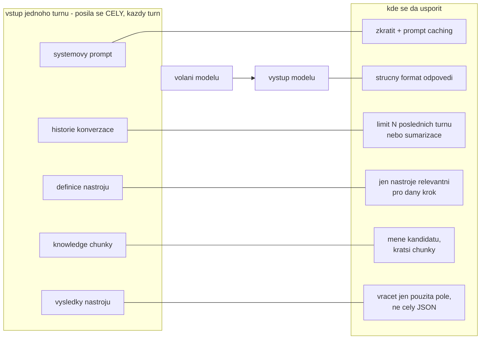
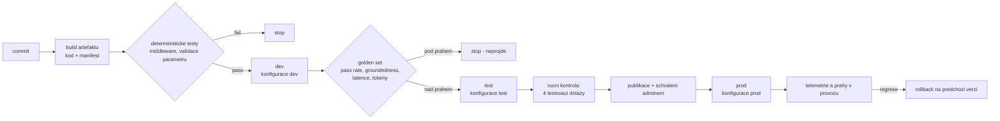

# Výkon, náklady & lifecycle

> Typ: **samostudium** (vyřazeno z osnovy 2026-08-25) · Odhad: 70 min čtení · Publikum: **vývojáři / architekti**
> Prostředí: viz [`../../environment.md`](../../environment.md) · Názvosloví: [`../../GLOSSARY.md`](../../GLOSSARY.md)

Co agent stojí, jak to snížit, a jak ho dostat z dev do prod a zpátky, když se to pokazí.

> [!NOTE] Materiály tohoto modulu — všechny jsou v repu
> Studentům se rozdávají **odsud**, ne odkazem. Otevřou se dvojklikem z klonu
> a fungují offline (bez internetu se nenačtou jen fonty).
>
> | Soubor | Co to je | Kdy |
> |---|---|---|
> | [`tekute-pisky-retrievalu.html`](./tekute-pisky-retrievalu.html) | **výstup z projektu** — změřená odpověď na čtyři otázky z týdne | D5, blok 0 |
> | [`roi-calculator.html`](./roi-calculator.html) | kalkulačka nákladů a ROI, načte vlastní `usage-log.jsonl` | D5, capstone část D |
> | [`cost-visual.html`](./cost-visual.html) | plánovací kalkulačka, presety a what-if | samostudium |
> | [`mereni-retrieval-vs-search.md`](./mereni-retrieval-vs-search.md) | úplné měření se surovými čísly a reprodukcí | podklad pro instruktora |
>
> Všechny tři HTML sdílejí tokeny a typografii — kurz má jeden vizuální jazyk.
> `roi-calculator` a `cost-visual` mají **dvě kopie výpočtu i ceníku**; po kurzu sloučit.

> [!NOTE] Kde se tenhle modul v kurzu vrací
> Nákladová část žije v **capstone, část D** — studenti tam počítají provoz a ROI
> svého zadání v [kalkulačce](roi-calculator.html).
> Naměřená data a obhajoba modelu: [`explainer-obhajoba-modelu-a-roi.md`](./explainer-obhajoba-modelu-a-roi.md).

> [!IMPORTANT] Modul se neodučí — jeho nástroje ale v kurzu jsou
> Vyřazen do samostudia při druhé rekalibraci (2026-08-25); jádro (token budget, nákladový
> strop) je složené do [`../capstone/`](../capstone/). **Kalkulátory v této složce se
> používají živě**: [`cost-visual.html`](./cost-visual.html) na D3 v
> [`../../actions-graph/`](../../day-4/actions-graph/) a
> [`cost-calculator.mjs`](./cost-calculator.mjs) u nákladového stropu v capstonu.

## Cíle
- Rozumět **token ekonomice** agenta a vědět, kde se peníze reálně ztrácejí.
- Zavést **cache vrstvy** a optimalizaci retrievalu — a změřit efekt.
- Navrhnout **promotion mezi prostředími**, verzování a **rollback**.
- Mít postoj ke **governance výměn modelů a plánování deprecací**.

## Výklad

### Token ekonomika

Výchozí fakt, který studenti podceňují: **model nemá paměť**. Každý turn posílá celý vstup
znovu — účtuje se tedy celý turn, ne jen to, co uživatel napsal.

| Složka vstupu | Kdy se platí | Roste s |
|---|---|---|
| **systémový prompt** | **každý turn** | délkou promptu × počtem turnů |
| **historie konverzace** | každý turn | délkou konverzace — u plné historie přibývá s každým turnem |
| **definice nástrojů** | každý turn | počtem nástrojů a upovídaností jejich popisů |
| **knowledge chunky** | turn s retrievalem | počtem kandidátů × velikostí chunku |
| **výsledky nástrojů** | turn s tool-callem | velikostí odpovědi API — surový JSON je typický žrout |
| **výstup modelu** | každý turn | délkou odpovědi; výstupní tokeny bývají dražší než vstupní |

- **Jeden tool-call = dvě volání modelu** (návrh volání + zpracování výsledku). Turn
  s eskalací (dotaz 3) je dražší než turn s odpovědí z runbooku (dotaz 1) — to je v pořádku,
  jen to musí být v rozpočtu.
- **Nejčastější zdroj plýtvání: rostoucí historie a knowledge bez limitu.** Obojí je tiché —
  nic se nerozbije, jen každý další den stojí víc. Bez měření per turn to nikdo neuvidí.
- Druhý v pořadí: nástroj, který vrací celou odpověď API místo tří polí, která agent
  skutečně potřebuje.
- Měřit **per turn a per konverzaci**, ne per den. Denní číslo řekne, že je to drahé;
  rozpad per turn řekne, kde a co s tím.

### Nástroje v tomhle modulu — spočítat si to

Model z předchozího diagramu je v repu spustitelný. Obojí počítá tokeny **turn po turnu
a kolo po kole**, ne paušálem:

| Nástroj | K čemu | Jak spustit |
|---|---|---|
| [`cost-visual.html`](./cost-visual.html) | výklad a demo u tabule — posuvníky, šest archetypů jako předvolby | otevřít v prohlížeči, nic se neinstaluje |
| [`cost-calculator.mjs`](./cost-calculator.mjs) | vlastní naměřená čísla, srovnání modelů, citlivost | `node cost-calculator.mjs --model gpt-5-mini` |

- Ceny se stahují z veřejného retail API Azure a ukládají do
  [`prices-snapshot.json`](./prices-snapshot.json). Bez sítě jede `--offline` ze snapshotu;
  `--refresh-prices` si vynutí nové stažení. **Ve snapshotu je datum stažení — ukázat ho,**
  ceny se mění a číslo bez data je k ničemu.
- Přepínače: `--model`, `--cache <0..1>`, `--history <n>`, `--turns <n>`, `--users <n>`,
  `--scenario <muj.json>`. Nápověda: `--help`.
- **Vstupní čísla ber z `usage` metadat vlastního agenta**, ne z odhadu. Odhad tokenů se
  systematicky plete o řád — proto se v labu měří.
- Nejsilnější dvojice předvoleb ve vizuálu je *Vlastníci z justice.cz* proti
  *↳ s deterministickým předfiltrem*: ukazuje, že větší úsporu než ladění promptu přinese
  **vyhození kroku, který model nepotřeboval** —
  [`../../actions-graph/explainer-deterministic-first.md`](../../day-4/actions-graph/explainer-deterministic-first.md).

### Tři peněženky znovu — teď s čísly

Rozlišení z [`../../GLOSSARY.md`](../../GLOSSARY.md) se tady poprvé potkává s reálným účtem
za Support Asistenta:

| Peněženka | Co platí | U Support Asistenta konkrétně |
|---|---|---|
| **M365 Copilot licence** | přístup ke Copilot zážitkům, deklarativní agenti, grounding nad tenantem | deklarativní v1 a jeho provoz pro licencované uživatele |
| **Copilot Credits (PAYG)** | Copilot Chat nad tenant daty, použití agentů, Agent Builder, spotřeba Retrieval API | grounding nad knihovnou `Runbooky` přes Copilot Retrieval API |
| **Azure inference** (Foundry / Azure OpenAI) | tokeny modelu volaného vlastním kódem | **celý provoz custom engine agenta** — každý turn z labů |
| **Azure hosting** | App Service / Container Apps, storage, telemetrie | běh endpointu agenta, i když se nikdo neptá |

> [!IMPORTANT] Nosný teaching point
> **Copilot Credits nezaplatí inference custom engine agenta.** Model si přináší vlastní
> a platí ho přes Azure subscription. Tohle je nejčastější rozpočtové nedorozumění
> u zákazníků: „máme Copilot licence, tak agenta máme zaplaceného" — neplatí od okamžiku,
> kdy se sáhne po Agents SDK.

- **Čtvrtá položka, na kterou se zapomíná, je hosting.** Není to token, ale je to faktura —
  a na rozdíl od tokenů běží i v noci a o víkendu (viz „Odolnost a náklady v nečinnosti").
- Konkrétní sazby do materiálu nepatří — vyplňují se k datu běhu z pricing stránek (viz
  Stav produktu). **Stabilní je struktura**: kolik faktur přijde, od koho a co je řídí.
  To je odpověď, kterou zákazník potřebuje při rozhodování o architektuře.
- Praktický důsledek pro nabídku: náklady custom engine agenta se rozpadají na
  **variabilní** (tokeny, spotřeba API — škálují s používáním) a **fixní** (hosting,
  telemetrie, Agent 365 licence — platí se bez ohledu na provoz). Míchat je do jednoho
  čísla za měsíc znamená neumět je řídit.

### Cache vrstvy

| Vrstva | Co cachuje | Riziko | Invalidace |
|---|---|---|---|
| **Prompt caching** (na straně modelu) | stabilní prefix requestu — systémový prompt, definice nástrojů | žádné, neopouští to hranici volání | automaticky, TTL poskytovatele |
| **Cache retrievalu** | výsledky vyhledávání pro dotaz | výsledky jsou **už otrimované pro konkrétního uživatele** | při změně obsahu i oprávnění |
| **Cache odpovědí** | celá vygenerovaná odpověď | nejvyšší — hotová odpověď včetně obsahu runbooku | při změně obsahu, oprávnění, promptu i modelu |

- **Pořadí zavádění**: prompt caching první (nejmenší riziko, nejmenší práce), cache
  retrievalu druhá, cache odpovědí až po analýze oprávnění.
- **Cache s ACL je netriviální**: stejný dotaz, jiný uživatel = jiná oprávněná odpověď.
  Klíč cache musí obsahovat identitu volajícího nebo množinu jeho oprávnění. Cache klíčovaná
  jen textem dotazu je exfiltrační kanál, kterému jste omylem řekli optimalizace — a projeví
  se až u druhého uživatele, tedy dávno po code review.
- **Kdy je cache odpovědí bezpečná**: obsah je stejný pro všechny (veřejná politika, SLA
  tabulka) nebo je klíč rozšířený o oprávnění. Dotaz 2 („Jaká je SLA na P1?") je učebnicový
  kandidát — odpověď se nemění a nezávisí na tom, kdo se ptá. Zároveň je to případ, kdy
  stojí za úvahu odpověď vůbec negenerovat modelem (editorial answer).
- **Invalidace**: TTL je náhražka, ne řešení. Skutečná invalidace se váže na událost —
  změna dokumentu, změna oprávnění, změna promptu, změna modelu. Poslední dvě patří
  do klíče cache jako verze; jinak po deploy nového promptu dál servírujete odpovědi
  toho starého.

### Optimalizace retrievalu

Čtyři páky, každá s vlastním rizikem:

| Páka | Co ušetří | Čím to může zaplatit |
|---|---|---|
| **Méně kandidátů z retrievalu** | vstupní tokeny, latenci re-rankingu | odpověď bez podkladu, když správný chunk vypadl |
| **Kratší chunky** | vstupní tokeny | utržený kontext, neúplný postup |
| **Limit historie** (posledních N turnů) | roste-li konverzace, nejvíc ze všeho | agent „zapomene", co bylo na začátku konverzace |
| **Sumarizace historie** místo plné | totéž, s menší ztrátou kontextu | jedno volání modelu navíc; sumarizace může vypustit detail |

- Ke každé páce patří i **zúžení výsledků nástrojů** — vracet do turnu jen pole, která
  agent potřebuje, ne celou odpověď API. Nejlevnější úspora s prakticky nulovým rizikem.
- **Postup, který jediný dává smysl**: jedna změna → golden set → zapsat úsporu i kvalitu →
  ponechat, nebo vrátit. Dvě změny naráz znamenají, že nevíš, která z nich kvalitu shodila.
- **Měřit dopad na kvalitu, ne jen na tokeny.** Golden set z
  [`../../evaluation-quality/`](../evaluation-quality/) je jediný způsob,
  jak rozeznat optimalizaci od degradace. Optimalizace bez měření je hazard — a projeví se
  až u zákazníka, protože v dev se ptají jen ti, kdo znají správnou odpověď.

### Odolnost a náklady v nečinnosti

Navazuje na hostingovou osu z
[`../../event-driven-hosting/`](../event-driven-hosting/):

- **Consumption model**: platíš za to, co běží. Levné v noci, ale první dotaz po nečinnosti
  platí **cold start** — a uživatel to nevnímá jako úsporu, nýbrž jako „agent je pomalý".
  U agenta je cold start horší než u API: k němu se ještě přičítá latence modelu.
- **Vždy běžící (dedicated) plán**: platíš i v noci, ale odpovídá okamžitě. Predikovatelný
  účet, predikovatelná latence.
- **Support Asistent má špičky v pracovní době a ticho v noci** — to je argument pro
  consumption, jenže cold start naráží na timeout kanálu (Teams nečeká libovolně dlouho).
- Praktický kompromis: minimální počet trvale běžících instancí a škálování nahoru,
  případně warm-up ping. Obojí má cenu a obojí se dá spočítat dopředu — je to rozhodnutí,
  ne náhoda.
- Do rozpočtu patří i to, co běží mimo agenta: telemetrie, storage stavu, mock/ostré API.
  „Náklady v nečinnosti" jsou součet těchhle položek, ne jen výpočetní plán.

### Promotion mezi prostředími

- **Co se mezi prostředími mění** (= konfigurace): endpoint a nasazení modelu, knowledge
  zdroje (kopie runbooků vs. ostrá knihovna), app registrace a udělená oprávnění, ticketing
  API (mock vs. ostré), telemetrie (instance, vzorkování), prahy (timeouty, retry, limit
  historie), feature flagy.
- **Co se nemění**: kód, struktura manifestu, systémový prompt, definice nástrojů, testy,
  golden set. Do všech prostředí jde **stejný artefakt**.
- **Pravidlo: promotion je konfigurace, ne branch.** Větev per prostředí znamená, že se
  prostředí dřív nebo později rozejdou a nikdo nebude vědět čím. Co se testovalo v testu,
  musí být bit po bitu to, co jde do produkce.
- **Tajemství nepatří do konfigurace v repu** — klíče, connection stringy a certifikáty
  jdou přes secret store per prostředí (viz [`../../environment.md`](../../environment.md)).
  Repo drží jen názvy a odkazy.
- Manifest se mezi prostředími liší **jen v identifikátorech** (jméno, app ID, ikony pro
  odlišení). Obsahově musí být identický — jinak testuješ jiného agenta, než nasazuješ.
- Promotion agenta má krok navíc proti běžné aplikaci: **publikace a admin schválení**
  (viz [`../../event-driven-hosting/`](../event-driven-hosting/)). Není
  okamžitá a musí být v plánu vydání, ne v poznámce pod čarou.

### Verzování a rollback

Čtyři nezávislé verze, které se umějí rozejít:

| Verze | Kdo ji mění | Kde je vidět | Co znamená rozejití |
|---|---|---|---|
| **manifest** | ty, publikací + schválením | admin a uživatel | agent umí něco jiného, než co admin schválil |
| **kód** | ty, deploymentem | nikdo zvenčí | chování neodpovídá popisu v manifestu |
| **prompt** | ty, commitem — často „rychle a mimo" | nikdo | nereprodukovatelné odpovědi, neplatná cache |
| **model** | **poskytovatel**, i když neuděláš nic | nikdo | agent se změní bez tvého zásahu |

- **Prompt patří do repa a do telemetrie.** Prompt měněný mimo verzování je nejčastější
  příčina věty „včera odpovídal jinak", na kterou nikdo nemá odpověď.
- Praktický požadavek: každý záznam telemetrie nese **všechny čtyři verze**. Bez toho
  se incident nedá reprodukovat — a nemá smysl se o to ani pokoušet.
- **Rollback — co jde vrátit:** kód (deploy předchozí verze), manifest (novou verzí a novým
  schválením, tedy **ne okamžitě**), prompt (commit), nasazení modelu — pokud je předchozí
  verze ještě dostupná, což není samozřejmost.
- **Co vrátit nejde:** vedlejší efekty akcí (založené tikety, odeslané zprávy, zápisy do
  systémů), konverzace a to, co si uživatel přečetl, odeslanou telemetrii.
- Důsledek: akce s vedlejšími efekty potřebují **idempotenci a kompenzaci**
  (viz [`../../event-driven-hosting/`](../event-driven-hosting/)), ne rollback.
  U `CreateTicket` to znamená mít připravený postup „jak zrušit tikety založené vadnou
  verzí za posledních X hodin" — a vědět, podle čeho je najdeš.

### Governance výměn modelů a deprecace

- **Model se mění pod rukama**: nové verze, změna výchozího modelu, oznámená retirement
  data. Ty jsi nezměnil nic — a chování agenta je jiné.
- **Co se prakticky mění po výměně modelu**: ochota volat nástroje, formát a délka odpovědí,
  míra odmítání (pozor na dotaz 4), kvalita citací, latence i cena za turn. Prompt vyladěný
  na jednu verzi není přenosný.
- **Postup bezpečné výměny:**
  1. nasazení **pinovat na konkrétní verzi**, ne na „nejnovější" — změna má být tvoje
     rozhodnutí, ne cizí;
  2. sledovat oznámení o deprecacích pro model, který skutečně používáš;
  3. mít pojmenovanou alternativu dřív, než ji potřebuješ;
  4. přepnout nejdřív v dev, pustit golden set, porovnat s předchozí verzí;
  5. doladit prompt na nový model — ne obráceně;
  6. teprve pak promotion podle gate výše.
- **Deprecace je projektová položka s termínem**, ne provozní překvapení. Kdo ji nesleduje,
  dozví se o ní tím, že agent přestane odpovídat.

> [!IMPORTANT] Nosná pointa bloku
> **Golden set z [`../../evaluation-quality/`](../evaluation-quality/) je to,
> co dělá výměnu modelu bezpečnou.** Bez něj je každá výměna modelu (a každá optimalizace
> nákladů) hazard. To je důvod, proč evaluace v tomto kurzu předchází optimalizaci.

## Klíčové rozlišení
- **Cache odpovědí** (nebezpečná bez ACL) vs. **cache retrievalu** vs. **prompt caching**.
- **Optimalizace** (snížím náklady, kvalita drží) vs. **degradace** (snížím náklady, kvalita
  klesne) — rozdíl poznáš jen měřením.
- **Verze manifestu / kódu / promptu / modelu** — čtyři nezávislé verze.
- **Rollback kódu** (jde) vs. **rollback dat a konverzací** (nejde) — plánovat dopředu.

## Naše prostředí

Hands-on, bez tenantu — potřebuje **model endpoint**. Elastický blok: při zkrácení se jede
výklad + část A labu (měření a cache), lifecycle části se probírají u tabule.

## Lab
Viz [`lab-cost-and-promotion.md`](./lab-cost-and-promotion.md).

## Nosná linka
Support Asistent dostává **cache a limit historie** (s naměřenou úsporou a ověřenou kvalitou
proti golden setu) a **promotion konfiguraci dev → test** včetně rollback plánu.

## Zdroje (Microsoft)
- [Prompt caching — Microsoft Foundry](https://learn.microsoft.com/en-us/azure/ai-foundry/openai/how-to/prompt-caching)
- [Plan and manage costs for Microsoft Foundry](https://learn.microsoft.com/en-us/azure/ai-foundry/how-to/costs-plan-manage)
- [Model deprecations and retirements — Microsoft Foundry](https://learn.microsoft.com/en-us/azure/ai-foundry/openai/concepts/model-retirements)
- [Evaluation of generative AI applications](https://learn.microsoft.com/en-us/azure/ai-foundry/concepts/evaluation-approach-gen-ai)

## Stav produktu / delta

> [!WARNING] Ověřit k datu běhu — stav k 2026-08.
> **Ceny modelů, sazby Copilot Credits a data deprecace modelů se mění po měsících.**
> Neuvádět žádné konkrétní číslo bez ověření na aktuální pricing / model retirements stránce.
> Podpora prompt cachingu se liší podle modelu — ověřit pro model na kurzovním endpointu.
