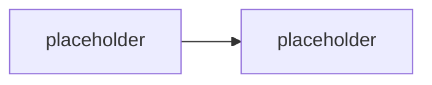

# Bezpečnost & řízení rizik

> Typ: povinný · Den: 5 · Odhad: **130 min** (55 výklad + 75 lab) · Publikum: **vývojáři / architekti**
> Prostředí: viz [`../../environment.md`](../../environment.md) · Názvosloví: [`../../GLOSSARY.md`](../../GLOSSARY.md)

Útok na **vlastního agenta studenta**. Nejsilnější „aha" moment kurzu.

## Cíle
- Rozumět **prompt injection** a **XPIA** (cross-prompt injection) — útoku přes obsah,
  ne přes dotaz.
- Znát vzory **prevence exfiltrace** a vědět, které z nich skutečně drží.
- Aplikovat **minimalizaci scope** na oprávnění agenta a jeho akce.
- Umět **sanitizovat výstupy** a vědět, kde je hranice toho, co sanitizace zvládne.

## Výklad

### Model útoku na agenta

<!-- TODO: cim se agent lisi od klasicke aplikace: prijima nedůveryhodny text a na jeho
     zaklade VOLA NASTROJE s vlastnimi opravnenimi. Confused deputy problem. -->

### Prompt injection vs. XPIA

<!-- TODO: prompt injection = utocnik je uzivatel. XPIA = utocnik je AUTOR OBSAHU,
     ktery agent cte (dokument, e-mail, webova stranka, vysledek nastroje).
     XPIA je nebezpecnejsi, protoze uzivatel je obet, ne pachatel. -->

> [!IMPORTANT] Proč je XPIA jádro tohoto bloku
> Support Asistent čte **runbooky, které někdo napsal**. Kdokoli s právem editovat runbook
> může do něj vložit instrukce pro agenta. Uživatel, který se pak zeptá, je obětí — ne útočníkem.
> Tohle je reálný model hrozby pro agenty nad firemním obsahem.

### Exfiltrace — jak z agenta vytéká

<!-- TODO: kanaly uniku: odpoved uzivateli, volani nastroje s parametry (data v URL/payloadu),
     odchozi HTTP, citace odkazujici na neco, co uzivatel nema videt, chybove zpravy, logy.
     Nejcastejsi zdroj: app-only opravneni (navaznost na D2 cast D). -->

### Minimalizace scope

<!-- TODO: least privilege prakticky: delegated misto app-only, per-akce scope,
     whitelist nastroju, whitelist cilu odchoziho volani, oddelene identity pro agenty
     (Entra Agent ID) s odlisnymi opravnenimi. -->

### Sanitizace výstupů — a co nezvládne

<!-- TODO: co sanitizace umi (formaty, PII vzory, odkazy) a co ne (semantiku).
     Nosna pointa: sanitizace je posledni vrstva, ne prvni obrana. -->

### Watermarking — poctivá odpověď

<!-- TODO: katalogova osnova jmenuje watermarking. U textovych odpovedi agenta to nema
     robustni obranny prinos (snadno se odstrani, nezabrani exfiltraci). Rict to poctive
     a nabidnout, co ma smysl misto toho: auditni stopa a detekce (D4 governance). -->

> [!IMPORTANT] Změna proti katalogové osnově
> Publikovaná osnova uvádí „sanitizace výstupů a **watermarking** (kde dává smysl)".
> Watermarking textových odpovědí agenta nemá robustní obranný přínos — snadno se odstraní
> a exfiltraci nezabrání. Nahrazeno **prompt injection / XPIA**, což je reálný a aktuální
> model hrozby. Toto rozhodnutí je vědomé.

## Klíčové rozlišení
- **Prompt injection** (útočník = uživatel) vs. **XPIA** (útočník = autor obsahu, uživatel
  je oběť).
- **Obrana v promptu** (přemluvitelná) vs. **middleware** (vykoná se) vs. **oprávnění**
  (nepřemluvitelná) — třetí je jediná skutečná hranice.
- **Sanitizace** (poslední vrstva) vs. **scope minimalizace** (první vrstva).
- **Prevence** vs. **detekce** — u agentů potřebuješ obojí, protože prevence nikdy není úplná.

## Naše prostředí

Hands-on, bez tenantu — potřebuje **model endpoint**. Útok se vede na **studentova vlastního
agenta**, na lokálních datech. Do knihovny `Runbooky` v tenantu se injection **nevkládá** —
používá se lokální kopie (viz fallback v labu).

## Lab
Viz [`lab-injection-and-scope.md`](lab-injection-and-scope.md).

## Nosná linka
Support Asistent je napaden **přes obsah runbooku**. Část obran z
[`../../day-3/middleware-policy/`](../../day-3/middleware-policy/) padne — a to je záměr.
Student pak opravuje scope, ne prompt.

## Zdroje (Microsoft)
- [Prompt shields — Microsoft Foundry](https://learn.microsoft.com/en-us/azure/ai-services/content-safety/concepts/jailbreak-detection)
- [Content filtering — Microsoft Foundry](https://learn.microsoft.com/en-us/azure/ai-foundry/openai/concepts/content-filter)
- [Governing agent identities — Entra ID Governance](https://learn.microsoft.com/en-us/entra/id-governance/agent-id-governance-overview)
- [Microsoft Graph permissions reference](https://learn.microsoft.com/en-us/graph/permissions-reference)

## Stav produktu / delta

> [!WARNING] Ověřit k datu běhu — stav k 2026-08.
> Obranné mechanismy proti injection na straně platformy (prompt shields, spotlighting)
> se aktivně vyvíjejí — ověřit, co je k dispozici a co je default. Zároveň ověřit, že
> **útok v labu na aktuálním modelu skutečně funguje**; modely se proti známým vzorům
> průběžně zpevňují a lab bez fungujícího útoku ztrácí smysl.
