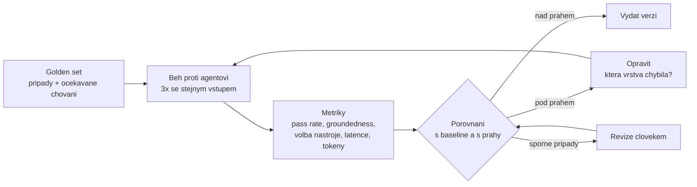

# Evaluace & kvalita

> Typ: povinný · Den: 5 · Odhad: **80 min** (35 výklad + 45 lab) · Publikum: **vývojáři / architekti**
> Prostředí: viz [`../../environment.md`](../environment.md) · Názvosloví: [`../../GLOSSARY.md`](../GLOSSARY.md)

Jak dokázat, že je agent dobrý — a že ho poslední změna nezhoršila.

## Cíle
- Rozlišit **kvalitativní a kvantitativní** metriky a vědět, kterou kdy použít.
- Postavit **golden set** a **regresní test** nad vlastním agentem.
- Zapojit **human-in-the-loop** tam, kde automat nestačí.
- Použít **Foundry evaluations** a **OpenTelemetry** jako průmyslové nástroje, ne jen skripty.

## Výklad

### Proč intuice nestačí

- **„Zkusil jsem to a je to lepší" není měření** — je to dojem z jednoho průchodu
  nedeterministickým systémem.
- LLM vrací při stejném vstupu různé výstupy. Jeden běh nedokazuje zlepšení ani zhoršení,
  dva taky ne. Měří se **rozdělení**, ne jeden vzorek — proto v labu tři běhy a rozptyl.
- Bez golden setu je změna promptu **refaktoring bez testů**: opravíš jednu formulaci
  a nevíš, co jsi rozbil jinde. U kódu by to nikdo z téhle místnosti neudělal.
- Baseline z D3 (`prompt-orchestration`, část A) je zárodek: čtyři testovací dotazy se
  zapsaným výsledkem. Golden set je ta samá myšlenka dotažená do počtu případů,
  do opakování a do prahů.
- Otázka, na kterou blok odpovídá, je provozní: **na základě čeho vydáš novou verzi
  agenta?** „Vypadalo to dobře" je odpověď, kterou u zákazníka nepoužiješ dvakrát.

### Co se u agenta vůbec měří

| Co se měří | Otázka | Odkud to vezmeš |
|---|---|---|
| **Správnost odpovědi** | odpověděl to, co měl? | rubrika + posouzení (člověk nebo LLM-as-judge) |
| **Groundedness** | má odpověď podklad ve zdroji? | porovnání odpovědi s citovaným úryvkem |
| **Citace** | odkázal na správný runbook? | kontrola ID/URL zdroje proti očekávanému |
| **Volba nástroje** | zavolal `CreateTicket`, když měl — a nezavolal, když neměl? | trace turnu (telemetrie z D4) |
| **Správnost parametrů** | priorita a žadatel validní a odvozené z identity? | deterministický test, bez modelu |
| **Odmítnutí** | odmítl dotaz 4 místo odhadu? | negativní případy v golden setu |
| **Latence** | jak dlouho uživatel čekal | telemetrie, **p50/p95** — ne průměr |
| **Náklady** | tokeny na dotaz včetně tool-call kol | telemetrie |

- **U multi-agenta nestačí verdikt „odpověděl špatně".** Musíš vědět, **která vrstva
  chybila**: špatně směroval triage, nebo špatně odpověděl resolver nad správným zdrojem?
  Bez toho opravuješ náhodnou vrstvu.
- Prakticky to znamená měřit i mezikroky — rozhodnutí triage, seznam volaných nástrojů,
  verdikt middleware. Trace z telemetrie D4 je přesně ten vstup; proto jede tenhle blok
  hned po governance.

### Kvalitativní vs. kvantitativní

- **Kvantitativní**: pass rate na golden setu, groundedness skóre, podíl správné volby
  nástroje, latence p95, tokeny na dotaz. Rychlé, opakovatelné, dají se dát do CI a spojit
  s prahem.
- **Kvalitativní**: revize člověkem nad vzorkem, uživatelská zpětná vazba (palec),
  tonalita, užitečnost — kategorie „technicky správné, ale uživateli to nepomohlo".
- **Ani jedno samo nestačí.** Čísla neuvidí, že agent odpovídá správně a nesnesitelně;
  revize člověkem neuškáluje a nezachytí regresi v pátek večer.
- Rozumný poměr: kvantitativní běh na **každou změnu**, kvalitativní revize na **vzorek
  před vydáním** a pak na produkčních dotazech po vydání.

### Golden set

- **Z čeho se skládá** — pět tříd, každá musí být zastoupená:
  - reálné dotazy (nejlepší zdroj je provoz nebo helpdesk, ne fantazie vývojáře),
  - **případy bez podkladu** — odpověď v `Runbookách` není, agent musí přiznat neznalost,
  - **negativní případy** — musí odmítnout (dotaz 4 a jeho varianty),
  - akční případy — musí zavolat nástroj se správnými parametry (dotaz 3),
  - edge cases — nejednoznačné nebo neúplné zadání, dvě možné příčiny, chybějící hláška.
- **Kolik je dost**: v labu 12; v praxi řádově desítky až nízké stovky na doménu.
  Kritérium ale není počet, ale **pokrytí tříd chování** — při pěti případech skáče pass
  rate o dvacet procent kvůli jedinému případu a číslo přestane něco znamenat.
- **Očekávání se zapisuje jako chování, ne jako text.** „Odpoví z runbooku RB-002 s citací
  a nabídne eskalaci" je testovatelné; přesná formulace odpovědi ne — na té by test padal
  při každé změně modelu.
- **Kdo ho udržuje**: tým, který agenta vlastní. Každý produkční incident přidává případ.
  Golden set bez vlastníka zestárne a začne měřit svět, který už neplatí.
- **Stárnutí je reálné**: mění se runbooky, model i očekávání. Případy se **revidují**,
  nejen přidávají — případ, který se stal nesprávným, je horší než žádný, protože nutí
  tým opravovat správně fungujícího agenta.

### Regresní testy

- **Bez modelu (deterministické)**: middleware politiky, validace parametrů akcí, whitelist
  cílů, redakce PII, klasifikace mimo-scope. Vstup dovnitř, očekávaný verdikt ven. Musí
  projít **100 %, bez tolerance**, běží v CI za sekundy a zadarmo. Základ je unit test nad
  pipeline z D3 (`middleware-policy`).
- **S modelem (nedeterministické)**: odpovědi, groundedness, volba nástroje. Tady platí
  prahy, opakování a rozptyl — ne rovnost.
- **Nemíchat je do jednoho běhu s jednou tolerancí.** Deterministický test s 90% prahem
  přestane hlásit, že middleware zmizel; nedeterministická evaluace s požadavkem 100 %
  bude věčně červená a přestanete ji číst. Obojí končí stejně: nikdo se na výsledek nedívá.
- Praktické rozdělení: deterministická sada na **každý commit**, evaluační běh na PR
  do release větve nebo v noci — je pomalý a stojí tokeny.

### Human-in-the-loop

- **Kde člověk musí zůstat**: u akcí s dopadem mimo agenta (eskalace, která někomu vytvoří
  práci; cokoli, co mění data), při prvním nasazení pro novou skupinu uživatelů, u sporných
  případů z evaluace (judge si není jistý, skóre těsně u prahu) a na vzorku běžného provozu.
- **Jak to navrhnout, aby to nebyla brzda**: člověk schvaluje **třídy** akcí, ne každou
  odpověď; schválení je asynchronní (agent odpoví hned, akce čeká) a má definované výchozí
  chování při nečinnosti; podíl kontrolovaných případů se snižuje podle **naměřených dat**,
  ne podle pocitu.
- Dva anti-vzory: „všechno projde přes člověka" (agent přestane šetřit čas a projekt se
  zabije sám) a „už je to dobré, člověka vypneme" bez měření, které to podepře.

### Nástroje

- **Primární nástroj labu: ručně psaný TS runner.** Smyčka přes případy → zavolej agenta →
  posbírej odpověď, trace a metriky → **LLM-as-judge** s rubrikou odvozenou z očekávaného
  chování → agregace a prahy. Je to malý soubor a **žádná knihovna mezi studentem
  a mechanismem** — pointa je, že evaluace není magie, ale test s tolerancí.
- **Poznámka k LLM-as-judge**: judge je taky model a má vlastní chybovost. Proto rubrika
  s jasnými kritérii („cituje RB-002 ano/ne"), ne „ohodnoť 1–10", a kalibrace proti
  několika ručně posouzeným případům.
- **Microsoft.Extensions.AI.Evaluation** — first-party evaluační knihovna, **.NET-only**:
  evaluatory kvality agenta (mj. `IntentResolution`, `TaskAdherence`), reporting a napojení
  na `dotnet` CLI a CI. **JS/TS ekvivalent neexistuje** — další místo, kde volba jazyka
  zužuje stack (stejně jako Agent Framework v D3). V kurzu jen zmínka jedním slidem.
- **Foundry evaluations** — cloudová vrstva: built-in evaluatory, dávkové běhy nad
  datasetem, srovnání verzí a historie v portálu. Dává smysl, když evaluace přestane být
  skript a stane se procesem. Ověřit, jestli umí evaluovat i agenta hostovaného **mimo**
  Foundry — na tom stojí použitelnost.
- **OpenTelemetry** — trace přes celý turn, spans přes jednotlivá volání nástrojů a modelu.
  Přímá návaznost na telemetrii z D4 governance: co jsi tam poslal jako události, tady
  čteš jako důkaz, **která vrstva chybila**. Semantic conventions pro AI agenty se stále
  vyvíjejí — ověřit k datu běhu.
- Citovaná stránka `evaluate-sdk` je **Python** SDK — v materiálech jen pro srovnání,
  ne pro lab.

## Klíčové rozlišení
- **Deterministické testy** (middleware, validace — musí projít vždy) vs. **nedeterministické
  evaluace** (odpovědi modelu — prahy a tolerance).
- **Groundedness** (odpověď má podklad) vs. **správnost** (podklad je ten správný) vs.
  **užitečnost** (uživateli to pomohlo).
- **Golden set** (kurátorovaný, stabilní) vs. **produkční vzorek** (aktuální, zašuměný).
- **Metrika** (číslo) vs. **rozhodnutí o vydání** (prahy + kvalitativní revize).

## Naše prostředí

Hands-on, bez tenantu — potřebuje **model endpoint**. Deterministická část (regresní testy
nad middleware) běží **bez modelu** a je tedy zdarma a rychlá; to je záměr a teaching point.

## Lab
Viz [`lab-golden-set.md`](lab-golden-set.md). Referenční řešení v `solution/`.

## Nosná linka
Support Asistent získává **golden set a regresní běh**. Baseline ze
[`../../prompt-orchestration/`](../prompt-orchestration/) a měření z
[`../../agent-framework/`](../agent-framework/) se konečně spojují do jedné
tabulky — student vidí celý týden jako křivku, ne jako sérii pokusů.

## Zdroje (Microsoft)
- [Microsoft.Extensions.AI.Evaluation — libraries](https://learn.microsoft.com/en-us/dotnet/ai/evaluation/libraries) (first-party evaluační knihovna — .NET-only, v kurzu jen zmínka)
- [Exploring agent quality and NLP evaluators — .NET Blog](https://devblogs.microsoft.com/dotnet/exploring-agent-quality-and-nlp-evaluators/)
- [Evaluation of generative AI applications — Microsoft Foundry](https://learn.microsoft.com/en-us/azure/ai-foundry/concepts/evaluation-approach-gen-ai)
- [Evaluate your AI application — Microsoft Foundry](https://learn.microsoft.com/en-us/azure/ai-foundry/how-to/develop/evaluate-sdk) (Python SDK — jen pro srovnání)
- [Observability in generative AI — Microsoft Foundry](https://learn.microsoft.com/en-us/azure/ai-foundry/concepts/observability)
- [Microsoft Agent 365 SDK — overview](https://learn.microsoft.com/en-us/microsoft-agent-365/developer/agent-365-sdk)

## Stav produktu / delta

> [!WARNING] Ověřit k datu běhu — stav k 2026-08.
> Sada built-in evaluatorů ve Foundry a jejich názvy se mění; ověřit, které jsou k dispozici
> a jestli jde evaluovat i agenta hostovaného mimo Foundry. Rovněž ověřit stav OpenTelemetry
> konvencí pro AI agenty (semantic conventions se stále vyvíjejí).
