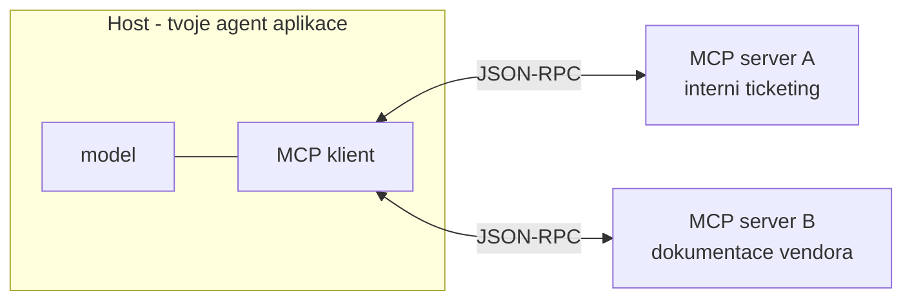

# Explainer · MCP — co to vlastně je a jak funguje

> Modul: `knowledge-grounding` · Typ: deep-dive k protokolu · ~10 min čtení
> Prostředí: viz [`../environment.md`](../environment.md) · Názvosloví: [`../GLOSSARY.md`](../GLOSSARY.md)

Kurz s MCP pracuje na dvou místech — jako s **přístupem k datům** (tento modul)
a jako s **cestou k nástrojům** ([`../actions-graph/`](../actions-graph/)). Tenhle
text doplňuje to, co obě místa předpokládají: co MCP ve skutečnosti je.

## Co MCP je

**Model Context Protocol** — otevřený standard (Anthropic, 11/2024; dnes napříč
industrií včetně Microsoftu) pro připojení **nástrojů a dat** k aplikaci s modelem.
Technicky: **JSON-RPC** přes definovaný transport, klient-server architektura.

Jedna věta, která zabrání většině nedorozumění: **MCP je USB-C pro nástroje —
standardizuje zásuvku, ne spotřebič.** Neříká nic o tom, co nástroj dělá, jak je
kvalitní ani komu patří. Říká jen, jak se připojí a jak se popíše.

## Tři role

- **Host** — aplikace, ve které žije model (tvůj custom engine agent, Copilot,
  VS Code…). Drží konverzaci a rozhoduje, co model uvidí.
- **Klient** — knihovní část v hostu; jedno spojení na jeden server.
- **Server** — proces, který nabízí schopnosti. Může běžet lokálně vedle agenta,
  nebo jako vzdálená služba někoho cizího.

Kdo píše co: server typicky **vlastník systému** (vendor ticketingu dodá MCP server
ke svému API), klient a host ty. Proto je MCP levná integrace — nástroj „je",
nepíšeš ho.

## Co server nabízí — tři primitiva

| Primitivum | Co to je | Analogie z kurzu |
|---|---|---|
| **Tools** | volatelné operace se JSON schématem parametrů | naše `create_ticket` — jen katalog drží server |
| **Resources** | data ke čtení (soubory, záznamy, výsledky dotazů) | chunky z retrievalu |
| **Prompts** | připravené šablony promptů pro časté úlohy | naše instrukce v knowledge zprávě |

V praxi dnešního M365 světa potkáš hlavně **tools** — a proto se v kurzu rozlišuje
MCP-jako-knowledge (tool, který čte) vs. MCP-jako-akce (tool, který mění stav).
Kategorie serveru nic negarantuje; **rozhoduje seznam nástrojů, ne marketing**.

## Transport a autentizace

- **stdio** — server běží jako lokální proces vedle hosta (typicky dev nástroje).
- **Streamable HTTP** — vzdálený server; autentizace řešená na úrovni HTTP (OAuth).
  Tohle je varianta pro firemní scénáře — a taky místo, kde se ptát „čí identita
  volá?": MCP samo o sobě **delegovanou identitu uživatele neřeší**, to je
  odpovědnost integrace. Srovnej s ACL trimmingem synced konektorů — přesně tenhle
  rozdíl dělá z federated konektorů „admin povolí, uživatel se autentizuje".

## Jak MCP potká tvůj kód z labu

Tool-call smyčka z [`../actions-graph/`](../actions-graph/lab-actions-and-graph.md)
se **nemění**. Rozdíl je jediný: dnes držíš katalog nástrojů ty (pole `tools`
v kódu, verzované v gitu) — s MCP se katalog **stáhne ze serveru** při připojení
(`tools/list`) a volání jde přes klienta (`tools/call`) místo tvého `executeTool`.

Z toho plynou obě tabulky v kurzu: kontrakt drží server a **může se změnit bez
tebe**; popisy nástrojů **vstupují do kontextu modelu** — nedůvěryhodný server tak
dodává instrukce do promptu (XPIA vektor, [`../middleware-policy/`](../middleware-policy/));
a validace, autorizace ani audit **nepřestávají být tvoje** jen proto, že nástroj
napsal někdo jiný.

## Kde MCP potkáš v M365 stacku

| Místo | Role MCP |
|---|---|
| **Federated konektory** | MCP nese živá, neindexovaná data do groundingu (tento modul) |
| **Agents Toolkit** | first-class: scaffold MCP serveru, připojení MCP tools k agentovi |
| **Copilot Studio** | MCP tools jako akce low-code agentů |
| **MCP Apps → SharePoint Copilot Apps** | rozšíření MCP o interaktivní UX; v M365 jako SPFx ([`../spfx-copilot-apps/`](../spfx-copilot-apps/)) |

## Kdy MCP a kdy ne

Rozhodovací tabulka je v [`../actions-graph/README.md`](../actions-graph/README.md)
(§ MCP jako nástroj) — zkratka: cizí systém s hotovým serverem a nízkým rizikem
→ MCP; akce s validací, autorizací per uživatel a auditní stopou → vlastní handler.
A pravidlo, které platí vždy: **MCP nezbavuje odpovědnosti.**

## Zdroje

- [Model Context Protocol — specifikace a dokumentace](https://modelcontextprotocol.io/)
- [MCP — referenční servery a SDK (GitHub)](https://github.com/modelcontextprotocol)
- [Extend agents with MCP — Copilot Studio](https://learn.microsoft.com/en-us/microsoft-copilot-studio/agent-extend-action-mcp)

## Stav produktu / delta

> [!WARNING] Ověřit k datu běhu — stav k 2026-08
> MCP spec se verzuje po měsících (transport se už jednou měnil: SSE → streamable
> HTTP) a podpora v Agents SDK / Toolkitu se vyvíjí rychleji než dokumentace.
> Před během ověřit aktuální verzi spec a rozsah podpory v Toolkitu; „MCP Apps"
> je pracovní název a může se změnit.
