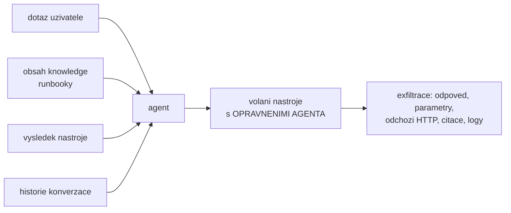
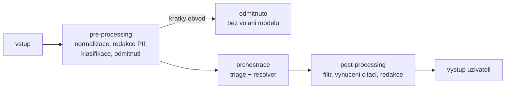

# Bezpečnost & middleware — útok a obrana jako kód

> Typ: povinný · Den: 4 · Odhad: **130 min** (45 výklad + 85 lab) · Publikum: **vývojáři / architekti**
> Multi-agent scope zmínku nahrazuje odkaz na D5 (`agent-framework` se učí až po tomto bloku).
> Prostředí: viz [`../../environment.md`](../environment.md) · Názvosloví: [`../../GLOSSARY.md`](../GLOSSARY.md)

Útok na **vlastního agenta studenta** — a hned potom obrana, která se skutečně vykoná.
Nejsilnější „aha" moment kurzu.

> [!IMPORTANT] Sloučený blok (rozhodnutí prvního běhu 2026-08-24)
> Vznikl spojením `middleware-policy` a `security-risk` ([`../../security-risk/`](../security-risk/)).
> Oba učily totéž z opačných stran: útok ukáže, že obrana v promptu nedrží — a middleware
> je ta odpověď. Postavené odděleně to znamenalo stavět obranu dvakrát a nechat XPIA
> dva dny bez odpovědi. Dramaturgie sloučeného bloku: **útok první, obrana jednou
> a pořádně.** Katalogová osnova má navíc „Responsible AI" jako zvláštní blok — v pro-code
> kurzu je guardrail kód v pipeline, ne slide.

## Cíle

- Rozumět **prompt injection** a **XPIA** (cross-prompt injection) — útoku přes obsah, ne dotaz.
- Postavit **middleware pipeline** kolem turnu: pre-processing a post-processing.
- Implementovat **redakci** a **filtrování výstupů**, které se vykonají i proti pokusu o obejití.
- Aplikovat **minimalizaci scope** — jedinou hranici, kterou nejde přemluvit.
- Vědět, co dělají **safety filtry platformy** a co ne, a kde končí sanitizace.

## Výklad

### 1. Model útoku na agenta

- Klasická aplikace zpracovává **data**. Agent zpracovává **text, který zároveň může být
  instrukce** — a nemá mechanismus, jak jedno od druhého oddělit. Hranice mezi daty a kódem,
  kterou v aplikacích držíme desítky let, tady **neexistuje**.
- Agent navíc na základě toho textu **volá nástroje pod svými vlastními oprávněními**.
  Nedůvěryhodný vstup tak nepřímo ovládá privilegovanou akci.
- To je učebnicový **confused deputy**: útočník k datům přístup nemá, ale agent ho má —
  a útočník ho přiměje jednat. Proto cílem obrany **není přesvědčit model**, ale zúžit,
  co může deputy vůbec udělat.
- **Vstupy, kterým agent nesmí věřit** (všechny jsou na diagramu níže): dotaz uživatele,
  obsah knowledge (runbooky), výsledek nástroje, historie konverzace. Poslední dva
  studenty překvapují nejvíc — obojí se do kontextu dostane bez lidské kontroly.
- **Kudy data odcházejí**: odpověď uživateli, parametry volání nástroje, odchozí HTTP,
  citace a odkazy, logy. Exfiltrace nemusí projít odpovědí — stačí, aby agent zavolal URL
  s daty v query stringu.

### 2. Prompt injection vs. XPIA

| | **Prompt injection** | **XPIA** (cross-prompt injection) |
|---|---|---|
| Útočník | uživatel v chatu | **autor obsahu**, který agent čte |
| Uživatel | je útočník | je **oběť** |
| Vektor | dotaz | dokument, e-mail, stránka, položka v listu, **výsledek nástroje** |
| Kdy se projeví | okamžitě | až se někdo zeptá na správné téma |
| Detekce | vidíš to ve vstupu | vstup vypadá nevinně — **ve vstupu to nevidíš** |

- Prompt injection zachytí i vstupní filtr. **XPIA ne** — nevinný dotaz projde a payload
  přijde až z retrievalu, tedy z místa, kde už mu agent věří.
- Útočníkem je u XPIA **kdokoli, kdo smí editovat zdroj**: autor runbooku, odesílatel
  e-mailu, provozovatel stránky, vlastník API, které agent volá.
- Přímý důsledek: **každé rozšíření knowledge nebo capabilities je rozšíření útočné
  plochy.** Tím se vrací bezpečnostní rozhodnutí z výběru capabilities v
  [`../../declarative-agents/`](../declarative-agents/) — tehdy jako pravidlo,
  teď jako model hrozby.

> [!IMPORTANT] Proč je XPIA jádro bloku
> Support Asistent čte **runbooky, které někdo napsal**. Kdokoli s právem editovat runbook
> může do něj vložit instrukce pro agenta. Uživatel, který se pak zeptá, je obětí — ne
> útočníkem. Tohle je reálný model hrozby pro agenty nad firemním obsahem.

### 3. Proč obrana v promptu nedrží

- V [`../prompt-orchestration/`](../prompt-orchestration/) (část D labu) měl agent
  v systémovém promptu explicitně napsáno, co nesmí — a **obejití přesto uspělo**. Není to
  chyba studenta ani špatně napsaný prompt; je to vlastnost mechanismu.
- **Instrukce v promptu je vstup do modelu, ne kontrola nad ním.** Konkuruje jí každý další
  token v kontextu — včetně toho útočníkova. Vyhrává statisticky, ne deterministicky.
- Tři úrovně síly obrany, které studenti slévají dohromady:

| Vrstva | Povaha | Jde přemluvit? |
|---|---|---|
| **Prompt** | doporučení pro model | **ano** |
| **Middleware** | kód, který se vykoná | ne — ale musíš ho napsat správně |
| **Oprávnění / scope** | hranice mimo agenta | **ne** |

- Lepší prompt zvedne laťku, ale dveře nezavře. Proto je pořadí bloku útok → **middleware**
  → scope, a proto se v labu prompt už neopravuje.
- Nejčastější reflex studenta po neúspěšné obraně je „napíšu ten prompt líp". Tady musí
  definitivně padnout: to je přechod z části A labu (útok) do části B (obrana v kódu).

### 4. Middleware pipeline kolem turnu

- **Middleware = kód, který obalí zpracování turnu.** Dostane vstup **před** orchestrací
  a výsledek **po** ní, a smí obojí změnit nebo zastavit.
- Zapojuje se v `AgentApplication` kolem handlerů turnu. **Konkrétní kontrakt v JS větvi
  Agents SDK ověřit k datu běhu** — liší se od C#. Fallback, který funguje vždy, je vlastní
  wrapper kolem handleru (`withPipeline(handler)`); funkčně je to totéž.
- **Pořadí je součást návrhu, ne detail.** Nejlevnější a nejjistější kontroly první:
  normalizace → odmítnutí mimo scope → redakce PII → **teprve pak model**.
- **Krátký obvod je nosná schopnost**: pre-processing musí umět turn ukončit **bez volání
  modelu** a vrátit připravenou odpověď. Nejlevnější obrana v celém kurzu.
- **Pipeline musí obalit všechny agenty.** Po [`../agent-framework/`](../agent-framework/)
  jsou dva — middleware nasazený jen kolem resolveru nechává triage nechráněný, a triage
  je přitom první, kdo vidí útočníkův text. Ověřuje se **logem, ne dojmem**.
- Middleware je testovatelný **bez modelu**: vstup dovnitř, verdikt ven. Tím se z obrany
  stává regresní test — vstup do [`../../evaluation-quality/`](../evaluation-quality/).

### 5. Pre-processing a post-processing

| | **Pre-processing** | **Post-processing** |
|---|---|---|
| Kdy běží | před voláním modelu | po odpovědi modelu |
| Cena | **nula tokenů** | model už proběhl a je zaplacený |
| Typické kroky | normalizace vstupu, redakce PII, klasifikace záměru, odmítnutí mimo scope | filtr výstupu, vynucení formátu a citací, redakce, zablokování odpovědi bez podkladu |
| Co neumí | nezná odpověď — rozhoduje jen z dotazu | nezabrání tomu, aby model data vůbec viděl |

- **Ekonomika obrany**: odmítnout před modelem je zdarma, odmítnout po něm stojí plnou cenu
  turnu. U dotazu 4 ze scénáře je to měřitelný rozdíl — a v labu se měří.
- **Redakce PII před odesláním modelu** má i jiný důvod než cenu: co model nedostal, to
  nemůže uniknout do odpovědi ani do logů poskytovatele inference.
- **Post-processing blokuje, nepřepisuje.** Přepsat odpověď bez podkladu znamená vyrobit
  lépe vypadající halucinaci. Správná reakce je „nemám podklad" + nabídka eskalace.
- Tři nástroje, které studenti zaměňují — různá cena i dopad na uživatelský zážitek:
  **redakce** (odpověď zůstane, data zmizí), **filtrování** (zmizí část odpovědi),
  **odmítnutí** (odpověď nevznikne).

### 6. Minimalizace scope — jediná nepřemluvitelná hranice

Least privilege prakticky, seřazeno od nejsilnějšího:

1. **Delegated místo app-only.** Agent dědí oprávnění uživatele — co uživatel nevidí,
   nevidí ani agent. App-only je pohodlné a je to **nejčastější zdroj exfiltrace u agentů**
   (protipříklad z [`../../actions-graph/`](../actions-graph/), část D labu).
2. **Per-akce scope, ne per-agent.** „Agent smí volat Graph" ≠ „tahle akce to smí pro
   tohoto uživatele". Autorizace patří k akci, ne k aplikaci.
3. **Whitelist nástrojů.** Model nesmí zavolat nic, co není explicitně povolené pro daný
   krok. Triage `CreateTicket` nepotřebuje — tak ho k němu nepouštěj.
4. **Whitelist cílů odchozího volání.** Bez něj je exfiltrace jedno HTTP volání daleko,
   i kdyby byla odpověď dokonale vyfiltrovaná.
5. **Oddělené identity pro agenty** (Microsoft Entra Agent ID). Triage a resolver nemusí mít
   stejná práva; dohledatelnost i lifecycle jsou pak per agent —
   [`../../agent-365-governance/`](../agent-365-governance/).

- **Test kvality scope**: vezmi útok z části A labu a zeptej se, co by **nezmohl ani
  kdyby middleware neexistoval**. Co zůstane, je skutečná hranice. Zbytek je jen dobře
  napsaný kód, který někdo příště změní.
- Scope je poslední krok bloku **záměrně**: prompt padne → middleware drží → ale hranice
  je oprávnění. Studenti chtějí začít u promptu, a to je přesně opačné pořadí.
- **Nulté opatření: krok, který neprochází modelem, se nedá promptovat.** Než začneš
  obranu psát, zeptej se, jestli ten krok model vůbec potřebuje — volání API, parser
  nebo výpočet nemá útočnou plochu, kterou tenhle blok celou dobu ošetřuje. Není to
  úspora nákladů, je to **odstranění vektoru**. Postup:
  [`../../actions-graph/explainer-deterministic-first.md`](../actions-graph/explainer-deterministic-first.md).

### 7. Safety filtry platformy — a co neřeší

- Platforma (content filtry, prompt shields) řeší **obecný škodlivý obsah v definovaných
  kategoriích** a známé jailbreak vzory. Je to užitečná vrstva a zapíná se **konfigurací,
  ne kódem**.
- **Neřeší** tvůj scope, tvoje business politiky, oprávnění, co je v téhle firmě citlivé,
  ani jestli má odpověď podklad. Dotaz „Kolik bere kolega Novák?" **není škodlivý obsah** —
  je to legitimní věta, kterou tenhle konkrétní agent nesmí zodpovědět. Žádný platformní
  filtr to za tebe nerozhodne.
- Filtry navíc **nevidí tvůj kontext**: nevědí, kdo se ptá, co má v oprávněních a co je
  v tomhle zadání mimo scope.
- Praktický závěr: platformní filtry ber jako **spodní hranici**, ne jako obranu.
  Tvoje politiky jsou tvůj kód.
- Aktuální kategorie a default konfiguraci **enumerovat proti dokumentaci před během**,
  ne z hlavy.

### 8. Sanitizace a mitigace halucinací — vynucení vs. naděje

- **Naděje**: „v promptu mu napíšu, ať si nevymýšlí." Měřitelně to pomůže a spolehlivě
  to nevyřeší nic. Přesto je to reflex, se kterým studenti přicházejí i po D2.
- **Vynucení** — všechno v post-processingu, všechno kód:
  - **vyžadování citace**: odpověď bez odkazu na konkrétní runbook se **zablokuje**;
  - **whitelist témat**: mimo něj se neodpovídá, i kdyby model odpověď měl;
  - **strukturovaný výstup s ověřením**: model vrací `answer` + `sources`, kód ověří, že
    `sources` odkazují na dokumenty, které retrieval v tomto turnu **skutečně vrátil**;
  - **fallback místo výmluvy**: „nemám podklad" + nabídka eskalace přes `CreateTicket`.
- **Sanitizace** umí formáty, PII vzory, odkazy a znakové triky (neviditelné znaky,
  homoglyfy). **Neumí sémantiku** — nepozná, že věta je pravdivá, ale nesmí zaznít.
- Proto je sanitizace **poslední vrstva, ne první obrana**. První je scope, druhá je
  odmítnutí před voláním modelu.

### 9. Watermarking — poctivá odpověď

> [!IMPORTANT] Změna proti katalogové osnově
> Publikovaná osnova uvádí „sanitizace výstupů a **watermarking** (kde dává smysl)".
> Watermarking textových odpovědí agenta nemá robustní obranný přínos — snadno se odstraní
> a exfiltraci nezabrání. Nahrazeno **prompt injection / XPIA**, což je reálný a aktuální
> model hrozby. Místo watermarkingu má smysl **auditní stopa a detekce**
> ([`../../agent-365-governance/`](../agent-365-governance/)).

## Klíčové rozlišení

- **Prompt injection** (útočník = uživatel) vs. **XPIA** (útočník = autor obsahu, uživatel
  je oběť).
- **Obrana v promptu** (přemluvitelná) vs. **middleware** (vykoná se) vs. **oprávnění**
  (nepřemluvitelná) — třetí je jediná skutečná hranice.
- **Safety filtry platformy** (obecný škodlivý obsah) vs. **tvoje politiky** (scope, PII,
  business pravidla).
- **Pre-processing** (levné odmítnutí před voláním modelu) vs. **post-processing** (drahé,
  model už proběhl) — ekonomika obrany.
- **Sanitizace** (poslední vrstva) vs. **scope minimalizace** (první vrstva).
- **Prevence** vs. **detekce** — u agentů potřebuješ obojí, prevence nikdy není úplná.

## Naše prostředí

Hands-on, bez tenantu — potřebuje **model endpoint**. Útok se vede na **studentova vlastního
agenta**, na lokálních datech. Do knihovny `Runbooky` v tenantu se injection **nevkládá** —
používá se lokální kopie (viz fallback v labu). Middleware se testuje i offline (unit testy
nad pipeline bez volání modelu) — naváže [`../../evaluation-quality/`](../evaluation-quality/).

## Lab

Viz [`lab-middleware-pipeline.md`](lab-middleware-pipeline.md). Referenční řešení v `solution/`.

## Nosná linka

Support Asistent je nejdřív **napaden přes obsah runbooku** — a obrana z promptu
(D3 `prompt-orchestration`) padne. Pak dostává middleware, který pokrývá **oba** agenty
z [`../agent-framework/`](../agent-framework/): dotaz 4 ze
[`../../scenario-support-agent.md`](../scenario-support-agent.md) už není odmítnutý
promptem, ale **kódem** — a student to umí dokázat proti pokusu o obejití. Nakonec opravuje
**scope**, ne prompt.

## Zdroje (Microsoft)

- [Prompt shields — Microsoft Foundry](https://learn.microsoft.com/en-us/azure/ai-services/content-safety/concepts/jailbreak-detection)
- [Content filtering — Microsoft Foundry](https://learn.microsoft.com/en-us/azure/ai-foundry/openai/concepts/content-filter)
- [Responsible AI in Microsoft Foundry](https://learn.microsoft.com/en-us/azure/ai-foundry/responsible-use-of-ai-overview)
- [AgentApplication in Microsoft 365 Agents SDK](https://learn.microsoft.com/en-us/microsoft-365/agents-sdk/agent-application)
- [Governing agent identities — Entra ID Governance](https://learn.microsoft.com/en-us/entra/id-governance/agent-id-governance-overview)
- [Microsoft Graph permissions reference](https://learn.microsoft.com/en-us/graph/permissions-reference)

## Stav produktu / delta

> [!WARNING] Ověřit k datu běhu — stav k 2026-08.
> Ověřit, že **útok v labu na aktuálním modelu skutečně funguje** — modely se proti známým
> vzorům zpevňují a lab bez fungujícího útoku ztrácí smysl. Obranné mechanismy platformy
> (prompt shields, spotlighting) se aktivně vyvíjejí — ověřit, co je default. Rovněž ověřit
> **middleware kontrakt v JS Agents SDK** (liší se od C# větve; fallback je wrapper kolem
> handlerů).
