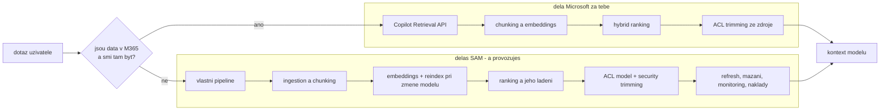

# Vlastní retrieval: chunking, embeddings, hybrid ranking

> Typ: **samostudium** (demo vyřazeno při třetí rekalibraci 2026-08-26) · Odhad: 105 min čtení · Publikum: **vývojáři / architekti**
> Zájem skupiny o retrieval z velké části pokryl **ŽIVÝ semantic index s ACL** odučený v `knowledge-grounding` (D3).
> Prostředí: viz [`../../environment.md`](../environment.md) · Názvosloví: [`../../GLOSSARY.md`](../GLOSSARY.md)

> [!NOTE] Kde se téma v kurzu odučí
> Rozhodovací část („stavět, nebo pronajmout?") jede v **bloku 0 dne 5** —
> [`../../agent-landscape/explainer-vlastni-retrieval.md`](../agent-landscape/explainer-vlastni-retrieval.md)
> to vykládá na kódu, který studenti sami napsali v `knowledge-grounding`.
> Tenhle modul je hloubka pod tím rozhodnutím, ne jeho náhrada.

> [!IMPORTANT] Proč je tento modul volitelný
> Katalogová osnova staví vlastní vektorizaci a RAG design jako **povinné jádro**. V kontextu
> Microsoft 365 to je zastaralé rámování: retrieval nad tenant obsahem dělá **semantic index**
> včetně vynucení permissions. Vlastní vektorizace je **rozhodnutí s cenovkou**, ne výchozí stav.
> Proto je to volitelný **leaf** modul — nic povinného na něm nezávisí a je to první kompresní
> ventil dne.

## Cíle
- Vědět, **kdy** vlastní retrieval má smysl — a kdy je to zbytečná odpovědnost.
- Rozumět chunkingu, embeddingům a **hybrid semantic ranking** na úrovni návrhových rozhodnutí.
- Umět pojmenovat kompromis **latence vs. relevance** a co ho v praxi rozhoduje.
- Vědět, co všechno si s vlastním úložištěm bereš na krk (ACL, refresh, ladění, náklady).

## Výklad

### Kdy ano a kdy ne

Výchozí stav je **semantic index** — retrieval nad tenant obsahem včetně vynucení
oprávnění dělá platforma (viz [`../knowledge-grounding/`](../knowledge-grounding/)).
Vlastní pipeline potřebuje důvod, který se dá napsat do jedné věty.

**Vlastní retrieval dává smysl, když:**

- **data nejsou v M365** a nejde na ně postavit synced Copilot connector — legacy databáze,
  on-prem systém bez konektoru, proprietární formát;
- **potřebuješ vlastní ranking** — doménové boostování, řazení podle business atributů,
  filtry, které se v semantic indexu nedají vyjádřit;
- **data se do Graph indexu nesmí dostat** — regulace, smluvní omezení, klasifikace,
  která zakazuje replikaci obsahu do M365 indexu;
- **agent běží mimo M365** (vlastní web aplikace, jiný kanál) a nemá M365 uživatelský
  kontext, o který by se retrieval opřel.

**Vlastní retrieval nedává smysl, když:**

- obsah leží v SharePointu nebo OneDrive a semantic index ho už indexuje — Copilot
  Retrieval API vrátí chunky včetně ACL trimmingu a nic nereplikuje;
- jediným motivem je „chceme mít RAG pod kontrolou" — kontrolou tady začíná provozní
  závazek, ne architektonická výhoda;
- tým nemá, kdo by index provozoval po odchodu autora — ACL a refresh nejsou jednorázová
  práce (viz níže).

> [!NOTE] Rozhodnutí není binární
> Hybrid je běžný: semantic index nad tenant obsahem **plus** vlastní index nad jedním
> externím zdrojem. Rozhoduje se per zdroj dat, ne per agent.

### Chunking

Chunk je **jednotka relevance** — retrieval nevrací dokument, ale kus dokumentu, a přesně
ten kus skončí v kontextu modelu. Návrhová rozhodnutí jsou čtyři:

- **Velikost.** Malý chunk = přesný zásah, ale utržený od kontextu (krok postupu bez toho,
  čeho se týká). Velký chunk = kontext ano, ale ředí relevanci a spálí víc tokenů na každý
  dotaz. Optimum je vlastnost dat, ne konstanta — měří se, ne odhaduje.
- **Překryv (overlap).** Sousední chunky se částečně překrývají, aby řez neuťal větu nebo
  krok napůl. Cena: duplicitní obsah v indexu a víc zásahů na totéž.
- **Respektování struktury.** Řezat na hranicích, které dokument sám má — nadpisy sekcí,
  kroky postupu, řádky tabulky. Runbook má strukturu; ignorovat ji je aktivní ztráta
  informace.
- **Metadata na chunku.** Minimálně: URL zdrojového dokumentu, nadpis sekce, verze a datum,
  klíč oprávnění. **Bez zdroje v metadatech nelze vygenerovat citaci** — a citace je
  požadavek scénáře (dotaz 1).

> [!IMPORTANT] Nejčastější chyba
> Chunking po pevném počtu znaků bez ohledu na strukturu. U runbooku to rozsekne tabulku
> SLA na dvě půlky a postup na kroky bez hlavičky. Agent pak odpoví polovinu postupu —
> a zní přitom naprosto jistě. Chyba vznikne v ingestion pipeline a projeví se jako
> „model halucinuje".

### Embeddings

- **Volba modelu** je kompromis kvalita / dimenze / cena / latence. Pro české runbooky
  s anglickou terminologií ověřit chování na jazykovém mixu — vícejazyčnost embedding
  modelu se nedá předpokládat, testuje se na vlastních datech.
- **Dimenze** vektoru určuje velikost indexu, cenu úložiště a rychlost vyhledávání.
  Část modelů umí zkrácenou dimenzi s malou ztrátou kvality — ověřit u konkrétního modelu,
  ne zobecňovat.
- **Cena** se platí dvakrát: při ingestion (a znovu při každém reindexu) a při **každém
  dotazu** (dotaz se musí embeddovat taky). Konkrétní sazby patří do přípravy k datu běhu
  (viz Stav produktu), ne do materiálu.
- **Verzování je jádro.** Embeddingy z různých modelů — i z různých verzí téhož modelu —
  **nejsou vzájemně porovnatelné**. Míchat je v jednom indexu znamená tiše rozbitou
  relevanci.

> [!IMPORTANT] Změna embedding modelu = reindex všeho
> Není to konfigurační přepínač, je to **lifecycle závazek**: přepočítat celý korpus,
> a to buď s výpadkem, nebo přes druhý index a přepnutí. Deprecace embedding modelu
> poskytovatelem je tedy provozní událost, kterou musí někdo hlídat. Praktické minimum:
> mít verzi embedding modelu zapsanou v metadatech indexu a v runbooku provozu.
> Souvislost s výměnou modelů obecně řeší
> [`../../perf-cost-lifecycle/`](../perf-cost-lifecycle/).

### Hybrid semantic ranking

Tři vrstvy, které se skládají:

| Vrstva | Co dělá | Kde je silná |
|---|---|---|
| **Keyword (lexikální)** | shoda termínů, klasické full-text skóre | přesné řetězce: kódy chyb, názvy systémů, zkratky, čísla verzí |
| **Vektorové skóre** | blízkost embeddingu dotazu a chunku | jiná formulace téhož („nejde mi upload" vs. „chyba oprávnění při nahrávání") |
| **Re-ranking** | model přeřadí top-N kandidátů podle dotazu | finální pořadí; opravuje případy, kde obě skóre selhávají |

- **Proč čistý vektorový search u firemních dokumentů často prohrává:** firemní obsah je
  plný přesných identifikátorů. Vektor „access denied" rozmaže na *něco o oprávněních*
  a vrátí obecný runbook místo toho konkrétního. Lexikální vrstva tenhle typ zásahu trefí
  přesně.
- **Proč nestačí ani čistý keyword:** uživatel se ptá jinými slovy, než jsou v runbooku.
  Přesně to je důvod, proč se sémantické vyhledávání zavádělo.
- **Hybrid** = kandidáti z obou cest se sjednotí a re-ranker rozhodne pořadí. Je to
  nejlevnější kvalitativní zlepšení celé pipeline — a první věc, kterou zkusit, když
  „retrieval vrací nesmysly".
- Re-ranking má cenu: je to další volání modelu na každý dotaz. Proto se pouští jen nad
  omezeným počtem kandidátů, ne nad celým výsledkem.

### Latence vs. relevance

- **Kde se platí latencí:** počtem kandidátů (širší recall = víc práce pro re-ranker),
  samotným re-rankingem (další volání modelu) a velikostí kontextu předaného modelu
  (víc vstupních tokenů = pomalejší i dražší generování).
- **Pásmo „víc kandidátů = lepší odpověď" končí.** Za ním roste jen latence a cena —
  a kvalita může i klesnout, protože se správný chunk utopí v šumu.
- **Rozpočet místo ladění naslepo:** stanovit cílovou latenci turnu a rozdělit ji mezi
  retrieval, re-ranking a generování. Bez rozpočtu se optimalizuje podle dojmu.
- **Měřit, ne hádat.** Každou změnu (počet kandidátů, velikost chunku, zapnutý re-ranking)
  proti stejné sadě dotazů a porovnávat kvalitu i latenci současně. Metodiku dodá
  [`../../evaluation-quality/`](../evaluation-quality/), ekonomiku
  [`../../perf-cost-lifecycle/`](../perf-cost-lifecycle/).

### ACL — nejdrazší část, na kterou se zapomíná

Semantic index vynucuje oprávnění **ze zdroje**: dotaz běží pod identitou uživatele,
trimming dělá Microsoft, agenta se to nedotkne. U vlastního úložiště přebíráš celý mechanismus:

| Odpovědnost | Co to konkrétně znamená | Co se stane, když se zanedbá |
|---|---|---|
| **Model oprávnění** | ke každému chunku uložit klíče (skupiny, role), které ho smí vidět | není podle čeho filtrovat |
| **Security trimming v dotazu** | filtr podle skupin volajícího vyhodnocený **v dotazu na index**, ne až nad výsledky | post-filtr vrací prázdné stránky a obsah uniká do logů a citací |
| **Rozvinutí členství** | vnořené skupiny, dynamické skupiny, hosté; kešované členství stárne | uživatel vidí víc nebo míň, než má |
| **Refresh při změně obsahu** | reindex po editaci dokumentu | agent cituje neplatný postup |
| **Refresh při změně oprávnění** | reindex/aktualizace klíčů po odebrání přístupu | okno mezi změnou a reindexem je **okno úniku** |
| **Mazání a retence** | smazané a přesunuté dokumenty, retenční politiky, DSR požadavky | index je kopie dat a platí pro něj stejné povinnosti jako pro zdroj |

> [!IMPORTANT] Nejčastější zdroj exfiltrace u vlastních RAG řešení
> Nejsou to chytré prompty, ale **index bez trimmingu nebo se zastaralými ACL**. Model se
> přitom chová správně — jen mu předáš chunk, který uživatel nikdy neměl vidět. Obrana
> v promptu tady nepomůže vůbec (viz [`../../middleware-policy/`](../middleware-policy/)):
> data se do kontextu dostala legitimní cestou tvé vlastní pipeline.

- Doteky se scénářem: ve stejném webu jako `Runbooky` leží i list Zaměstnanci. Dotaz 4
  („kolik bere kolega Novák") je spolehlivě odmítnutý jen tehdy, když se ta data do indexu
  buď vůbec nedostanou, nebo je trimming odfiltruje **před** sestavením kontextu.
- Praktické pravidlo: ACL a refresh jsou **provozní** položky, ne implementační. Zaplatí se
  každý měsíc, ne jednou při nasazení — a to je hlavní obsah cenovky v labu.

## Klíčové rozlišení
- **Semantic index** (Microsoft dělá relevance i ACL trimming) vs. **vlastní úložiště**
  (děláš oboje ty, včetně odpovědnosti za úniky).
- **Chunking** (jak se dokument rozseká) vs. **retrieval** (co se vybere) vs. **ranking**
  (v jakém pořadí) — tři různá místa, kde se dá zkazit relevance.
- **Změna embedding modelu** = reindex všeho, ne konfigurační přepínač.

## Naše prostředí

**Instruktorské demo** — vyžaduje Azure subscription (Azure AI Search / Foundry), kterou
studenti pod baseline `spdemo.online` + PAYG nemají. Viz matice v
[`../../environment.md`](../environment.md). Studentská část labu je **návrhová**.

## Lab
Viz [`lab-retrieval-design.md`](lab-retrieval-design.md).

## Nosná linka
Support Asistent se **nemění** — a to je pointa. Student na jeho příkladu odůvodní, proč
vlastní retrieval **nepotřebuje**, a pojmenuje jedno rozšíření scénáře, kde by ho potřeboval.

## Zdroje (Microsoft)
- [Copilot connectors overview](https://learn.microsoft.com/en-us/microsoft-365/copilot/connectors/overview)
- [Hybrid search — Azure AI Search](https://learn.microsoft.com/en-us/azure/search/hybrid-search-overview)
- [Semantic ranking — Azure AI Search](https://learn.microsoft.com/en-us/azure/search/semantic-search-overview)
- [Security filters for trimming results — Azure AI Search](https://learn.microsoft.com/en-us/azure/search/search-security-trimming-for-azure-search)

## Stav produktu / delta

> [!WARNING] Ověřit k datu běhu — stav k 2026-08.
> Ceny Azure AI Search tiers a dostupnost integrovaného vektorizování se mění. Neuvádět
> konkrétní ceny bez ověření. Rovněž ověřit, jestli federated konektory (MCP) mezitím
> nepokryly část scénářů, pro které se dnes staví vlastní pipeline — to by tento modul
> ještě zúžilo.
