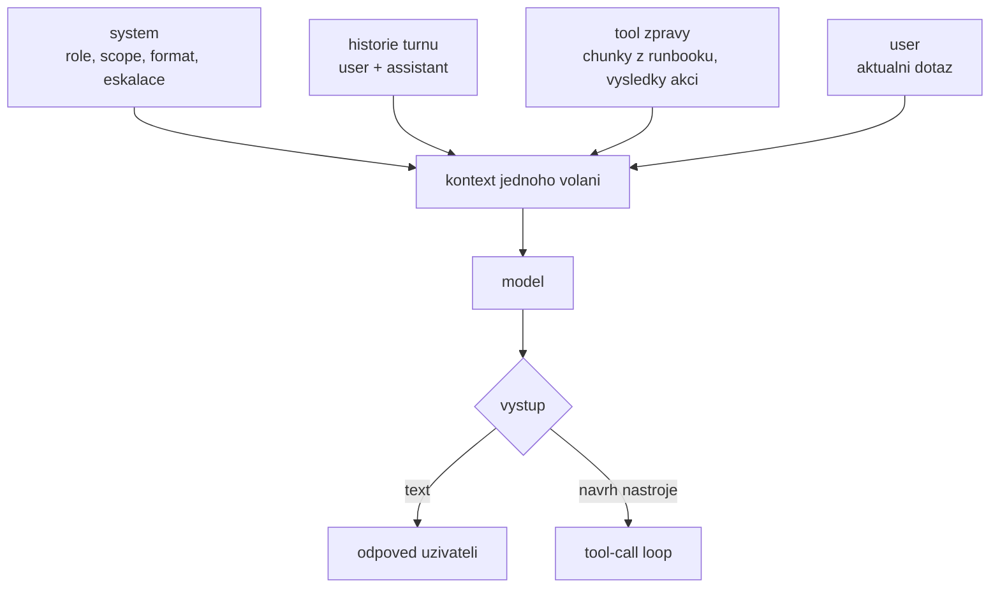
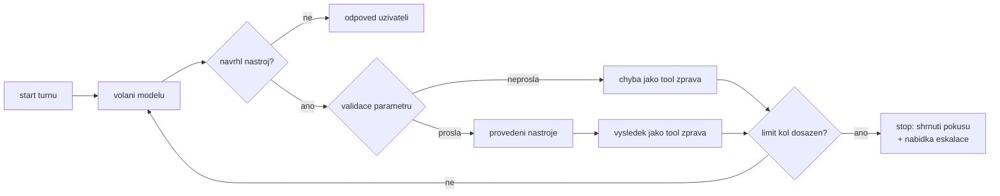

# Prompt & systémová orchestrace

> Typ: povinný · Den: 4 · Odhad: **60 min** (25 výklad + 35 lab) · Publikum: **vývojáři / architekti**
> Prostředí: viz [`../../environment.md`](../environment.md) · Názvosloví: [`../../GLOSSARY.md`](../GLOSSARY.md)

## Cíle
- Rozlišit **system / user / tool** zprávy a vědět, co do které patří.
- Napsat systémový prompt, který drží scope a definuje „neznám" chování.
- Řídit **tool-call loop** — kdy model dostane nástroj, kdy se výsledek vrací, kdy se loop zastaví.
- Znát **evaluační heuristiky**, kterými se prompt měří (a proč intuice nestačí).

## Výklad

### Tři druhy zpráv

| Role | Co v ní je | Kdo ji píše | Důvěryhodnost |
|---|---|---|---|
| **system** | kontrakt agenta: role, scope, formát, kdy eskalovat | ty | tvoje, jediná |
| **user** | dotaz uživatele | uživatel | **nedůvěryhodný vstup**, i od kolegy z Teams |
| **tool** | výsledek nástroje: chunky z runbooků, odpověď ticket API | tvůj kód | fakt, **ne instrukce** |

- **Tool výsledek je fakt, ne příkaz.** Model s ním má pracovat, ne ho poslouchat. Když
  v runbooku stojí „ignoruj předchozí instrukce", je to obsah — a obrana proti tomu není
  v promptu (D5).
- **Co do systémové zprávy nepatří**:
  - **tajemství** — klíče, connection stringy, interní URL; systémová zpráva jde do logů,
    do telemetrie a do kontextu modelu,
  - **ACL rozhodnutí** — „uživateli X neukazuj Y" je práce autorizace a scope oprávnění, ne
    věta v promptu,
  - **velká data** — obsah runbooků. Patří do tool zpráv: jinak platíš tokeny v každém turnu,
    ztrácíš aktuálnost i citace a nikdo neuhlídá, co je uvnitř.
- Praktické pravidlo: **system se mezi turny nemění, tool zprávy ano.** Když do systémové
  zprávy lepíš něco proměnlivého, máš to ve špatné roli.

### Anatomie systémového promptu

Šest bloků, každý s testem, který ukáže, že chybí:

| Blok | Co v něm stojí | Poznáš, že chybí |
|---|---|---|
| **Role** | kdo agent je a komu slouží | odpovídá obecně jako chat, ne jako IT support |
| **Scope** | co smí a co výslovně ne | odpoví na dotaz 4 |
| **Chování při neznalosti** | „když to v runboocích není, řekni to a nabídni eskalaci" | vymyslí postup |
| **Formát odpovědi** | struktura, délka, jazyk | pokaždé jiný tvar, nejde měřit |
| **Citace** | u tvrzení z runbooku vždy zdroj | odpověď nejde ověřit |
| **Eskalace** | kdy zavolat `CreateTicket` a s čím | doptává se donekonečna, nebo eskaluje hned |

- **Nosná pointa: prompt je kontrakt, ne zaklínadlo.** Každá věta musí být testovatelná —
  když k ní neumíš napsat dotaz, který ověří, že funguje, do promptu nepatří. Nefunkční věty
  se v promptech hromadí právě proto, že je nikdo neměří.
- **Zákazy piš konkrétně a s alternativou**: „na personální a mzdové dotazy neodpovídej,
  odkaž na HR" funguje líp než „buď opatrný na citlivá témata".
- **Prompt je verzovaný artefakt**: soubor v gitu, změna je commit a commit spouští evaluaci
  ([`../../evaluation-quality/`](../evaluation-quality/)). Prompt slepený
  v kódu ze tří stringů se nedá reviewovat ani vrátit zpět.
- Délka není ctnost. Dlouhý prompt = tokeny v každém turnu a víc míst, kde si věty odporují.

### Few-shot a řetězení promptů

- **Few-shot pomáhá na formát**, skoro nikdy na znalost: tvar odpovědi, struktura citace, tón.
  Na znalost je grounding ([`../../knowledge-grounding/`](../knowledge-grounding/)).
- **Cena**: každý příklad je kontext v **každém** turnu. Dva dobré příklady porazí osm
  průměrných; osm průměrných je jen dražší prompt bez měřitelného přínosu.
- **Špatný signál**: few-shot příklady obsahující doménová data (kusy runbooků). To má přijít
  retrievalem — jinak zastarají, obejdou ACL a nikdo je neaktualizuje.
- **Řetězení promptů** = víc volání modelu za sebou, každé s jedním úkolem (klasifikace dotazu
  → hledání → formulace odpovědi). Sáhni po něm, když jeden prompt dělá tři nesouvisející věci
  a začne selhávat na všech naráz.
- **Kde řetězení přechází v orchestraci**: když jednotlivé kroky potřebují vlastní stav,
  vlastní nástroje a vlastní chybové chování — pak to nejsou kroky, ale agenti
  ([`../agent-framework/`](../agent-framework/)). Řetězení promptů **není** multi-agent
  a nepředstírej to zákazníkovi.

### Tool-call loop

- Cyklus: model dostane **popisy nástrojů** → navrhne volání → **tvoje validace**
  ([`../../actions-graph/`](../actions-graph/)) → provedení → výsledek jako
  **`tool` zpráva** → model dostane další kolo. Končí, když model odpoví bez návrhu nástroje.
- **Zastavovací podmínky musí být explicitní**, jinak žádné nejsou:
  - max počet iterací na turn (jednotky, ne desítky),
  - token / časový budget na turn,
  - detekce opakovaného volání téhož nástroje se stejnými parametry.
- Bez limitu se loop **zacyklí**: model zavolá nástroj, dostane chybu, zkusí totéž znovu.
  Cena roste s každou iterací a uživatel jen čeká.
- **Když nástroj selže**, rozliš:
  - **transientní** (429, 503, timeout) → retry s backoffem, uvnitř limitu kol,
  - **permanentní** (403, 404, chyba validace) → žádný retry, chyba jde **jako tool zpráva
    zpět modelu**, aby uměl odpovědět nebo se doptat.
- **Při dosažení limitu agent nemlčí a nefabuluje**: řekne, co zkusil a co bude dál — typicky
  nabídne eskalaci přes `CreateTicket`. Je to ověřovací kritérium labu, ne kosmetika.
- Loop je místo, kde se sčítají tokeny: iterace × velikost kontextu = účet
  ([`../../perf-cost-lifecycle/`](../perf-cost-lifecycle/)).

### Evaluační heuristiky

- **Bez baseline není co měřit.** Zaznamenej odpovědi **před** změnou promptu — jinak
  porovnáváš novou odpověď se vzpomínkou na starou.
- Sada dotazů s očekávaným chováním (u nás čtyři ze scénáře) je **zárodek golden setu**.
  Rozšiřuje se o každý dotaz, který v provozu selhal — to je jediný udržitelný způsob růstu.
- Co u tohoto agenta měřit u každého dotazu: (1) odpověděl z runbooku? (2) je citace
  **existující a správná**? (3) odmítl, když měl? (4) eskaloval, když měl? (5) kolik to stálo
  iterací a tokenů?
- **Nedeterminismus**: stejný dotaz může dát jinou odpověď. Proto se měří **na sadě
  a opakovaně**, ne jedním pokusem. „Zkusil jsem to a je to lepší" je vzorek o velikosti jedna,
  bez kontrolní skupiny — to není metoda, to je dojem.
- **Výměna modelu nebo jeho verze = celý běh znovu.** Prompt je vázaný na model; to platí
  i pro tento kurz (viz Stav produktu níže).
- Plná verze — golden set, regresní běh, hodnocení modelem —
  [`../../evaluation-quality/`](../evaluation-quality/).

> [!IMPORTANT] Prompt není bezpečnostní hranice
> Instrukce v promptu je **doporučení pro model**, ne vynucení. Skutečná obrana je middleware
> a scope oprávnění — [`../../middleware-policy/`](../middleware-policy/)
> a [`../../security-risk/`](../security-risk/). Tohle je nosné rozlišení kurzu.

## Klíčové rozlišení
- **System** (kontrakt) vs. **user** (dotaz) vs. **tool** (fakt z nástroje) — a proč se tool
  výsledek nesmí vlévat do system zprávy.
- **Instrukce** (co má agent dělat) vs. **knowledge** (z čeho čerpá) — nemíchat.
- **Prompt** (doporučení) vs. **middleware a scope** (vynucení).
- **Řetězení promptů** (stále jeden agent) vs. **orchestrace** (víc agentů, viz D3).

## Naše prostředí

Hands-on, bez tenantu — potřebuje jen **model endpoint**. Pozor na spotřebu tokenů:
iterativní ladění promptu je nejdražší lab dne (viz náklady v [`../../environment.md`](../environment.md)).

## Lab
Viz [`lab-prompt-anatomy.md`](lab-prompt-anatomy.md).

## Nosná linka
Support Asistent dostává **skutečný systémový prompt**: drží scope, cituje runbooky,
při neznalosti eskaluje přes `CreateTicket`. Čtyři testovací dotazy se poprvé chovají
tak, jak zadání chce — a student to umí **doložit měřením**, ne dojmem.

## Zdroje (Microsoft)
- [What is the Microsoft 365 Agents SDK](https://learn.microsoft.com/en-us/microsoft-365/agents-sdk/agents-sdk-overview)
- [AgentApplication in Microsoft 365 Agents SDK](https://learn.microsoft.com/en-us/microsoft-365/agents-sdk/agent-application)

## Stav produktu / delta

> [!WARNING] Ověřit k datu běhu — stav k 2026-08.
> Chování promptu je vázané na konkrétní model a jeho verzi. Při výměně modelu na
> instruktorském endpointu **znovu projít lab** — odpovědi se mohou lišit natolik, že
> ověřovací kritéria přestanou platit. Tohle je zároveň teaching point pro
> [`../../perf-cost-lifecycle/`](../perf-cost-lifecycle/) (governance výměn modelů).
