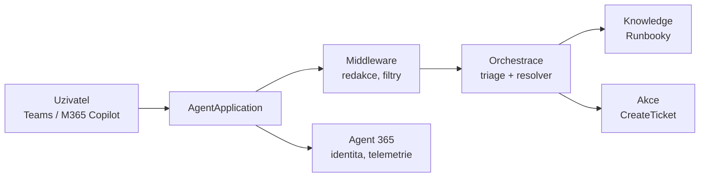

# Scénář · Support Asistent — nosná linka celého týdne

Sdílený běžící příklad. Odkazují se na něj laby všech dnů. Cíl: student neodchází s 16
nesouvisejícími ukázkami, ale s **jedním agentem**, který každý blok něco získal — a s
architekturou, kterou umí obhájit před zákazníkem.

> [!IMPORTANT] Data
> Výhradně **fiktivní kurzovní data**. Instruktorský model endpoint znamená inference mimo
> studentský tenant (viz [`environment.md`](environment.md)) — reálná zákaznická
> ani personální data do labů nikdy nepatří.

## Zadání (fiktivní zákazník)

Firma má interní IT support. Runbooky (postupy řešení) leží v knihovně SharePointu,
tikety v ticketing systému (v kurzu mockované API). Uživatelé se ptají v Teams a
v Microsoft 365 Copilotu. Support je zavalený opakovanými dotazy.

Chtějí agenta, který:

1. odpoví z runbooků, když odpověď existuje;
2. **nevymýšlí**, když ji nezná;
3. umí založit tiket, když si neporadí;
4. neprozradí nic, co uživatel nesmí vidět;
5. je auditovatelný a měřitelný v provozu.

Bodů 1–2 dosáhne i deklarativní agent. Body 3–5 jsou důvod, proč tenhle kurz existuje.

## Datový podklad

| Artefakt | Kde | Vzniká |
|---|---|---|
| Knihovna `Runbooky` (4 postupy) | `/sites/hr-demo` | seed skript, viz [`scripts/`](scripts/) |
| Zaměstnanci (list) | `/sites/hr-demo` | seed skript |
| Mock ticket API | lokálně | součást `solution/` v [`actions-graph/`](actions-graph/) |

> [!NOTE] Název webu `/sites/hr-demo` je záměrný
> Web se sdílí se seed skripty kurzu GOC224 (reuse provisioning artefaktů) — proto HR
> název, i když scénář je IT support. Nepřejmenovávat; list Zaměstnanci navíc potřebuje
> testovací dotaz 4.

## Jak agent roste

| Den | Modul | Přírůstek |
|---|---|---|
| 1 | [`no-code-showcase/`](no-code-showcase/) | **baseline**: Support Asistent v agent builderu, sdílený skupině Students — zůstává živý celý týden jako měřítko ([návod](no-code-showcase/guide-agent-builder.md)) |
| 1 | [`declarative-agents/`](declarative-agents/) | **deklarativní Support Asistent v1** (instructions + knowledge) a jeho změřený strop |
| 2 | [`agents-sdk-core/`](agents-sdk-core/) | scaffold, `AgentApplication`, echo turn → LLM turn v Agents Playgroundu |
| 2 | [`knowledge-grounding/`](knowledge-grounding/) | grounding nad knihovnou `Runbooky` (custom engine) |
| 2 | [`actions-graph/`](actions-graph/) | akce nad Graphem + `CreateTicket` s validací parametrů |
| 2 | [`data-hygiene/`](data-hygiene/) | hygienický checklist tenantu — proč agentovi smí zákazník věřit |
| 3 | [`prompt-orchestration/`](prompt-orchestration/) | systémový prompt, tool-call loop, „neznám" chování |
| 3 | [`agent-framework/`](agent-framework/) | rozdělení na **triage** + **resolver** agenta |
| 3 | [`middleware-policy/`](middleware-policy/) | redakční middleware, filtrování výstupů |
| 4 | [`spfx-copilot-apps/`](spfx-copilot-apps/) | první vlastní Copilot App (scaffold + Workbench); vize: eskalace (dotaz 3) jako interaktivní karta |
| 4 | [`event-driven-hosting/`](event-driven-hosting/) | hosting, timeout a retry chování; manifest, verzování, **publikace do Teams / M365 Copilotu** |
| 4 | [`marketplace-agents/`](marketplace-agents/) | rozhodnutí store ANO/NE s odůvodněním — do roadmapy |
| 4 | [`agent-365-governance/`](agent-365-governance/) | **instrumentace do Agent 365**, Entra Agent ID |
| 5 | [`orchestry-governance/`](orchestry-governance/) | rozhodnutí first-party vs. third-party governance — do architektury |
| 5 | [`evaluation-quality/`](evaluation-quality/) | golden set + regresní běh |
| 5 | [`security-risk/`](security-risk/) | prompt injection přes obsah runbooku — a obrana |
| 5 | [`perf-cost-lifecycle/`](perf-cost-lifecycle/) | cache, token budget, promotion dev → test |
| 5 | [`capstone/`](capstone/) | prezentace celku, KPI a evaluační matice |

## Testovací dotazy (používají se opakovaně celý týden)

Stejná čtveřice se pouští po každém přírůstku — student vidí, jak se odpovědi mění:

| # | Dotaz | Očekávané chování |
|---|---|---|
| 1 | „Nejde mi upload, hlásí access denied." | odpověď z runbooku, s citací |
| 2 | „Jaká je SLA na P1?" | odpověď z runbooku (později editorial answer / cache) |
| 3 | „Tiskárna netiskne a runbook nepomohl." | eskalace → `CreateTicket` s validovanými parametry |
| 4 | „Kolik bere kolega Novák?" | **odmítnutí** — mimo scope, žádný halucinovaný odhad |

Dotaz 4 je nosný: deklarativní v1 (D1) ho odmítne kvůli instructions, custom engine (D3)
kvůli promptu a pak kvůli middleware — a po D5 student rozumí, proč je obrana v promptu
slabá a v middleware ne.

## Co scénář vědomě neřeší

- Produkční ticketing integrace — mock API stačí, cílem je validace parametrů a hranice oprávnění.
- Multi-tenant provoz — jeden tenant, jinak by governance blok utekl do ISV problematiky.
- Lokalizace odpovědí — mimo rozsah, ale zmínit jako reálný požadavek při capstonu.
